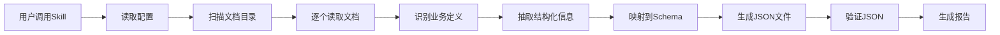

# 文档到JSON抽取 Skill - 使用指南

这是一个通用的Claude Code Skill，用于从设计文档中抽取结构化业务定义并生成JSON文件。

## 🚀 快速开始

### 在当前项目使用

```bash
# 方式1: 使用Skill工具（如果已注册）
使用 doc-to-json-extractor skill，从 docs/04-设计/API接口设计/ 抽取 program_sql 定义

# 方式2: 直接调用（在对话中）
@doc-to-json-extractor 抽取 program_sql，源目录: docs/04-设计/API接口设计/
```

### 在新项目中使用

1. **复制Skill到新项目**:
```bash
cp -r .claude/skills/doc-to-json-extractor /path/to/new-project/.claude/skills/
```

2. **修改配置文件**:
编辑 `config.yaml`：
- 设置 `source_docs_dir` 为新项目的文档目录
- 设置 `schema_dir` 为Schema定义目录
- 调整 `module_map` 匹配新项目的模块

3. **调用Skill**:
```
使用 doc-to-json-extractor skill 抽取 API定义
```

## 📖 支持的抽取类型

| 类型 | 说明 | 输出目录 | Schema |
|------|------|----------|--------|
| program_sql | 业务SQL定义 | 16-业务SQL | program_sql-schema.json |
| biz_flow | 业务流程定义 | 17-业务流程 | biz_flow-schema.json |
| report | 报表定义 | 18-报表定义 | report-schema.json |
| internal_api | API接口定义 | 11-内部API | internal_api-schema.json |

## 🎯 使用示例

### 示例1: 抽取program_sql

```
使用 doc-to-json-extractor skill，
从 docs/04-设计/API接口设计/ 抽取 program_sql 定义，
输出到 structured-requirements/individual-jsons/16-业务SQL/
```

**预期结果**:
- 读取API设计文档
- 识别复杂查询需求
- 生成15-30个program_sql JSON文件
- 每个文件包含数据来源标注

### 示例2: 抽取biz_flow

```
使用 doc-to-json-extractor skill，
从 docs/04-设计/ 抽取 biz_flow 定义
```

**预期结果**:
- 查找文档中的Mermaid流程图
- 提取流程描述
- 生成5-15个biz_flow JSON文件

### 示例3: 抽取API定义

```
使用 doc-to-json-extractor skill，
从 docs/04-设计/API接口设计/01-认证授权API.md 抽取 internal_api 定义
```

**预期结果**:
- 解析API端点定义
- 提取请求/响应结构
- 生成多个API JSON文件

## ⚙️ 配置选项

### 基本配置

编辑 `.claude/skills/doc-to-json-extractor/config.yaml`:

```yaml
# 设置源文档目录
extractor:
  source_docs_dir: "docs/04-设计"  # 修改为你的文档路径

# 设置模块映射
module_map:
  "用户管理": 1
  "订单管理": 2
  # 添加你的模块...
```

### 高级配置

```yaml
# 自定义抽取规则
json_types:
  program_sql:
    extraction_rules:
      keywords:
        - "查询"
        - "统计"
        # 添加你的关键词...
```

## 🔍 工作原理



## ✅ 数据质量保证

### 1. 数据溯源

每个生成的JSON都包含数据来源：

```json
{
  "program_sql_name": "项目统计",
  "sql_text": "-- 数据来源: docs/04-设计/API接口设计/02-项目管理API.md",
  "_metadata": {
    "extracted_from": "docs/04-设计/API接口设计/02-项目管理API.md",
    "extraction_date": "2025-11-28",
    "extractor_version": "1.0.0"
  }
}
```

### 2. Schema验证

生成后自动验证：

```python
✅ 16-业务SQL: 25/25 通过
✅ 17-业务流程: 10/10 通过
✅ 18-报表定义: 15/15 通过
```

### 3. 人工审核

建议流程：
1. Skill自动生成JSON
2. 人工review生成的文件
3. 根据需要调整和补充
4. 提交到版本控制

## 📊 输出报告

Skill执行后会生成抽取报告：

```markdown
# 文档抽取报告

**抽取时间**: 2025-11-28 10:30
**抽取类型**: program_sql

## 数据来源

- docs/04-设计/API接口设计/01-认证授权API.md
- docs/04-设计/API接口设计/02-项目管理API.md
- docs/04-设计/API接口设计/03-文档管理API.md

## 抽取结果

- 共生成: 25个JSON文件
- 验证通过: 25个
- 验证失败: 0个

## 定义清单

1. SQL-001: 用户登录统计 (来源: 01-认证授权API.md)
2. SQL-002: 项目状态统计 (来源: 02-项目管理API.md)
...
```

## 🔧 故障排除

### 问题1: 找不到Schema文件

**症状**: 报错 "Schema文件不存在"

**解决**:
```yaml
# 在config.yaml中指定Schema目录
extractor:
  schema_dir: "/absolute/path/to/schemas"
```

### 问题2: 没有抽取到任何数据

**症状**: 显示 "共生成: 0个JSON文件"

**解决**:
- 检查 `source_docs_dir` 路径是否正确
- 检查文档中是否包含可识别的业务定义
- 调整 `extraction_rules` 中的关键词

### 问题3: JSON验证失败

**症状**: 验证失败: X/Y通过

**解决**:
- 检查Schema定义是否正确
- 查看验证错误信息
- 手动调整生成的JSON文件

## 📚 最佳实践

### 1. 分批抽取

不要一次抽取所有类型，建议分批进行：

```
第1批: 抽取 program_sql
第2批: 抽取 biz_flow
第3批: 抽取 report
```

### 2. 增量抽取

只抽取新增或修改的文档：

```
使用 doc-to-json-extractor skill，
从 docs/04-设计/新文档/ 抽取 program_sql，
不覆盖已存在文件
```

### 3. 版本控制

将生成的JSON提交到Git：

```bash
git add structured-requirements/individual-jsons/
git commit -m "feat: 添加program_sql定义 (自动抽取)"
```

## 🤝 贡献

欢迎改进这个Skill！

提交改进：
1. 修改skill.md或config.yaml
2. 测试改进效果
3. 更新README.md
4. 提交PR

## 📄 许可证

MIT License - 可自由使用和修改

---

**创建时间**: 2025-11-28
**版本**: 1.0.0
**维护者**: Claude Code Community
