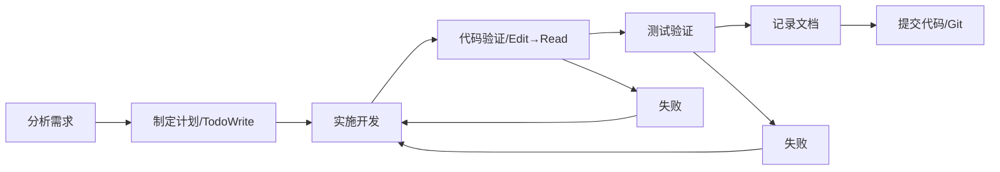

# AIBidComposer - 项目记忆文件

**项目**: AI标书智能创作平台（AIBidComposer）
**版本**: 2.0
**更新日期**: 2025-11-26 16:30
**更新者**: claude-sonnet-4-5 (claude-sonnet-4-5-20250929)
**项目阶段**: 架构设计完成，准备进入开发阶段

---

## 项目核心定位

AIBidComposer 是企业级 SaaS 平台，使用 AI 技术辅助企业快速创作投标文档。

**技术架构**: 混合后端微服务架构
- **Java Spring Boot** (端口 8080) - 数据维护、业务逻辑、CRUD
- **Python FastAPI** (端口 8001) - AI能力、大模型调用
- **React + Ant Design Pro** - 企业级前端

**主要分支**: master

---

## 技术栈核心

### 后端架构职责划分

```
前端 (React + Ant Design Pro)
    │
    ├─► Java Spring Boot (8080)      ├─► Python FastAPI (8001)
    │   - 用户认证授权               │   - GPT-4/Claude 调用
    │   - 组织项目管理               │   - 文档智能解析
    │   - 文档CRUD                   │   - RAG 内容生成
    │   - 模板管理                   │   - 向量化检索
    │   - 协作审批                   │   - 知识图谱
    │                                │
    └─► PostgreSQL + Redis + Elasticsearch
```

### 技术栈速查

**Java Spring Boot 服务** (数据维护):
- Java 17 LTS + Spring Boot 3.2.x
- Spring Data JPA + Spring Security 6.x
- PostgreSQL 14+ + Redis 7+
- Maven 3.9+

**Python FastAPI 服务** (AI能力):
- Python 3.11+ + FastAPI 0.104+
- LlamaIndex 0.9+ (主力RAG框架，80%任务)
- LangChain 0.1+ (备用，仅复杂Agent场景)
- OpenAI SDK 1.0+ + Anthropic SDK 0.7+
- Elasticsearch Python 8.11+

**前端**:
- React 18 + TypeScript 5.x
- Ant Design Pro 6.x + Umi 4.x

**基础设施**:
- Docker 24+ + Kubernetes 1.28+
- Nginx 1.25+ + MinIO

### 服务间通信
- REST API (Java ↔ Python)
- RabbitMQ (异步任务)
- Redis Pub/Sub (事件通知)

---

## 项目铁律（10条必须遵守）

> 🚨 **重要**: 每次工作都必须遵守以下铁律，违反将导致工作成果不合格。

### 1. 简体中文优先 🇨🇳
- ✅ 所有文档、注释、交流使用简体中文
- ✅ 技术术语可保留英文（如 Spring Boot、React）
- ❌ 禁止使用繁体中文或纯英文文档

### 2. 混合后端架构职责明确 ☕🐍
- ✅ 数据维护使用 Java Spring Boot
- ✅ AI能力使用 Python FastAPI
- ❌ 禁止在Java中调用大模型（应由Python服务处理）
- ❌ 禁止在Python中处理数据CRUD（应由Java服务处理）

### 3. 文档集中管理 📁
- ✅ 所有文档保存到 `docs/` 或现有文档目录
- ✅ 使用标准化子目录：01-指引/ 02-需求/ 03-架构/ 04-设计/ 05-实现/ 06-测试/ 07-交付/ 99-知识/
- ❌ 禁止文档散落在项目根目录

**文档命名规范**：
- 正式文档：遵循目录规范，使用描述性名称（如 `00-架构设计总览.md`）
- 临时报告/分析文档：使用 `{描述}_YYYY-MM-DD-HHMM.md` 格式（时间戳精确到分钟）
  - 示例：`文档校对报告_2025-11-26-1430.md`
  - 示例：`性能分析报告_2025-12-01-0915.md`

### 4. 文档元信息完整 📝
每个文档必须包含标准头部（7个字段）：
```yaml
---
文档类型: [需求/设计/实现/测试]文档
需求编号: REQ-YYYY-MM-NNN
创建日期: YYYY-MM-DD 或 YYYY-MM-DD HH:MM (临时报告可精确到分钟)
创建者: [AI模型名称 / 开发者姓名]
最后更新: YYYY-MM-DD 或 YYYY-MM-DD HH:MM (临时报告可精确到分钟)
更新者: [AI模型名称 / 开发者姓名]
状态: [草稿/评审中/已批准/已实现]
---
```

**日期格式说明**：
- 正式文档（架构、设计、需求）：使用 `YYYY-MM-DD` 格式
- 临时报告/分析文档：使用 `YYYY-MM-DD HH:MM` 格式（24小时制）

### 5. 验证优先原则 ✅
- ✅ **强制流程**: Edit → Read → 确认修改 → 测试验证
- ✅ 每次 Edit 后必须 Read 验证文件内容
- ✅ 运行相关测试验证功能
- ❌ 禁止没有 Read 就声称"已修复"
- ❌ 禁止假设修改会生效

**验证步骤**:
```
1. Edit 修改代码
2. Read 读取文件验证 ← 强制！
3. 确认修改在代码中
4. 运行测试验证功能
5. 记录文档
```

**金句提醒**:
> "没有 Read 验证的 Edit，就是薛定谔的修改"
> "报告进度用数字（X/Y），不用'全部'或'所有'"

### 6. 修改历史可追溯 📜
每个文档包含修改历史表：
```markdown
## 修改历史
| 日期 | 版本 | 修改者 | 修改内容概要 |
|------|------|--------|-------------|
| YYYY-MM-DD HH:mm | 1.0 | 模型名称/姓名 | 初始创建 |
```

**注意**: 时间戳必须精确到分钟（格式：`YYYY-MM-DD HH:mm`）

### 7. 源码需求标注 🏷️
代码注释中添加需求编号：
```java
/**
 * 用户管理服务
 * 需求编号: REQ-2025-11-001
 */
@Service
public class UserService {
    // 需求编号: REQ-2025-11-001 - 用户查询功能
    public User findById(Long id) { ... }
}
```

### 8. 完整功能必须提交Git 💾
- ✅ 每个完整功能实现后立即提交
- ✅ 提交信息包含需求编号：
```bash
feat(用户模块): 实现用户管理功能

需求编号: REQ-2025-11-001
影响范围: 新增 UserService、UserController
验证结果: 单元测试通过

🤖 Generated with Claude Code
Co-Authored-By: Claude <noreply@anthropic.com>
```
- ❌ 禁止积累多个功能后一次性提交

### 9. 数据必须可追溯 📊
- ✅ 所有数字说明来源（如"基于 xxx.md 实际扫描"）
- ✅ 所有结论说明依据
- ❌ 禁止未经验证的量化声明
- ❌ 禁止模棱两可的表述（如"大概"、"应该"）

### 10. 诚实透明优先 🔍
- ✅ 不确定时明确说明
- ✅ 错误时立即承认并纠正
- ✅ 推测时明确标注
- ❌ 禁止主观猜测冒充客观事实

### 11. AI模型身份标识完整 🤖
- ✅ 使用完整模型标识：`claude-sonnet-4-5 (claude-sonnet-4-5-20250929)`
- ✅ Git提交包含 Co-Authored-By

---

## 代码规范要点

### Java 命名规范
```java
// 类名：大驼峰
public class UserService { }

// 方法名：小驼峰
public User findById(Long id) { }

// 常量：全大写+下划线
public static final int MAX_RETRY_COUNT = 3;

// 包名：全小写
package com.aibidcomposer.service;
```

### Spring Boot 分层规范
```java
// Controller 层
@RestController
@RequestMapping("/api/v1/users")
@RequiredArgsConstructor
public class UserController { }

// Service 层
@Service
@RequiredArgsConstructor
@Transactional
public class UserService { }

// Repository 层
@Repository
public interface UserRepository extends JpaRepository<User, Long> { }
```

**详细规范**: @docs/99-知识/Java代码规范.md (计划创建)

---

## 常用命令速查

### Maven 构建
```bash
mvn clean install      # 清理并构建
mvn test              # 运行单元测试
mvn verify            # 运行所有测试
mvn spring-boot:run   # 启动Java服务
```

### Python AI 服务
```bash
cd backend/fastapi-ai-service
uvicorn main:app --reload --port 8001
pytest                # 运行测试
```

### Docker 操作
```bash
docker-compose up -d     # 启动所有服务
docker-compose down      # 停止所有服务
docker-compose logs -f   # 查看日志
```

### 前端操作
```bash
cd frontend/react-app
npm run dev    # 启动开发服务器
npm test       # 运行测试
npm run build  # 构建生产版本
```

### Git 操作
```bash
git status               # 查看状态
git add .               # 添加所有修改
git commit              # 提交（使用规范格式）
git push origin master  # 推送到远程
```

---

## 工作流程

### 标准流程（严格按顺序）



### 详细步骤

1. **分析需求** - 明确需求，询问不明确之处
   - 确认需求编号
   - 理解业务目标
   - 明确技术栈选择（Java/Python/前端）

2. **制定计划** - 使用 `TodoWrite` 工具创建任务清单
   - 拆分为可执行的小任务
   - 估算工作量
   - 确定优先级

3. **实施开发** - 按计划逐步实现
   - 代码中标注需求编号
   - 遵循命名规范和分层规范
   - Java服务处理数据维护，Python服务处理AI能力

4. **代码验证** - **Edit → Read → 确认**（🚨 强制步骤）
   - ✅ 每次 Edit 后必须 Read 验证
   - ✅ 确认修改确实存在于文件中
   - ❌ 禁止没有 Read 就声称"已修复"

5. **测试验证** - 运行测试确认功能
   - Java: `mvn test`
   - Python: `pytest`
   - 前端: `npm test`
   - 集成测试

6. **记录文档** - 创建总结文档
   - 包含完整的元信息（7个字段）
   - 添加修改历史表
   - 时间戳精确到分钟

7. **提交代码** - Git 提交
   - 包含需求编号
   - 使用规范的提交格式
   - 包含详细说明和验证结果

---

## 质量保证

### 三大核心原则

1. **诚实第一** - 宁可不完整，也要准确
   - 不确定时明确说明
   - 不知道就说不知道
   - 不编造信息

2. **验证优先** - 每次 Edit 后必须 Read 验证
   - Edit → Read → 确认是强制流程
   - 测试通过才算完成
   - 用数字报告进度（X/Y）

3. **逐项报告** - 清晰的进度反馈
   - 使用数字报告进度（3/5 而非"大部分"）
   - 列出具体完成的项目
   - 明确标注未完成项

### 金句提醒

> "没有 Read 验证的 Edit，就是薛定谔的修改"
>
> "报告进度用数字（X/Y），不用'全部'或'所有'"
>
> "宁可不完整，也要准确"

---

## 检查清单

### 每次创建/修改文档前
- [ ] 使用简体中文编写
- [ ] 确认技术栈为混合后端架构（Java处理数据，Python处理AI）
- [ ] 保存到正确的文档目录（docs/01-07或99）
- [ ] 包含完整的元信息头部（7个字段）
- [ ] 包含修改历史表
- [ ] AI模型名称使用完整标识

### 每次修改代码前
- [ ] 明确需求编号
- [ ] 确认使用正确的技术栈（Java数据维护 / Python AI能力）
- [ ] 代码注释中标注需求编号
- [ ] 遵循命名规范和分层规范

### 每次完成功能后
- [ ] ⚠️ **Edit → Read → 验证**（强制步骤）
- [ ] ⚠️ **运行测试验证功能**（强制步骤）
- [ ] 更新相关文档（包含时间戳精确到分钟）
- [ ] Git 提交（包含需求编号和详细说明）
- [ ] 检查提交信息符合规范
- [ ] 用数字报告进度（X/Y）

### 质量检查
- [ ] 代码符合规范（命名、分层、注释）
- [ ] 测试覆盖率 >80%
- [ ] 文档已更新（元信息完整、修改历史）
- [ ] 无安全漏洞
- [ ] 所有修改都经过 Read 验证

---

## Git 提交规范

### 提交消息格式
```bash
<type>(<scope>): <subject>

<body>

<footer>
```

### 类型说明
- `feat`: 新功能
- `fix`: 修复bug
- `docs`: 文档更新
- `refactor`: 重构
- `test`: 测试相关
- `chore`: 构建/工具

### 示例
```bash
feat(用户模块): 实现用户管理功能

需求编号: REQ-2025-11-001
影响范围:
- 新增 UserService、UserController
- 新增用户管理相关 API

验证结果: 单元测试通过

🤖 Generated with Claude Code
Co-Authored-By: Claude <noreply@anthropic.com>
```

---

## 项目目录结构

```
ai-contract/
├── docs/                    # 项目文档
│   ├── 01-指引/             # 项目指引、规范
│   ├── 02-需求/             # 需求文档
│   ├── 03-架构/             # 系统架构
│   ├── 04-设计/             # 详细设计
│   ├── 05-实现/             # 实现说明、任务计划
│   ├── 06-测试/             # 测试计划
│   ├── 07-交付/             # 部署文档
│   └── 99-知识/             # 知识库、FAQ
├── backend/
│   ├── spring-boot-service/ # Java Spring Boot 服务
│   └── fastapi-ai-service/  # Python FastAPI AI服务
├── frontend/
│   └── react-app/           # React 前端
├── deploy/
│   ├── docker/              # Docker 配置
│   └── k8s/                 # Kubernetes 配置
└── CLAUDE.md               # 本文档
```

---

## 关键文档索引

使用 @import 语法引用详细文档：

**架构文档**:
- @docs/03-架构/00-架构设计总览.md
- @docs/03-架构/02-数据库设计.md
- @docs/03-架构/03-API接口设计.md
- @docs/03-架构/05-AI能力层设计.md
- @docs/03-架构/06-部署架构设计.md

**实现文档**:
- @docs/05-实现/task-plan.md - 开发任务计划和进度跟踪

**方案文档**:
- @方案文档/03-功能模块详解.md - 8大核心功能模块详解

---

## 版本历史

| 版本 | 日期 | 变更说明 | 修订者 |
|------|------|---------|--------|
| 2.0 | 2025-11-26 16:30 | 工作流重大升级：添加详细7步工作流程、质量保证三大核心原则、强化验证要求（Edit→Read→测试）、铁律从10条扩展到11条 | claude-sonnet-4-5 |
| 1.3 | 2025-11-26 | 添加文档命名规范：要求临时报告类文档时间戳精确到分钟（YYYY-MM-DD-HHMM） | claude-sonnet-4-5 |
| 1.2 | 2025-11-26 | 精简优化：删除冗余内容，聚焦项目特定规则，从841行优化到约350行 | claude-sonnet-4-5 |
| 1.1 | 2025-11-26 | 架构调整：更新为混合后端架构（Java + Python），明确服务职责 | claude-sonnet-4-5 |
| 1.0 | 2025-11-25 | 初始版本：创建项目记忆文件 | claude-sonnet-4-5 |

### 版本2.0主要变更（2025-11-26 16:30）

**工作流程升级**（参考 Claude Code 最佳实践）:
- ✅ 新增"工作流程"章节，明确7步强制流程
- ✅ 新增"质量保证"章节，定义三大核心原则
- ✅ 添加Mermaid流程图，可视化工作流
- ✅ 强化验证要求：Edit → Read → 测试验证

**铁律扩展**（从10条到11条）:
- ✅ 新增铁律5"验证优先原则"
- ✅ 原铁律5-10依次后移为6-11
- ✅ 在铁律5中添加验证步骤说明和金句提醒
- ✅ 在铁律6中明确时间戳精确到分钟的要求

**检查清单强化**:
- ✅ 标注强制步骤（⚠️ Edit→Read验证、测试验证）
- ✅ 添加进度报告要求（用数字X/Y）
- ✅ 质量检查增加"所有修改都经过Read验证"

**快速提醒优化**:
- ✅ 列出11条铁律清单
- ✅ 添加工作流程一行图
- ✅ 添加金句提醒

### 版本1.2优化要点（2025-11-26）

根据 [Claude Code 官方最佳实践](https://code.claude.com/docs/en/memory)：

**删除内容**:
- 通用的 Claude Code 使用说明（非项目特定）
- 重复的章节（核心原则、项目特定规范已合并到铁律）
- 详细的代码示例（应放在单独的代码规范文档中）
- 冗长的工作流程图和测试示例

**优化策略**:
- ✅ 聚焦项目特定信息（混合后端架构是最大特点）
- ✅ 具体而简洁（保留核心规则，删除冗长示例）
- ✅ 使用 @import 引用详细文档（避免重复）
- ✅ 保持可扫描性（清晰的标题和项目符号）
- ✅ 从841行精简到约350行（减少58%）

---

## 快速提醒

**项目铁律**（11条必须遵守）：
1. 🇨🇳 简体中文优先
2. ☕🐍 混合后端架构职责明确（Java数据/Python AI）
3. 📁 文档集中管理（docs/标准8目录）
4. 📝 文档元信息完整（7字段+修改历史）
5. ✅ **验证优先原则**（Edit → Read → 测试）⚠️
6. 📜 修改历史可追溯
7. 🏷️ 源码需求标注
8. 💾 完整功能立即提交Git
9. 📊 数据可追溯
10. 🔍 诚实透明
11. 🤖 AI模型身份标识完整

**工作流程**（7步强制流程）：
```
分析需求 → 制定计划 → 实施开发 → 代码验证 → 测试验证 → 记录文档 → 提交代码
           (TodoWrite)           (Edit→Read)  (mvn test)
```

**金句提醒**：
> "没有 Read 验证的 Edit，就是薛定谔的修改"
> "报告进度用数字（X/Y），不用'全部'或'所有'"

**技术栈速记**:
- Java 17 + Spring Boot 3.2 (数据维护)
- Python 3.11 + FastAPI + LlamaIndex (AI能力)
- React 18 + TypeScript + Ant Design Pro (前端)
- PostgreSQL + Elasticsearch + Redis (数据层)

**详细文档**: 使用 `/memory` 命令编辑本文档，查看 @docs/ 目录获取详细信息。

---

**本文档遵循自身定义的所有规范，可作为规范执行的参考示例。**
