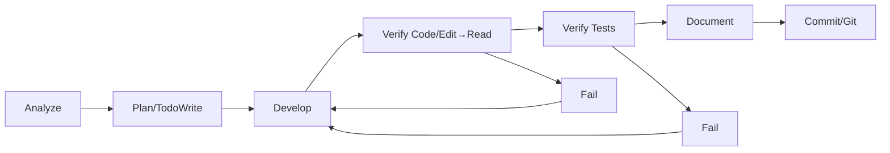

# AIBidComposer - Project Memory File

**Project**: AI Bidding Document Intelligent Creation Platform (AIBidComposer)
**Version**: 2.2
**Last Updated**: 2025-11-29
**Updater**: gemini-pro
**Project Phase**: Architecture design complete, preparing for development phase

---

## Project Core Vision

AIBidComposer is an enterprise-grade SaaS platform that uses AI to help companies create high-quality bidding documents quickly.

**Technical Architecture**: Hybrid backend microservices
- **Java Spring Boot** (Port 8080) - Data persistence, business logic, CRUD
- **Python FastAPI** (Port 8001) - AI capabilities, large model calls
- **React + Ant Design Pro** - Enterprise-grade frontend

---

## Technology Stack Overview

### Backend Architecture Responsibility Division

```
Frontend (React + Ant Design Pro)
    │
    ├─► Java Spring Boot (8080)      ├─► Python FastAPI (8001)
    │   - User Authentication/Authorization │   - GPT-4/Claude Calls
    │   - Organization & Project Management │   - Intelligent Document Parsing
    │   - Document CRUD                   │   - RAG Content Generation
    │   - Template Management             │   - Vector Retrieval
    │   - Collaboration & Approval        │   - Knowledge Graph
    │                                │
    └─► PostgreSQL + Redis + Elasticsearch
```

### Key Technologies

*   **Java Spring Boot Service** (Data Persistence):
    *   Java 17 LTS + Spring Boot 3.2.x
    *   Spring Data JPA + Spring Security 6.x
    *   PostgreSQL 14+ + Redis 7+
    *   Maven 3.9+
*   **Python FastAPI Service** (AI Capabilities):
    *   Python 3.11+ + FastAPI 0.104+
    *   LlamaIndex 0.9+ (Primary RAG framework for 80% of tasks)
    *   LangChain 0.1+ (Secondary, for complex Agent scenarios only)
    *   OpenAI SDK 1.0+ + Anthropic SDK 0.7+
    *   Elasticsearch Python 8.11+
*   **Frontend**:
    *   React 18 + TypeScript 5.x
    *   Ant Design Pro 6.x + Umi 4.x
*   **Infrastructure**:
    *   Docker 24+ + Kubernetes 1.28+
    *   Nginx 1.25+ + MinIO

### Inter-service Communication
- REST API (Java ↔ Python)
- RabbitMQ (Asynchronous tasks)
- Redis Pub/Sub (Event notifications)

---

## Building and Running

### Prerequisites

*   Java JDK 17+
*   Python 3.11+
*   Node.js 18+
*   Docker 24+

### Development Environment

1.  **Clone the repository:**
    ```bash
    git clone <repository-url>
    cd ai-contract
    ```

2.  **Set up environment variables:**
    ```bash
    cp .env.example .env
    # Edit .env with your configuration
    ```

3.  **Start infrastructure services:**
    ```bash
    docker-compose up -d postgres redis elasticsearch minio rabbitmq
    ```

4.  **Run the backend services:**

    *   **Java:**
        ```bash
        cd apps/backend-java
        mvn spring-boot:run
        ```
        The service will be available at `http://localhost:8080`.

    *   **Python:**
        ```bash
        cd apps/backend-python
        pip install -r requirements/dev.txt
        uvicorn app.main:app --reload --port 8001
        ```
        The service will be available at `http://localhost:8001`.

5.  **Run the frontend:**
    ```bash
    cd apps/frontend
    npm install
    npm run dev
    ```
    The application will be available at `http://localhost:5173`.

### Dockerized Environment

To run the entire stack using Docker:

```bash
docker-compose up -d
```

To build and run in a production-like environment:

```bash
docker-compose -f docker-compose.prod.yml up -d
```

---

## Project Iron Laws (11 Rules to Obey)

> 🚨 **Important**: All work must adhere to these laws. Violations will result in non-compliant deliverables.

### 1. 强制使用简体中文 🇨🇳
- ✅ **所有文档、文档名、注释、代码提交信息、以及所有交流都必须使用简体中文**。
- ✅ 技术术语可以保留英文（例如 Spring Boot, React）。
- ❌ 禁止使用繁体中文或纯英文撰写文档和注释。

### 2. Clear Hybrid Backend Responsibilities ☕🐍
- ✅ Java Spring Boot for data persistence.
- ✅ Python FastAPI for AI capabilities.
- ❌ Do not call LLMs from Java (should be handled by the Python service).
- ❌ Do not handle data CRUD in Python (should be handled by the Java service).

### 3. Centralized Document Management 📁
- ✅ All documents must be stored in `docs/` or its subdirectories.
- ✅ Use standardized subdirectories: `01-Principles/`, `02-Requirements/`, `03-Architecture/`, etc.
- ❌ Do not leave documents scattered in the project root.

**文档命名规范**:
- 正式文档: 遵循目录规范，使用中文描述性名称 (例如: `00-架构设计总览.md`)。
- 临时报告: 使用 `{中文描述}_YYYY-MM-DD-HHMM.md` 格式。
  - 示例: `文档校对报告_2025-11-26-1430.md`

**Document Length Limit**:
- ✅ Each document should not exceed 1000 lines.
- ✅ Split longer documents into multiple related files using a main + sub-document structure.
- ❌ Avoid creating excessively long single documents.

### 4. Complete Document Metadata 📝
Every document must start with a standard 7-field header:
```yaml
---
doc_type: [Requirement/Design/Implementation/Test]
req_id: REQ-YYYY-MM-NNN
created_at: YYYY-MM-DD or YYYY-MM-DD HH:MM
author: [AI Model Name / Developer Name]
updated_at: YYYY-MM-DD or YYYY-MM-DD HH:MM
updater: [AI Model Name / Developer Name]
status: [Draft/In-Review/Approved/Implemented]
---
```

### 5. Validation First Principle ✅
- ✅ **Mandatory Flow**: Edit → Read → Confirm Change → Test & Verify.
- ✅ After every `Edit`, you must `Read` the file to verify the change.
- ✅ Run relevant tests to verify functionality.
- ❌ Do not claim "fixed" without `Read` verification.
- ❌ Do not assume a change will work without verification.

> "An `Edit` without a `Read` is a Schrödinger's change."

### 6. Traceable Change History 📜
Each document must include a modification history table:
```markdown
## Modification History
| Date | Version | Modifier | Summary of Changes |
|---|---|---|---|
| YYYY-MM-DD HH:mm | 1.0 | Model/Name | Initial creation |
```
**Note**: Timestamps must be precise to the minute (`YYYY-MM-DD HH:mm`).

### 7. Requirement Tagging in Source Code 🏷️
Add requirement IDs in code comments:
```java
/**
 * User management service
 * Requirement ID: REQ-2025-11-001
 */
@Service
public class UserService {
    // REQ-2025-11-001 - User query feature
    public User findById(Long id) { ... }
}
```

### 8. Commit Complete Features to Git 💾
- ✅ Commit after each complete feature implementation.
- ✅ Commit message must include the Requirement ID:
```bash
feat(user-module): Implement user management

Requirement ID: REQ-2025-11-001
Impact: Added UserService, UserController
Verification: Unit tests passed.
```
- ❌ Do not batch multiple features into a single commit.

### 9. Traceable Data 📊
- ✅ All numbers must cite a source (e.g., "based on scanning xxx.md").
- ✅ All conclusions must state their evidence.
- ❌ No unverified quantitative claims.
- ❌ No ambiguous statements like "approximately" or "should be".

### 10. Honesty and Transparency First 🔍
- ✅ State clearly when you are uncertain.
- ✅ Admit and correct mistakes immediately.
- ✅ Clearly label any speculation.
- ❌ Do not present subjective guesses as objective facts.

### 11. Complete AI Model Identity 🤖
- ✅ Use a full model identifier in documents (e.g., `gemini-pro`).
- ✅ Git commits should include `Co-Authored-By` if applicable.

### 12. Thorough Document Reading Principle 📖
- ✅ **在阅读任何文档以获取信息或进行决策时，必须进行全量、充分的阅读和理解**。
- ❌ 不得仅通过标题、摘要或部分内容进行概略性判断。

---

## Code Style Highlights

### Java Naming Conventions
```java
// Class: UpperCamelCase
public class UserService { }

// Method: lowerCamelCase
public User findById(Long id) { }

// Constant: UPPER_SNAKE_CASE
public static final int MAX_RETRY_COUNT = 3;

// Package: alllowercase
package com.aibidcomposer.service;
```

### Spring Boot Layering
```java
// Controller Layer
@RestController
@RequestMapping("/api/v1/users")
@RequiredArgsConstructor
public class UserController { }

// Service Layer
@Service
@RequiredArgsConstructor
@Transactional
public class UserService { }

// Repository Layer
@Repository
public interface UserRepository extends JpaRepository<User, Long> { }
```

**Details**: See `@docs/01-原则指引/Java代码规范.md`

---

## Common Commands

### Testing

*   **Java:**
    ```bash
    cd apps/backend-java
    mvn test
    ```
*   **Python:**
    ```bash
    cd apps/backend-python
    pytest
    ```
*   **Frontend:**
    ```bash
    cd apps/frontend
    npm test
    ```

### Git Operations
```bash
git status               # Check status
git add .                # Stage all changes
git commit               # Commit with conventional message
git push origin master   # Push to remote
```

---

## Standard Workflow (Strictly Sequential)



---
## Git Commit Convention

### Message Format
```
<type>(<scope>): <subject>

<body>

<footer>
```

### Type
- `feat`: A new feature
- `fix`: A bug fix
- `docs`: Documentation only changes
- `refactor`: A code change that neither fixes a bug nor adds a feature
- `test`: Adding missing tests or correcting existing tests
- `chore`: Changes to the build process or auxiliary tools

### Example
```
feat(user-module): Implement user management feature

Requirement ID: REQ-2025-11-001
Impact:
- Added UserService and UserController.
- Added new APIs for user management.

Verification: Unit tests passed.
```

---

## Project Directory Structure

```
ai-contract/
├── apps/
│   ├── backend-java/      # Java Spring Boot Service
│   ├── backend-python/    # Python FastAPI AI Service
│   └── frontend/          # React Frontend
├── docs/                  # 项目文档
│   ├── 01-原则指引/
│   ├── 02-需求定义/
│   ├── 03-架构设计/
│   ├── 04-业务设计/
│   ├── 05-编码实现/
│   ├── 06-测试验证/
│   ├── 07-交付部署/
│   └── 99-知识积累/
├── docker/                # Docker configurations
├── scripts/               # Helper scripts
├── .gitignore
├── docker-compose.yml
├── GEMINI.md              # This file
└── README.md
```