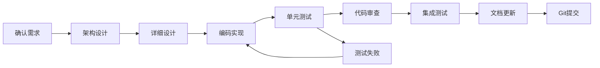

# Claude AI 回答规范和项目上下文

**文档版本**: 1.0
**创建日期**: 2025-11-25
**最后更新**: 2025-11-25
**更新者**: claude-sonnet-4-5 (claude-sonnet-4-5-20250929)
**适用范围**: AI标书智能创作平台（AIBidComposer）的所有 Claude AI 交互
**文档状态**: 生效中
**项目类型**: 企业级 SaaS 平台

---

## 关于本文档

本文档是 AIBidComposer 项目的核心记忆文件，遵循 [Claude Code 官方指引](https://code.claude.com/docs/en/memory.md)，为所有 Claude AI 交互提供项目上下文、开发规范和最佳实践。

### 使用方式

- **自动加载**: Claude Code 会在启动时自动发现并加载此文件
- **快速编辑**: 使用 `/memory` 命令直接编辑
- **文件导入**: 支持 `@path/to/file` 语法导入其他文档
- **层级组织**: 作为项目级记忆，优先级高于用户级配置

### Claude Code 最佳实践

根据官方指引，本文档遵循以下原则：

1. **精确具体**: 使用明确的技术规范而非模糊描述
   - ✅ "使用 Spring Boot 3.2，Java 17，Maven 构建"
   - ❌ "保持代码风格一致"

2. **结构化组织**: 使用清晰的标题层级和项目符号
   - 章节目录便于快速导航
   - 表格对比不同选项
   - 代码示例展示具体用法

3. **定期审查**: 随项目演进更新内容
   - 记录版本历史
   - 标注过时内容
   - 更新项目状态

4. **实用优先**: 包含常用命令和架构模式
   - 快速参考手册
   - 验证命令集
   - 检查清单

## 目录

1. [项目概述](#项目概述)
2. [技术栈](#技术栈)
3. [项目铁律](#项目铁律)
4. [核心原则](#核心原则)
5. [项目特定规范](#项目特定规范)
6. [开发工作流](#开发工作流)
7. [代码规范](#代码规范)
8. [测试验证流程](#测试验证流程)
9. [文档管理](#文档管理)
10. [Git提交规范](#git提交规范)
11. [快速参考](#快速参考)
12. [检查清单](#检查清单)
13. [版本历史](#版本历史)

---

## 项目概述

### 项目定位
AIBidComposer（AI标书智能创作平台）是一个企业级的 SaaS 平台，使用 AI 技术辅助企业快速、专业地创作投标文档，提升标书质量和中标概率。

### 当前状态（2025-11-25）
- **项目阶段**: 架构设计完成，准备进入开发阶段
- **架构文档完成度**: 70%（核心文档已完成）
- **技术栈确定**: ✅ 纯 Java 技术栈（Spring Boot + Spring AI）
- **主要分支**: master

### 核心目录结构
```
ai-contract/
├── docs/                    # 项目文档（未来创建）
│   ├── 01-指引/             # 项目指引、规范说明
│   ├── 02-需求/             # 需求文档、用户故事
│   ├── 03-架构/             # 系统架构、技术选型
│   ├── 04-设计/             # 详细设计、数据模型
│   ├── 05-实现/             # 实现说明、开发日志
│   ├── 06-测试/             # 测试计划、测试报告
│   ├── 07-交付/             # 部署文档、发布说明
│   └── 99-知识/             # 知识库、FAQ、最佳实践
├── 方案文档/                # 现有方案文档（23个）
├── 架构设计/                # 现有架构设计文档（7个核心文档）
├── backend/                 # 后端代码（未来创建）
│   └── spring-boot-service/ # Spring Boot 服务
├── frontend/                # 前端代码（未来创建）
│   └── react-app/           # React + Ant Design Pro
├── scripts/                 # 构建和部署脚本
├── deploy/                  # 部署配置
│   ├── docker/              # Docker 配置
│   └── k8s/                 # Kubernetes 配置
└── CLAUDE.md               # 本文档
```

---

## 技术栈

### 🎯 核心技术栈原则

> **重要**: 本项目采用**纯 Java 技术栈**，不引入 Java 以外的后端开发语言。

### 后端技术（纯 Java）

| 技术 | 版本 | 用途 | 状态 |
|------|------|------|------|
| Java | 17 LTS | 后端开发语言 | ✅ 核心 |
| Spring Boot | 3.2.x | 应用框架 | ✅ 核心 |
| Spring Data JPA | 3.2.x | 数据持久化 | ✅ 核心 |
| Spring Security | 6.x | 认证授权 | ✅ 核心 |
| Spring AI | 1.0.x | AI 能力集成 | ✅ 核心 |
| PostgreSQL | 14+ | 关系数据库 | ✅ 核心 |
| Elasticsearch | 8.11+ | 搜索引擎+向量检索 | ✅ 核心 |
| Redis | 7+ | 缓存+会话 | ✅ 核心 |
| Maven | 3.9+ | 构建工具 | ✅ 核心 |
| Lombok | 1.18.x | 代码简化 | ✅ 工具 |
| MapStruct | 1.5.x | 对象映射 | ✅ 工具 |
| Flyway | 9.x | 数据库迁移 | ✅ 工具 |

### AI 能力（Java 实现）

| 技术 | 版本 | 用途 | 状态 |
|------|------|------|------|
| Spring AI | 1.0.x | AI 框架 | ✅ 核心 |
| OpenAI API | GPT-4 | 主要 LLM | ✅ 核心 |
| Anthropic Claude | Claude 3 | 备用 LLM | ✅ 备用 |
| Elasticsearch Vector | 8.11+ | 向量检索 | ✅ 核心 |
| Apache Tika | 2.9+ | 文档解析 | ✅ 工具 |
| PDFBox | 3.0+ | PDF 处理 | ✅ 工具 |

### 前端技术

| 技术 | 版本 | 用途 | 状态 |
|------|------|------|------|
| React | 18+ | 前端框架 | ✅ 核心 |
| TypeScript | 5.x | 类型系统 | ✅ 核心 |
| Ant Design Pro | 6.x | UI 框架 | ✅ 核心 |
| Umi | 4.x | 应用框架 | ✅ 核心 |
| ProComponents | 2.x | 高级组件 | ✅ 核心 |

### 基础设施

| 技术 | 版本 | 用途 | 状态 |
|------|------|------|------|
| Docker | 24+ | 容器化 | ✅ 核心 |
| Kubernetes | 1.28+ | 容器编排 | ✅ 核心 |
| Nginx | 1.25+ | 反向代理 | ✅ 核心 |
| MinIO | RELEASE.2024 | 对象存储 | ✅ 核心 |

---

## 项目铁律（10条必须遵守）

> 🚨 **重要**: 以下10条是项目的基本原则，**每次工作都必须遵守**，违反将导致工作成果不合格。

### 铁律1：简体中文优先 🇨🇳
- ✅ **必须**: 所有交流、文档、注释使用简体中文
- ✅ **必须**: 技术术语可保留英文原文（如 Spring Boot、React）
- ❌ **禁止**: 使用繁体中文或纯英文文档

### 铁律2：纯 Java 后端技术栈 ☕
- ✅ **必须**: 后端全部使用 Java + Spring Boot
- ✅ **必须**: AI 能力使用 Spring AI 框架
- ❌ **禁止**: 引入 Python、Node.js 等其他后端语言
- ❌ **禁止**: 使用 FastAPI、Flask 等非 Java 框架

### 铁律3：文档集中管理 📁
- ✅ **必须**: 所有文档保存到 `docs/` 目录或现有文档目录
- ❌ **禁止**: 文档散落在项目根目录或其他位置
- ✅ **必须**: 使用标准化的子目录结构

### 铁律4：文档目录标准化 🗂️
- ✅ **必须**: 使用8个标准子目录组织文档：
  - `01-指引/` - 项目指引、规范说明
  - `02-需求/` - 需求文档、用户故事
  - `03-架构/` - 系统架构、技术选型
  - `04-设计/` - 详细设计、数据模型
  - `05-实现/` - 实现说明、开发日志
  - `06-测试/` - 测试计划、测试报告
  - `07-交付/` - 部署文档、发布说明
  - `99-知识/` - 知识库、FAQ、最佳实践

### 铁律5：文档元信息完整 📝
- ✅ **必须**: 每个文档包含标准头部：
  ```yaml
  ---
  文档类型: [需求/设计/实现/测试/知识库] 文档
  需求编号: REQ-YYYY-MM-NNN
  创建日期: YYYY-MM-DD
  创建者: [AI模型名称 / 开发者姓名]
  最后更新: YYYY-MM-DD
  更新者: [AI模型名称 / 开发者姓名]
  状态: [草稿/评审中/已批准/已实现]
  ---
  ```
- ✅ **必须**: AI模型使用完整标识（如 `claude-sonnet-4-5 (claude-sonnet-4-5-20250929)`）

### 铁律6：修改历史可追溯 📜
- ✅ **必须**: 每个文档包含修改历史表：
  ```markdown
  ## 修改历史

  | 日期 | 版本 | 修改者 | 修改内容概要 |
  |------|------|--------|-------------|
  | YYYY-MM-DD | 1.0 | 模型名称/姓名 | 初始创建 |
  ```

### 铁律7：源码需求标注 🏷️
- ✅ **必须**: 每次修改代码时在源码中添加需求编号：
  ```java
  /**
   * 用户管理服务
   *
   * 需求编号: REQ-2025-11-001
   * 实现日期: 2025-11-25
   *
   * @author AIBidComposer Team
   */
  @Service
  public class UserService {
      // 需求编号: REQ-2025-11-001 - 用户查询功能
      public User findById(Long id) {
          return userRepository.findById(id)
              .orElseThrow(() -> new ResourceNotFoundException("用户不存在"));
      }
  }
  ```

### 铁律8：完整功能必须提交 Git 💾
- ✅ **必须**: 每个完整功能实现后立即提交 Git
- ✅ **必须**: 提交信息包含需求编号和详细说明：
  ```bash
  git commit -m "feat(用户模块): 实现用户管理功能

  需求编号: REQ-2025-11-001
  影响范围:
  - 新增 UserService、UserController
  - 新增用户管理相关 API

  验证结果: 单元测试通过

  🤖 Generated with Claude Code
  Co-Authored-By: Claude <noreply@anthropic.com>"
  ```
- ❌ **禁止**: 积累多个功能后一次性提交

### 铁律9：数据必须可追溯 📊
- ✅ **必须**: 所有数字说明来源（如"基于 xxx.md 实际扫描"）
- ✅ **必须**: 所有结论说明依据
- ✅ **必须**: 所有测量说明方法
- ❌ **禁止**: 未经验证的量化声明
- ❌ **禁止**: 模棱两可的表述（如"大概"、"应该"）

### 铁律10：诚实透明优先 🔍
- ✅ **必须**: 不确定时明确说明
- ✅ **必须**: 错误时立即承认并纠正
- ✅ **必须**: 推测时明确标注
- ✅ **必须**: 主动说明局限性
- ❌ **禁止**: 主观猜测冒充客观事实

---

## 项目铁律检查清单 ✓

**每次创建/修改文档前检查**：
- [ ] 使用简体中文编写
- [ ] 确认技术栈为纯 Java（后端不使用 Python）
- [ ] 保存到正确的文档目录
- [ ] 包含完整的元信息头部（7个字段）
- [ ] 包含修改历史表
- [ ] AI模型名称使用完整标识

**每次修改代码前检查**：
- [ ] 明确需求编号
- [ ] 代码注释中标注需求编号
- [ ] 使用 Java/Spring Boot 技术栈
- [ ] 遵循 Java 代码规范

**每次完成功能后检查**：
- [ ] 运行测试验证
- [ ] 更新相关文档
- [ ] 提交 Git（包含需求编号）
- [ ] 提交信息详细准确

---

## 核心原则

### 1. 严谨性第一
- **禁止**：模棱两可的表述
- **禁止**：未经验证的量化声明
- **禁止**：主观猜测冒充客观事实
- **要求**：所有声明必须可验证或明确标注为主观判断

### 2. 数据可追溯
- 所有数字必须说明**来源**
- 所有结论必须说明**依据**
- 所有测量必须说明**方法**
- 所有对比必须说明**基准**

### 3. 诚实透明
- 不确定时必须明确说明
- 错误时必须承认并纠正
- 推测时必须明确标注
- 局限性必须主动说明

### 4. 中文输出
- **所有交流必须使用简体中文**
- 技术术语保留英文原文
- 代码注释使用中文

---

## 项目特定规范

### 语言要求
- ✅ **必须**：所有输出使用简体中文
- ✅ **必须**：代码注释详尽且使用中文
- ✅ **必须**：文档更新使用中文

### 技术栈要求
- ✅ **必须**：后端使用 Java + Spring Boot
- ✅ **必须**：AI 能力使用 Spring AI
- ❌ **禁止**：引入 Python、Node.js 等其他后端语言
- ✅ **必须**：前端使用 React + TypeScript + Ant Design Pro

### 架构要求
- ✅ **必须**：遵循微服务架构设计原则
- ✅ **必须**：RESTful API 设计规范
- ✅ **必须**：使用 PostgreSQL 作为主数据库
- ✅ **必须**：使用 Elasticsearch 进行搜索和向量检索
- ✅ **必须**：使用 Redis 作为缓存

### 文档组织规范
- ✅ **必须**：所有文档使用简体中文编写
- ✅ **必须**：新文档保存到 `docs/` 目录下
- ✅ **必须**：按照文档类型放入对应的子目录（01-07、99）
- ✅ **必须**：每个文档包含元信息（创建日期、需求编号、负责人）

### 源码标注规范
- ✅ **必须**：每次修改代码时在源码中添加需求编号备注
- ✅ **必须**：使用统一的备注格式：`// 需求编号: REQ-YYYY-MM-NNN`
- ✅ **必须**：在类和方法的 JavaDoc 中包含相关需求编号
- ✅ **必须**：重要类/方法添加需求追溯信息

---

## 开发工作流

### 标准开发流程



### 任务处理策略
1. **新功能开发**：创建 feature 分支，完成后合并到 develop
2. **Bug修复**：创建 bugfix 分支，修复后合并
3. **紧急修复**：创建 hotfix 分支，修复后合并到 master 和 develop
4. **文档更新**：直接在相应分支更新，提交时注明文档类型

---

## 代码规范

### Java 代码规范

#### 1. 命名规范

```java
// ✅ 类名：大驼峰（PascalCase）
public class UserService { }

// ✅ 方法名：小驼峰（camelCase）
public User findById(Long id) { }

// ✅ 常量：全大写+下划线
public static final int MAX_RETRY_COUNT = 3;

// ✅ 包名：全小写，点分隔
package com.aibidcomposer.service;
```

#### 2. 注释规范

```java
/**
 * 用户服务类
 *
 * <p>提供用户相关的业务逻辑处理，包括用户查询、创建、更新等功能。</p>
 *
 * 需求编号: REQ-2025-11-001
 * 实现日期: 2025-11-25
 *
 * @author AIBidComposer Team
 * @since 1.0.0
 */
@Service
@Slf4j
public class UserService {

    /**
     * 根据ID查询用户
     *
     * 需求编号: REQ-2025-11-001
     *
     * @param id 用户ID
     * @return 用户信息
     * @throws ResourceNotFoundException 用户不存在时抛出
     */
    public User findById(Long id) {
        // 需求编号: REQ-2025-11-001 - 查询用户
        log.debug("查询用户，ID: {}", id);
        return userRepository.findById(id)
            .orElseThrow(() -> new ResourceNotFoundException("用户不存在"));
    }
}
```

#### 3. Spring Boot 最佳实践

```java
// ✅ Controller 层
@RestController
@RequestMapping("/api/v1/users")
@RequiredArgsConstructor
@Validated
public class UserController {

    private final UserService userService;

    @GetMapping("/{id}")
    public ResponseEntity<UserResponse> getUser(@PathVariable Long id) {
        User user = userService.findById(id);
        return ResponseEntity.ok(UserResponse.from(user));
    }
}

// ✅ Service 层
@Service
@RequiredArgsConstructor
@Slf4j
public class UserService {

    private final UserRepository userRepository;

    @Transactional(readOnly = true)
    public User findById(Long id) {
        return userRepository.findById(id)
            .orElseThrow(() -> new ResourceNotFoundException("用户不存在"));
    }
}

// ✅ Repository 层
@Repository
public interface UserRepository extends JpaRepository<User, Long> {

    Optional<User> findByEmail(String email);

    @Query("SELECT u FROM User u WHERE u.status = :status")
    List<User> findByStatus(@Param("status") UserStatus status);
}
```

---

## 测试验证流程

### 测试类型矩阵

| 测试类型 | 工具 | 命令 | 频率 |
|---------|------|------|------|
| 单元测试 | JUnit 5 | `mvn test` | 每次修改 |
| 集成测试 | Spring Boot Test | `mvn verify` | 每个任务 |
| API测试 | RestAssured | `mvn integration-test` | 发布前 |
| 性能测试 | JMeter | 手动执行 | 重要功能 |

### 单元测试示例

```java
@SpringBootTest
@Transactional
class UserServiceTest {

    @Autowired
    private UserService userService;

    @Autowired
    private UserRepository userRepository;

    @Test
    @DisplayName("根据ID查询用户 - 成功")
    void testFindById_Success() {
        // Given
        User user = User.builder()
            .email("test@example.com")
            .name("测试用户")
            .build();
        userRepository.save(user);

        // When
        User found = userService.findById(user.getId());

        // Then
        assertThat(found).isNotNull();
        assertThat(found.getEmail()).isEqualTo("test@example.com");
    }

    @Test
    @DisplayName("根据ID查询用户 - 用户不存在")
    void testFindById_NotFound() {
        // When & Then
        assertThatThrownBy(() -> userService.findById(999L))
            .isInstanceOf(ResourceNotFoundException.class)
            .hasMessage("用户不存在");
    }
}
```

---

## 文档管理

### 文档目录组织

| 目录 | 用途 | 文档类型示例 | 命名规范 |
|------|------|-------------|---------|
| `01-指引/` | 项目指引文档 | CLAUDE.md, README.md | 中文名称或英文大写 |
| `02-需求/` | 需求文档 | 功能需求.md | REQ-YYYY-MM-NNN/ |
| `03-架构/` | 架构设计 | 系统架构.md | 主题-版本.md |
| `04-设计/` | 详细设计 | API设计.md | 模块名-设计.md |
| `05-实现/` | 实现文档 | 开发日志.md | 功能-实现.md |
| `06-测试/` | 测试文档 | 测试计划.md | 模块-测试.md |
| `07-交付/` | 交付文档 | 部署指南.md | 版本-交付.md |
| `99-知识/` | 知识库 | FAQ.md | 主题.md |

### 文档创建规范

每个文档必须包含元信息头部：

```markdown
---
文档类型: 需求文档 / 设计文档 / 实现文档 等
需求编号: REQ-YYYY-MM-NNN
创建日期: YYYY-MM-DD
创建者: AI模型名称 / 开发者姓名
最后更新: YYYY-MM-DD
更新者: AI模型名称 / 开发者姓名
状态: 草稿 / 评审中 / 已批准 / 已实现
---

# 文档标题

## 概述
文档简介...

## 修改历史

| 日期 | 版本 | 修改者 | 修改内容概要 |
|------|------|--------|-------------|
| YYYY-MM-DD | 1.0 | 模型名称/姓名 | 初始创建 |
```

---

## Git提交规范

### 提交消息格式

```bash
# 标准格式
<type>(<scope>): <subject>

<body>

<footer>

# 类型说明
feat: 新功能
fix: 修复bug
docs: 文档更新
style: 格式调整
refactor: 重构
test: 测试相关
chore: 构建/工具

# 示例
feat(用户模块): 实现用户管理功能

需求编号: REQ-2025-11-001
影响范围:
- 新增 UserService、UserController
- 新增用户管理相关 API
- 新增用户管理单元测试

验证结果:
- 单元测试通过 100%
- 集成测试通过

🤖 Generated with Claude Code
Co-Authored-By: Claude <noreply@anthropic.com>
```

---

## 快速参考

### 🚀 常用命令速查

```bash
# Maven 构建
mvn clean install          # 清理并构建
mvn clean test            # 运行单元测试
mvn clean verify          # 运行所有测试
mvn spring-boot:run       # 启动应用

# Docker 操作
docker-compose up -d      # 启动所有服务
docker-compose down       # 停止所有服务
docker-compose logs -f    # 查看日志

# Git 操作
git status               # 查看状态
git add .               # 添加所有修改
git commit -m "消息"     # 提交
git push origin master  # 推送到远程
```

### 📊 关键文件路径

```yaml
配置文件:
  Maven配置: pom.xml
  应用配置: application.yml
  环境配置: application-{profile}.yml

核心代码:
  控制器: backend/src/main/java/com/aibidcomposer/controller/
  服务层: backend/src/main/java/com/aibidcomposer/service/
  数据层: backend/src/main/java/com/aibidcomposer/repository/

测试代码:
  单元测试: backend/src/test/java/

文档目录:
  方案文档: 方案文档/
  架构设计: 架构设计/
  项目文档: docs/
```

---

## 检查清单

### 任务执行前
- [ ] 确认需求编号
- [ ] 阅读相关文档
- [ ] 确认技术栈（纯 Java）
- [ ] 准备开发环境

### 任务执行中
- [ ] 使用 Java + Spring Boot
- [ ] AI 能力使用 Spring AI
- [ ] 添加充分的中文注释
- [ ] 包含需求编号标注
- [ ] 遵循代码规范

### 任务完成后
- [ ] 运行单元测试 `mvn test`
- [ ] 运行集成测试 `mvn verify`
- [ ] 更新相关文档
- [ ] Git 提交包含详细信息
- [ ] 代码审查通过

### 质量检查
- [ ] 代码符合 Java 规范
- [ ] 测试覆盖率 >80%
- [ ] 文档已更新
- [ ] 无安全漏洞
- [ ] 性能符合要求

---

## 版本历史

| 版本 | 日期 | 变更类型 | 变更说明 | 修订人 |
|------|------|---------|---------|--------|
| 1.0 | 2025-11-25 | 初始版本 | 创建项目记忆文件，确立纯 Java 技术栈 | claude-sonnet-4-5 |

### 版本1.0主要内容

#### 核心原则
1. **纯 Java 技术栈**: 后端全部使用 Java + Spring Boot，不引入其他语言
2. **Spring AI**: 使用 Spring AI 框架实现 AI 能力
3. **Elasticsearch**: 使用 Elasticsearch 进行搜索和向量检索
4. **简体中文**: 所有文档和注释使用简体中文
5. **规范标准**: 遵循 Java 代码规范和 Spring Boot 最佳实践

#### 技术栈确定
- **后端**: Java 17 + Spring Boot 3.2 + Spring AI
- **数据库**: PostgreSQL 14+ + Elasticsearch 8.11+
- **缓存**: Redis 7+
- **前端**: React 18 + TypeScript + Ant Design Pro

#### 项目铁律
- 10条核心原则，覆盖语言、技术栈、文档、代码、Git 等方面
- 提供检查清单，确保每次工作符合标准

---

**记住 - 项目铁律（10条必须遵守）**:

> 🚨 每次工作前请先阅读"项目铁律"章节

**核心铁律**:
1. ✅ 简体中文优先 - 所有交流、文档、注释
2. ✅ 纯 Java 后端 - 不引入 Python 等其他语言
3. ✅ 文档集中管理 - 保存到对应目录
4. ✅ 元信息完整 - 包含7个字段
5. ✅ 修改历史可追溯 - 每个文档包含修改历史表
6. ✅ 源码需求标注 - 代码注释中标注需求编号
7. ✅ 完整功能提交Git - 立即提交，包含详细说明
8. ✅ 数据可追溯 - 所有数字说明来源
9. ✅ 诚实透明优先 - 不确定时明确说明
10. ✅ 完成后自动进入下一个，不要等待

**技术栈核心原则**:
- ✅ 后端：Java 17 + Spring Boot 3.2 + Spring AI
- ✅ AI能力：Spring AI（不使用 Python）
- ✅ 数据库：PostgreSQL + Elasticsearch + Redis
- ✅ 前端：React 18 + TypeScript + Ant Design Pro

**快速检查**: 使用"项目铁律检查清单"验证工作成果

---

**本文档遵循自身定义的所有规范，可作为规范执行的参考示例。**

**版本**: 1.0（2025-11-25）- 创建项目记忆文件，确立纯 Java 技术栈原则
