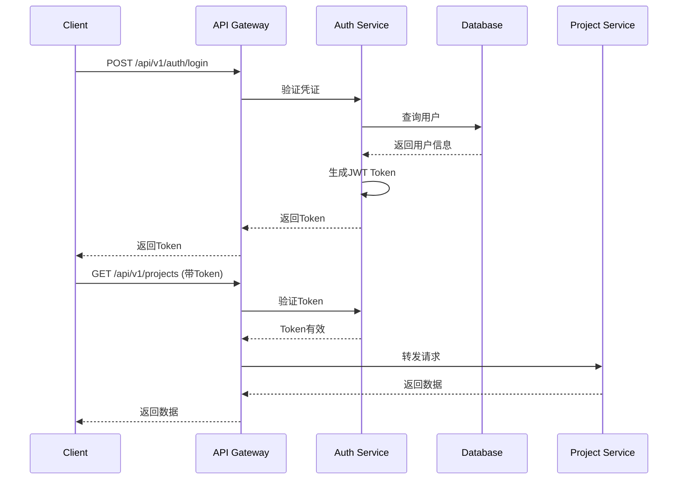

# AI标书智能创作平台 - API接口设计

## 📋 API设计概览

### API设计原则

```yaml
设计原则:
  RESTful风格: 遵循REST架构风格
  版本控制: URI版本化 (/api/v1, /api/v2)
  统一响应: 统一的响应格式
  错误处理: 标准化的错误码和错误信息
  文档完善: OpenAPI 3.0规范，自动生成文档
  向后兼容: 保证API向后兼容性

技术规范:
  协议: HTTPS
  格式: JSON
  编码: UTF-8
  认证: JWT + OAuth2.0
  限流: 基于Token Bucket算法

性能指标:
  响应时间: P95 < 200ms, P99 < 500ms
  并发支持: 1000 req/s
  可用性: 99.9%
```

### API分类

```yaml
API分类:
  认证授权API: /api/v1/auth
  用户管理API: /api/v1/users
  组织管理API: /api/v1/organizations
  项目管理API: /api/v1/projects
  文档管理API: /api/v1/documents
  模板管理API: /api/v1/templates
  AI服务API: /api/v1/ai
  企业能力API: /api/v1/capabilities
  协作API: /api/v1/collaboration
  审批API: /api/v1/approval
  导出API: /api/v1/export
  系统管理API: /api/v1/admin
```

## 🔐 认证授权

### 认证流程



### JWT Token结构

```json
{
  "header": {
    "alg": "HS256",
    "typ": "JWT"
  },
  "payload": {
    "user_id": "uuid",
    "username": "string",
    "email": "string",
    "organization_id": "uuid",
    "roles": ["admin", "member"],
    "permissions": ["project:read", "project:write"],
    "exp": 1700000000,
    "iat": 1699913600
  }
}
```

## 📝 统一响应格式

### 成功响应

```typescript
interface SuccessResponse<T> {
  success: true;
  data: T;
  message?: string;
  timestamp: string; // ISO 8601 format
}
```

**示例**:
```json
{
  "success": true,
  "data": {
    "id": "550e8400-e29b-41d4-a716-446655440000",
    "name": "测试项目",
    "status": "active"
  },
  "message": "操作成功",
  "timestamp": "2025-11-14T10:00:00Z"
}
```

### 分页响应

```typescript
interface PaginatedResponse<T> {
  success: true;
  data: {
    items: T[];
    total: number;
    page: number;
    pageSize: number;
    totalPages: number;
  };
  message?: string;
  timestamp: string;
}
```

**示例**:
```json
{
  "success": true,
  "data": {
    "items": [...],
    "total": 100,
    "page": 1,
    "pageSize": 20,
    "totalPages": 5
  },
  "message": "获取成功",
  "timestamp": "2025-11-14T10:00:00Z"
}
```

### 错误响应

```typescript
interface ErrorResponse {
  success: false;
  error: {
    code: string;
    message: string;
    details?: any;
    path?: string;
  };
  timestamp: string;
}
```

**示例**:
```json
{
  "success": false,
  "error": {
    "code": "INVALID_CREDENTIALS",
    "message": "用户名或密码错误",
    "details": {
      "field": "password",
      "reason": "密码不匹配"
    },
    "path": "/api/v1/auth/login"
  },
  "timestamp": "2025-11-14T10:00:00Z"
}
```

## 🔑 认证授权API

### 1. 用户注册

```yaml
POST /api/v1/auth/register
Content-Type: application/json

Request Body:
  email: string (required, email format)
  username: string (required, 3-50 chars)
  password: string (required, min 8 chars)
  full_name: string (optional)
  organization_name: string (optional)

Response: 201 Created
  {
    "success": true,
    "data": {
      "user_id": "uuid",
      "email": "string",
      "username": "string",
      "full_name": "string",
      "organization_id": "uuid",
      "created_at": "datetime"
    },
    "message": "注册成功"
  }

Errors:
  - 400: EMAIL_ALREADY_EXISTS - 邮箱已存在
  - 400: USERNAME_ALREADY_EXISTS - 用户名已存在
  - 400: INVALID_PASSWORD - 密码强度不足
```

### 2. 用户登录

```yaml
POST /api/v1/auth/login
Content-Type: application/json

Request Body:
  email: string (required)
  password: string (required)

Response: 200 OK
  {
    "success": true,
    "data": {
      "access_token": "jwt_token",
      "refresh_token": "jwt_token",
      "token_type": "Bearer",
      "expires_in": 3600,
      "user": {
        "id": "uuid",
        "email": "string",
        "username": "string",
        "full_name": "string",
        "organization_id": "uuid",
        "roles": ["string"]
      }
    },
    "message": "登录成功"
  }

Errors:
  - 401: INVALID_CREDENTIALS - 用户名或密码错误
  - 403: ACCOUNT_SUSPENDED - 账号已被暂停
  - 429: TOO_MANY_ATTEMPTS - 登录尝试次数过多
```

### 3. 刷新Token

```yaml
POST /api/v1/auth/refresh-token
Content-Type: application/json
Authorization: Bearer {refresh_token}

Response: 200 OK
  {
    "success": true,
    "data": {
      "access_token": "new_jwt_token",
      "expires_in": 3600
    }
  }

Errors:
  - 401: INVALID_REFRESH_TOKEN - 刷新Token无效
  - 401: REFRESH_TOKEN_EXPIRED - 刷新Token已过期
```

### 4. 用户登出

```yaml
POST /api/v1/auth/logout
Authorization: Bearer {access_token}

Response: 200 OK
  {
    "success": true,
    "message": "登出成功"
  }
```

### 5. 获取当前用户信息

```yaml
GET /api/v1/auth/me
Authorization: Bearer {access_token}

Response: 200 OK
  {
    "success": true,
    "data": {
      "id": "uuid",
      "email": "string",
      "username": "string",
      "full_name": "string",
      "avatar_url": "string",
      "organization": {
        "id": "uuid",
        "name": "string"
      },
      "roles": ["string"],
      "permissions": ["string"],
      "settings": {}
    }
  }
```

## 📁 项目管理API

### 1. 获取项目列表

```yaml
GET /api/v1/projects
Authorization: Bearer {access_token}

Query Parameters:
  page: integer (default: 1)
  pageSize: integer (default: 20, max: 100)
  status: string (draft|in_progress|review|submitted|won|lost|archived)
  priority: string (low|medium|high|urgent)
  search: string (搜索项目名称/编号)
  sortBy: string (created_at|updated_at|submission_deadline)
  sortOrder: string (asc|desc, default: desc)

Response: 200 OK
  {
    "success": true,
    "data": {
      "items": [
        {
          "id": "uuid",
          "name": "string",
          "code": "string",
          "description": "string",
          "status": "string",
          "priority": "string",
          "budget_amount": number,
          "submission_deadline": "datetime",
          "win_probability": number,
          "created_by": {
            "id": "uuid",
            "name": "string"
          },
          "created_at": "datetime",
          "updated_at": "datetime"
        }
      ],
      "total": 100,
      "page": 1,
      "pageSize": 20,
      "totalPages": 5
    }
  }
```

### 2. 创建项目

```yaml
POST /api/v1/projects
Authorization: Bearer {access_token}
Content-Type: application/json

Request Body:
  name: string (required)
  code: string (optional, auto-generated if not provided)
  description: string (optional)
  bidding_type: string (government|enterprise|international|other)
  industry: string (optional)
  budget_amount: number (optional)
  start_date: date (optional)
  end_date: date (optional)
  submission_deadline: datetime (optional)
  priority: string (low|medium|high|urgent, default: medium)
  tags: string[] (optional)

Response: 201 Created
  {
    "success": true,
    "data": {
      "id": "uuid",
      "name": "string",
      "code": "string",
      "status": "draft",
      "created_at": "datetime"
    },
    "message": "项目创建成功"
  }

Errors:
  - 400: INVALID_INPUT - 输入数据无效
  - 409: PROJECT_CODE_EXISTS - 项目编号已存在
```

### 3. 获取项目详情

```yaml
GET /api/v1/projects/{project_id}
Authorization: Bearer {access_token}

Response: 200 OK
  {
    "success": true,
    "data": {
      "id": "uuid",
      "name": "string",
      "code": "string",
      "description": "string",
      "organization_id": "uuid",
      "bidding_type": "string",
      "industry": "string",
      "budget_amount": number,
      "currency": "string",
      "start_date": "date",
      "end_date": "date",
      "submission_deadline": "datetime",
      "status": "string",
      "priority": "string",
      "win_probability": number,
      "tags": ["string"],
      "members": [
        {
          "user_id": "uuid",
          "username": "string",
          "full_name": "string",
          "role": "string"
        }
      ],
      "documents_count": number,
      "requirements_count": number,
      "created_by": {...},
      "created_at": "datetime",
      "updated_at": "datetime"
    }
  }

Errors:
  - 404: PROJECT_NOT_FOUND - 项目不存在
  - 403: ACCESS_DENIED - 无权访问
```

### 4. 更新项目

```yaml
PUT /api/v1/projects/{project_id}
Authorization: Bearer {access_token}
Content-Type: application/json

Request Body: (所有字段可选)
  name: string
  description: string
  status: string
  priority: string
  budget_amount: number
  submission_deadline: datetime
  win_probability: number
  tags: string[]

Response: 200 OK
  {
    "success": true,
    "data": {...},
    "message": "项目更新成功"
  }

Errors:
  - 404: PROJECT_NOT_FOUND
  - 403: PERMISSION_DENIED
  - 400: INVALID_STATUS_TRANSITION
```

### 5. 删除项目

```yaml
DELETE /api/v1/projects/{project_id}
Authorization: Bearer {access_token}

Response: 200 OK
  {
    "success": true,
    "message": "项目删除成功"
  }

Errors:
  - 404: PROJECT_NOT_FOUND
  - 403: PERMISSION_DENIED
  - 409: PROJECT_HAS_ACTIVE_DOCUMENTS - 项目有活跃文档，不能删除
```

### 6. 添加项目成员

```yaml
POST /api/v1/projects/{project_id}/members
Authorization: Bearer {access_token}
Content-Type: application/json

Request Body:
  user_id: string (required)
  role: string (owner|manager|member|viewer, default: member)
  permissions: string[] (optional)

Response: 201 Created
  {
    "success": true,
    "data": {
      "id": "uuid",
      "user": {...},
      "role": "string",
      "joined_at": "datetime"
    },
    "message": "成员添加成功"
  }

Errors:
  - 404: USER_NOT_FOUND
  - 409: MEMBER_ALREADY_EXISTS
  - 403: PERMISSION_DENIED
```

## 📄 文档管理API

### 1. 解析招标文件

```yaml
POST /api/v1/documents/parse
Authorization: Bearer {access_token}
Content-Type: multipart/form-data

Request Body:
  file: binary (required, max 50MB)
  project_id: string (required)

Response: 202 Accepted
  {
    "success": true,
    "data": {
      "task_id": "uuid",
      "status": "processing",
      "estimated_time": 30
    },
    "message": "文档解析任务已提交"
  }

Errors:
  - 400: FILE_TOO_LARGE - 文件过大
  - 400: UNSUPPORTED_FILE_TYPE - 不支持的文件类型
  - 404: PROJECT_NOT_FOUND
```

### 2. 获取解析结果

```yaml
GET /api/v1/documents/parse/{task_id}
Authorization: Bearer {access_token}

Response: 200 OK
  {
    "success": true,
    "data": {
      "task_id": "uuid",
      "status": "success",
      "result": {
        "document_id": "uuid",
        "file_name": "string",
        "parsed_content": {
          "project_info": {...},
          "requirements": [...],
          "evaluation_criteria": [...],
          "submission_info": {...}
        },
        "requirements_count": number,
        "parsed_at": "datetime"
      }
    }
  }

Status Values:
  - pending: 等待处理
  - processing: 处理中
  - success: 处理成功
  - failed: 处理失败

Errors:
  - 404: TASK_NOT_FOUND
```

### 3. 创建标书文档

```yaml
POST /api/v1/documents
Authorization: Bearer {access_token}
Content-Type: application/json

Request Body:
  project_id: string (required)
  template_id: string (optional)
  title: string (required)
  document_type: string (main|technical|commercial|qualification|other)

Response: 201 Created
  {
    "success": true,
    "data": {
      "id": "uuid",
      "project_id": "uuid",
      "title": "string",
      "version": "1.0",
      "status": "draft",
      "created_at": "datetime"
    },
    "message": "文档创建成功"
  }
```

### 4. 获取文档详情

```yaml
GET /api/v1/documents/{document_id}
Authorization: Bearer {access_token}

Response: 200 OK
  {
    "success": true,
    "data": {
      "id": "uuid",
      "project_id": "uuid",
      "title": "string",
      "version": "string",
      "status": "string",
      "content": {
        "sections": [...]
      },
      "toc": [...],
      "word_count": number,
      "page_count": number,
      "last_edited_by": {...},
      "last_edited_at": "datetime",
      "locked_by": null,
      "created_at": "datetime",
      "updated_at": "datetime"
    }
  }

Errors:
  - 404: DOCUMENT_NOT_FOUND
  - 403: ACCESS_DENIED
```

### 5. 更新文档内容

```yaml
PUT /api/v1/documents/{document_id}
Authorization: Bearer {access_token}
Content-Type: application/json

Request Body:
  title: string (optional)
  content: object (optional)
  status: string (optional)

Response: 200 OK
  {
    "success": true,
    "data": {
      "id": "uuid",
      "version": "string",
      "updated_at": "datetime"
    },
    "message": "文档更新成功"
  }

Errors:
  - 404: DOCUMENT_NOT_FOUND
  - 409: DOCUMENT_LOCKED - 文档被其他用户锁定
  - 403: PERMISSION_DENIED
```

### 6. 创建文档版本

```yaml
POST /api/v1/documents/{document_id}/versions
Authorization: Bearer {access_token}
Content-Type: application/json

Request Body:
  change_summary: string (required)
  change_type: string (major|minor|patch|draft, default: minor)

Response: 201 Created
  {
    "success": true,
    "data": {
      "id": "uuid",
      "version": "string",
      "version_number": number,
      "created_at": "datetime"
    },
    "message": "版本创建成功"
  }
```

### 7. 获取版本列表

```yaml
GET /api/v1/documents/{document_id}/versions
Authorization: Bearer {access_token}

Response: 200 OK
  {
    "success": true,
    "data": {
      "items": [
        {
          "id": "uuid",
          "version": "string",
          "version_number": number,
          "change_summary": "string",
          "created_by": {...},
          "created_at": "datetime"
        }
      ]
    }
  }
```

## 🤖 AI服务API

### 1. 分析需求

```yaml
POST /api/v1/ai/analyze-requirements
Authorization: Bearer {access_token}
Content-Type: application/json

Request Body:
  project_id: string (required)
  document_id: string (optional)
  content: string (optional, if document_id not provided)

Response: 202 Accepted
  {
    "success": true,
    "data": {
      "task_id": "uuid",
      "status": "processing",
      "estimated_time": 60
    },
    "message": "需求分析任务已提交"
  }
```

### 2. 匹配能力

```yaml
POST /api/v1/ai/match-capabilities
Authorization: Bearer {access_token}
Content-Type: application/json

Request Body:
  project_id: string (required)
  requirements: array (optional)

Response: 202 Accepted
  {
    "success": true,
    "data": {
      "task_id": "uuid",
      "status": "processing"
    }
  }
```

### 3. 生成内容

```yaml
POST /api/v1/ai/generate-content
Authorization: Bearer {access_token}
Content-Type: application/json

Request Body:
  document_id: string (required)
  section_id: string (optional)
  prompt: string (required)
  context: object (optional)
  model: string (gpt-4|gpt-3.5-turbo|claude-3, default: gpt-4)
  temperature: number (0-2, default: 0.7)
  max_tokens: number (default: 2000)

Response: 200 OK
  {
    "success": true,
    "data": {
      "task_id": "uuid",
      "content": "string",
      "tokens_used": {
        "prompt": number,
        "completion": number,
        "total": number
      },
      "model": "string",
      "created_at": "datetime"
    }
  }

Errors:
  - 400: INVALID_PROMPT
  - 429: RATE_LIMIT_EXCEEDED - AI调用超过限额
  - 500: AI_SERVICE_ERROR - AI服务错误
```

### 4. 质量审核

```yaml
POST /api/v1/ai/review-quality
Authorization: Bearer {access_token}
Content-Type: application/json

Request Body:
  document_id: string (required)
  check_types: string[] (plagiarism|completeness|compliance|quality)

Response: 202 Accepted
  {
    "success": true,
    "data": {
      "task_id": "uuid",
      "status": "processing"
    }
  }
```

### 5. 获取AI任务状态

```yaml
GET /api/v1/ai/tasks/{task_id}
Authorization: Bearer {access_token}

Response: 200 OK
  {
    "success": true,
    "data": {
      "id": "uuid",
      "task_type": "string",
      "status": "string",
      "progress": number,
      "result": object,
      "error_message": string,
      "started_at": "datetime",
      "completed_at": "datetime",
      "duration_seconds": number
    }
  }
```

## 📋 模板管理API

### 1. 获取模板列表

```yaml
GET /api/v1/templates
Authorization: Bearer {access_token}

Query Parameters:
  page: integer
  pageSize: integer
  category: string
  industry: string
  scope: string (public|organization|private)
  search: string

Response: 200 OK (Paginated)
```

### 2. 获取模板详情

```yaml
GET /api/v1/templates/{template_id}
Authorization: Bearer {access_token}

Response: 200 OK
  {
    "success": true,
    "data": {
      "id": "uuid",
      "name": "string",
      "description": "string",
      "category": "string",
      "industry": "string",
      "content": {...},
      "structure": [...],
      "variables": [...],
      "usage_count": number,
      "rating": number
    }
  }
```

### 3. 创建模板

```yaml
POST /api/v1/templates
Authorization: Bearer {access_token}
Content-Type: application/json

Request Body:
  name: string (required)
  description: string
  category: string
  template_type: string
  content: object (required)
  structure: array
  variables: array

Response: 201 Created
```

## 🏢 企业能力API

### 1. 获取产品服务列表

```yaml
GET /api/v1/capabilities/products
Authorization: Bearer {access_token}

Query Parameters:
  page: integer
  pageSize: integer
  category: string
  type: string (product|service|solution)
  search: string

Response: 200 OK (Paginated)
```

### 2. 添加产品服务

```yaml
POST /api/v1/capabilities/products
Authorization: Bearer {access_token}
Content-Type: application/json

Request Body:
  name: string (required)
  category: string
  type: string (product|service|solution)
  description: string
  features: string[]
  specifications: object
  advantages: string[]

Response: 201 Created
```

### 3. 获取项目案例列表

```yaml
GET /api/v1/capabilities/cases
Authorization: Bearer {access_token}

Query Parameters:
  page: integer
  pageSize: integer
  client_industry: string
  project_category: string
  search: string

Response: 200 OK (Paginated)
```

### 4. 添加项目案例

```yaml
POST /api/v1/capabilities/cases
Authorization: Bearer {access_token}
Content-Type: application/json

Request Body:
  project_name: string (required)
  client_name: string
  client_industry: string
  project_description: string
  achievements: string[]
  technologies_used: string[]

Response: 201 Created
```

## 👥 协作API

### 1. WebSocket连接

```yaml
WebSocket /api/v1/collaboration/ws
Authorization: Bearer {access_token}

Connection URL:
  ws://api.example.com/api/v1/collaboration/ws?token={access_token}&document_id={document_id}

Message Types:
  - join: 加入协作会话
  - leave: 离开协作会话
  - edit: 编辑操作
  - cursor: 光标位置
  - selection: 选中内容
  - comment: 评论
  - awareness: 用户状态

Message Format:
  {
    "type": "string",
    "data": object,
    "timestamp": "datetime"
  }
```

### 2. 创建协作会话

```yaml
POST /api/v1/collaboration/sessions
Authorization: Bearer {access_token}
Content-Type: application/json

Request Body:
  document_id: string (required)

Response: 201 Created
  {
    "success": true,
    "data": {
      "session_id": "uuid",
      "session_key": "string",
      "ws_url": "string",
      "created_at": "datetime"
    }
  }
```

## 📤 导出API

### 1. 导出为PDF

```yaml
POST /api/v1/export/pdf
Authorization: Bearer {access_token}
Content-Type: application/json

Request Body:
  document_id: string (required)
  options: {
    page_size: string (A4|A3|Letter, default: A4)
    orientation: string (portrait|landscape, default: portrait)
    include_toc: boolean (default: true)
    watermark: string (optional)
  }

Response: 202 Accepted
  {
    "success": true,
    "data": {
      "task_id": "uuid",
      "status": "processing"
    }
  }
```

### 2. 导出为Word

```yaml
POST /api/v1/export/word
Authorization: Bearer {access_token}
Content-Type: application/json

Request Body:
  document_id: string (required)
  options: {
    include_images: boolean (default: true)
    include_comments: boolean (default: false)
  }

Response: 202 Accepted
```

### 3. 获取导出任务状态

```yaml
GET /api/v1/export/tasks/{task_id}
Authorization: Bearer {access_token}

Response: 200 OK
  {
    "success": true,
    "data": {
      "task_id": "uuid",
      "status": "success",
      "download_url": "string",
      "file_size": number,
      "expires_at": "datetime"
    }
  }
```

## ⚠️ 错误码定义

### 通用错误码

```yaml
4xx 客户端错误:
  400: BAD_REQUEST - 请求参数错误
  401: UNAUTHORIZED - 未授权
  403: FORBIDDEN - 禁止访问
  404: NOT_FOUND - 资源不存在
  409: CONFLICT - 资源冲突
  422: UNPROCESSABLE_ENTITY - 无法处理的实体
  429: TOO_MANY_REQUESTS - 请求过多

5xx 服务器错误:
  500: INTERNAL_SERVER_ERROR - 服务器内部错误
  502: BAD_GATEWAY - 网关错误
  503: SERVICE_UNAVAILABLE - 服务不可用
  504: GATEWAY_TIMEOUT - 网关超时
```

### 业务错误码

```yaml
认证相关:
  AUTH_001: INVALID_CREDENTIALS - 凭证无效
  AUTH_002: TOKEN_EXPIRED - Token已过期
  AUTH_003: INVALID_TOKEN - Token无效
  AUTH_004: EMAIL_ALREADY_EXISTS - 邮箱已存在
  AUTH_005: USERNAME_ALREADY_EXISTS - 用户名已存在

项目相关:
  PROJ_001: PROJECT_NOT_FOUND - 项目不存在
  PROJ_002: PROJECT_CODE_EXISTS - 项目编号已存在
  PROJ_003: INVALID_STATUS_TRANSITION - 状态转换无效
  PROJ_004: PROJECT_LOCKED - 项目已锁定

文档相关:
  DOC_001: DOCUMENT_NOT_FOUND - 文档不存在
  DOC_002: DOCUMENT_LOCKED - 文档被锁定
  DOC_003: VERSION_CONFLICT - 版本冲突
  DOC_004: PARSE_FAILED - 解析失败

AI服务相关:
  AI_001: AI_SERVICE_ERROR - AI服务错误
  AI_002: RATE_LIMIT_EXCEEDED - 超过限额
  AI_003: INVALID_PROMPT - Prompt无效
  AI_004: MODEL_NOT_AVAILABLE - 模型不可用

权限相关:
  PERM_001: PERMISSION_DENIED - 权限不足
  PERM_002: RESOURCE_ACCESS_DENIED - 资源访问被拒绝
  PERM_003: ORGANIZATION_MISMATCH - 组织不匹配
```

## 🔒 API限流策略

```yaml
限流规则:
  认证API:
    登录: 5次/分钟
    注册: 3次/分钟
    刷新Token: 10次/分钟

  普通API:
    基础版: 100次/分钟
    专业版: 500次/分钟
    企业版: 2000次/分钟

  AI API:
    基础版: 10次/小时
    专业版: 100次/小时
    企业版: 1000次/小时

  导出API:
    所有版本: 20次/小时

限流响应:
  HTTP Status: 429 Too Many Requests
  Headers:
    X-RateLimit-Limit: 100
    X-RateLimit-Remaining: 0
    X-RateLimit-Reset: 1700000000
    Retry-After: 60
```

## 📊 API使用示例

### JavaScript/TypeScript示例

```typescript
// 1. 登录
async function login(email: string, password: string) {
  const response = await fetch('https://api.example.com/api/v1/auth/login', {
    method: 'POST',
    headers: {
      'Content-Type': 'application/json',
    },
    body: JSON.stringify({ email, password }),
  });

  const data = await response.json();

  if (data.success) {
    localStorage.setItem('access_token', data.data.access_token);
    return data.data;
  } else {
    throw new Error(data.error.message);
  }
}

// 2. 获取项目列表
async function getProjects(page = 1, pageSize = 20) {
  const token = localStorage.getItem('access_token');

  const response = await fetch(
    `https://api.example.com/api/v1/projects?page=${page}&pageSize=${pageSize}`,
    {
      headers: {
        'Authorization': `Bearer ${token}`,
      },
    }
  );

  const data = await response.json();
  return data.data;
}

// 3. 创建项目
async function createProject(projectData) {
  const token = localStorage.getItem('access_token');

  const response = await fetch('https://api.example.com/api/v1/projects', {
    method: 'POST',
    headers: {
      'Content-Type': 'application/json',
      'Authorization': `Bearer ${token}`,
    },
    body: JSON.stringify(projectData),
  });

  return await response.json();
}

// 4. WebSocket连接
function connectCollaboration(documentId: string) {
  const token = localStorage.getItem('access_token');
  const ws = new WebSocket(
    `wss://api.example.com/api/v1/collaboration/ws?token=${token}&document_id=${documentId}`
  );

  ws.onopen = () => {
    ws.send(JSON.stringify({ type: 'join', data: { documentId } }));
  };

  ws.onmessage = (event) => {
    const message = JSON.parse(event.data);
    handleCollaborationMessage(message);
  };

  return ws;
}
```

### Python示例

```python
import requests
from typing import Optional, Dict, Any

class AIBidComposerClient:
    def __init__(self, base_url: str, access_token: Optional[str] = None):
        self.base_url = base_url
        self.access_token = access_token

    def login(self, email: str, password: str) -> Dict[str, Any]:
        """用户登录"""
        response = requests.post(
            f"{self.base_url}/api/v1/auth/login",
            json={"email": email, "password": password}
        )
        response.raise_for_status()
        data = response.json()

        if data["success"]:
            self.access_token = data["data"]["access_token"]
            return data["data"]
        else:
            raise Exception(data["error"]["message"])

    def get_projects(self, page: int = 1, page_size: int = 20) -> Dict[str, Any]:
        """获取项目列表"""
        response = requests.get(
            f"{self.base_url}/api/v1/projects",
            params={"page": page, "pageSize": page_size},
            headers={"Authorization": f"Bearer {self.access_token}"}
        )
        response.raise_for_status()
        return response.json()["data"]

    def create_project(self, project_data: Dict[str, Any]) -> Dict[str, Any]:
        """创建项目"""
        response = requests.post(
            f"{self.base_url}/api/v1/projects",
            json=project_data,
            headers={
                "Authorization": f"Bearer {self.access_token}",
                "Content-Type": "application/json"
            }
        )
        response.raise_for_status()
        return response.json()["data"]

    def generate_content(
        self,
        document_id: str,
        prompt: str,
        model: str = "gpt-4",
        temperature: float = 0.7
    ) -> Dict[str, Any]:
        """AI生成内容"""
        response = requests.post(
            f"{self.base_url}/api/v1/ai/generate-content",
            json={
                "document_id": document_id,
                "prompt": prompt,
                "model": model,
                "temperature": temperature
            },
            headers={
                "Authorization": f"Bearer {self.access_token}",
                "Content-Type": "application/json"
            }
        )
        response.raise_for_status()
        return response.json()["data"]

# 使用示例
client = AIBidComposerClient("https://api.example.com")

# 登录
user = client.login("user@example.com", "password")

# 获取项目
projects = client.get_projects(page=1, page_size=20)

# 创建项目
new_project = client.create_project({
    "name": "测试项目",
    "description": "这是一个测试项目",
    "priority": "high"
})
```

## 📚 OpenAPI 3.0规范

完整的OpenAPI规范文档可以通过以下URL访问：

```
开发环境: http://localhost:8000/openapi.json
生产环境: https://api.example.com/openapi.json

交互式文档:
Swagger UI: https://api.example.com/docs
ReDoc: https://api.example.com/redoc
```

---

**文档版本**: v1.0
**创建时间**: 2025年11月14日
**API版本**: v1
**基础URL**: https://api.aibidcomposer.com/api/v1
