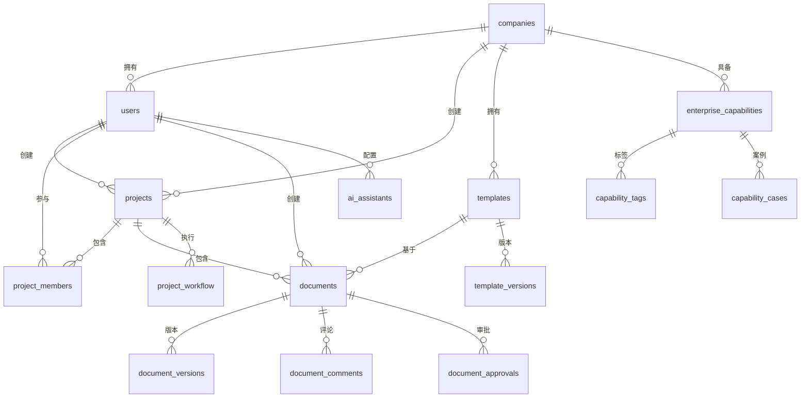

# AI标书智能创作平台 - 数据模型与API接口 - 📊 数据模型设计

### 核心实体关系图


### 详细数据模型

#### 1. 用户和权限模型
```typescript
// 用户相关数据模型
interface User {
  id: string;                    // UUID
  company_id: string;            // 企业ID
  username: string;              // 用户名
  email: string;                 // 邮箱
  password_hash: string;         // 密码哈希
  full_name: string;             // 全名
  avatar_url?: string;           // 头像URL
  phone?: string;                // 电话
  department?: string;           // 部门
  position?: string;             // 职位
  bio?: string;                  // 个人简介
  expertise: string[];           // 专业技能
  languages: Record<string, number>; // 语言能力
  role: UserRole;                // 用户角色
  permissions: Permission[];     // 权限列表
  is_active: boolean;            // 是否激活
  is_verified: boolean;          // 是否验证
  is_online: boolean;            // 在线状态
  last_login_at?: Date;          // 最后登录时间
  login_count: number;           // 登录次数
  timezone: string;              // 时区
  language: string;              // 语言
  theme: ThemeType;              // 主题
  notification_settings: NotificationSettings; // 通知设置
  created_at: Date;              // 创建时间
  updated_at: Date;              // 更新时间
}

// 用户角色枚举
enum UserRole {
  SUPER_ADMIN = 'super_admin',
  ADMIN = 'admin',
  MANAGER = 'manager',
  EDITOR = 'editor',
  REVIEWER = 'reviewer',
  VIEWER = 'viewer',
  USER = 'user'
}

// 权限定义
interface Permission {
  resource: string;              // 资源类型
  action: string;                // 操作类型
  conditions?: Record<string, any>; // 条件限制
}

// 通知设置
interface NotificationSettings {
  email: boolean;                // 邮件通知
  push: boolean;                 // 推送通知
  sms: boolean;                  // 短信通知
  project_updates: boolean;      // 项目更新
  deadline_reminders: boolean;   // 截止日期提醒
  ai_recommendations: boolean;   // AI推荐
  system_updates: boolean;       // 系统更新
}

// 企业模型
interface Company {
  id: string;                    // UUID
  name: string;                  // 企业名称
  display_name: string;          // 显示名称
  description?: string;          // 描述
  industry: string;              // 行业
  company_size: CompanySize;     // 企业规模
  website?: string;              // 网站
  logo_url?: string;             // Logo URL
  contact_email: string;         // 联系邮箱
  contact_phone?: string;        // 联系电话
  address?: string;              // 地址
  country: string;               // 国家
  region: string;                // 地区
  city: string;                  // 城市
  postal_code?: string;          // 邮编
  established_year?: number;    // 成立年份
  annual_revenue?: number;       // 年收入
  employee_count?: number;       // 员工数
  subscription_tier: SubscriptionTier; // 订阅层级
  subscription_status: SubscriptionStatus; // 订阅状态
  subscription_expires_at?: Date; // 订阅过期时间
  is_active: boolean;            // 是否激活
  is_verified: boolean;          // 是否验证
  created_at: Date;              // 创建时间
  updated_at: Date;              // 更新时间
}

// 企业规模枚举
enum CompanySize {
  STARTUP = 'startup',
  SMALL = 'small',
  MEDIUM = 'medium',
  LARGE = 'large',
  ENTERPRISE = 'enterprise'
}

// 订阅层级
enum SubscriptionTier {
  BASIC = 'basic',
  PROFESSIONAL = 'professional',
  ENTERPRISE = 'enterprise',
  FLAGSHIP = 'flagship'
}

// 订阅状态
enum SubscriptionStatus {
  ACTIVE = 'active',
  INACTIVE = 'inactive',
  SUSPENDED = 'suspended',
  CANCELLED = 'cancelled'
}
```

#### 2. 项目管理模型
```typescript
// 项目模型
interface Project {
  id: string;                    // UUID
  company_id: string;            // 企业ID
  created_by: string;            // 创建者ID
  name: string;                  // 项目名称
  description?: string;          // 项目描述
  project_number?: string;       // 项目编号
  client_name: string;           // 客户名称
  client_industry?: string;      // 客户行业
  project_type: ProjectType;     // 项目类型
  project_category?: string;     // 项目分类

  // 招标信息
  tender_document_url?: string;  // 招标文档URL
  tender_document_id?: string;   // 招标文档ID
  submission_deadline?: Date;    // 提交截止时间
  bid_opening_date?: Date;       // 开标时间
  budget_amount?: number;        // 预算金额
  budget_currency: string;       // 预算货币

  // 项目状态
  status: ProjectStatus;         // 项目状态
  priority: Priority;            // 优先级

  // 项目信息
  estimated_duration?: number;   // 预估天数
  actual_duration?: number;      // 实际天数
  team_size?: number;            // 团队规模

  // 竞争信息
  competitors: CompetitorInfo[]; // 竞争对手信息
  market_analysis?: MarketAnalysis; // 市场分析

  // 系统字段
  created_at: Date;              // 创建时间
  updated_at: Date;              // 更新时间
  submitted_at?: Date;           // 提交时间
  completed_at?: Date;           // 完成时间
}

// 项目类型
enum ProjectType {
  GOVERNMENT = 'government',
  COMMERCIAL = 'commercial',
  INTERNAL = 'internal'
}

// 项目状态
enum ProjectStatus {
  DRAFT = 'draft',
  IN_PROGRESS = 'in_progress',
  REVIEW = 'review',
  APPROVED = 'approved',
  SUBMITTED = 'submitted',
  WON = 'won',
  LOST = 'lost',
  CANCELLED = 'cancelled'
}

// 优先级
enum Priority {
  LOW = 'low',
  MEDIUM = 'medium',
  HIGH = 'high',
  URGENT = 'urgent'
}

// 竞争对手信息
interface CompetitorInfo {
  name: string;                  // 竞争对手名称
  type: CompetitorType;          // 竞争对手类型
  strengths: string[];           // 优势
  weaknesses: string[];          // 劣势
  market_position: string;       // 市场地位
  historical_performance?: string; // 历史表现
}

enum CompetitorType {
  DIRECT = 'direct',
  INDIRECT = 'indirect',
  POTENTIAL = 'potential'
}

// 市场分析
interface MarketAnalysis {
  market_size?: number;          // 市场规模
  growth_rate?: number;          // 增长率
  competition_level: CompetitionLevel; // 竞争程度
  success_factors: string[];     // 成功因素
  barriers: string[];            // 进入壁垒
}

enum CompetitionLevel {
  LOW = 'low',
  MEDIUM = 'medium',
  HIGH = 'high'
}

// 项目成员模型
interface ProjectMember {
  id: string;                    // UUID
  project_id: string;            // 项目ID
  user_id: string;               // 用户ID
  role: ProjectRole;             // 项目角色
  responsibilities: string[];     // 职责
  can_edit: boolean;             // 编辑权限
  can_delete: boolean;           // 删除权限
  can_invite: boolean;           // 邀请权限
  can_approve: boolean;          // 审批权限
  status: MemberStatus;          // 成员状态
  joined_at: Date;               // 加入时间
  left_at?: Date;                // 离开时间
  created_at: Date;              // 创建时间
  updated_at: Date;              // 更新时间
  created_by?: string;           // 创建者
}

enum ProjectRole {
  OWNER = 'owner',
  MANAGER = 'manager',
  EDITOR = 'editor',
  REVIEWER = 'reviewer',
  MEMBER = 'member'
}

enum MemberStatus {
  ACTIVE = 'active',
  INACTIVE = 'inactive',
  PENDING = 'pending'
}
```

#### 3. 模板系统模型
```typescript
// 模板模型
interface Template {
  id: string;                    // UUID
  company_id?: string;           // 企业ID (null表示公共模板)
  created_by: string;            // 创建者ID
  name: string;                  // 模板名称
  description?: string;          // 描述
  category: TemplateCategory;    // 模板分类
  industry?: string;             // 适用行业
  project_type?: string;         // 适用项目类型

  // 模板内容
  content: TemplateContent;      // 模板内容
  structure: TemplateStructure;  // 模板结构
  variables: TemplateVariable[]; // 模板变量
  sections: TemplateSection[];   // 章节定义

  // 模板属性
  is_public: boolean;            // 是否公开
  is_active: boolean;            // 是否激活
  is_default: boolean;           // 是否默认模板

  // 使用统计
  usage_count: number;           // 使用次数
  rating: number;                // 平均评分
  rating_count: number;          // 评分数量

  // 版本信息
  version: number;               // 版本号
  parent_template_id?: string;   // 父模板ID

  // 系统字段
  created_at: Date;              // 创建时间
  updated_at: Date;              // 更新时间
  published_at?: Date;           // 发布时间
}

// 模板分类
enum TemplateCategory {
  TENDER = 'tender',
  PROPOSAL = 'proposal',
  CONTRACT = 'contract',
  REPORT = 'report',
  OTHER = 'other'
}

// 模板内容
interface TemplateContent {
  metadata: TemplateMetadata;    // 元数据
  sections: ContentSection[];    // 内容章节
  styles: TemplateStyles;        // 样式定义
  scripts: TemplateScript[];     // 脚本定义
}

// 模板元数据
interface TemplateMetadata {
  title: string;                 // 标题
  author: string;                // 作者
  version: string;               // 版本
  description?: string;          // 描述
  keywords: string[];            // 关键词
  language: string;              // 语言
  page_size: PageSize;           // 页面大小
  orientation: PageOrientation;  // 页面方向
}

// 内容章节
interface ContentSection {
  id: string;                    // 章节ID
  type: SectionType;             // 章节类型
  title: string;                 // 章节标题
  order: number;                 // 排序
  content: string | ContentBlock[]; // 章节内容
  is_required: boolean;          // 是否必需
  is_repeatable: boolean;        // 是否可重复
  conditions?: SectionCondition[]; // 显示条件
  variables?: string[];          // 关联变量
}

// 章节类型
enum SectionType {
  HEADER = 'header',
  PARAGRAPH = 'paragraph',
  LIST = 'list',
  TABLE = 'table',
  IMAGE = 'image',
  CHART = 'chart',
  FORM = 'form',
  CUSTOM = 'custom'
}

// 章节条件
interface SectionCondition {
  variable: string;              // 变量名
  operator: ConditionOperator;   // 操作符
  value: any;                    // 值
  logic?: 'AND' | 'OR';          // 逻辑关系
}

enum ConditionOperator {
  EQUALS = 'equals',
  NOT_EQUALS = 'not_equals',
  GREATER_THAN = 'greater_than',
  LESS_THAN = 'less_than',
  CONTAINS = 'contains',
  NOT_CONTAINS = 'not_contains',
  IS_EMPTY = 'is_empty',
  IS_NOT_EMPTY = 'is_not_empty'
}

// 模板变量
interface TemplateVariable {
  id: string;                    // 变量ID
  name: string;                  // 变量名
  type: VariableType;            // 变量类型
  label: string;                 // 显示标签
  description?: string;          // 描述
  default_value?: any;           // 默认值
  required: boolean;             // 是否必需
  validation?: ValidationRule[]; // 验证规则
  options?: VariableOption[];    // 选项 (用于select类型)
  data_source?: string;          // 数据源
}

enum VariableType {
  TEXT = 'text',
  NUMBER = 'number',
  DATE = 'date',
  BOOLEAN = 'boolean',
  SELECT = 'select',
  MULTI_SELECT = 'multi_select',
  FILE = 'file',
  RICH_TEXT = 'rich_text',
  REFERENCE = 'reference'
}

// 验证规则
interface ValidationRule {
  type: ValidationType;          // 验证类型
  value?: any;                   // 验证值
  message: string;               // 错误消息
}

enum ValidationType {
  REQUIRED = 'required',
  MIN_LENGTH = 'min_length',
  MAX_LENGTH = 'max_length',
  MIN_VALUE = 'min_value',
  MAX_VALUE = 'max_value',
  PATTERN = 'pattern',
  EMAIL = 'email',
  URL = 'url'
}

// 变量选项
interface VariableOption {
  value: any;                    // 选项值
  label: string;                 // 选项标签
  description?: string;          // 描述
  disabled?: boolean;            // 是否禁用
}
```

#### 4. 文档管理模型
```typescript
// 文档模型
interface Document {
  id: string;                    // UUID
  project_id: string;            // 项目ID
  template_id?: string;          // 模板ID
  created_by: string;            // 创建者ID
  updated_by: string;            // 更新者ID

  // 基本信息
  title: string;                 // 文档标题
  document_type: DocumentType;   // 文档类型
  file_name?: string;            // 文件名
  file_path?: string;            // 文件路径
  file_size?: number;            // 文件大小
  file_type: FileType;           // 文件类型
  mime_type?: string;            // MIME类型

  // 文档状态
  status: DocumentStatus;        // 文档状态
  version: number;               // 版本号
  parent_document_id?: string;   // 父文档ID

  // 文档内容
  content?: DocumentContent;     // 结构化内容
  raw_content?: string;          // 原始文本内容
  analysis_result?: AnalysisResult; // AI分析结果

  // 质量指标
  quality_score?: number;        // 质量评分
  completeness_score?: number;   // 完整性评分
  ai_generated: boolean;         // 是否AI生成

  // 协作信息
  collaborators: DocumentCollaborator[]; // 协作者
  comments: DocumentComment[];   // 评论
  approvals: DocumentApproval[]; // 审批记录

  // 系统字段
  created_at: Date;              // 创建时间
  updated_at: Date;              // 更新时间
  last_accessed_at?: Date;       // 最后访问时间
}

// 文档类型
enum DocumentType {
  TENDER_ANALYSIS = 'tender_analysis',
  BID_DOCUMENT = 'bid_document',
  SUPPORTING_DOCUMENT = 'supporting_document',
  TEMPLATE = 'template',
  CONTRACT = 'contract'
}

// 文件类型
enum FileType {
  PDF = 'pdf',
  DOCX = 'docx',
  XLSX = 'xlsx',
  TXT = 'txt',
  HTML = 'html',
  JSON = 'json'
}

// 文档状态
enum DocumentStatus {
  DRAFT = 'draft',
  REVIEW = 'review',
  APPROVED = 'approved',
  FINAL = 'final',
  ARCHIVED = 'archived'
}

// 文档内容
interface DocumentContent {
  metadata: DocumentMetadata;    // 文档元数据
  sections: DocumentSection[];   // 文档章节
  styles: DocumentStyles;        // 样式信息
  variables: DocumentVariable[]; // 变量定义
  assets: DocumentAsset[];       // 资源文件
}

// 文档元数据
interface DocumentMetadata {
  title: string;                 // 标题
  author: string;                // 作者
  subject?: string;              // 主题
  keywords?: string[];           // 关键词
  creation_date: Date;           // 创建日期
  modification_date: Date;       // 修改日期
  language: string;              // 语言
  page_count?: number;           // 页数
  word_count?: number;           // 字数
}

// 文档章节
interface DocumentSection {
  id: string;                    // 章节ID
  parent_id?: string;            // 父章节ID
  type: SectionType;             // 章节类型
  title: string;                 // 章节标题
  level: number;                 // 层级
  order: number;                 // 排序
  content: any;                  // 章节内容
  styles?: SectionStyles;        // 章节样式
  locked: boolean;               // 是否锁定
  locked_by?: string;            // 锁定者
  locked_at?: Date;              // 锁定时间
  created_at: Date;              // 创建时间
  updated_at: Date;              // 更新时间
}

// AI分析结果
interface AnalysisResult {
  overall_score: number;         // 总体评分
  sections: SectionAnalysis[];   // 章节分析
  issues: AnalysisIssue[];       // 问题
  suggestions: AnalysisSuggestion[]; // 建议
  processing_metadata: ProcessingMetadata; // 处理元数据
}

// 章节分析
interface SectionAnalysis {
  section_id: string;            // 章节ID
  relevance_score: number;       // 相关性评分
  quality_score: number;         // 质量评分
  completeness_score: number;    // 完整性评分
  identified_issues: string[];   // 识别的问题
  improvement_suggestions: string[]; // 改进建议
}

// 分析问题
interface AnalysisIssue {
  type: IssueType;               // 问题类型
  severity: IssueSeverity;       // 严重程度
  description: string;           // 描述
  location: string;              // 位置
  suggestion?: string;           // 建议
}

enum IssueType {
  GRAMMAR = 'grammar',
  STYLE = 'style',
  COMPLETENESS = 'completeness',
  CONSISTENCY = 'consistency',
  COMPLIANCE = 'compliance'
}

enum IssueSeverity {
  LOW = 'low',
  MEDIUM = 'medium',
  HIGH = 'high',
  CRITICAL = 'critical'
}

// 文档协作者
interface DocumentCollaborator {
  user_id: string;               // 用户ID
  permission: CollaborationPermission; // 权限
  joined_at: Date;               // 加入时间
  last_activity_at?: Date;       // 最后活动时间
  is_active: boolean;            // 是否活跃
}

enum CollaborationPermission {
  READ = 'read',
  COMMENT = 'comment',
  EDIT = 'edit',
  APPROVE = 'approve',
  ADMIN = 'admin'
}

// 文档评论
interface DocumentComment {
  id: string;                    // UUID
  user_id: string;               // 评论者ID
  section_id?: string;           // 章节ID
  content: string;               // 评论内容
  type: CommentType;             // 评论类型
  parent_id?: string;            // 父评论ID
  resolved: boolean;             // 是否已解决
  resolved_by?: string;          // 解决者ID
  resolved_at?: Date;            // 解决时间
  created_at: Date;              // 创建时间
  updated_at: Date;              // 更新时间
}

enum CommentType {
  SUGGESTION = 'suggestion',
  QUESTION = 'question',
  ISSUE = 'issue',
  APPROVAL = 'approval',
  GENERAL = 'general'
}

// 文档审批
interface DocumentApproval {
  id: string;                    // UUID
  workflow_id: string;           // 工作流ID
  step_id: string;               // 步骤ID
  reviewer_id: string;           // 审批者ID
  decision: ApprovalDecision;    // 决定
  comments?: string;             // 审批意见
  conditions?: ApprovalCondition[]; // 条件
  reviewed_at: Date;             // 审批时间
  expires_at?: Date;             // 过期时间
}

enum ApprovalDecision {
  APPROVED = 'approved',
  REJECTED = 'rejected',
  REQUESTED_CHANGES = 'requested_changes',
  PENDING = 'pending'
}

// 审批条件
interface ApprovalCondition {
  type: ConditionType;           // 条件类型
  description: string;           // 描述
  requirement: string;           // 要求
  deadline?: Date;               // 截止时间
}

enum ConditionType {
  MODIFICATION = 'modification',
  ADDITION = 'addition',
  REVIEW = 'review',
  VERIFICATION = 'verification'
}
```

#### 5. 企业能力模型
```typescript
// 企业能力模型
interface EnterpriseCapability {
  id: string;                    // UUID
  company_id: string;            // 企业ID
  created_by: string;            // 创建者ID
  updated_by: string;            // 更新者ID

  // 基本信息
  name: string;                  // 能力名称
  type: CapabilityType;          // 能力类型
  category: string;              // 分类
  subcategory?: string;          // 子分类
  description: string;           // 描述

  // 详细信息
  specifications: CapabilitySpecification; // 技术规格
  features: CapabilityFeature[]; // 特性列表
  benefits: CapabilityBenefit[]; // 优势列表
  limitations: CapabilityLimitation[]; // 局限性

  // 能力级别
  proficiency_level: number;     // 能力级别 (1-5)
  experience_years: number;      // 经验年数
  case_study_count: number;      // 案例数量

  // 标签和分类
  tags: string[];                // 标签
  keywords: string[];            // 关键词
  industry_focus: string[];      // 行业焦点

  // 向量化数据
  embedding_vector?: number[];   // 向量表示

  // 关联数据
  related_capabilities: string[]; // 关联能力ID
  applicable_projects: string[]; // 适用项目ID
  required_certifications: string[]; // 所需认证

  // 状态和可用性
  is_active: boolean;            // 是否激活
  is_verified: boolean;          // 是否验证
  availability_status: AvailabilityStatus; // 可用性状态

  // 使用统计
  usage_count: number;           // 使用次数
  success_rate?: number;         // 成功率
  client_satisfaction?: number;  // 客户满意度

  // 成本信息
  cost_info?: CostInfo;          // 成本信息

  // 系统字段
  created_at: Date;              // 创建时间
  updated_at: Date;              // 更新时间
  last_used_at?: Date;           // 最后使用时间
}

// 能力类型
enum CapabilityType {
  PRODUCT = 'product',
  SERVICE = 'service',
  PROJECT = 'project',
  PERSONNEL = 'personnel',
  TECHNOLOGY = 'technology',
  CERTIFICATION = 'certification'
}

// 技术规格
interface CapabilitySpecification {
  technical_specs: Record<string, any>; // 技术规格
  performance_metrics: PerformanceMetric[]; // 性能指标
  compliance_standards: string[]; // 合规标准
  quality_standards: string[];   // 质量标准
  integration_capabilities: string[]; // 集成能力
}

// 性能指标
interface PerformanceMetric {
  name: string;                  // 指标名称
  value: number | string;        // 指标值
  unit?: string;                 // 单位
  benchmark?: number | string;   // 基准值
  description?: string;          // 描述
}

// 能力特性
interface CapabilityFeature {
  id: string;                    // 特性ID
  name: string;                  // 特性名称
  description: string;           // 描述
  type: FeatureType;             // 特性类型
  importance: ImportanceLevel;    // 重要性
  is_unique: boolean;            // 是否独特
  evidence?: string;             // 证据
}

enum FeatureType {
  TECHNICAL = 'technical',
  FUNCTIONAL = 'functional',
  BUSINESS = 'business',
  QUALITY = 'quality'
}

enum ImportanceLevel {
  LOW = 'low',
  MEDIUM = 'medium',
  HIGH = 'high',
  CRITICAL = 'critical'
}

// 能力优势
interface CapabilityBenefit {
  id: string;                    // 优势ID
  description: string;           // 描述
  value_proposition: string;     // 价值主张
  differentiation: string;        // 差异化
  evidence?: Evidence;           // 证据
  impact_level: ImpactLevel;     // 影响程度
}

enum ImpactLevel {
  MINOR = 'minor',
  MODERATE = 'moderate',
  SIGNIFICANT = 'significant',
  MAJOR = 'major'
}

// 证据
interface Evidence {
  type: EvidenceType;            // 证据类型
  description: string;           // 描述
  source: string;                // 来源
  date: Date;                    // 日期
  verified: boolean;             // 是否验证
}

enum EvidenceType {
  CASE_STUDY = 'case_study',
  CERTIFICATION = 'certification',
  TEST_REPORT = 'test_report',
  CUSTOMER_TESTIMONIAL = 'customer_testimonial',
  AWARD = 'award'
}

// 能力局限性
interface CapabilityLimitation {
  id: string;                    // 局限性ID
  description: string;           // 描述
  impact: string;                // 影响
  mitigation: string;            // 缓解措施
  severity: SeverityLevel;       // 严重程度
  temporary: boolean;            // 是否临时
}

enum SeverityLevel {
  LOW = 'low',
  MEDIUM = 'medium',
  HIGH = 'high',
  CRITICAL = 'critical'
}

// 可用性状态
enum AvailabilityStatus {
  AVAILABLE = 'available',
  LIMITED = 'limited',
  UNAVAILABLE = 'unavailable',
  IN_DEVELOPMENT = 'in_development'
}

// 成本信息
interface CostInfo {
  cost_model: CostModel;         // 成本模型
  unit_cost: number;             // 单位成本
  currency: string;              // 货币
  billing_cycle: BillingCycle;   // 计费周期
  minimum_commitment?: number;   // 最小承诺
  discount_structure?: DiscountStructure; // 折扣结构
}

enum CostModel {
  FIXED = 'fixed',
  USAGE_BASED = 'usage_based',
  SUBSCRIPTION = 'subscription',
  TIERED = 'tiered'
}

enum BillingCycle {
  MONTHLY = 'monthly',
  QUARTERLY = 'quarterly',
  ANNUALLY = 'annually',
  PROJECT_BASED = 'project_based'
}

// 折扣结构
interface DiscountStructure {
  volume_discounts: VolumeDiscount[]; // 数量折扣
  long_term_discounts: LongTermDiscount[]; // 长期折扣
  partnership_discounts: PartnershipDiscount[]; // 合作折扣
}

interface VolumeDiscount {
  min_quantity: number;         // 最小数量
  discount_percentage: number;   // 折扣百分比
}

interface LongTermDiscount {
  min_duration_months: number;   // 最小月数
  discount_percentage: number;   // 折扣百分比
}

interface PartnershipDiscount {
  partner_type: string;          // 合作伙伴类型
  discount_percentage: number;   // 折扣百分比
}
```
