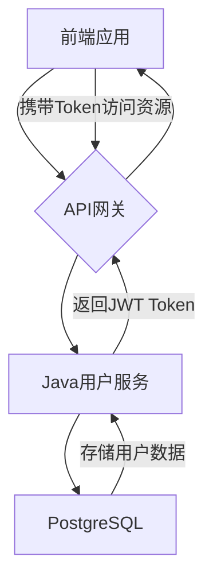
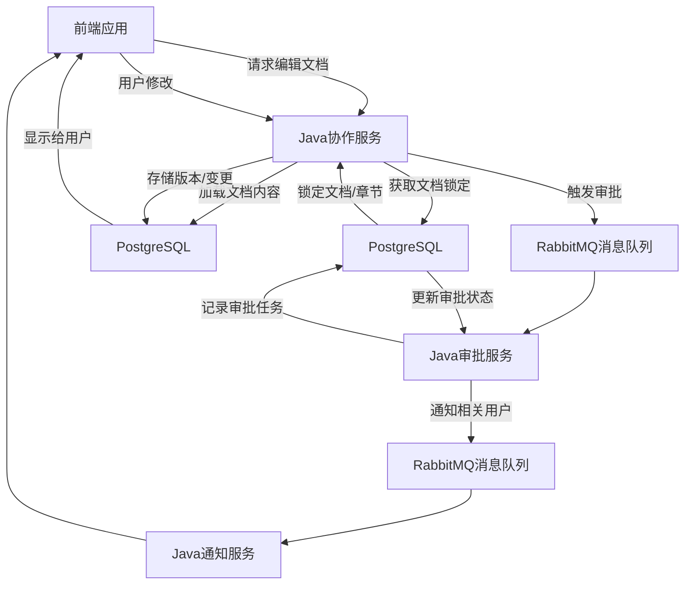

# 04-数据流设计

## 1. 概述

本文档详细描述AI标书智能创作平台中关键业务场景的数据流，包括数据在前端、Java业务服务、Python AI服务以及各个数据存储组件（PostgreSQL, Elasticsearch, Neo4j, Redis, MinIO）之间的流转、转换和同步机制。清晰的数据流设计是确保系统功能正确性、性能和可维护性的关键。

## 2. 核心数据流设计原则

*   **数据源唯一性**: 确保每份数据有明确的来源和所有者。
*   **流向清晰**: 明确数据在系统中的流动路径和目标。
*   **转换透明**: 数据在流转过程中发生的任何转换都应被记录和理解。
*   **一致性**: 确保不同系统组件之间的数据保持一致。
*   **安全性**: 数据在流转过程中受到保护，防止泄露或篡改。
*   **可追溯性**: 关键数据流应可追溯，便于问题诊断和审计。

## 3. 关键业务场景数据流

### 3.1 用户注册与登录数据流 (User Registration & Login)



### 3.2 招标文件智能解析数据流 (Tender Document Intelligent Parsing)

```mermaid
graph TD
    A[前端应用] --> B{API网关};
    B --> C[Java文档服务];
    C -- 请求上传凭证 --> C;
    C -- 返回MinIO上传凭证 --> B;
    A -- 上传招标文件 --> D[MinIO对象存储];
    D -- 返回文件URL/ID --> A;
    A --> E[Java文档服务];
    E -- 触发解析任务 --> F[RabbitMQ消息队列];
    F --> G[Python AI分析服务];
    G -- 读取招标文件 --> D;
    G -- 调用LLM/NLP处理 --> H[外部LLM服务];
    H --> G;
    G -- 结构化关键信息 --> I[PostgreSQL];
    G -- 生成文本向量 --> J[Elasticsearch (向量检索)];
    G -- 更新文档状态 --> E;
    E -- 通知前端 --> A;
```

### 3.3 企业能力库（知识图谱）构建与更新数据流 (Knowledge Graph Construction & Update)

```mermaid
graph TD
    A[前端应用] -- 录入企业能力 --> B[Java企业能力服务];
    B -- 存储元数据 --> C[PostgreSQL];
    B -- 触发知识图谱更新任务 --> D[RabbitMQ消息队列];
    D --> E[Python AI知识图谱服务];
    E -- 读取相关数据 --> C;
    E -- 生成实体/关系/向量 --> F[Neo4j (知识图谱)];
    E -- 生成实体向量 --> G[Elasticsearch (向量检索)];
    E -- 更新处理状态 --> B;
    B -- 通知前端 --> A;

    A[前端应用] -- (后台自动抽取/定时任务) --> E;
```

### 3.4 标书内容智能生成数据流 (Bid Content Intelligent Generation)

```mermaid
graph TD
    A[前端应用] -- 用户请求生成标书 --> B[Java标书服务];
    B -- 触发生成任务 --> C[RabbitMQ消息队列];
    C --> D[Python AI生成服务 (AI助手矩阵)];
    D -- 从PostgreSQL获取项目/模板 --> E[PostgreSQL];
    D -- 从Elasticsearch检索能力向量 --> F[Elasticsearch (向量检索)];
    D -- 从Neo4j检索知识图谱关联 --> G[Neo4j (知识图谱)];
    D -- 调用LLM/NLP进行内容生成 --> H[外部LLM服务];
    H --> D;
    D -- 生成内容 --> B;
    B -- 存储生成内容 --> E;
    B -- 通知前端 --> A;
```

### 3.5 协作编辑与审批数据流 (Collaboration & Approval)



## 4. 数据流设计工具与规范

*   **工具**: Mermaid Flowchart（高层级），后续可补充 BPMN 工具进行详细流程建模。
*   **规范**:
    *   **命名**: 统一命名规范，清晰表达数据对象和处理节点。
    *   **层次**: 区分业务数据流和技术数据流，逐步细化。
    *   **标注**: 明确标注数据类型、流向、处理逻辑和存储介质。

## 5. 跨服务数据同步与一致性

*   **事务性数据**: 核心业务数据通过Java服务操作PostgreSQL，保证强事务一致性。
*   **异步数据同步**: 采用消息队列（RabbitMQ）进行事件驱动的数据同步，如PostgreSQL中业务数据变更触发Elasticsearch和Neo4j的增量更新。
*   **最终一致性**: 对于跨系统、跨数据库的数据同步，采用最终一致性原则，并通过补偿机制处理潜在不一致。

## 6. 数据存储组件的职责分工

*   **PostgreSQL**: 核心业务关系型数据、事务性数据。
*   **Elasticsearch**: 全文检索、向量检索、非结构化数据索引。
*   **Neo4j**: 知识图谱实体及关系存储、复杂关联分析。
*   **Redis**: 高速缓存、会话管理、轻量级队列（如验证码）。
*   **MinIO**: 非结构化大文件存储。
*   **RabbitMQ**: 异步任务队列、事件通知。

---
