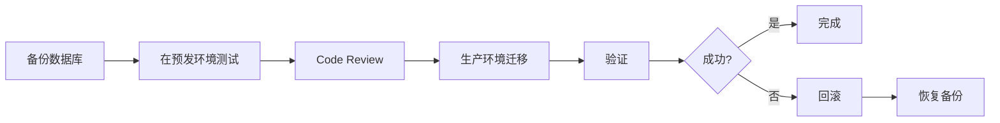

# 数据库迁移脚本

**目录**: docs/04-设计/数据库设计/migrations/
**迁移工具**: Flyway / Liquibase
**数据库**: PostgreSQL 14+
**最后更新**: 2025-11-28

---

## 📋 迁移脚本说明

数据库迁移脚本使用版本化管理，遵循以下命名规范：

```
V{版本号}__{描述}.sql
```

例如：
- `V1__initial_schema.sql` - 初始数据库架构
- `V2__add_ai_tables.sql` - 添加AI服务相关表
- `V3__add_collaboration_tables.sql` - 添加协作相关表

---

## 🗂️ 迁移脚本列表

### V1 - 初始架构（⏸️ 待生成）

**文件**: `V1__initial_schema.sql`

**包含内容**:
- 基础扩展（uuid-ossp, pg_trgm, timescaledb）
- 用户与权限域（6张表）
- 项目域（4张表）
- 标书域（4张表）
- 模板域（3张表）

**生成方式**:
```bash
# 从表定义文档生成
cat ../表定义/01-users.md \
    ../表定义/02-organizations.md \
    ../表定义/03-roles.md \
    # ... 其他表
    > V1__initial_schema.sql
```

### V2 - AI服务表（⏸️ 待生成）

**文件**: `V2__add_ai_tables.sql`

**包含内容**:
- ai_tasks（AI任务表）
- ai_prompts（Prompt模板表）
- ai_usage_logs（AI使用日志表）

### V3 - 企业能力表（⏸️ 待生成）

**文件**: `V3__add_capability_tables.sql`

**包含内容**:
- company_profiles（企业档案表）
- products_services（产品服务表）
- project_cases（项目案例表）
- personnel（人员资质表）
- certifications（资质证书表）
- historical_bids（历史标书表）

### V4 - 协作与审批表（⏸️ 待生成）

**文件**: `V4__add_collaboration_tables.sql`

**包含内容**:
- collaboration_sessions（协作会话表）
- collaboration_events（协作事件表）
- approval_workflows（审批流程表）
- approval_tasks（审批任务表）
- approval_logs（审批日志表）

### V5 - 审计与日志表（⏸️ 待生成）

**文件**: `V5__add_audit_tables.sql`

**包含内容**:
- audit_logs（审计日志表）
- system_logs（系统日志表）

---

## 🔧 使用方法

### 使用Flyway

#### 1. 安装Flyway

```bash
# macOS
brew install flyway

# Linux
wget -qO- https://repo1.maven.org/maven2/org/flywaydb/flyway-commandline/9.22.3/flyway-commandline-9.22.3-linux-x64.tar.gz | tar xvz
```

#### 2. 配置Flyway

创建 `flyway.conf`:
```properties
flyway.url=jdbc:postgresql://localhost:5432/aibidcomposer
flyway.user=postgres
flyway.password=your_password
flyway.locations=filesystem:./migrations
flyway.schemas=public
```

#### 3. 执行迁移

```bash
# 查看迁移状态
flyway info

# 执行迁移
flyway migrate

# 验证迁移
flyway validate

# 清理数据库（仅开发环境）
flyway clean
```

### 使用Liquibase

#### 1. 安装Liquibase

```bash
# macOS
brew install liquibase

# Linux
wget https://github.com/liquibase/liquibase/releases/download/v4.24.0/liquibase-4.24.0.tar.gz
tar -xzf liquibase-4.24.0.tar.gz
```

#### 2. 创建changelog.xml

```xml
<?xml version="1.0" encoding="UTF-8"?>
<databaseChangeLog
    xmlns="http://www.liquibase.org/xml/ns/dbchangelog"
    xmlns:xsi="http://www.w3.org/2001/XMLSchema-instance"
    xsi:schemaLocation="http://www.liquibase.org/xml/ns/dbchangelog
    http://www.liquibase.org/xml/ns/dbchangelog/dbchangelog-4.24.xsd">

    <include file="V1__initial_schema.sql" relativeToChangelogFile="true"/>
    <include file="V2__add_ai_tables.sql" relativeToChangelogFile="true"/>
    <!-- 更多迁移脚本 -->
</databaseChangeLog>
```

#### 3. 执行迁移

```bash
# 执行迁移
liquibase update \
  --changelog-file=changelog.xml \
  --url=jdbc:postgresql://localhost:5432/aibidcomposer \
  --username=postgres \
  --password=your_password

# 查看状态
liquibase status

# 回滚（谨慎使用）
liquibase rollback-count 1
```

---

## 📝 编写迁移脚本规范

### 1. 脚本结构

```sql
-- ============================================================================
-- 迁移脚本: V1__initial_schema.sql
-- 描述: 创建初始数据库架构
-- 作者: AIBidComposer Team
-- 日期: 2025-11-28
-- ============================================================================

-- 1. 启用扩展
CREATE EXTENSION IF NOT EXISTS "uuid-ossp";
CREATE EXTENSION IF NOT EXISTS "pg_trgm";

-- 2. 创建表
CREATE TABLE users (
    id UUID PRIMARY KEY DEFAULT uuid_generate_v4(),
    -- ... 其他字段
);

-- 3. 创建索引
CREATE INDEX idx_users_email ON users(email);

-- 4. 创建触发器
CREATE TRIGGER update_users_updated_at
    BEFORE UPDATE ON users
    FOR EACH ROW
    EXECUTE FUNCTION update_updated_at_column();

-- 5. 插入初始数据（可选）
INSERT INTO permissions (name, code, resource, action) VALUES
    ('用户管理-查看', 'user:read', 'user', 'read'),
    -- ... 其他权限
```

### 2. 最佳实践

**✅ 推荐**:
- 使用事务（BEGIN/COMMIT）
- 添加详细注释
- 使用`IF NOT EXISTS`避免重复创建
- 先创建表，再创建索引和约束
- 包含回滚脚本（对于Liquibase）

**❌ 避免**:
- 在生产环境使用`DROP TABLE`
- 删除数据
- 修改已有迁移脚本
- 缺少错误处理

---

## 🔄 迁移流程

### 开发环境


### 生产环境



---

## 📚 相关文档

- [数据库设计总览](../00-数据库设计总览.md)
- [表定义索引](../INDEX.md)
- [表定义文档](../表定义/)

---

## 修改历史

| 日期 | 版本 | 修改者 | 修改内容概要 |
|------|------|--------|-------------|
| 2025-11-28 07:30 | 1.0 | claude-sonnet-4-5 | 创建数据库迁移脚本README |

---

**说明**:
- 当前为迁移脚本框架，实际的SQL脚本待后续根据表定义文档生成
- 推荐使用Flyway或Liquibase进行版本化管理
- 所有迁移脚本需要经过测试后才能应用到生产环境
