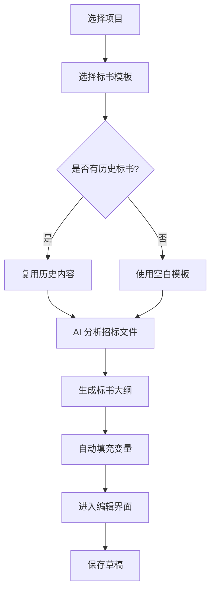
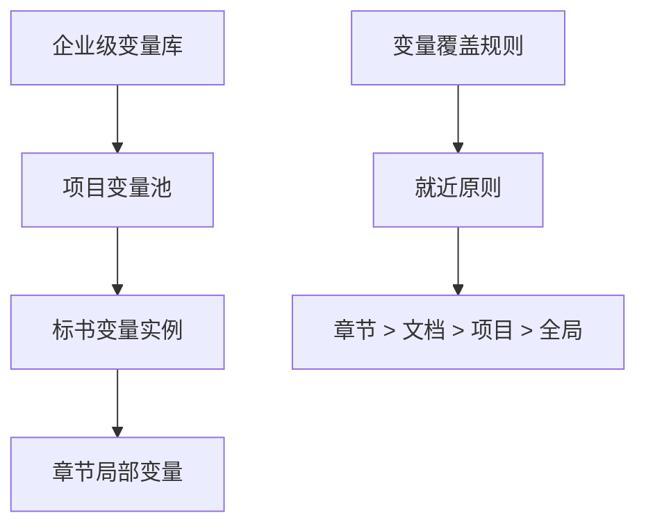
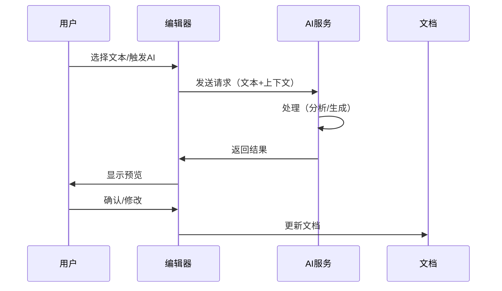
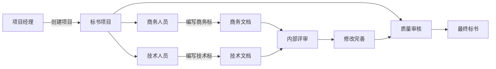
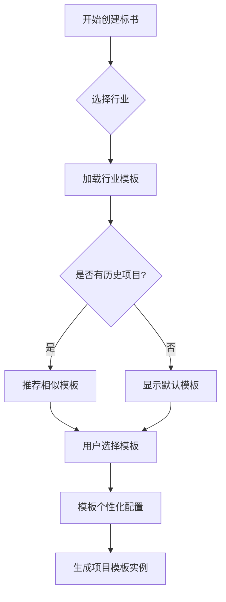
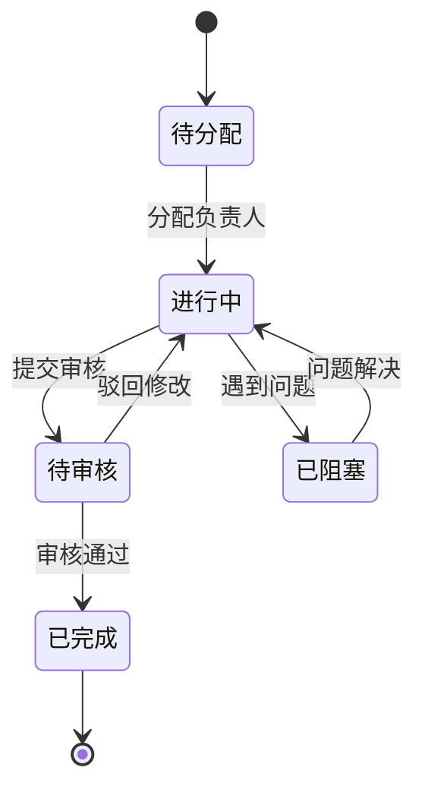
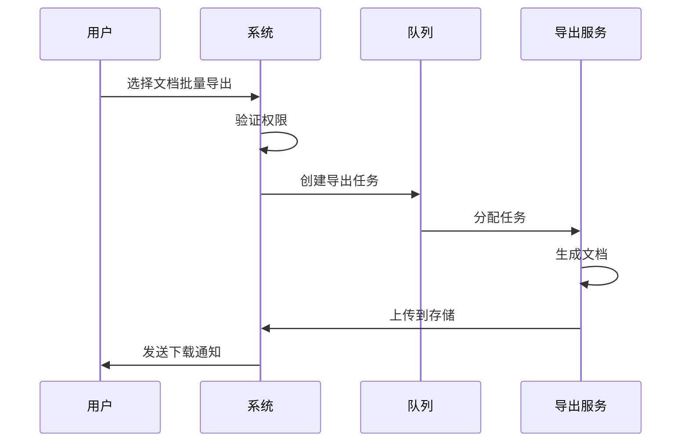

# 高级业务流程设计

## 概述

本文档描述 AIBidComposer 平台的高级业务流程设计，包括文档编辑、变量管理、AI处理等核心业务流程。

## 一、文档创建与编辑流程

### 1.1 标书创建流程



### 1.2 智能编辑流程

**核心编辑功能**：
1. **实时自动保存**
   - 每30秒自动保存到本地
   - 每5分钟同步到云端
   - 版本冲突自动检测

2. **AI 辅助写作**
   - 选中文本 → AI 建议
   - 快捷键触发 AI 功能
   - 上下文感知生成

3. **变量管理**
   - 变量高亮显示
   - 拖拽插入变量
   - 批量更新变量值

### 1.3 版本管理流程

```
用户编辑
  ├── 自动保存草稿（本地）
  ├── 创建版本快照（重要修改）
  ├── 版本比较（可视化 diff）
  └── 版本回滚（一键恢复）
```

## 二、变量系统业务逻辑

### 2.1 变量定义流程

```typescript
// 变量定义层级
招标项目
├── 全局变量（企业信息）
│   ├── 公司名称
│   ├── 统一社会信用代码
│   └── 联系方式
├── 项目变量（项目信息）
│   ├── 项目名称
│   ├── 项目编号
│   └── 投标日期
└── 文档变量（标书特定）
    ├── 技术方案
    ├── 商务报价
    └── 资质材料
```

### 2.2 变量继承机制



### 2.3 变量使用场景

| 场景 | 变量类型 | 自动化程度 | 示例 |
|------|----------|-----------|------|
| 企业信息填充 | 全局变量 | 100% 自动 | 公司资质、地址、联系人 |
| 项目信息填充 | 项目变量 | 100% 自动 | 项目名称、招标编号 |
| 技术参数 | 模板变量 | 80% 自动 | 产品规格、技术指标 |
| 报价明细 | 计算变量 | 100% 自动 | 单价、数量、总价 |
| 个性化内容 | 自定义变量 | 手动输入 | 特殊要求、补充说明 |

## 三、AI 业务流程

### 3.1 AI 处理流程



### 3.2 AI 能力应用场景

| AI 能力 | 业务场景 | 输入 | 输出 | 处理时间 |
|---------|---------|------|------|----------|
| **需求分析** | 解析招标文件 | PDF/Word文档 | 结构化需求列表 | 10-20秒 |
| **内容生成** | 生成技术方案 | 需求要点+模板 | 完整章节内容 | 5-15秒 |
| **内容优化** | 优化表述 | 原始文本 | 优化后文本 | 3-8秒 |
| **合规检查** | 检查标书合规性 | 标书全文 | 问题列表+建议 | 15-30秒 |
| **评分预测** | 预测得分 | 标书+评分标准 | 预测分数+改进建议 | 10-20秒 |

### 3.3 AI 提示词管理

```typescript
// 提示词模板结构
interface PromptTemplate {
  id: string;
  name: string;
  category: '需求分析' | '内容生成' | '内容优化' | '合规检查';
  template: string;
  variables: string[];  // 支持的变量
  examples: Example[];  // 示例
  model: 'gpt-4' | 'claude' | 'wenxin';
}

// 动态提示词生成
function generatePrompt(template: PromptTemplate, context: Context): string {
  let prompt = template.template;

  // 替换变量
  for (const [key, value] of Object.entries(context.variables)) {
    prompt = prompt.replace(`{{${key}}}`, value);
  }

  // 添加上下文
  if (context.requirements) {
    prompt += `\n\n需求要点：\n${context.requirements}`;
  }

  if (context.companyInfo) {
    prompt += `\n\n企业信息：\n${context.companyInfo}`;
  }

  return prompt;
}
```

## 四、项目协作流程

### 4.1 团队协作模式



### 4.2 权限控制矩阵

| 角色 | 项目管理 | 文档编辑 | AI 使用 | 审批 | 导出 |
|------|---------|---------|---------|------|------|
| 项目经理 | ✅ 完全 | ✅ 完全 | ✅ 完全 | ✅ | ✅ |
| 技术人员 | 🔍 查看 | ✅ 技术部分 | ✅ | ❌ | 🔍 |
| 商务人员 | 🔍 查看 | ✅ 商务部分 | ✅ | ❌ | 🔍 |
| 审核人员 | 🔍 查看 | 💬 批注 | 🔍 | ✅ | ✅ |
| 只读用户 | 🔍 查看 | ❌ | ❌ | ❌ | 🔍 |

### 4.3 审批流程

```typescript
// 审批流程定义
interface ApprovalWorkflow {
  stages: [
    {
      name: '初稿完成',
      approvers: ['技术负责人', '商务负责人'],
      parallel: true,  // 并行审批
    },
    {
      name: '内部评审',
      approvers: ['部门经理'],
      parallel: false,
    },
    {
      name: '最终审批',
      approvers: ['总经理'],
      parallel: false,
    }
  ];

  escalation: {
    timeout: 24 * 60 * 60 * 1000,  // 24小时
    escalateTo: 'upper_manager',
  };
}
```

## 五、模板管理业务

### 5.1 模板层级体系

```
行业模板库
├── IT软件类
│   ├── 系统集成项目模板
│   ├── 软件开发项目模板
│   └── 运维服务项目模板
├── 工程建设类
│   ├── 房建工程模板
│   ├── 市政工程模板
│   └── 装修工程模板
└── 咨询服务类
    ├── 管理咨询模板
    ├── IT咨询模板
    └── 财务咨询模板
```

### 5.2 模板选择逻辑



### 5.3 模板智能推荐

```typescript
// 模板推荐算法
function recommendTemplates(project: Project): Template[] {
  const recommendations: Template[] = [];

  // 1. 基于行业匹配
  const industryTemplates = templates.filter(t =>
    t.industry === project.industry
  );

  // 2. 基于历史使用
  const historicalTemplates = getUserHistory(project.userId)
    .filter(t => t.successRate > 0.8);

  // 3. 基于相似项目
  const similarProjects = findSimilarProjects(project);
  const similarTemplates = similarProjects
    .map(p => p.templateId)
    .filter(unique);

  // 4. 综合评分
  const scored = [...industryTemplates, ...historicalTemplates, ...similarTemplates]
    .map(t => ({
      template: t,
      score: calculateScore(t, project),
    }))
    .sort((a, b) => b.score - a.score);

  return scored.slice(0, 5).map(s => s.template);
}
```

## 六、任务管理业务

### 6.1 任务分解结构

```
标书项目
├── 准备阶段
│   ├── 获取招标文件 [1天]
│   ├── 分析招标要求 [0.5天]
│   └── 组建项目团队 [0.5天]
├── 编写阶段
│   ├── 商务标编写 [3天]
│   │   ├── 投标函
│   │   ├── 报价表
│   │   └── 商务资质
│   ├── 技术标编写 [5天]
│   │   ├── 技术方案
│   │   ├── 实施计划
│   │   └── 人员配置
│   └── 资质标准备 [2天]
├── 审核阶段
│   ├── 内部审核 [1天]
│   ├── 修改完善 [1天]
│   └── 最终审批 [0.5天]
└── 提交阶段
    ├── 文档打印 [0.5天]
    ├── 装订密封 [0.5天]
    └── 现场投标 [0.5天]
```

### 6.2 任务状态机



### 6.3 任务依赖管理

```typescript
// 任务依赖定义
interface TaskDependency {
  taskId: string;
  dependencies: {
    taskId: string;
    type: 'finish-to-start' | 'start-to-start' | 'finish-to-finish';
    lag: number;  // 延迟时间（小时）
  }[];
}

// 关键路径计算
function calculateCriticalPath(tasks: Task[]): Task[] {
  // 构建依赖图
  const graph = buildDependencyGraph(tasks);

  // 计算最早开始时间 (ES) 和最早完成时间 (EF)
  const { es, ef } = forwardPass(graph);

  // 计算最晚开始时间 (LS) 和最晚完成时间 (LF)
  const { ls, lf } = backwardPass(graph);

  // 识别关键路径（总时差为0的任务）
  return tasks.filter(task => {
    const slack = ls[task.id] - es[task.id];
    return slack === 0;
  });
}
```

## 七、数据分析业务

### 7.1 项目分析指标

| 指标类别 | 具体指标 | 计算方法 | 业务价值 |
|---------|---------|----------|----------|
| 效率指标 | 标书完成时间 | 提交时间 - 开始时间 | 评估团队效率 |
| 质量指标 | 中标率 | 中标数 / 投标总数 | 评估标书质量 |
| 复用指标 | 模板使用率 | 使用模板数 / 总标书数 | 评估模板价值 |
| AI指标 | AI使用率 | AI生成内容 / 总内容 | 评估AI贡献 |
| 协作指标 | 审批及时率 | 按时审批 / 总审批 | 评估流程效率 |

### 7.2 智能分析报表

```typescript
// 项目分析报表
interface ProjectAnalytics {
  // 基础统计
  basic: {
    totalProjects: number;
    activeProjects: number;
    completedProjects: number;
    winRate: number;
  };

  // 趋势分析
  trends: {
    monthlyProjects: ChartData[];
    winRateTrend: ChartData[];
    avgCompletionTime: ChartData[];
  };

  // AI 使用分析
  aiUsage: {
    totalAICalls: number;
    avgAIContribution: number;
    topAIFeatures: { feature: string; count: number }[];
  };

  // 团队绩效
  teamPerformance: {
    topPerformers: User[];
    avgTaskCompletion: number;
    collaborationScore: number;
  };
}
```

## 八、导出与交付业务

### 8.1 导出格式管理

```typescript
// 导出配置
interface ExportConfig {
  format: 'docx' | 'pdf' | 'html';

  // Word 配置
  docx?: {
    template: string;  // 模板文件
    styles: StyleConfig;
    pageSetup: PageConfig;
    header: HeaderConfig;
    footer: FooterConfig;
  };

  // PDF 配置
  pdf?: {
    watermark: WatermarkConfig;
    encryption: EncryptionConfig;
    signatures: SignatureConfig;
  };

  // 内容选项
  content: {
    includeCoverPage: boolean;
    includeTOC: boolean;
    includeAppendix: boolean;
    includeVariables: boolean;  // 是否解析变量
  };
}
```

### 8.2 批量导出流程



## 九、质量控制业务

### 9.1 质量检查规则

```typescript
// 质量检查配置
const qualityRules = {
  // 完整性检查
  completeness: {
    requiredSections: ['技术方案', '商务报价', '项目团队'],
    minWordCount: { '技术方案': 5000, '商务报价': 1000 },
    requiredAttachments: ['营业执照', '资质证书'],
  },

  // 一致性检查
  consistency: {
    checkVariables: true,  // 变量一致性
    checkNumbers: true,    // 数字一致性
    checkDates: true,      // 日期一致性
  },

  // 合规性检查
  compliance: {
    checkFormat: true,     // 格式规范
    checkTerms: true,      // 禁用词检查
    checkRequirements: true, // 需求响应
  },
};

// 质量评分算法
function calculateQualityScore(document: Document): QualityScore {
  const scores = {
    completeness: checkCompleteness(document),
    consistency: checkConsistency(document),
    compliance: checkCompliance(document),
    readability: checkReadability(document),
  };

  const weights = {
    completeness: 0.3,
    consistency: 0.2,
    compliance: 0.4,
    readability: 0.1,
  };

  const totalScore = Object.entries(scores).reduce((sum, [key, score]) => {
    return sum + score * weights[key];
  }, 0);

  return {
    total: totalScore,
    details: scores,
    suggestions: generateSuggestions(scores),
  };
}
```

## 关键业务创新点

1. **四层变量架构** - 项目-任务-文档-章节的层级变量管理
2. **七种 AI 能力** - 全方位 AI 辅助提升效率
3. **智能模板推荐** - 基于历史和相似度的推荐
4. **任务依赖管理** - 自动计算关键路径
5. **质量自动评分** - 多维度质量控制

---

## 修改历史

| 日期 | 版本 | 修改者 | 修改内容概要 |
|------|------|--------|-------------|
| 2025-11-30 10:00 | 1.0 | claude-opus-4-1-20250805 | 创建基于 aidev3 的业务流程设计 |

---

**文档状态**: ✅ 已完成
**下一步**: 更新编码实现文档