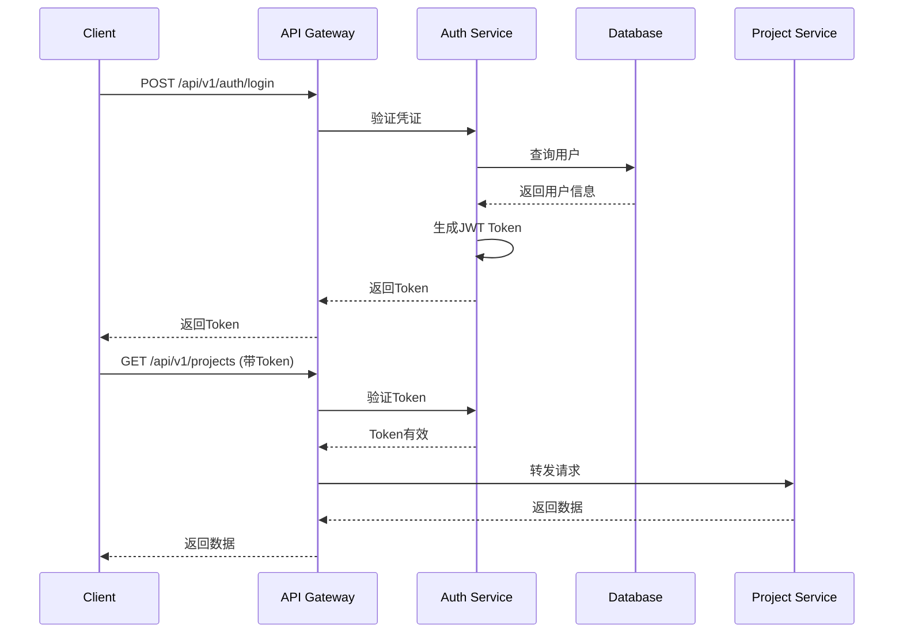

# AI标书智能创作平台 - API接口设计 - 🔐 认证授权

### 认证流程



### JWT Token结构

```json
{
  "header": {
    "alg": "HS256",
    "typ": "JWT"
  },
  "payload": {
    "user_id": "uuid",
    "username": "string",
    "email": "string",
    "organization_id": "uuid",
    "roles": ["admin", "member"],
    "permissions": ["project:read", "project:write"],
    "exp": 1700000000,
    "iat": 1699913600
  }
}
```
