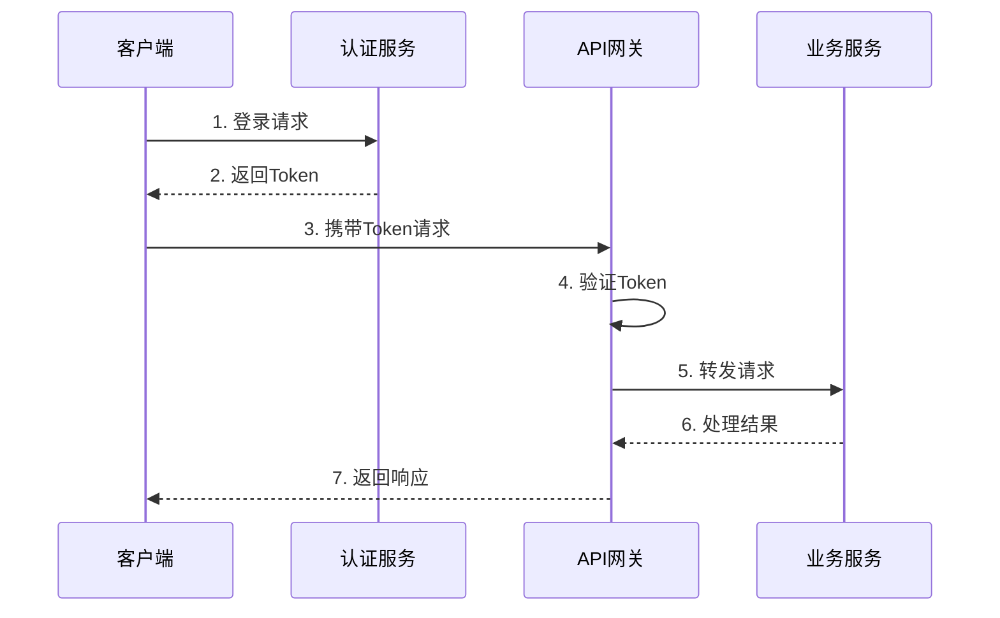
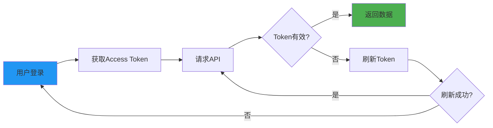
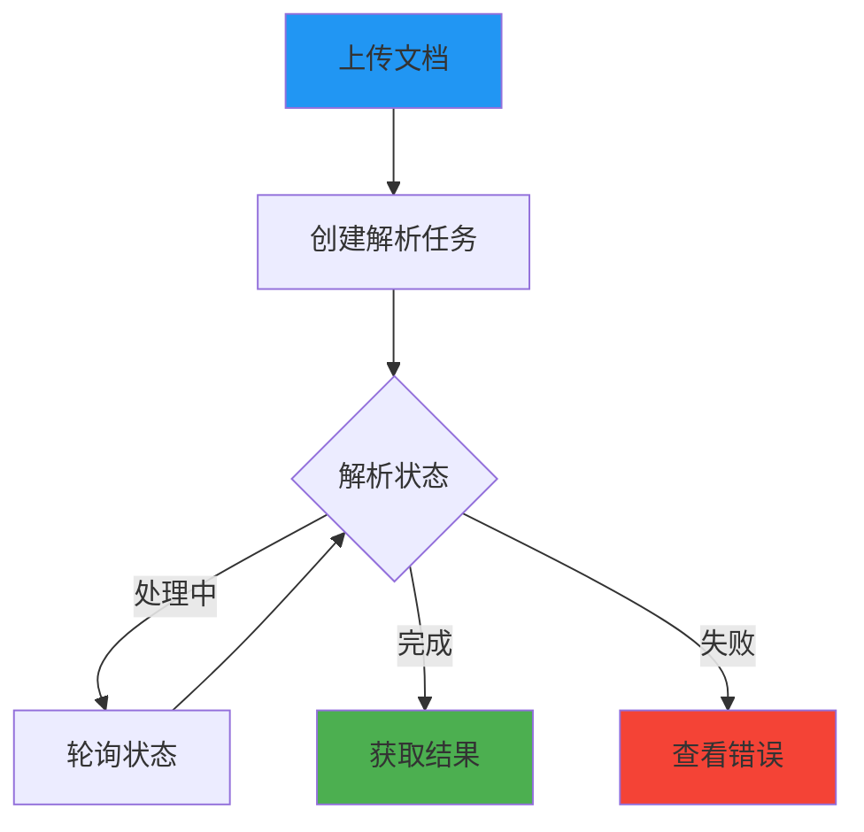
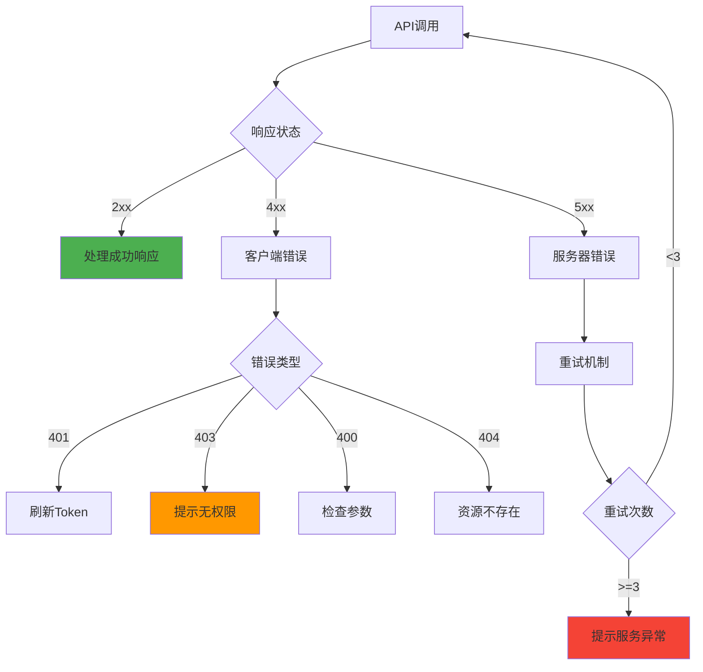
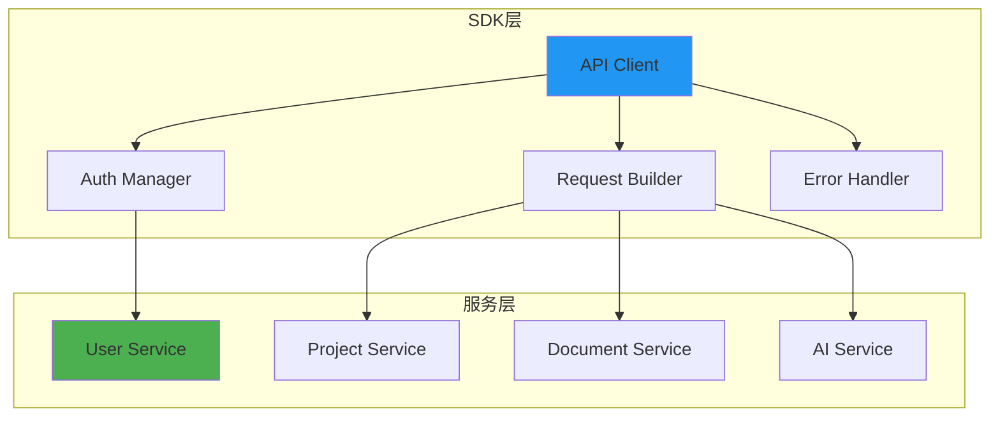

# AI标书智能创作平台 - API接口设计 - 📊 API使用示例

## 1. API调用流程

### 1.1 基本调用流程



### 1.2 认证流程



## 2. API调用规范

### 2.1 请求规范

| 规范项 | 要求 | 示例 |
|--------|------|------|
| URL格式 | RESTful风格 | `/api/v1/resources/{id}` |
| HTTP方法 | 语义化使用 | GET读取、POST创建、PUT更新、DELETE删除 |
| Header | 必需字段 | Authorization、Content-Type |
| Body格式 | JSON | `{"key": "value"}` |
| 参数编码 | UTF-8 | URL编码特殊字符 |

### 2.2 响应规范

| 字段 | 类型 | 说明 | 示例 |
|------|------|------|------|
| success | boolean | 请求是否成功 | true/false |
| data | any | 响应数据 | 具体业务数据 |
| error | object | 错误信息 | 错误码和描述 |
| timestamp | string | 响应时间 | ISO 8601格式 |
| requestId | string | 请求ID | 用于追踪 |

## 3. 典型调用场景

### 3.1 用户认证场景

**场景描述**：用户登录获取访问令牌

**调用步骤**：
1. POST `/api/v1/auth/login` - 提交登录凭证
2. 获取 access_token 和 refresh_token
3. 存储令牌用于后续请求
4. 在请求头中携带令牌

**请求示例**：
```
POST /api/v1/auth/login
Content-Type: application/json

{
  "email": "user@example.com",
  "password": "secure_password"
}
```

**响应示例**：
```
{
  "success": true,
  "data": {
    "access_token": "eyJhbGciOiJIUzI1NiIs...",
    "refresh_token": "eyJhbGciOiJIUzI1NiIs...",
    "expires_in": 3600,
    "user": {
      "id": "user_123",
      "name": "张三",
      "role": "admin"
    }
  }
}
```

### 3.2 项目管理场景

**场景描述**：创建新项目并添加成员

**调用步骤**：
1. POST `/api/v1/projects` - 创建项目
2. GET `/api/v1/projects/{id}` - 获取项目详情
3. POST `/api/v1/projects/{id}/members` - 添加成员
4. GET `/api/v1/projects/{id}/members` - 查看成员列表

### 3.3 文档解析场景

**场景描述**：上传招标文档并获取解析结果



**调用步骤**：
1. POST `/api/v1/documents/upload` - 上传文档
2. POST `/api/v1/documents/{id}/parse` - 创建解析任务
3. GET `/api/v1/ai/tasks/{taskId}` - 查询任务状态
4. GET `/api/v1/documents/{id}/requirements` - 获取解析结果

### 3.4 AI生成场景

**场景描述**：使用AI生成标书内容

**调用步骤**：
1. POST `/api/v1/ai/analyze-requirements` - 分析需求
2. POST `/api/v1/ai/match-capabilities` - 匹配能力
3. POST `/api/v1/ai/generate-content` - 生成内容
4. POST `/api/v1/ai/review-quality` - 质量审核
5. GET `/api/v1/documents/{id}` - 获取最终文档

## 4. 错误处理

### 4.1 错误码体系

| 错误码 | HTTP状态码 | 说明 | 处理建议 |
|--------|-----------|------|---------|
| AUTH_001 | 401 | 未认证 | 重新登录 |
| AUTH_002 | 403 | 无权限 | 检查权限 |
| PARAM_001 | 400 | 参数错误 | 检查参数 |
| RESOURCE_001 | 404 | 资源不存在 | 确认资源ID |
| SERVER_001 | 500 | 服务器错误 | 稍后重试 |
| RATE_001 | 429 | 请求过频 | 降低频率 |

### 4.2 错误处理流程



## 5. 性能优化建议

### 5.1 客户端优化

| 优化项 | 方法 | 效果 |
|--------|------|------|
| 请求合并 | 批量API | 减少请求次数 |
| 缓存策略 | 本地缓存 | 减少重复请求 |
| 分页加载 | 按需加载 | 减少数据传输 |
| 压缩传输 | Gzip | 减少传输大小 |
| 连接复用 | Keep-Alive | 减少连接开销 |

### 5.2 并发控制

```
并发策略：
1. 限制并发数
   └─> 最大并发: 10个请求

2. 请求队列
   └─> FIFO队列管理

3. 优先级控制
   └─> 紧急请求优先

4. 失败重试
   └─> 指数退避算法
```

## 6. 安全规范

### 6.1 安全要求

1. **HTTPS传输**：所有API调用必须使用HTTPS
2. **Token安全**：Token不能存储在不安全的位置
3. **参数验证**：客户端预验证，减少无效请求
4. **敏感信息**：不在URL中传递敏感信息
5. **CORS配置**：正确配置跨域访问

### 6.2 最佳实践

| 实践项 | 说明 | 示例 |
|--------|------|------|
| Token存储 | 使用安全存储 | HttpOnly Cookie |
| 请求签名 | 防篡改 | HMAC签名 |
| 时间戳 | 防重放攻击 | 5分钟有效期 |
| 限流 | 防滥用 | 100次/分钟 |
| 日志 | 审计追踪 | 记录关键操作 |

## 7. SDK使用指南

### 7.1 SDK特性

- **自动认证**：自动处理Token刷新
- **请求重试**：智能重试机制
- **错误处理**：统一错误处理
- **类型安全**：TypeScript类型定义
- **链式调用**：流畅的API设计

### 7.2 SDK架构



## 8. 调试与监控

### 8.1 调试工具

| 工具 | 用途 | 特点 |
|------|------|------|
| Postman | API测试 | 可视化界面 |
| cURL | 命令行测试 | 脚本自动化 |
| Chrome DevTools | 浏览器调试 | 网络监控 |
| Swagger UI | 在线测试 | 文档集成 |

### 8.2 监控指标

- **响应时间**：P50、P90、P99延迟
- **成功率**：请求成功率统计
- **错误分布**：按错误类型统计
- **流量统计**：QPS、带宽使用
- **用户行为**：API使用模式分析

---

**注意**：具体的代码实现示例请参考 `05-编码实现/` 目录下的相关文档。本文档仅描述API的使用规范和设计原则。

---

## 修改历史

| 日期 | 版本 | 修改者 | 修改内容概要 |
|------|------|--------|-------------|
| 2025-11-30 12:35 | 2.0 | claude-opus-4-1-20250805 | 移除实现代码，保留API设计规范，使用Mermaid图表 |
| 2025-11-26 | 1.1 | claude-sonnet-4-5 (claude-sonnet-4-5-20250929) | 更新为混合后端架构的API示例 |
| 2025-11-15 | 1.0 | claude-sonnet-4-5 (claude-sonnet-4-5-20250929) | 创建API使用示例文档 |