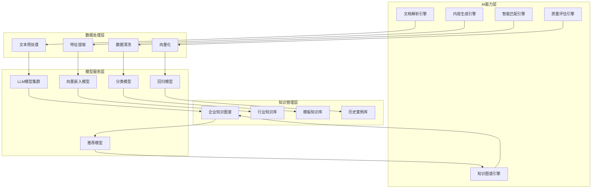

# AI标书智能创作平台 - AI算法与模型设计总览

## 📋 文档导航

本目录包含AI算法与模型的详细设计文档，已按功能模块拆分为以下文件：

1. **00-AI算法总览.md**（本文档）- AI能力架构总览
2. **01-文档智能解析算法.md** - 招标文档智能解析算法
   - 文档结构化解析算法
   - 智能需求分析算法
3. **02-智能匹配引擎算法.md** - 智能匹配引擎算法
   - 企业能力匹配算法

## 🧠 AI能力架构总览

### AI系统架构图

### 核心能力模块说明

#### 1. 文档解析引擎
- **功能**：智能解析招标文档，提取关键需求信息
- **详细设计**：参见 `01-文档智能解析算法.md`
- **核心算法**：
  - 文档结构化解析
  - 智能需求分析
  - 关键信息提取

#### 2. 内容生成引擎
- **功能**：基于LLM生成高质量标书内容
- **技术栈**：GPT-4, Claude 3, LlamaIndex
- **生成流程**：需求理解 → 内容组织 → 智能撰写 → 质量优化

#### 3. 智能匹配引擎
- **功能**：匹配招标需求与企业能力
- **详细设计**：参见 `02-智能匹配引擎算法.md`
- **核心算法**：
  - 企业能力匹配
  - 案例相似度计算
  - 人员资质匹配

#### 4. 质量评估引擎
- **功能**：自动评估标书质量和合规性
- **评估维度**：
  - 完整性检查
  - 合规性审核
  - 技术方案评分
  - 商务方案评分

#### 5. 知识图谱引擎
- **功能**：构建和管理企业知识图谱
- **技术栈**：Neo4j
- **图谱节点**：需求、能力、案例、人员、产品

### 模型服务层

#### LLM模型集群
- **主模型**：GPT-4 Turbo, Claude 3 Opus
- **备用模型**：智谱ChatGLM, 百度文心一言
- **调度策略**：负载均衡、成本优化、质量优先

#### 向量嵌入模型
- **主力模型**：OpenAI text-embedding-ada-002
- **备选模型**：HuggingFace Sentence-BERT
- **应用场景**：语义检索、相似度计算

### 数据处理层

#### 文本预处理
- 分词、去噪、归一化
- 实体识别、关系抽取
- 结构化转换

#### 向量化
- 文本向量化
- 图像向量化
- 多模态融合

### 知识管理层

#### 企业知识图谱
- **存储**：Neo4j图数据库
- **更新频率**：实时更新
- **覆盖范围**：产品、服务、案例、人员、资质

#### 行业知识库
- **来源**：公开数据、行业报告、历史标书
- **更新**：定期更新
- **应用**：行业术语、评分标准、最佳实践

## 📊 算法性能指标

### 文档解析准确率
- 结构识别准确率：> 95%
- 需求提取准确率：> 90%
- 关键信息召回率：> 92%

### 匹配精度
- 企业能力匹配精度：> 85%
- 案例推荐准确率：> 80%
- 人员匹配准确率：> 88%

### 内容生成质量
- 内容相关性：> 90%
- 语言流畅度：> 92%
- 专业术语准确率：> 95%

## 🔄 算法优化策略

### 持续学习
- 用户反馈循环
- 模型微调
- 知识库更新

### 性能优化
- 缓存策略
- 批处理
- 异步处理

### 成本控制
- Token优化
- 模型选择
- 缓存复用

---

## 修改历史

| 日期 | 版本 | 修改者 | 修改内容概要 |
|------|------|--------|-------------|
| 2025-11-29 | 1.0 | claude-sonnet-4-5 (claude-sonnet-4-5-20250929) | 从00-AI算法与模型设计.md拆分创建总览文档 |

---

**文档版本**: v1.0
**创建时间**: 2025年11月29日
**文档状态**: ✅ 已批准
