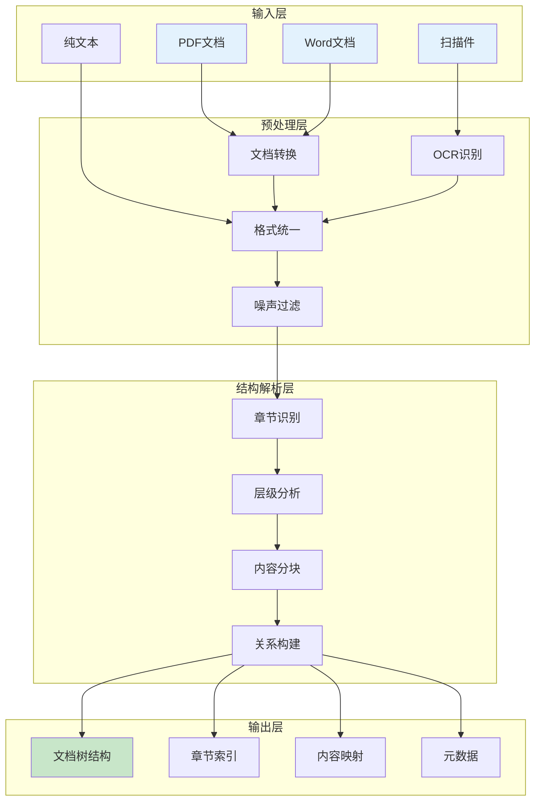
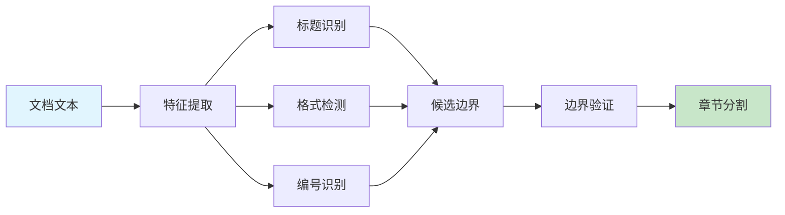
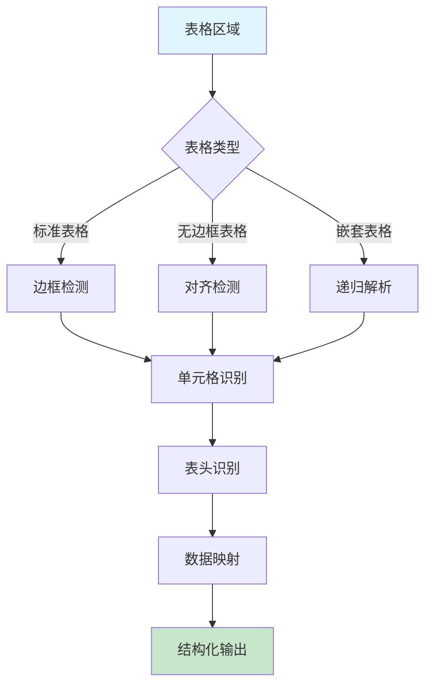

# 招标文档智能解析算法 - 1. 文档结构化解析算法

## 1.1 算法目标

- **输入**：原始招标文档文本（PDF、Word、扫描件等）
- **输出**：结构化的文档数据，包括章节划分、关键信息提取、结构验证
- **准确率目标**：结构识别 >95%，需求提取 >90%，关键信息召回率 >92%

## 1.2 算法架构



## 1.3 文档结构模型

### 1.3.1 数据结构定义

```
文档结构模型：
DocumentSection
├── section_type: 章节类型（枚举值）
├── title: 章节标题
├── content: 章节内容
├── page_number: 页码
├── level: 层级（1-5级）
├── subsections: 子章节列表
└── metadata: 元数据
    ├── keywords: 关键词列表
    ├── requirements_count: 需求数量
    ├── is_mandatory: 是否必需章节
    └── confidence_score: 识别置信度
```

### 1.3.2 章节类型定义

| 章节类型 | 识别标志 | 重要性 | 提取策略 |
|---------|---------|--------|---------|
| project_info | 项目概况、项目背景 | 高 | 全文提取 |
| technical_requirements | 技术要求、技术参数 | 高 | 深度解析 |
| commercial_terms | 商务条款、合同条款 | 高 | 条款拆分 |
| evaluation_criteria | 评标办法、评分标准 | 高 | 表格解析 |
| submission_requirements | 投标要求、投标须知 | 中 | 清单提取 |
| qualification | 资质要求、资格条件 | 高 | 规则匹配 |

## 1.4 结构识别算法

### 1.4.1 章节边界检测



**识别规则**：
1. **标题特征**：
   - 字体大小变化
   - 加粗/下划线
   - 独占一行
   - 前后空行

2. **编号规则**：
   - 数字编号：1、1.1、1.1.1
   - 中文编号：第一章、第一节
   - 字母编号：A、A.1、A.1.1

3. **格式特征**：
   - 缩进级别
   - 行间距变化
   - 分页符位置

### 1.4.2 层级关系构建

```
层级识别算法：
1. 编号深度分析
   ├─> 统计编号格式
   ├─> 识别层级规律
   └─> 构建编号树

2. 缩进关系分析
   ├─> 测量缩进距离
   ├─> 聚类缩进级别
   └─> 映射层级关系

3. 语义关系推理
   ├─> 标题相似度计算
   ├─> 内容连贯性分析
   └─> 上下文关系推断

4. 层级融合决策
   ├─> 多特征投票
   ├─> 冲突消解
   └─> 层级确定
```

## 1.5 内容提取算法

### 1.5.1 关键信息识别

| 信息类型 | 识别方法 | 提取规则 | 验证方式 |
|---------|---------|---------|---------|
| 项目名称 | 正则+NER | 标题附近高频词 | 全文一致性 |
| 金额数字 | 正则匹配 | 数字+单位组合 | 合理性检查 |
| 日期时间 | 时间解析 | 标准日期格式 | 逻辑验证 |
| 联系方式 | 模式匹配 | 电话/邮箱格式 | 格式校验 |
| 地址信息 | NER识别 | 地名实体链接 | 地理验证 |

### 1.5.2 表格数据解析



**表格解析策略**：
1. **边框检测**：基于线条和交点识别表格边界
2. **对齐分析**：通过文本对齐特征识别隐式表格
3. **表头识别**：首行/首列的特殊格式和语义分析
4. **数据提取**：按行列索引提取单元格内容
5. **关系映射**：表头与数据的对应关系构建

## 1.6 质量控制

### 1.6.1 识别准确度评估

| 评估维度 | 计算方法 | 阈值要求 | 处理策略 |
|---------|---------|---------|---------|
| 结构完整性 | 章节数量/预期数量 | >90% | 人工补充 |
| 层级正确性 | 正确层级/总层级 | >95% | 算法调优 |
| 内容召回率 | 提取内容/标注内容 | >92% | 增强规则 |
| 格式保真度 | 格式保持率 | >85% | 格式恢复 |

### 1.6.2 错误纠正机制

```
纠错流程：
1. 异常检测
   ├─> 结构异常（缺失章节、层级混乱）
   ├─> 内容异常（乱码、截断）
   └─> 格式异常（表格错位、列表混乱）

2. 自动修复
   ├─> 规则修复（基于模板）
   ├─> 统计修复（基于频率）
   └─> 上下文修复（基于语境）

3. 人工确认
   ├─> 低置信度标记
   ├─> 修复建议生成
   └─> 人工审核接口
```

## 1.7 性能优化

### 1.7.1 处理性能指标

| 性能指标 | 目标值 | 优化方法 |
|---------|--------|---------|
| 单页处理时间 | <100ms | 并行处理 |
| 文档解析速度 | >50页/秒 | 缓存机制 |
| 内存占用 | <500MB | 流式处理 |
| CPU利用率 | <80% | 负载均衡 |

### 1.7.2 优化策略

1. **预处理优化**
   - 文档格式预判断，选择最优解析器
   - 图片文本分离，并行处理
   - 增量式解析，边读边解析

2. **算法优化**
   - 特征缓存，避免重复计算
   - 规则索引，快速匹配
   - 批量处理，减少开销

3. **架构优化**
   - 分布式解析，多机并行
   - 异步处理，提高吞吐量
   - 结果缓存，加速重复查询

## 1.8 接口设计

### 1.8.1 解析接口

**接口路径**：`POST /api/v1/document/parse`

**请求参数**：
```json
{
    "document_id": "文档ID",
    "document_type": "pdf|word|image",
    "options": {
        "ocr_enabled": true,
        "table_extraction": true,
        "structure_depth": 3
    }
}
```

**响应格式**：
```json
{
    "success": true,
    "document_structure": {
        "sections": [],
        "metadata": {},
        "statistics": {}
    },
    "processing_time": 1250,
    "confidence_score": 0.95
}
```

---

## 修改历史

| 日期 | 版本 | 修改者 | 修改内容概要 |
|------|------|--------|-------------|
| 2025-11-30 12:30 | 2.0 | claude-opus-4-1-20250805 | 移除Python实现代码，保留算法设计，使用Mermaid图表 |
| 2025-11-29 | 1.0 | claude-sonnet-4-5 (claude-sonnet-4-5-20250929) | 创建文档结构化解析算法 |