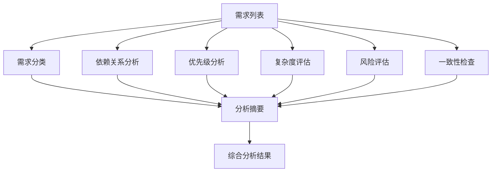

# 招标文档智能解析算法 - 2. 智能需求分析算法

### 2.1 算法目标

- **输入**：提取的需求列表
- **输出**：需求分类、依赖关系、优先级、复杂度、风险评估、一致性检查
- **分析维度**：5个维度（分类、依赖、优先级、复杂度、风险）

### 2.2 核心实现

```python
from typing import List, Dict, Any, Tuple
import networkx as nx
from sklearn.cluster import KMeans
from sklearn.feature_extraction.text import TfidfVectorizer
from sentence_transformers import SentenceTransformer
import numpy as np

class RequirementAnalyzer:
    """智能需求分析器"""

    def __init__(self):
        self.sentence_model = SentenceTransformer('paraphrase-multilingual-MiniLM-L12-v2')
        self.requirement_types = {
            'functional': {
                'keywords': ['功能', '实现', '支持', '提供', '处理'],
                'weight': 0.3
            },
            'non_functional': {
                'keywords': ['性能', '安全', '可用性', '兼容性', '可靠性'],
                'weight': 0.25
            },
            'constraint': {
                'keywords': ['约束', '限制', '必须', '应当', '不得'],
                'weight': 0.2
            },
            'assumption': {
                'keywords': ['假设', '前提', '条件', '环境'],
                'weight': 0.15
            },
            'deliverable': {
                'keywords': ['交付', '产出', '成果', '报告'],
                'weight': 0.1
            }
        }

    async def analyze_requirements(self, requirements: List[str]) -> Dict[str, Any]:
        """
        分析需求集合

        Args:
            requirements: 需求文本列表

        Returns:
            需求分析结果
        """
        try:
            # 1. 需求分类
            classified_requirements = await self._classify_requirements(requirements)

            # 2. 需求依赖关系分析
            dependency_graph = await self._analyze_dependencies(requirements)

            # 3. 需求优先级分析
            priority_analysis = await self._analyze_priorities(classified_requirements)

            # 4. 需求复杂度评估
            complexity_analysis = await self._assess_complexity(requirements)

            # 5. 需求风险评估
            risk_analysis = await self._assess_risks(requirements)

            # 6. 需求一致性检查
            consistency_check = await self._check_consistency(requirements)

            return {
                'classified_requirements': classified_requirements,
                'dependency_graph': dependency_graph,
                'priority_analysis': priority_analysis,
                'complexity_analysis': complexity_analysis,
                'risk_analysis': risk_analysis,
                'consistency_check': consistency_check,
                'analysis_summary': self._generate_analysis_summary(
                    classified_requirements, priority_analysis, complexity_analysis
                )
            }

        except Exception as e:
            raise RequirementAnalysisError(f"需求分析失败: {str(e)}")

    async def _classify_requirements(self, requirements: List[str]) -> List[Dict[str, Any]]:
        """分类需求"""
        classified = []

        for i, req in enumerate(requirements):
            # 计算每个类型的相似度分数
            type_scores = {}

            for req_type, config in self.requirement_types.items():
                score = self._calculate_type_similarity(req, config['keywords'])
                type_scores[req_type] = score * config['weight']

            # 使用语义模型增强分类
            embedding = self.sentence_model.encode([req])
            if hasattr(self, '_type_embeddings'):
                similarities = cosine_similarity(embedding, self._type_embeddings)

                for j, req_type in enumerate(self.requirement_types.keys()):
                    type_scores[req_type] += similarities[0][j] * 0.3

            # 确定主要类型和置信度
            primary_type = max(type_scores, key=type_scores.get)
            confidence = type_scores[primary_type]

            classified.append({
                'id': i,
                'text': req,
                'type': primary_type,
                'confidence': confidence,
                'all_scores': type_scores
            })

        return classified

    def _calculate_type_similarity(self, requirement: str, keywords: List[str]) -> float:
        """计算需求与类型关键词的相似度"""
        if not keywords:
            return 0.0

        # 使用TF-IDF计算相似度
        docs = [requirement] + keywords
        vectorizer = TfidfVectorizer().fit_transform(docs)

        # 计算需求与每个关键词的相似度
        requirement_vec = vectorizer[0]
        keyword_vectors = vectorizer[1:]

        similarities = cosine_similarity(requirement_vec, keyword_vectors)

        # 返回最高相似度
        return np.max(similarities)

    async def _analyze_dependencies(self, requirements: List[str]) -> Dict[str, Any]:
        """分析需求依赖关系"""
        # 构建依赖图
        G = nx.DiGraph()

        # 添加节点
        for i, req in enumerate(requirements):
            G.add_node(i, text=req)

        # 分析依赖关系
        dependencies = {}

        for i, req in enumerate(requirements):
            dependencies[i] = []

            # 使用关键词识别依赖
            dependency_keywords = ['基于', '依赖', '前提', '需要', '在...基础上']

            for j, other_req in enumerate(requirements):
                if i != j:
                    # 检查是否存在依赖关系
                    dependency_score = self._calculate_dependency_score(req, other_req)

                    if dependency_score > 0.3:  # 阈值
                        G.add_edge(j, i, weight=dependency_score)
                        dependencies[i].append({
                            'depends_on': j,
                            'score': dependency_score,
                            'reason': self._explain_dependency(req, other_req)
                        })

        # 计算图的指标
        try:
            # 关键路径分析
            critical_path = nx.dag_longest_path(G) if nx.is_directed_acyclic_graph(G) else []

            # 依赖深度
            dependency_depths = {}
            for node in G.nodes():
                try:
                    dependency_depths[node] = nx.shortest_path_length(G, source=node)
                except nx.NetworkXNoPath:
                    dependency_depths[node] = 0

            # 中心性分析
            centrality = nx.degree_centrality(G)
            betweenness = nx.betweenness_centrality(G)

        except Exception as e:
            critical_path = []
            dependency_depths = {}
            centrality = {}
            betweenness = {}

        return {
            'dependencies': dependencies,
            'critical_path': critical_path,
            'dependency_depths': dependency_depths,
            'centrality_metrics': {
                'degree_centrality': centrality,
                'betweenness_centrality': betweenness
            },
            'graph_stats': {
                'num_nodes': G.number_of_nodes(),
                'num_edges': G.number_of_edges(),
                'is_dag': nx.is_directed_acyclic_graph(G)
            }
        }

    def _calculate_dependency_score(self, req1: str, req2: str) -> float:
        """计算两个需求之间的依赖分数"""
        # 使用语义相似度
        embedding1 = self.sentence_model.encode([req1])
        embedding2 = self.sentence_model.encode([req2])
        semantic_similarity = cosine_similarity(embedding1, embedding2)[0][0]

        # 使用关键词匹配
        dependency_indicators = ['基于', '依赖', '参考', '遵循', '符合']
        keyword_score = 0

        for indicator in dependency_indicators:
            if indicator in req1:
                # 检查req2是否包含相关内容
                if any(word in req2 for word in req1.split() if len(word) > 2):
                    keyword_score += 0.2

        return semantic_similarity * 0.7 + keyword_score * 0.3

    def _explain_dependency(self, req1: str, req2: str) -> str:
        """解释依赖关系的原因"""
        # 找出共同的关键词
        words1 = set(req1.split())
        words2 = set(req2.split())
        common_words = words1.intersection(words2)

        if common_words:
            return f"存在共同关键词: {', '.join(list(common_words)[:3])}"
        else:
            return "语义相似度较高"

    async def _analyze_priorities(self, classified_requirements: List[Dict[str, Any]]) -> Dict[str, Any]:
        """分析需求优先级"""
        priorities = {}

        for req in classified_requirements:
            req_id = req['id']

            # 基于类型的基础优先级
            type_priority_scores = {
                'functional': 0.8,
                'non_functional': 0.6,
                'constraint': 0.9,
                'assumption': 0.3,
                'deliverable': 0.7
            }

            base_priority = type_priority_scores.get(req['type'], 0.5)

            # 基于关键词调整优先级
            high_priority_keywords = ['关键', '重要', '核心', '主要', '必须']
            low_priority_keywords = ['建议', '可选', '推荐', '期望']

            keyword_adjustment = 0
            for keyword in high_priority_keywords:
                if keyword in req['text']:
                    keyword_adjustment += 0.1

            for keyword in low_priority_keywords:
                if keyword in req['text']:
                    keyword_adjustment -= 0.1

            # 基于文本长度和复杂度调整
            complexity_bonus = min(len(req['text']) / 500, 0.2)

            # 计算最终优先级
            final_priority = min(max(base_priority + keyword_adjustment + complexity_bonus, 0), 1)

            # 确定优先级等级
            if final_priority >= 0.8:
                priority_level = 'critical'
            elif final_priority >= 0.6:
                priority_level = 'high'
            elif final_priority >= 0.4:
                priority_level = 'medium'
            else:
                priority_level = 'low'

            priorities[req_id] = {
                'score': final_priority,
                'level': priority_level,
                'factors': {
                    'type_priority': base_priority,
                    'keyword_adjustment': keyword_adjustment,
                    'complexity_bonus': complexity_bonus
                }
            }

        return priorities

    async def _assess_complexity(self, requirements: List[str]) -> Dict[str, Any]:
        """评估需求复杂度"""
        complexity_scores = {}

        for i, req in enumerate(requirements):
            # 文本复杂度指标
            text_length = len(req)
            word_count = len(req.split())
            sentence_count = len(req.split('。'))

            # 词汇复杂度
            unique_words = len(set(req.split()))
            vocabulary_richness = unique_words / word_count if word_count > 0 else 0

            # 技术术语密度
            technical_keywords = ['系统', '数据库', '网络', '安全', '性能', '接口', '架构']
            technical_density = sum(1 for word in technical_keywords if word in req) / word_count

            # 条件复杂度
            condition_words = ['如果', '当', '在...情况下', '满足...条件']
            condition_density = sum(1 for word in condition_words if word in req) / sentence_count if sentence_count > 0 else 0

            # 计算综合复杂度分数
            complexity_score = (
                min(text_length / 1000, 0.3) +  # 文本长度 (最多0.3)
                min(vocabulary_richness, 0.2) +  # 词汇丰富度 (最多0.2)
                min(technical_density * 5, 0.3) +  # 技术密度 (最多0.3)
                min(condition_density, 0.2)  # 条件复杂度 (最多0.2)
            )

            # 确定复杂度等级
            if complexity_score >= 0.8:
                complexity_level = 'very_high'
            elif complexity_score >= 0.6:
                complexity_level = 'high'
            elif complexity_score >= 0.4:
                complexity_level = 'medium'
            else:
                complexity_level = 'low'

            complexity_scores[i] = {
                'score': complexity_score,
                'level': complexity_level,
                'metrics': {
                    'text_length': text_length,
                    'word_count': word_count,
                    'vocabulary_richness': vocabulary_richness,
                    'technical_density': technical_density,
                    'condition_density': condition_density
                }
            }

        return complexity_scores

    async def _assess_risks(self, requirements: List[str]) -> Dict[str, Any]:
        """评估需求风险"""
        risk_assessments = {}

        risk_indicators = {
            'ambiguity': ['可能', '大概', '约', '左右', '估计'],
            'dependency': ['依赖', '基于', '需要', '前提'],
            'technical': ['新技术', '创新', '研发', '开发'],
            'schedule': ['紧急', '尽快', '立即', '按时'],
            'resource': ['大量', '高强度', '高技能', '专业']
        }

        for i, req in enumerate(requirements):
            risk_scores = {}

            for risk_type, indicators in risk_indicators.items():
                score = sum(1 for indicator in indicators if indicator in req) / len(indicators)
                risk_scores[risk_type] = score

            # 计算综合风险分数
            overall_risk = sum(risk_scores.values()) / len(risk_scores)

            # 确定风险等级
            if overall_risk >= 0.7:
                risk_level = 'high'
            elif overall_risk >= 0.4:
                risk_level = 'medium'
            else:
                risk_level = 'low'

            # 生成风险描述
            risk_descriptions = []
            for risk_type, score in risk_scores.items():
                if score > 0.3:
                    risk_descriptions.append(f"{risk_type}: {score:.2f}")

            risk_assessments[i] = {
                'overall_risk': overall_risk,
                'risk_level': risk_level,
                'risk_scores': risk_scores,
                'risk_descriptions': risk_descriptions,
                'mitigation_suggestions': self._generate_mitigation_suggestions(risk_scores)
            }

        return risk_assessments

    def _generate_mitigation_suggestions(self, risk_scores: Dict[str, float]) -> List[str]:
        """生成风险缓解建议"""
        suggestions = []

        if risk_scores.get('ambiguity', 0) > 0.3:
            suggestions.append("建议进一步澄清需求，消除模糊性表述")

        if risk_scores.get('dependency', 0) > 0.3:
            suggestions.append("建议明确依赖关系，制定相应的风险应对计划")

        if risk_scores.get('technical', 0) > 0.3:
            suggestions.append("建议进行技术可行性评估，准备技术备选方案")

        if risk_scores.get('schedule', 0) > 0.3:
            suggestions.append("建议重新评估时间安排，考虑适当的缓冲时间")

        if risk_scores.get('resource', 0) > 0.3:
            suggestions.append("建议评估资源需求，确保有足够的人力和技术支持")

        return suggestions

    async def _check_consistency(self, requirements: List[str]) -> Dict[str, Any]:
        """检查需求一致性"""
        consistency_issues = []

        # 使用语义相似度检测矛盾
        embeddings = self.sentence_model.encode(requirements)
        similarities = cosine_similarity(embeddings)

        # 检查相互矛盾的需求
        contradiction_keywords = {
            'positive': ['支持', '允许', '提供', '包含'],
            'negative': ['不支持', '禁止', '排除', '不允许']
        }

        for i in range(len(requirements)):
            for j in range(i + 1, len(requirements)):
                # 检查语义相似度
                if similarities[i][j] > 0.7:  # 高相似度
                    # 检查是否存在矛盾
                    req1_has_positive = any(kw in requirements[i] for kw in contradiction_keywords['positive'])
                    req1_has_negative = any(kw in requirements[i] for kw in contradiction_keywords['negative'])
                    req2_has_positive = any(kw in requirements[j] for kw in contradiction_keywords['positive'])
                    req2_has_negative = any(kw in requirements[j] for kw in contradiction_keywords['negative'])

                    if (req1_has_positive and req2_has_negative) or (req1_has_negative and req2_has_positive):
                        consistency_issues.append({
                            'type': 'contradiction',
                            'requirement_1': i,
                            'requirement_2': j,
                            'similarity': similarities[i][j],
                            'description': f"需求 {i+1} 和 {j+1} 可能存在矛盾"
                        })

                # 检查重复
                elif similarities[i][j] > 0.9:
                    consistency_issues.append({
                        'type': 'duplication',
                        'requirement_1': i,
                        'requirement_2': j,
                        'similarity': similarities[i][j],
                        'description': f"需求 {i+1} 和 {j+1} 内容高度重复"
                    })

        # 计算一致性分数
        total_pairs = len(requirements) * (len(requirements) - 1) / 2
        issue_count = len(consistency_issues)
        consistency_score = max(1 - (issue_count / total_pairs), 0)

        return {
            'consistency_score': consistency_score,
            'issues': consistency_issues,
            'issue_count': issue_count,
            'total_pairs': total_pairs,
            'recommendations': self._generate_consistency_recommendations(consistency_issues)
        }

    def _generate_consistency_recommendations(self, issues: List[Dict[str, Any]]) -> List[str]:
        """生成一致性改进建议"""
        recommendations = []

        contradictions = [issue for issue in issues if issue['type'] == 'contradiction']
        duplications = [issue for issue in issues if issue['type'] == 'duplication']

        if contradictions:
            recommendations.append(f"发现 {len(contradictions)} 个矛盾需求，建议重新审查相关需求")

        if duplications:
            recommendations.append(f"发现 {len(duplications)} 个重复需求，建议合并或删除重复内容")

        if not issues:
            recommendations.append("需求一致性良好，未发现明显问题")

        return recommendations

    def _generate_analysis_summary(self, classified_requirements: List[Dict[str, Any]],
                                 priority_analysis: Dict[str, Any],
                                 complexity_analysis: Dict[str, Any]) -> Dict[str, Any]:
        """生成分析摘要"""
        # 统计各类型需求数量
        type_counts = {}
        for req in classified_requirements:
            req_type = req['type']
            type_counts[req_type] = type_counts.get(req_type, 0) + 1

        # 统计优先级分布
        priority_counts = {}
        for req_id, priority_info in priority_analysis.items():
            level = priority_info['level']
            priority_counts[level] = priority_counts.get(level, 0) + 1

        # 统计复杂度分布
        complexity_counts = {}
        for req_id, complexity_info in complexity_analysis.items():
            level = complexity_info['level']
            complexity_counts[level] = complexity_counts.get(level, 0) + 1

        return {
            'total_requirements': len(classified_requirements),
            'type_distribution': type_counts,
            'priority_distribution': priority_counts,
            'complexity_distribution': complexity_counts,
            'key_insights': self._generate_key_insights(type_counts, priority_counts, complexity_counts)
        }

    def _generate_key_insights(self, type_counts: Dict[str, int],
                             priority_counts: Dict[str, int],
                             complexity_counts: Dict[str, int]) -> List[str]:
        """生成关键洞察"""
        insights = []

        # 需求类型洞察
        if 'functional' in type_counts:
            insights.append(f"功能需求占比最高 ({type_counts['functional']} 个)，建议重点关注功能实现")

        if 'constraint' in type_counts and type_counts['constraint'] > 0:
            insights.append(f"发现 {type_counts['constraint']} 个约束条件，需要严格遵守")

        # 优先级洞察
        high_priority_total = priority_counts.get('critical', 0) + priority_counts.get('high', 0)
        if high_priority_total > 0:
            insights.append(f"高优先级需求 {high_priority_total} 个，建议优先处理")

        # 复杂度洞察
        high_complexity_total = complexity_counts.get('very_high', 0) + complexity_counts.get('high', 0)
        if high_complexity_total > 0:
            insights.append(f"高复杂度需求 {high_complexity_total} 个，建议分配更多资源和时间")

        return insights

class RequirementAnalysisError(Exception):
    """需求分析异常"""
    pass
```

### 2.3 算法流程



### 2.4 关键特性

1. **多维度分类**：5种需求类型（功能、非功能、约束、假设、交付物）
2. **依赖关系图**：使用NetworkX构建依赖图，分析关键路径和中心性
3. **智能优先级**：综合类型、关键词、复杂度三个因素计算优先级
4. **复杂度量化**：从文本长度、词汇丰富度、技术密度、条件复杂度4个维度评估
5. **风险识别**：识别模糊性、依赖性、技术、进度、资源5类风险并给出缓解建议
6. **一致性检查**：检测需求矛盾和重复，提供改进建议
