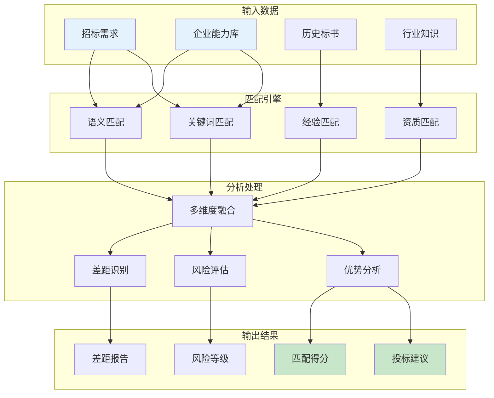
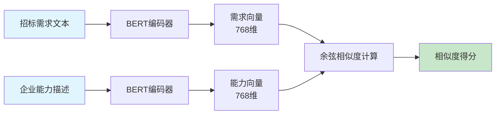
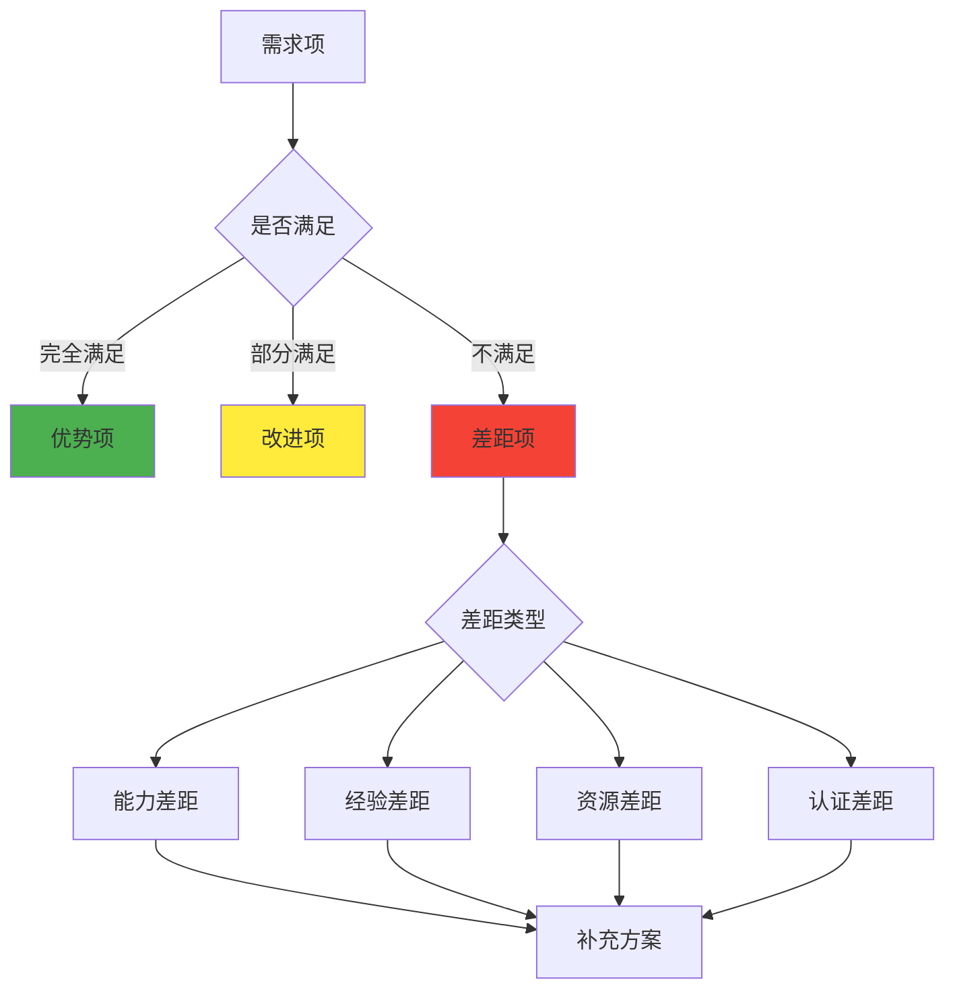
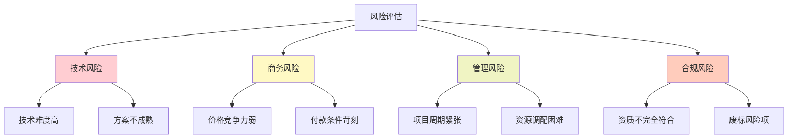
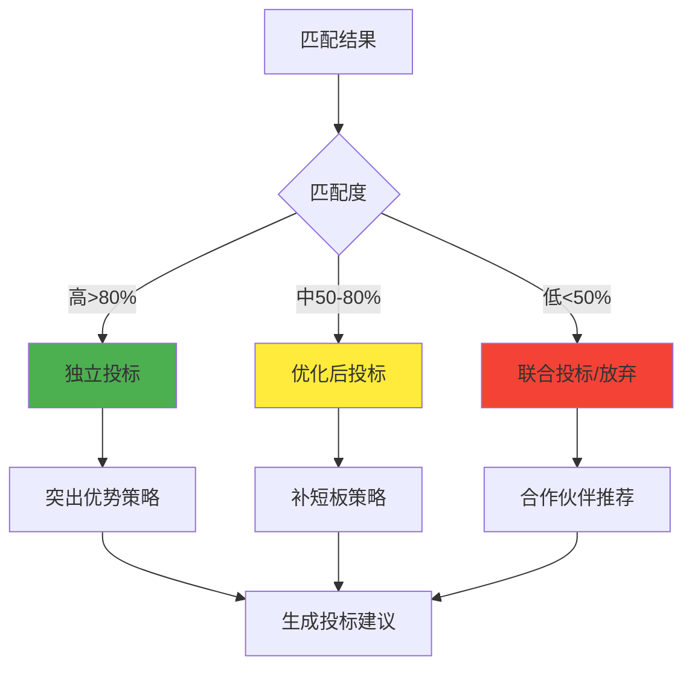

# 智能匹配引擎算法

本文档详细描述智能匹配引擎的核心算法，用于将招标需求与企业能力进行智能匹配，识别差距和优势，并提供投标建议。

## 📋 目录导航

- [返回总览](./00-AI算法总览.md)
- [文档智能解析算法](./01-文档智能解析算法.md)

## 🎯 算法概述

智能匹配引擎是标书创作平台的核心算法之一，负责将招标文档中提取的需求与企业的产品、服务、案例、人员等能力进行多维度匹配，为投标决策提供数据支持。

### 核心功能

1. **多维度匹配**：综合语义相似度、关键词匹配、经验匹配、认证匹配四个维度
2. **差距分析**：识别能力差距并分类（能力、经验、资源、认证）
3. **风险评估**：评估每个需求的投标风险并给出缓解建议
4. **智能推荐**：基于匹配结果生成投标策略建议

## 1. 企业能力匹配算法

### 1.1 算法架构



### 1.2 多维度匹配策略

#### 1.2.1 匹配维度定义

| 匹配维度 | 权重 | 算法方法 | 数据源 | 匹配阈值 |
|---------|------|---------|--------|----------|
| 语义相似度 | 35% | BERT/Sentence-BERT | 文本描述 | >0.7 |
| 关键词匹配 | 25% | TF-IDF + BM25 | 关键词库 | >0.6 |
| 经验匹配 | 25% | 案例相似度 | 历史项目 | >0.65 |
| 认证匹配 | 15% | 规则匹配 | 资质库 | 100% |

#### 1.2.2 匹配算法流程

```
匹配流程：
1. 需求预处理
   ├─> 文本清洗
   ├─> 分词分句
   └─> 特征提取

2. 多维度计算
   ├─> 语义向量化（BERT）
   ├─> 关键词提取（TF-IDF）
   ├─> 案例检索（相似度搜索）
   └─> 资质验证（规则引擎）

3. 分数融合
   ├─> 加权平均
   ├─> 归一化处理
   └─> 阈值判断

4. 结果生成
   ├─> 匹配分数
   ├─> 匹配详情
   └─> 差距分析
```

### 1.3 语义匹配算法

#### 1.3.1 向量化策略



#### 1.3.2 语义相似度计算

**计算公式**：
```
相似度 = cos(θ) = (A·B) / (||A|| × ||B||)

其中：
- A：需求向量
- B：能力向量
- θ：向量夹角
```

**优化策略**：
1. 使用Sentence-BERT预训练模型
2. 针对行业术语进行微调
3. 引入注意力机制突出关键信息
4. 使用向量索引加速检索（Faiss/Annoy）

### 1.4 关键词匹配算法

#### 1.4.1 关键词提取

| 提取方法 | 应用场景 | 优势 | 局限 |
|---------|---------|------|------|
| TF-IDF | 通用关键词 | 简单高效 | 忽略语义 |
| TextRank | 重要词汇 | 考虑词关系 | 计算较慢 |
| RAKE | 短语提取 | 保留词组 | 依赖分词 |
| KeyBERT | 语义关键词 | 语义准确 | 资源消耗大 |

#### 1.4.2 匹配评分机制

```
BM25评分公式：
Score = Σ IDF(qi) × (f(qi,D) × (k1+1)) / (f(qi,D) + k1×(1-b+b×|D|/avgdl))

参数说明：
- qi：查询词
- f(qi,D)：词频
- |D|：文档长度
- avgdl：平均文档长度
- k1=1.2, b=0.75（经验参数）
```

## 2. 差距分析算法

### 2.1 差距识别框架



### 2.2 差距分类与处理

| 差距类型 | 识别标准 | 严重程度 | 处理建议 |
|---------|---------|---------|---------|
| 能力差距 | 技术/产品不匹配 | 高 | 寻找合作伙伴/外包 |
| 经验差距 | 缺少类似案例 | 中 | 突出相关经验/培训 |
| 资源差距 | 人员/设备不足 | 中 | 临时招聘/租赁 |
| 认证差距 | 缺少必要资质 | 高 | 紧急办理/联合投标 |

### 2.3 差距量化评估

**差距严重度计算**：
```
差距分数 = Σ(权重i × 差距程度i)

差距程度分级：
- 0: 无差距
- 0.3: 轻微差距（可快速弥补）
- 0.6: 中等差距（需要努力）
- 1.0: 严重差距（难以弥补）

投标可行性 = 1 - 差距分数
```

## 3. 风险评估模型

### 3.1 风险维度分析



### 3.2 风险量化模型

| 风险类型 | 评估指标 | 权重 | 风险等级划分 |
|---------|---------|------|-------------|
| 技术风险 | 技术匹配度、实现难度 | 30% | 低[0-3]中[3-6]高[6-10] |
| 商务风险 | 价格竞争力、利润空间 | 25% | 低[0-3]中[3-6]高[6-10] |
| 管理风险 | 时间充裕度、资源可用性 | 25% | 低[0-3]中[3-6]高[6-10] |
| 合规风险 | 资质符合度、条款响应 | 20% | 低[0-3]中[3-6]高[6-10] |

**综合风险计算**：
```
综合风险 = Σ(风险i × 权重i)

风险决策：
- 风险 < 3：强烈建议投标
- 风险 3-6：谨慎投标，做好风险控制
- 风险 > 6：建议放弃或联合投标
```

## 4. 智能推荐算法

### 4.1 推荐策略生成

#### 4.1.1 策略决策树



#### 4.1.2 建议生成规则

| 匹配情况 | 风险等级 | 推荐策略 | 具体建议 |
|---------|---------|---------|---------|
| 高匹配+低风险 | 低 | 积极投标 | 突出核心优势，争取高分 |
| 高匹配+高风险 | 中 | 谨慎投标 | 重点防控风险点 |
| 低匹配+低风险 | 中 | 联合投标 | 寻找互补合作伙伴 |
| 低匹配+高风险 | 高 | 建议放弃 | 资源投入其他项目 |

### 4.2 优势突出算法

**优势识别维度**：
1. **独特优势**：竞争对手难以复制的能力
2. **相对优势**：在某方面明显超越平均水平
3. **综合优势**：多个维度组合形成的优势

**优势量化公式**：
```
优势度 = (我方得分 - 行业平均) / 行业平均 × 100%

优势等级：
- 显著优势：>30%
- 一般优势：10-30%
- 无明显优势：<10%
```

## 5. 性能优化

### 5.1 算法性能指标

| 性能指标 | 目标值 | 优先级 |
|---------|--------|--------|
| 匹配精度 | >90% | P0 |
| 处理速度 | <2秒/需求 | P1 |
| 召回率 | >85% | P0 |
| F1分数 | >0.87 | P0 |
| 并发处理 | 100需求/秒 | P2 |

### 5.2 优化策略

1. **缓存机制**
   - 向量缓存：缓存已计算的文本向量
   - 结果缓存：缓存高频查询结果
   - 模型缓存：预加载常用模型

2. **索引优化**
   - 使用Faiss构建向量索引
   - 倒排索引加速关键词检索
   - 图索引优化知识图谱查询

3. **并行处理**
   - 多线程并发匹配
   - 异步处理大批量需求
   - GPU加速向量计算

4. **模型优化**
   - 模型量化减少内存占用
   - 知识蒸馏提升推理速度
   - 动态批处理优化吞吐量

## 6. 接口设计

### 6.1 匹配分析接口

**接口路径**：`POST /api/v1/ai/match-analysis`

**请求参数**：
```json
{
    "project_id": "项目ID",
    "requirements": [
        {
            "id": "需求ID",
            "content": "需求描述",
            "type": "technical|business|qualification",
            "priority": "high|medium|low"
        }
    ],
    "options": {
        "include_gaps": true,
        "include_risks": true,
        "include_suggestions": true
    }
}
```

**响应格式**：
```json
{
    "success": true,
    "overall_match_score": 0.85,
    "match_results": [
        {
            "requirement_id": "REQ001",
            "match_score": 0.92,
            "matched_capabilities": [],
            "gaps": [],
            "risks": []
        }
    ],
    "recommendations": {
        "strategy": "independent|joint|optimize",
        "key_points": [],
        "risk_mitigation": []
    }
}
```

## 7. 监控指标

- 日均匹配分析量
- 平均匹配精度
- 差距识别准确率
- 风险预测准确率
- 推荐采纳率
- 用户满意度评分

---

## 修改历史

| 日期 | 版本 | 修改者 | 修改内容概要 |
|------|------|--------|-------------|
| 2025-11-30 12:25 | 2.0 | claude-opus-4-1-20250805 | 移除Python实现代码，保留算法设计，使用Mermaid图表 |
| 2025-11-29 | 1.0 | claude-sonnet-4-5 (claude-sonnet-4-5-20250929) | 初始版本 |