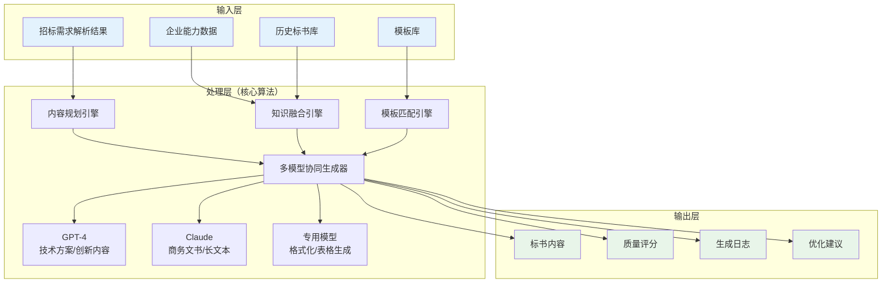
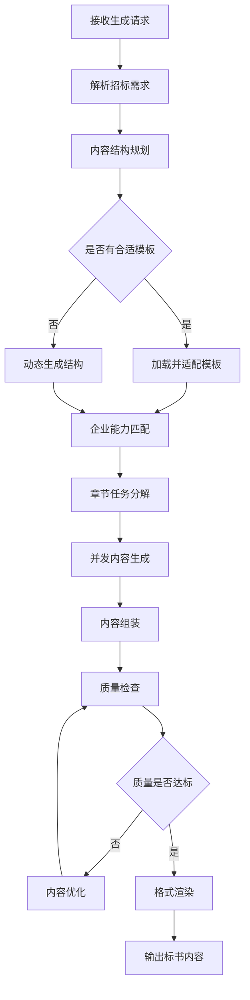
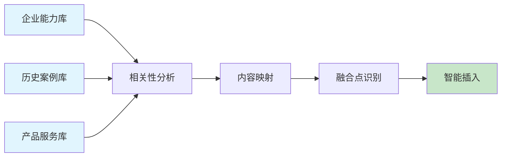

# 智能内容生成算法设计（修正版）

## 1. 业务概述

### 1.1 业务目标

智能内容生成是AI标书平台的核心业务能力，旨在根据招标需求自动生成高质量、个性化的标书内容，大幅提升标书制作效率。

### 1.2 业务价值

- **效率提升**：从传统3-5天缩短到10分钟完成百页标书
- **质量保证**：标准化生成流程，减少人为错误
- **成本降低**：减少80%的人工撰写时间
- **个性定制**：基于企业能力库的个性化内容

### 1.3 业务约束

- 生成内容必须符合招标文件要求
- 保证内容的原创性（查重率<30%）
- 确保专业术语使用准确
- 支持多行业、多类型标书

## 2. 算法总体设计

### 2.1 算法架构图



### 2.2 核心流程设计



## 3. 核心算法模块设计

### 3.1 内容规划引擎

#### 3.1.1 功能说明

根据招标需求自动规划标书的章节结构和内容要点。

#### 3.1.2 输入输出定义

**输入**：
- 招标需求解析结果（JSON格式）
- 项目类型和行业分类
- 字数和格式要求

**输出**：
- 文档结构树（章节、子章节、要点）
- 内容分配计划（每章节字数、重要度权重）
- 生成策略建议（使用模型、生成参数）

#### 3.1.3 算法流程

1. **需求分类**：识别项目类型（工程、服务、货物等）
2. **结构匹配**：从模板库匹配最佳文档结构
3. **要点提取**：分析需求提取每章节必须包含的要点
4. **权重分配**：根据评分标准分配章节重要度权重
5. **字数规划**：按权重和总字数要求分配各章节字数

### 3.2 知识融合引擎

#### 3.2.1 功能说明

将企业能力库的数据智能融入到生成内容中。

#### 3.2.2 数据流向图



#### 3.2.3 融合策略

| 内容类型 | 融合数据源 | 融合方式 | 示例 |
|---------|-----------|---------|------|
| 公司介绍 | 企业档案 | 直接引用 | 公司简介、发展历程 |
| 类似业绩 | 项目案例库 | 筛选匹配 | 相似行业、规模的案例 |
| 技术方案 | 产品服务库 | 组合生成 | 产品特性组合方案 |
| 人员配置 | 人员资质库 | 智能匹配 | 项目经理、技术专家 |
| 资质证书 | 资质库 | 条件筛选 | 相关认证、资质 |

### 3.3 多模型协同策略

#### 3.3.1 模型选择矩阵

| 内容类型 | 复杂度 | 推荐模型 | 选择理由 |
|---------|-------|---------|----------|
| 技术方案 | 高 | GPT-4 | 逻辑推理能力强 |
| 商务标书 | 中 | Claude | 长文本处理优势 |
| 格式文书 | 低 | GPT-3.5 | 成本效益最优 |
| 数据表格 | 低 | 专用模型 | 结构化生成 |
| 创新方案 | 高 | GPT-4 | 创造性思维 |

#### 3.3.2 协同生成流程

```
1. 任务分解
   └─> 将章节分解为独立生成任务

2. 模型分配
   └─> 根据内容类型分配最优模型

3. 并发生成
   └─> 多模型并发处理不同章节

4. 结果聚合
   └─> 统一格式和风格

5. 一致性校验
   └─> 确保前后文逻辑一致
```

## 4. 质量控制机制

### 4.1 质量评估维度

| 评估维度 | 权重 | 评估方法 | 及格线 |
|---------|-----|---------|--------|
| 需求覆盖度 | 30% | 关键词匹配+语义分析 | >90% |
| 内容完整性 | 25% | 章节完整度检查 | >95% |
| 专业程度 | 20% | 术语使用+逻辑性 | >85% |
| 原创性 | 15% | 查重检测 | >70% |
| 可读性 | 10% | 语言流畅度评分 | >90% |

### 4.2 优化迭代机制

```
质量评分 < 85分：
  ├─> 识别薄弱维度
  ├─> 定向内容增强
  ├─> 重新生成相关章节
  └─> 再次质量评估

质量评分 >= 85分：
  └─> 输出最终内容
```

## 5. 性能设计

### 5.1 性能指标要求

| 指标项 | 目标值 | 优先级 |
|--------|--------|--------|
| 生成速度 | 100页/10分钟 | P0 |
| 并发能力 | 10个文档同时 | P1 |
| 响应时间 | 首次响应<5秒 | P1 |
| 成功率 | >95% | P0 |
| 缓存命中 | >30% | P2 |

### 5.2 性能优化策略

1. **并发处理**：章节级别并发生成
2. **智能缓存**：常用内容预生成缓存
3. **流式输出**：边生成边返回
4. **资源调度**：动态分配计算资源
5. **降级策略**：高负载时启用快速模式

## 6. 接口设计

### 6.1 生成接口

**接口路径**：`POST /api/v1/ai/generate-content`

**请求参数**：
```json
{
    "project_id": "项目ID",
    "mode": "standard|fast|premium",
    "options": {
        "include_cases": true,
        "emphasis": ["技术方案", "价格优势"],
        "word_count": 50000
    }
}
```

**响应格式**：
```json
{
    "success": true,
    "task_id": "生成任务ID",
    "status": "processing|completed",
    "progress": 45,
    "estimated_time": 300,
    "preview_url": "预览地址"
}
```

### 6.2 状态查询接口

**接口路径**：`GET /api/v1/ai/generation-status/{task_id}`

**响应内容**：进度、预计时间、已完成章节列表

## 7. 异常处理

### 7.1 异常类型与处理策略

| 异常类型 | 处理策略 | 用户提示 |
|---------|---------|---------|
| 模型超时 | 重试3次，降级模型 | "正在优化生成速度..." |
| 内容不完整 | 补充生成 | "正在完善内容..." |
| 质量不达标 | 自动优化 | "正在提升内容质量..." |
| 查重率过高 | 重新生成 | "正在优化原创性..." |
| 系统过载 | 排队等待 | "系统繁忙，预计等待X分钟" |

## 8. 数据安全

### 8.1 安全措施

1. **数据隔离**：企业数据严格隔离
2. **内容加密**：生成内容加密存储
3. **访问控制**：基于角色的访问权限
4. **审计日志**：记录所有生成操作
5. **敏感词过滤**：防止生成不当内容

## 9. 监控指标

### 9.1 业务监控

- 日生成文档数量
- 平均生成时间
- 用户满意度评分
- 生成成功率
- 各模型使用占比

### 9.2 技术监控

- API响应时间
- 模型调用成功率
- 缓存命中率
- 系统资源使用率
- 错误率和错误分布

## 10. 实施路线图

### 第一阶段（MVP）
- 基础生成能力
- 单模型生成
- 简单模板支持

### 第二阶段（优化）
- 多模型协同
- 智能内容融合
- 质量自动优化

### 第三阶段（增强）
- 自学习能力
- 个性化定制
- 行业知识库

---

## 修改历史

| 日期 | 版本 | 修改者 | 修改内容概要 |
|------|------|--------|-------------|
| 2025-11-30 11:20 | 2.0 | claude-opus-4-1-20250805 | 重构文档，移除实现代码，专注业务设计 |
| 2025-11-30 10:45 | 1.0 | claude-opus-4-1-20250805 | 初始版本（包含过多实现代码） |