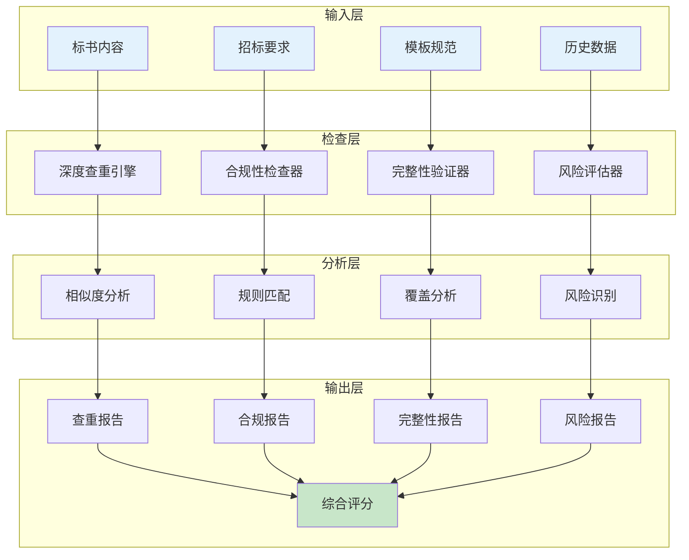
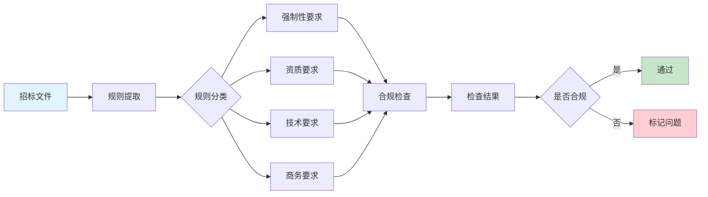
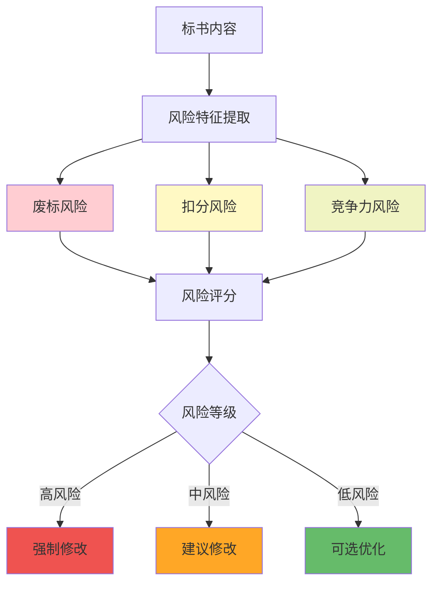
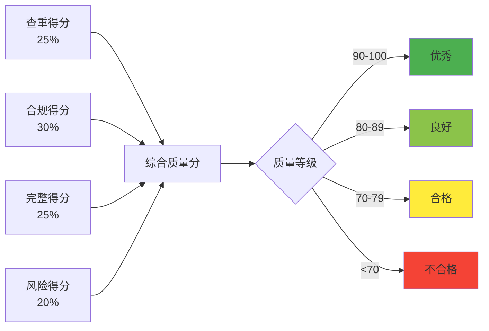

# 质量保障算法设计

## 1. 算法概述

### 1.1 算法目标

质量保障算法负责对生成的标书内容进行全方位的质量检查和优化，确保输出内容的准确性、完整性、合规性和原创性。

**核心目标**：
- **查重率控制**：相似度 <30%（与历史标书对比）
- **合规性检查**：100%符合招标要求
- **完整性验证**：必要内容覆盖率 100%
- **一致性检查**：前后文一致性 100%
- **风险预警**：废标风险识别率 >95%

### 1.2 算法架构图



## 2. 核心算法模块

### 2.1 深度查重引擎

#### 2.1.1 多维度查重策略

| 查重维度 | 算法方法 | 阈值设置 | 应用场景 |
|---------|---------|---------|---------|
| 文本相似度 | SimHash + 余弦相似度 | >70%判定相似 | 段落级查重 |
| 语义相似度 | BERT向量化 | >85%判定相似 | 语义级查重 |
| 结构相似度 | 文档树对比 | >80%判定相似 | 章节结构查重 |
| 关键词密度 | TF-IDF分析 | >60%判定相似 | 核心内容查重 |

#### 2.1.2 查重流程

```
1. 文本预处理
   ├─> 分词处理
   ├─> 去除停用词
   └─> 标准化格式

2. 特征提取
   ├─> 提取文本指纹（SimHash）
   ├─> 生成语义向量（BERT）
   └─> 构建文档结构树

3. 相似度计算
   ├─> 计算文本相似度
   ├─> 计算语义相似度
   └─> 计算结构相似度

4. 综合评判
   ├─> 加权综合得分
   ├─> 标记相似片段
   └─> 生成查重报告
```

### 2.2 合规性检查器

#### 2.2.1 检查规则体系



#### 2.2.2 合规性检查维度

| 检查项 | 检查内容 | 检查方法 | 不合规后果 |
|--------|---------|---------|-----------|
| 资质证书 | 营业执照、资质等级 | 关键词匹配+OCR识别 | 废标 |
| 技术参数 | 产品规格、性能指标 | 数值对比+范围检查 | 扣分 |
| 响应偏离 | 实质性条款响应 | 语义分析+规则匹配 | 废标 |
| 格式规范 | 字体、页数、装订 | 格式检测 | 扣分 |
| 报价规范 | 报价格式、计算准确性 | 公式验证 | 废标 |

### 2.3 完整性验证器

#### 2.3.1 完整性检查框架

**必需章节检查**：
1. 技术方案（权重30%）
2. 商务报价（权重25%）
3. 项目团队（权重20%）
4. 实施计划（权重15%）
5. 售后服务（权重10%）

**内容完整度评分公式**：

```
完整度得分 = Σ(章节i完整度 × 权重i)

其中：
- 章节完整度 = 实际内容量 / 预期内容量
- 预期内容量基于历史优秀标书统计
```

#### 2.3.2 缺失内容识别

```
缺失类型分析：
├── 必需章节缺失（严重）
│   └── 触发：立即补充生成
├── 关键要素缺失（中等）
│   └── 触发：智能提示补充
└── 细节内容缺失（轻微）
    └── 触发：优化建议
```

### 2.4 风险评估器

#### 2.4.1 风险识别模型



#### 2.4.2 风险评估维度

| 风险类型 | 风险项 | 检测方法 | 风险等级 | 处理建议 |
|---------|--------|---------|---------|---------|
| 废标风险 | 未响应实质性条款 | 条款匹配 | 高 | 立即修改 |
| 废标风险 | 资质不符 | 资质验证 | 高 | 更换人员/补充资质 |
| 扣分风险 | 技术方案薄弱 | 内容评分 | 中 | 增强技术描述 |
| 扣分风险 | 案例不匹配 | 相关性分析 | 中 | 更换相关案例 |
| 竞争力风险 | 价格偏高 | 市场对比 | 低 | 优化报价策略 |

### 2.5 智能优化器

#### 2.5.1 优化策略矩阵

| 问题类型 | 优化策略 | 优化方法 | 预期效果 |
|---------|---------|---------|---------|
| 查重率高 | 内容重写 | 同义替换+句式变换 | 降低20-30% |
| 逻辑不清 | 结构优化 | 段落重组+过渡优化 | 提升可读性30% |
| 专业度低 | 术语增强 | 专业词汇替换 | 提升专业度20% |
| 说服力弱 | 论据补充 | 数据+案例增强 | 提升说服力40% |

#### 2.5.2 自动优化流程

```
质量评分 < 60分：
  ├─> 重大问题修复
  ├─> 重新生成相关章节
  └─> 人工介入审核

质量评分 60-80分：
  ├─> 自动优化内容
  ├─> 补充缺失要素
  └─> 二次质量检查

质量评分 > 80分：
  ├─> 细节优化
  ├─> 格式美化
  └─> 直接输出
```

## 3. 质量评分体系

### 3.1 综合评分模型



### 3.2 评分细则

| 评分维度 | 权重 | 评分标准 | 扣分项 |
|---------|------|---------|--------|
| 原创性 | 25% | 查重率<30%得满分 | 每增10%扣10分 |
| 合规性 | 30% | 100%合规得满分 | 每项不合规扣5分 |
| 完整性 | 25% | 内容完整得满分 | 每缺失项扣3分 |
| 风险性 | 20% | 无风险得满分 | 每个高风险扣10分 |

## 4. 性能指标

### 4.1 算法性能要求

| 指标项 | 目标值 | 优先级 |
|--------|--------|--------|
| 查重速度 | <5秒/万字 | P0 |
| 检查准确率 | >95% | P0 |
| 风险识别率 | >95% | P0 |
| 优化提升率 | >20% | P1 |
| 误报率 | <5% | P1 |

### 4.2 优化策略

1. **并行处理**：多维度检查并发执行
2. **缓存机制**：常见问题模式缓存
3. **增量检查**：只检查修改部分
4. **智能降级**：高负载时简化检查

## 5. 接口设计

### 5.1 质量检查接口

**接口路径**：`POST /api/v1/ai/quality-check`

**请求参数**：
```json
{
    "document_id": "文档ID",
    "check_type": "full|quick|custom",
    "check_items": ["plagiarism", "compliance", "completeness", "risk"],
    "options": {
        "plagiarism_threshold": 0.3,
        "include_suggestions": true
    }
}
```

**响应格式**：
```json
{
    "success": true,
    "quality_score": 85,
    "check_results": {
        "plagiarism": {
            "score": 90,
            "similarity_rate": 0.15,
            "similar_segments": []
        },
        "compliance": {
            "score": 100,
            "violations": [],
            "warnings": []
        },
        "completeness": {
            "score": 85,
            "missing_sections": [],
            "coverage_rate": 0.95
        },
        "risk": {
            "score": 80,
            "high_risks": [],
            "medium_risks": []
        }
    },
    "suggestions": [],
    "report_url": "质量报告下载地址"
}
```

## 6. 监控指标

- 日均检查文档数量
- 平均查重准确率
- 风险识别准确率
- 优化建议采纳率
- 用户满意度评分

---

## 修改历史

| 日期 | 版本 | 修改者 | 修改内容概要 |
|------|------|--------|-------------|
| 2025-11-30 12:15 | 2.0 | claude-opus-4-1-20250805 | 移除实现代码，保留算法设计，使用Mermaid图表 |
| 2025-11-30 10:55 | 1.0 | claude-opus-4-1-20250805 | 初始版本（包含实现代码） |