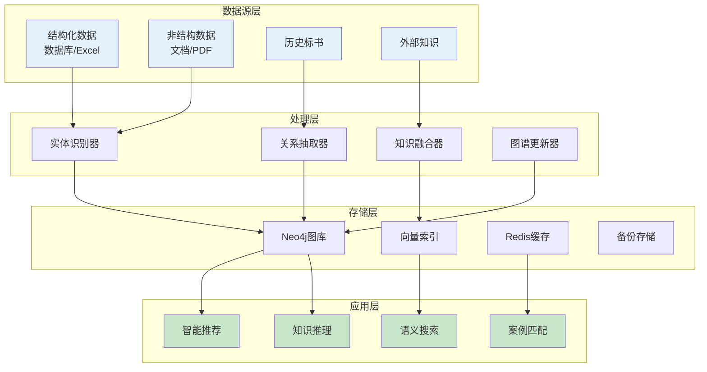
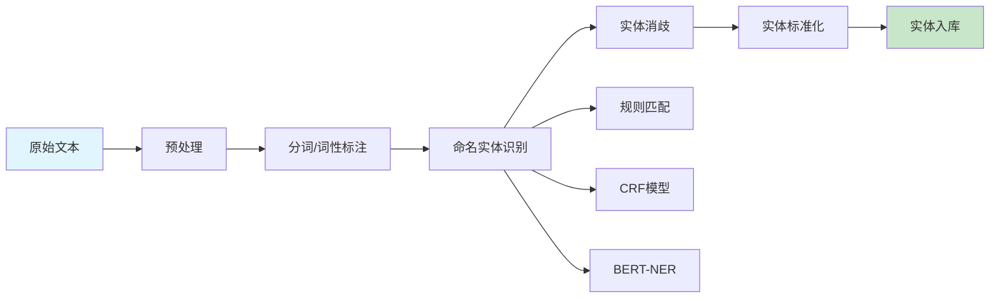
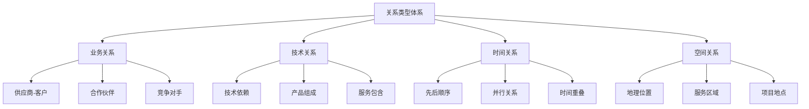
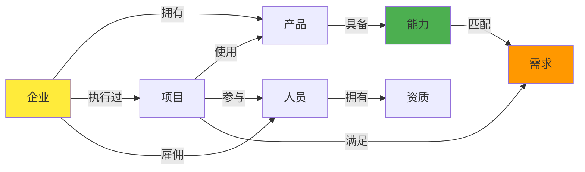
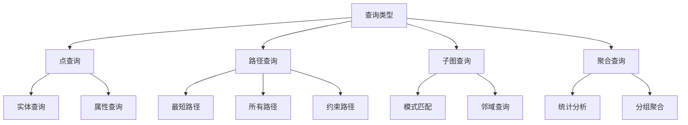

# 知识图谱构建算法设计

## 1. 算法概述

### 1.1 算法目标

知识图谱构建算法负责将企业的各类数据（产品、项目、人员、案例等）构建成结构化的知识图谱，实现智能化的知识管理和推理。

**核心目标**：
- **图谱规模**：支持10万+节点、100万+关系边
- **构建速度**：1000个节点/分钟
- **查询性能**：复杂查询 <100ms
- **准确率**：实体识别准确率 >95%
- **关系抽取**：关系识别准确率 >90%

### 1.2 技术架构图



## 2. 核心算法模块

### 2.1 实体识别与抽取

#### 2.1.1 实体类型定义

| 实体类型 | 描述 | 属性示例 | 数据来源 |
|---------|------|---------|---------|
| Organization | 组织机构 | 名称、类型、规模、行业 | 企业档案 |
| Project | 项目案例 | 名称、金额、时间、地点 | 项目库 |
| Person | 人员 | 姓名、职位、资质、经验 | 人员库 |
| Product | 产品服务 | 名称、规格、价格、特性 | 产品库 |
| Requirement | 需求项 | 类型、指标、重要度 | 招标文件 |
| Capability | 能力项 | 类型、等级、证明材料 | 能力库 |

#### 2.1.2 实体识别流程



### 2.2 关系抽取

#### 2.2.1 关系类型定义



#### 2.2.2 关系抽取策略

| 抽取方法 | 适用场景 | 准确率 | 处理速度 |
|---------|---------|--------|----------|
| 规则模板 | 结构化数据 | 95%+ | 快 |
| 依存句法 | 简单句式 | 85% | 中 |
| 远程监督 | 大规模文本 | 80% | 中 |
| 深度学习 | 复杂语境 | 90% | 慢 |

### 2.3 知识融合

#### 2.3.1 融合策略

```
知识融合流程：
1. 实体对齐
   ├─> 名称相似度计算
   ├─> 属性匹配
   └─> 上下文验证

2. 冲突检测
   ├─> 属性值冲突
   ├─> 关系冲突
   └─> 时间冲突

3. 冲突消解
   ├─> 可信度评估
   ├─> 时间优先级
   └─> 来源权重

4. 知识合并
   ├─> 属性合并
   ├─> 关系合并
   └─> 版本控制
```

#### 2.3.2 实体对齐算法

| 对齐维度 | 算法方法 | 权重 | 阈值 |
|---------|---------|------|------|
| 名称相似 | 编辑距离 | 0.3 | >0.8 |
| 属性匹配 | Jaccard相似度 | 0.3 | >0.7 |
| 结构相似 | 图嵌入 | 0.2 | >0.75 |
| 语义相似 | Word2Vec | 0.2 | >0.85 |

### 2.4 图谱构建

#### 2.4.1 图谱模式设计



#### 2.4.2 图谱存储结构

**节点属性设计**：

| 节点类型 | 必需属性 | 可选属性 | 索引字段 |
|---------|---------|---------|---------|
| Organization | id, name, type | industry, scale, location | id, name |
| Project | id, name, amount | start_date, end_date, status | id, name, amount |
| Person | id, name, role | experience, certifications | id, name |
| Product | id, name, category | price, features, version | id, name, category |

**关系属性设计**：

| 关系类型 | 属性 | 说明 |
|---------|------|------|
| OWNS | since, share | 拥有关系 |
| PARTICIPATES | role, duration | 参与关系 |
| REQUIRES | priority, mandatory | 需求关系 |
| PROVIDES | confidence, evidence | 提供关系 |

### 2.5 知识推理

#### 2.5.1 推理规则

```
推理规则示例：

规则1：传递性推理
IF A 供应商 B AND B 供应商 C
THEN A 间接供应商 C

规则2：能力推理
IF 项目P 需要能力C AND 企业E 拥有能力C
THEN 企业E 可承接项目P

规则3：团队推理
IF 项目P 需要角色R AND 人员M 担任角色R AND 人员M 属于企业E
THEN 企业E 具备项目P的人员条件

规则4：经验推理
IF 企业E 完成项目P1 AND P1 类似于 P2
THEN 企业E 有能力完成P2
```

#### 2.5.2 推理算法

| 推理类型 | 算法方法 | 应用场景 |
|---------|---------|---------|
| 规则推理 | 前向链接 | 实时推理 |
| 概率推理 | 贝叶斯网络 | 不确定性处理 |
| 路径推理 | 图遍历算法 | 关系发现 |
| 嵌入推理 | TransE/TransR | 链接预测 |

## 3. 查询与检索

### 3.1 查询类型

#### 3.1.1 查询分类



#### 3.1.2 查询优化

| 优化策略 | 方法 | 效果 |
|---------|------|------|
| 索引优化 | 建立多级索引 | 查询速度提升10x |
| 缓存策略 | 热点数据缓存 | 响应时间减少80% |
| 查询重写 | 等价变换 | 执行效率提升30% |
| 并行处理 | 分片并行 | 吞吐量提升5x |

### 3.2 语义搜索

#### 3.2.1 搜索流程

```
语义搜索流程：
1. 查询理解
   ├─> 意图识别
   ├─> 实体提取
   └─> 关系识别

2. 查询扩展
   ├─> 同义词扩展
   ├─> 上下位扩展
   └─> 关联扩展

3. 检索执行
   ├─> 图谱检索
   ├─> 向量检索
   └─> 混合排序

4. 结果优化
   ├─> 相关性排序
   ├─> 多样性保证
   └─> 解释生成
```

## 4. 应用场景

### 4.1 智能推荐

#### 4.1.1 推荐策略

| 推荐类型 | 基于图谱的方法 | 应用场景 |
|---------|---------------|---------|
| 案例推荐 | 相似项目路径 | 投标参考 |
| 人员推荐 | 技能匹配+经验 | 团队组建 |
| 方案推荐 | 需求-能力映射 | 技术方案 |
| 伙伴推荐 | 合作关系网络 | 联合投标 |

### 4.2 智能问答

#### 4.2.1 问答类型支持

```
支持的问题类型：
1. 事实型问题
   - "某公司有哪些产品？"
   - "某项目的金额是多少？"

2. 列举型问题
   - "列出所有具备某资质的人员"
   - "显示所有某类型的项目"

3. 比较型问题
   - "比较两个方案的优劣"
   - "对比不同供应商的能力"

4. 推理型问题
   - "哪些企业能承接此项目？"
   - "推荐最合适的实施方案"
```

## 5. 性能指标

### 5.1 性能要求

| 指标项 | 目标值 | 测试方法 |
|--------|--------|---------|
| 构建速度 | >1000节点/分钟 | 批量导入测试 |
| 查询延迟 | <100ms (P99) | 压力测试 |
| 并发查询 | >1000 QPS | 负载测试 |
| 图谱规模 | 10万+节点 | 容量测试 |
| 准确率 | >95% | 人工标注验证 |

### 5.2 优化策略

1. **分布式存储**：图数据分片存储
2. **异步构建**：实时与批量结合
3. **智能缓存**：基于访问模式的缓存
4. **索引优化**：多维度索引设计
5. **查询优化**：查询计划优化器

## 6. 接口设计

### 6.1 图谱构建接口

**接口路径**：`POST /api/v1/knowledge-graph/build`

**请求参数**：
```json
{
    "data_source": "database|document|api",
    "source_config": {
        "connection": "数据源连接信息",
        "filters": {}
    },
    "build_options": {
        "mode": "incremental|full",
        "entity_types": ["Organization", "Project"],
        "relation_types": ["OWNS", "PARTICIPATES"]
    }
}
```

### 6.2 图谱查询接口

**接口路径**：`POST /api/v1/knowledge-graph/query`

**请求参数**：
```json
{
    "query_type": "cypher|natural|template",
    "query": "查询语句或自然语言问题",
    "parameters": {},
    "options": {
        "limit": 100,
        "timeout": 5000
    }
}
```

## 7. 监控指标

- 图谱节点总数
- 关系边总数
- 日构建量
- 查询QPS
- 平均查询延迟
- 缓存命中率
- 推理准确率

---

## 修改历史

| 日期 | 版本 | 修改者 | 修改内容概要 |
|------|------|--------|-------------|
| 2025-11-30 12:20 | 2.0 | claude-opus-4-1-20250805 | 移除实现代码，保留业务设计，使用Mermaid图表 |
| 2025-11-30 11:05 | 1.0 | claude-opus-4-1-20250805 | 初始版本（包含实现代码） |