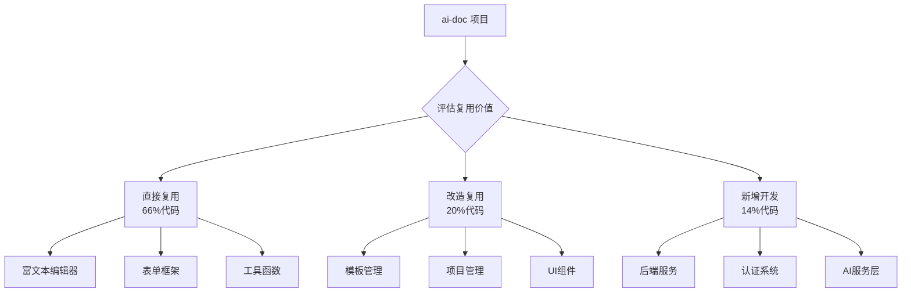

# AI-Doc 功能复用实施指南

**文档编号**: IMP-002-002
**创建时间**: 2025-11-26
**执行模型**: claude-opus-4-1-20250805
**文档状态**: 已完成
**实施目标**: 基于 ai-doc 项目快速构建 AIBidComposer 前端

---

## 修改历史

| 日期 | 修改人/模型 | 修改概要 |
|------|------------|---------|
| 2025-11-26 | claude-opus-4-1 | 创建功能复用实施指南 |
| 2025-11-26 | claude-opus-4-1 | 基于specs补充嵌套模板、用户管理、AI集成实现细节 |
| 2025-11-26 | claude-sonnet-4-5 | 根据技术要求，将表单方案从 React Hook Form + Zod 替换为 Ant Design ProForm |

---

## 重要技术要求说明

根据项目最新技术栈决策，本实施指南遵循以下技术要求：

| 技术组件 | 选型决策 | 版本要求 |
|---------|---------|---------|
| **数据库** | PostgreSQL | 18.1 (2025年11月最新稳定版) |
| **表单框架** | Ant Design ProForm | 2.32.0 (替代 React Hook Form + Zod) |
| **搜索引擎** | Elasticsearch | 9.2.1 (2025年11月) |
| **RAG框架** | LlamaIndex | 0.14.8 (2025年11月) |
| **LLM框架** | LangChain | 1.1.0 (2025年11月，备用) |
| **UI组件库** | Ant Design Pro | 6.x + ProComponents 2.8.10 |

> ⚠️ **特别说明**：本文档所有表单相关示例均已更新为 ProForm 实现，不再使用 React Hook Form + Zod。

---

## 一、快速复用路线图

### 复用策略总览



## 二、立即可复用的核心模块

### 2.1 BlockNode 富文本编辑器

#### 复用步骤

```bash
# 1. 复制编辑器核心代码
cp -r /data/ai-doc/frontend/src/components/editor/* \
      /mnt/data/ai-contract/frontend/src/components/editor/

# 2. 复制编辑器依赖的hooks
cp -r /data/ai-doc/frontend/src/hooks/useEditor* \
      /mnt/data/ai-contract/frontend/src/hooks/

# 3. 复制编辑器类型定义
cp -r /data/ai-doc/frontend/src/types/editor.ts \
      /mnt/data/ai-contract/frontend/src/types/
```

#### 改造要点

```typescript
// 原 ai-doc 编辑器配置
const editorConfig = {
  blocks: ['paragraph', 'heading', 'code', 'list'],
  theme: 'mui'
};

// 改造为标书编辑器
const bidEditorConfig = {
  blocks: [
    'paragraph',
    'heading',
    'table',           // 新增：表格支持
    'requirement',     // 新增：需求块
    'solution',        // 新增：方案块
    'quotation',       // 新增：报价块
    'attachment'       // 新增：附件块
  ],
  theme: 'antd',      // 改为 Ant Design 主题
  plugins: [
    'autoSave',       // 自动保存
    'collaboration',  // 协作编辑
    'aiAssistant'     // AI助手
  ]
};
```

### 2.2 表单管理框架（使用 ProForm）

#### 表单框架选择

根据技术栈要求，本项目采用 **Ant Design ProForm** 组件系列，而非 React Hook Form + Zod。ProForm 提供了更适合企业级应用的表单解决方案。

#### ProForm 核心优势

```typescript
// ProForm 特性
const ProFormAdvantages = {
  // 1. 与 Ant Design Pro 深度集成
  integration: '无缝集成 Ant Design Pro 生态',

  // 2. 内置常用表单组件
  components: [
    'ProFormText',        // 文本输入
    'ProFormDigit',       // 数字输入
    'ProFormDatePicker',  // 日期选择
    'ProFormSelect',      // 下拉选择
    'ProFormUploadButton', // 文件上传
    'ProFormTextArea',    // 多行文本
    'ProFormRadio',       // 单选
    'ProFormCheckbox'     // 多选
  ],

  // 3. 强大的表单能力
  features: [
    '自动表单布局',
    '内置验证规则',
    '异步数据获取',
    '表单联动',
    '分步表单',
    '弹窗表单'
  ]
};
```

#### ProForm 使用示例

```typescript
import {
  ProForm,
  ProFormText,
  ProFormSelect,
  ProFormDigit,
  ProFormDatePicker,
  ProFormList
} from '@ant-design/pro-form';
import { message } from 'antd';

// 标书项目创建表单
function CreateBidProjectForm() {
  // ProForm 自动处理表单状态和提交
  return (
    <ProForm
      layout="vertical"
      onFinish={async (values) => {
        // 提交逻辑
        try {
          await createProject(values);
          message.success('项目创建成功');
          return true;
        } catch (error) {
          message.error('创建失败');
          return false;
        }
      }}
      initialValues={{
        biddingType: 'enterprise',
        budget: 0,
        requirements: []
      }}
    >
      <ProFormText
        name="projectName"
        label="项目名称"
        placeholder="请输入项目名称"
        rules={[
          { required: true, message: '项目名称不能为空' },
          { min: 2, message: '项目名称至少2个字符' }
        ]}
      />

      <ProFormSelect
        name="biddingType"
        label="招标类型"
        options={[
          { label: '政府采购', value: 'government' },
          { label: '企业招标', value: 'enterprise' },
          { label: '国际招标', value: 'international' }
        ]}
        rules={[{ required: true, message: '请选择招标类型' }]}
      />

      <ProFormDigit
        name="budget"
        label="项目预算"
        placeholder="请输入预算金额"
        fieldProps={{
          prefix: '¥',
          formatter: value => `${value}`.replace(/\B(?=(\d{3})+(?!\d))/g, ','),
          parser: value => value!.replace(/\$\s?|(,*)/g, '')
        }}
        rules={[
          { required: true, message: '请输入预算金额' },
          {
            validator: async (_, value) => {
              if (value <= 0) {
                throw new Error('预算必须大于0');
              }
            }
          }
        ]}
      />

      <ProFormDatePicker
        name="deadline"
        label="投标截止时间"
        width="lg"
        rules={[{ required: true, message: '请选择截止时间' }]}
      />

      <ProFormList
        name="requirements"
        label="需求列表"
        creatorButtonProps={{
          position: 'bottom',
          creatorButtonText: '添加需求项'
        }}
        min={1}
        copyIconProps={false}
        itemRender={({ listDom, action }, { index }) => (
          <Card
            bordered
            style={{ marginBottom: 8 }}
            title={`需求 ${index + 1}`}
            extra={action}
          >
            {listDom}
          </Card>
        )}
      >
        <ProFormText
          name="requirement"
          placeholder="请输入需求描述"
          rules={[{ required: true, message: '需求描述不能为空' }]}
        />
      </ProFormList>
    </ProForm>
  );
}
```

#### 高级 ProForm 用法

```typescript
// 1. 分步表单 (StepsForm)
import { StepsForm } from '@ant-design/pro-form';

function BidWizardForm() {
  return (
    <StepsForm
      onFinish={async (values) => {
        console.log(values);
        message.success('提交成功');
      }}
    >
      <StepsForm.StepForm name="base" title="基本信息">
        <ProFormText name="projectName" label="项目名称" />
        <ProFormSelect name="type" label="项目类型" />
      </StepsForm.StepForm>

      <StepsForm.StepForm name="requirements" title="需求信息">
        <ProFormTextArea name="description" label="需求描述" />
        <ProFormUploadButton name="files" label="附件上传" />
      </StepsForm.StepForm>

      <StepsForm.StepForm name="budget" title="预算信息">
        <ProFormDigit name="amount" label="预算金额" />
        <ProFormDateRangePicker name="dateRange" label="项目周期" />
      </StepsForm.StepForm>
    </StepsForm>
  );
}

// 2. 弹窗表单 (ModalForm)
import { ModalForm } from '@ant-design/pro-form';

function QuickCreateProject() {
  return (
    <ModalForm
      title="快速创建项目"
      trigger={<Button type="primary">创建项目</Button>}
      onFinish={async (values) => {
        await createProject(values);
        message.success('创建成功');
        return true; // 返回true关闭弹窗
      }}
    >
      <ProFormText name="name" label="项目名称" />
      <ProFormDatePicker name="deadline" label="截止日期" />
    </ModalForm>
  );
}

// 3. 表单联动 (ProFormDependency)
import { ProFormDependency } from '@ant-design/pro-form';

function DynamicForm() {
  return (
    <ProForm>
      <ProFormSelect
        name="projectType"
        label="项目类型"
        options={[
          { label: '技术项目', value: 'tech' },
          { label: '咨询项目', value: 'consulting' }
        ]}
      />

      <ProFormDependency name={['projectType']}>
        {({ projectType }) => {
          if (projectType === 'tech') {
            return (
              <>
                <ProFormText name="techStack" label="技术栈" />
                <ProFormDigit name="developers" label="开发人数" />
              </>
            );
          }
          if (projectType === 'consulting') {
            return (
              <>
                <ProFormText name="industry" label="行业领域" />
                <ProFormDigit name="consultants" label="顾问人数" />
              </>
            );
          }
          return null;
        }}
      </ProFormDependency>
    </ProForm>
  );
}
```

#### 数据验证方案

```typescript
// ProForm 内置验证规则
const ValidationRules = {
  // 1. 基础验证
  required: { required: true, message: '此字段必填' },
  email: { type: 'email', message: '请输入有效的邮箱' },
  url: { type: 'url', message: '请输入有效的URL' },

  // 2. 长度验证
  minLength: { min: 2, message: '至少2个字符' },
  maxLength: { max: 100, message: '最多100个字符' },

  // 3. 数值验证
  positive: {
    validator: async (_, value) => {
      if (value <= 0) throw new Error('必须为正数');
    }
  },

  // 4. 自定义异步验证
  uniqueCheck: {
    validator: async (_, value) => {
      const isUnique = await checkProjectNameUnique(value);
      if (!isUnique) throw new Error('项目名称已存在');
    }
  },

  // 5. 正则验证
  pattern: {
    pattern: /^[A-Z][0-9]{6}$/,
    message: '格式：大写字母开头+6位数字'
  }
};

// 在 ProForm 中使用
<ProFormText
  name="projectCode"
  label="项目编号"
  rules={[
    ValidationRules.required,
    ValidationRules.pattern,
    ValidationRules.uniqueCheck
  ]}
/>
```

### 2.3 模板数据结构

#### 复用 JSON 配置

```bash
# 复制模板配置文件
cp /data/ai-doc/design/config/entity/*template*.json \
   /mnt/data/ai-contract/frontend/src/config/templates/
```

#### 数据结构映射

```javascript
// ai-doc 的模板结构
const aiDocTemplate = {
  templateId: 'uuid',
  templateName: '设计任务模板',
  templateType: 'task',
  fields: [
    { fieldKey: 'taskName', fieldType: 'string', required: true },
    { fieldKey: 'taskDescription', fieldType: 'text', required: false }
  ]
};

// 改造为标书模板结构
const bidTemplate = {
  templateId: 'uuid',
  templateName: '技术方案模板',
  templateType: 'technical',  // technical/commercial/qualification
  category: 'IT',             // 行业分类
  sections: [
    {
      sectionId: 'tech-overview',
      sectionName: '技术方案总览',
      sectionOrder: 1,
      content: {
        type: 'structured',
        fields: [
          {
            fieldKey: 'architecture',
            fieldType: 'richtext',
            fieldLabel: '系统架构',
            required: true,
            aiHint: '请描述系统的整体架构设计'
          },
          {
            fieldKey: 'techStack',
            fieldType: 'tags',
            fieldLabel: '技术栈',
            options: ['Java', 'Python', 'React', 'Vue']
          }
        ]
      }
    }
  ],
  variables: {
    companyName: '${company.name}',
    projectName: '${project.name}',
    submissionDate: '${project.deadline}'
  }
};
```

## 三、需要改造的模块

### 3.1 项目管理模块改造

#### 原始代码位置
```
/data/ai-doc/frontend/src/features/projects/
├── ProjectList.tsx
├── ProjectDetail.tsx
├── ProjectForm.tsx
└── hooks/useProjects.ts
```

#### 改造计划

```typescript
// 第一步：复制基础代码
// 复制项目管理的基础组件和逻辑

// 第二步：扩展数据模型
interface AiDocProject {
  projectId: string;
  projectName: string;
  projectPhase: string;
  createdAt: Date;
}

// 扩展为招投标项目
interface BidProject extends AiDocProject {
  // 保留原有字段
  projectId: string;
  projectName: string;

  // 新增招投标字段
  biddingType: 'government' | 'enterprise' | 'international';
  biddingNumber: string;        // 招标编号
  purchaser: string;             // 招标方
  budget: number;                // 预算金额
  submissionDeadline: Date;      // 投标截止时间
  openBidDate: Date;            // 开标时间

  // 新增状态管理
  status: 'draft' | 'in_progress' | 'submitted' | 'won' | 'lost';
  winProbability: number;        // 中标概率 0-100

  // 关联数据
  biddingDocumentId?: string;   // 招标文件
  bidDocumentId?: string;        // 投标文档
  competitorAnalysis?: any;     // 竞争对手分析
}

// 第三步：UI组件改造
function BidProjectList() {
  // 复用原有的列表逻辑
  const { data, loading } = useProjects();

  // 改造为 Ant Design ProTable
  return (
    <ProTable
      columns={[
        { title: '项目名称', dataIndex: 'projectName' },
        { title: '招标类型', dataIndex: 'biddingType' },
        { title: '预算金额', dataIndex: 'budget', render: (val) => `¥${val}` },
        {
          title: '截止时间',
          dataIndex: 'submissionDeadline',
          render: (date) => moment(date).format('YYYY-MM-DD HH:mm')
        },
        {
          title: '状态',
          dataIndex: 'status',
          valueEnum: {
            draft: { text: '草稿', status: 'Default' },
            in_progress: { text: '进行中', status: 'Processing' },
            submitted: { text: '已提交', status: 'Success' },
            won: { text: '已中标', status: 'Success' },
            lost: { text: '未中标', status: 'Error' }
          }
        }
      ]}
      dataSource={data}
      loading={loading}
    />
  );
}
```

### 3.2 AI 助手集成改造

#### 原始实现分析
```javascript
// ai-doc 的 AI 助手（前端直连）
const useAIAssistant = () => {
  const generateContent = async (prompt) => {
    const response = await fetch('https://api.openai.com/v1/chat/completions', {
      headers: { 'Authorization': `Bearer ${API_KEY}` },
      body: JSON.stringify({ prompt })
    });
    return response.json();
  };
};
```

#### 改造为后端服务模式
```typescript
// 新建 AI 服务客户端
class AIServiceClient {
  private pythonAPI = axios.create({
    baseURL: 'http://localhost:8001/api/v1/ai'
  });

  // 招标文件解析
  async parseBiddingDocument(file: File): Promise<ParsedDocument> {
    const formData = new FormData();
    formData.append('file', file);

    const response = await this.pythonAPI.post('/parse-document', formData);
    return response.data;
  }

  // 智能内容生成
  async generateContent(params: {
    documentId: string;
    sectionType: 'technical' | 'commercial' | 'qualification';
    context: any;
  }): Promise<GeneratedContent> {
    const response = await this.pythonAPI.post('/generate-content', params);
    return response.data;
  }

  // RAG 检索
  async searchKnowledge(query: string): Promise<SearchResult[]> {
    const response = await this.pythonAPI.post('/search', { query });
    return response.data;
  }
}

// React Hook 封装
function useAIService() {
  const client = new AIServiceClient();

  const { mutate: parseDocument, isLoading: isParsing } = useMutation(
    (file: File) => client.parseBiddingDocument(file)
  );

  const { mutate: generate, isLoading: isGenerating } = useMutation(
    (params) => client.generateContent(params)
  );

  return {
    parseDocument,
    isParsing,
    generate,
    isGenerating
  };
}
```

## 三补、基于 Specs 的高级复用方案

### 3补.1 嵌套模板系统实现（基于 spec-005）

#### 数据结构复用
```typescript
// 直接复用 ai-doc 的嵌套模板结构
interface DeliverableBlockTemplate {
  id: string;
  name: string;
  defaultContent: string;
  level: number;  // 最多5层
  children?: TemplateChildConstraint[];
}

interface TemplateChildConstraint {
  childTemplateId: string;
  isRequired: boolean;
  minCount: number;  // 默认 0
  maxCount: number;  // 默认 1
  orderIndex: number;
  supplementContent?: string;  // 父模板补充内容
}

// 标书文档的应用
interface BidDocumentTemplate extends DeliverableBlockTemplate {
  templateType: 'technical' | 'commercial' | 'qualification';
  industryCategory?: string;
  evaluationCriteria?: any;  // 评分标准关联
}
```

#### 树形编辑器组件
```tsx
// 复用 ai-doc 的树形模板编辑器
import { TemplateTreeEditor } from '@ai-doc/components';

function BidTemplateEditor() {
  return (
    <TemplateTreeEditor
      maxDepth={5}
      onDragEnd={handleReorder}
      renderNode={(node) => (
        <BidTemplateNode
          {...node}
          showConstraints
          showSupplementEditor
        />
      )}
      validation={{
        preventCircularRef: true,
        validateConstraints: true
      }}
    />
  );
}
```

### 3补.2 用户组织管理实现（基于 spec-003）

#### 复用用户邀请流程
```typescript
// 复用 ai-doc 的邀请激活工作流
interface InvitationFlow {
  // 第一步：管理员邀请
  async inviteUser(data: {
    email: string;
    role: 'Admin' | 'Member';
    companyId: string;
  }) {
    // 生成 token
    const token = await generateInvitationToken();
    // 发送邮件
    await sendInvitationEmail(email, token);
    // 保存邀请记录
    await saveInvitation({ ...data, token });
  }

  // 第二步：用户激活
  async activateAccount(token: string, password: string) {
    // 验证 token
    const invitation = await validateToken(token);
    // 创建账户
    const user = await createUser({
      ...invitation,
      password: hashPassword(password)
    });
    // 标记已激活
    await markTokenRedeemed(token);
    return user;
  }

  // 第三步：状态管理
  accountStatuses: {
    PENDING: 'pending_activation',
    ACTIVE: 'active',
    INACTIVE: 'inactive',
    SUSPENDED: 'suspended'
  }
}
```

#### 组织级权限管理
```typescript
// 复用组织隔离模式
class OrganizationContext {
  // 数据隔离
  @RequireOrganization()
  async getProjects(organizationId: string) {
    return this.projectRepo.find({
      where: { organizationId }
    });
  }

  // 级联状态控制
  async deactivateOrganization(orgId: string) {
    // 禁用组织
    await this.orgRepo.update(orgId, { status: 'inactive' });
    // 级联禁用用户
    await this.userRepo.update(
      { organizationId: orgId },
      { status: 'inactive' }
    );
    // 撤销活跃会话
    await this.sessionService.revokeOrgSessions(orgId);
  }
}
```

### 3补.3 AI Prompt 管理实现（基于 spec-008/011）

#### 三层 Prompt 体系
```typescript
// 1. 模板层 Prompt 配置
interface TemplateAIConfig {
  aiDocStyleGuide: string;      // 文档风格指南
  aiOutlineAdjustRule: string;  // 大纲调整规则
  aiSectionWriteConfig: {        // 章节写作配置
    tone: 'formal' | 'professional' | 'technical';
    length: 'brief' | 'standard' | 'detailed';
    examples?: string[];
  };
}

// 2. 实例层 Prompt 继承
class InstanceAIAssistant {
  constructor(
    private templateConfig: TemplateAIConfig,
    private instanceOverrides?: Partial<TemplateAIConfig>
  ) {}

  getPrompt(section: string): string {
    // 合并模板和实例配置
    const config = { ...this.templateConfig, ...this.instanceOverrides };

    return `
      风格指南：${config.aiDocStyleGuide}
      章节：${section}
      写作要求：${JSON.stringify(config.aiSectionWriteConfig)}
    `;
  }

  // 使用时机过滤
  filterByUsageTiming(assistants: Assistant[], timing: string) {
    return assistants.filter(a => a.usageTiming.includes(timing));
  }
}

// 3. 章节层自动化
interface SectionAutomation {
  trigger: 'onSave' | 'onDemand' | 'scheduled';
  operations: Array<{
    type: 'optimize' | 'expand' | 'summarize';
    aiModel: 'gpt-4' | 'claude-3';
    includeContext: boolean;
  }>;
}
```

#### Prompt 版本管理
```typescript
// 复用 ai-doc 的 Prompt 版本控制
class PromptVersionControl {
  // 保存历史
  async savePromptVersion(prompt: {
    content: string;
    variables: string[];
    performance: {
      tokenUsage: number;
      responseQuality: number;
    };
  }) {
    return this.versionRepo.save({
      ...prompt,
      version: await this.getNextVersion(),
      timestamp: new Date()
    });
  }

  // 回滚机制
  async rollbackPrompt(templateId: string, version: number) {
    const historicalPrompt = await this.versionRepo.findOne({
      templateId,
      version
    });

    await this.applyPrompt(templateId, historicalPrompt);
    return historicalPrompt;
  }

  // A/B 测试
  async comparePrompts(promptA: string, promptB: string) {
    const [resultA, resultB] = await Promise.all([
      this.testPrompt(promptA),
      this.testPrompt(promptB)
    ]);

    return {
      winner: resultA.score > resultB.score ? 'A' : 'B',
      metrics: { A: resultA, B: resultB }
    };
  }
}
```

### 3补.4 任务组织模式实现（基于 tasks.md）

#### 分阶段执行策略
```typescript
// 复用 ai-doc 的任务组织模式
interface TaskPhases {
  // Phase 1: 基础设施
  setup: Task[] = [
    { id: 'T001', parallel: true, description: '搭建前端框架' },
    { id: 'T002', parallel: true, description: '配置测试环境' },
    { id: 'T003', parallel: false, description: '主题配置' }
  ];

  // Phase 2: 核心功能
  foundational: Task[] = [
    { id: 'T010', parallel: false, description: '元数据加载' },
    { id: 'T011', parallel: false, description: '数据模型' },
    { id: 'T012', parallel: true, description: 'API 客户端' },
    { id: 'T013', parallel: true, description: 'AI 客户端' }
  ];

  // Phase 3-5: 用户故事
  userStories: {
    templateArchitect: Task[];  // 模板管理员
    projectLead: Task[];         // 项目负责人
    bidDesigner: Task[];         // 标书设计师
  };

  // Phase 6: 优化
  crossCutting: Task[] = [
    { id: 'T401', parallel: true, description: '性能优化' },
    { id: 'T402', parallel: true, description: '安全加固' }
  ];
}

// 任务执行器
class TaskExecutor {
  async executePhase(phase: Task[], options: {
    parallel?: boolean;
    onProgress?: (task: Task) => void;
  }) {
    if (options.parallel) {
      // 并行执行标记为 [P] 的任务
      const parallelTasks = phase.filter(t => t.parallel);
      await Promise.all(parallelTasks.map(t => this.runTask(t)));
    } else {
      // 串行执行
      for (const task of phase) {
        await this.runTask(task);
        options.onProgress?.(task);
      }
    }
  }
}
```

### 3补.5 国际化架构实现（基于 spec-002）

#### 消息目录管理
```typescript
// 复用 ai-doc 的 i18n 架构
interface MessageCatalog {
  'zh-CN': Record<string, string>;
  'en-US': Record<string, string>;
  'ja-JP': Record<string, string>;
}

// 语言切换组件
function LanguageSelector() {
  const { locale, setLocale } = useI18n();

  return (
    <Select
      value={locale}
      onChange={setLocale}
      options={[
        { value: 'zh-CN', label: '简体中文' },
        { value: 'en-US', label: 'English' },
        { value: 'ja-JP', label: '日本語' }
      ]}
    />
  );
}

// 持久化用户偏好
class LocalePreference {
  async saveUserLocale(userId: string, locale: string) {
    await this.userRepo.update(userId, { preferredLocale: locale });
    // 更新缓存
    await this.cache.set(`user:${userId}:locale`, locale);
  }

  async getUserLocale(userId: string): string {
    // 优先缓存
    const cached = await this.cache.get(`user:${userId}:locale`);
    if (cached) return cached;

    // 查询数据库
    const user = await this.userRepo.findOne(userId);
    return user?.preferredLocale || 'zh-CN';
  }
}
```

## 四、新增模块开发指南

### 4.1 后端服务搭建

#### Java Spring Boot 服务结构
```
backend/spring-boot-service/
├── src/main/java/com/aibidcomposer/
│   ├── controller/       # REST API 控制器
│   │   ├── AuthController.java
│   │   ├── ProjectController.java
│   │   └── DocumentController.java
│   ├── service/          # 业务逻辑层
│   │   ├── UserService.java
│   │   ├── ProjectService.java
│   │   └── DocumentService.java
│   ├── repository/       # 数据访问层
│   │   ├── UserRepository.java
│   │   └── ProjectRepository.java
│   ├── entity/           # JPA 实体
│   │   ├── User.java
│   │   └── Project.java
│   └── config/           # 配置类
│       ├── SecurityConfig.java
│       └── SwaggerConfig.java
```

#### Python FastAPI 服务结构
```
backend/fastapi-ai-service/
├── app/
│   ├── api/              # API 端点
│   │   ├── parse.py      # 文档解析
│   │   ├── generate.py   # 内容生成
│   │   └── search.py     # 智能检索
│   ├── services/         # 服务层
│   │   ├── llm_service.py
│   │   ├── rag_service.py
│   │   └── parser_service.py
│   ├── models/           # 数据模型
│   │   └── schemas.py
│   └── core/             # 核心配置
│       ├── config.py
│       └── llm_client.py
```

### 4.2 认证系统集成

```typescript
// 前端认证 Hook
function useAuth() {
  const [user, setUser] = useState(null);
  const navigate = useNavigate();

  const login = async (credentials: LoginCredentials) => {
    const response = await authAPI.login(credentials);
    const { token, user } = response.data;

    // 保存 token
    localStorage.setItem('access_token', token);
    axios.defaults.headers.common['Authorization'] = `Bearer ${token}`;

    setUser(user);
    navigate('/dashboard');
  };

  const logout = () => {
    localStorage.removeItem('access_token');
    delete axios.defaults.headers.common['Authorization'];
    setUser(null);
    navigate('/login');
  };

  return { user, login, logout, isAuthenticated: !!user };
}
```

## 五、分阶段实施计划

### Phase 1: 基础框架搭建（第1周）

```bash
# Day 1-2: 项目初始化
□ 创建新的 React 项目（基于 ai-doc 结构）
□ 安装 Ant Design Pro
□ 配置路径别名和基础配置

# Day 3-4: 核心模块复制
□ 复制 hooks 目录
□ 复制 utils 目录
□ 复制 types 目录

# Day 5-7: UI 框架切换
□ 创建 Ant Design 主题配置
□ 搭建基础布局（ProLayout）
□ 创建路由配置
```

### Phase 2: 编辑器集成（第2周）

```bash
# Day 8-9: BlockNode 移植
□ 复制编辑器代码
□ 适配 Ant Design 样式

# Day 10-11: 编辑器增强
□ 添加标书特定的内容块
□ 集成自动保存

# Day 12-14: 测试验证
□ 编辑器功能测试
□ 性能优化
```

### Phase 3: 业务功能开发（第3-4周）

```bash
# Week 3: 项目和模板管理
□ 项目管理模块改造
□ 模板管理系统实现
□ 文档管理基础功能

# Week 4: AI 功能集成
□ Python FastAPI 服务搭建
□ 文档解析功能
□ 内容生成功能
□ 前后端联调
```

### Phase 4: 后端服务完善（第5-6周）

```bash
# Week 5: Java 服务开发
□ Spring Boot 项目搭建
□ 用户认证系统
□ 数据 CRUD API

# Week 6: 服务集成
□ 服务间通信
□ 统一认证
□ 错误处理
```

## 六、代码复用检查清单

### 可直接复用（无需修改）✅

- [ ] 安装 `@ant-design/pro-form` - ProForm 组件库
- [ ] 配置 ProForm 全局样式和主题
- [ ] 创建表单验证规则工具库
- [ ] `/utils/format.ts` - 格式化工具
- [ ] `/utils/storage.ts` - 本地存储工具
- [ ] `/types/common.ts` - 通用类型定义

### 需要小幅改造 ⚡

- [ ] `/components/editor/` - 编辑器组件（样式调整）
- [ ] `/features/projects/` - 项目管理（字段扩展）
- [ ] `/features/templates/` - 模板管理（结构调整）
- [ ] `/services/api/` - API 服务（端点修改）

### 需要大幅改造 🔧

- [ ] `/features/aiAssistants/` - AI 助手（后端化）
- [ ] `/features/auth/` - 认证系统（新增）
- [ ] `/features/outputs/` - 输出管理（标书化）

### 全新开发 🆕

- [ ] 后端 Java 服务
- [ ] 后端 Python 服务
- [ ] 招标文件解析
- [ ] 企业能力库
- [ ] 智能匹配引擎

## 七、快速启动脚本

### 7.1 环境准备脚本

```bash
#!/bin/bash
# setup.sh - 快速搭建开发环境

echo "🚀 开始搭建 AIBidComposer 开发环境..."

# 1. 复制 ai-doc 前端基础
echo "📦 复制 ai-doc 前端基础代码..."
cp -r /data/ai-doc/frontend /mnt/data/ai-contract/frontend-base

# 2. 进入项目目录
cd /mnt/data/ai-contract/frontend-base

# 3. 删除 MUI 依赖
echo "🗑️ 移除 MUI 依赖..."
npm uninstall @mui/material @emotion/react @emotion/styled

# 4. 安装 Ant Design
echo "📥 安装 Ant Design Pro..."
npm install antd @ant-design/pro-components @ant-design/pro-layout

# 5. 创建新的目录结构
echo "📁 创建项目目录结构..."
mkdir -p src/features/bidding
mkdir -p src/features/capabilities
mkdir -p src/services/java-api
mkdir -p src/services/python-api

# 6. 复制配置文件
echo "⚙️ 配置文件初始化..."
cat > .env.development << EOF
VITE_JAVA_API_URL=http://localhost:8080
VITE_PYTHON_API_URL=http://localhost:8001
VITE_WEBSOCKET_URL=ws://localhost:8080/ws
EOF

echo "✅ 环境准备完成！"
echo "📝 下一步："
echo "   1. cd frontend-base"
echo "   2. npm run dev"
echo "   3. 访问 http://localhost:5173"
```

### 7.2 模块迁移脚本

```python
#!/usr/bin/env python3
# migrate_components.py - MUI 到 Ant Design 组件迁移脚本

import os
import re

def migrate_mui_to_antd(file_path):
    """将 MUI 组件替换为 Ant Design 组件"""

    replacements = {
        # Imports
        "@mui/material": "antd",
        "Box": "Space",
        "Paper": "Card",
        "TextField": "Input",
        "Button": "Button",
        "Grid": "Row, Col",
        "Dialog": "Modal",
        "Snackbar": "message",

        # 组件使用
        "<Box": "<Space",
        "</Box>": "</Space>",
        "<Paper": "<Card",
        "</Paper>": "</Card>",
        "<TextField": "<Input",
        "<Grid container": "<Row",
        "<Grid item": "<Col",
    }

    with open(file_path, 'r', encoding='utf-8') as f:
        content = f.read()

    for old, new in replacements.items():
        content = content.replace(old, new)

    with open(file_path, 'w', encoding='utf-8') as f:
        f.write(content)

    print(f"✅ 已迁移: {file_path}")

# 遍历所有组件文件
for root, dirs, files in os.walk("src/components"):
    for file in files:
        if file.endswith((".tsx", ".ts")):
            migrate_mui_to_antd(os.path.join(root, file))
```

## 八、常见问题解决方案

### Q1: BlockNode 编辑器与 Ant Design 样式冲突

```css
/* 解决方案：使用 CSS Module 隔离样式 */
.editorContainer {
  /* 重置 Ant Design 的全局样式影响 */
  :global(.ant-typography) {
    margin: 0;
  }

  /* BlockNode 编辑器专用样式 */
  .blocknode-editor {
    font-family: inherit;
    line-height: 1.6;
  }
}
```

### Q2: React Hook Form 与 Ant Design Form 冲突

```typescript
// 解决方案：使用 Controller 包装
import { Controller } from 'react-hook-form';
import { Form, Input } from 'antd';

<Controller
  name="fieldName"
  control={control}
  render={({ field, fieldState }) => (
    <Form.Item
      validateStatus={fieldState.error ? 'error' : ''}
      help={fieldState.error?.message}
    >
      <Input {...field} />
    </Form.Item>
  )}
/>
```

### Q3: TypeScript 类型不兼容

```typescript
// 解决方案：创建适配器类型
type MUIComponentProps = {
  variant: 'outlined' | 'contained';
  color: 'primary' | 'secondary';
};

type AntdComponentProps = {
  type: 'primary' | 'default';
  danger?: boolean;
};

// 属性映射函数
function mapMUItoAntd(props: MUIComponentProps): AntdComponentProps {
  return {
    type: props.variant === 'contained' ? 'primary' : 'default',
    danger: props.color === 'secondary'
  };
}
```

## 九、性能优化建议

### 9.1 代码分割

```typescript
// 路由级别的代码分割
const BidEditor = lazy(() => import('@features/bidding/BidEditor'));
const ProjectList = lazy(() => import('@features/projects/ProjectList'));

// 使用 Suspense 包装
<Suspense fallback={<Spin />}>
  <Routes>
    <Route path="/editor" element={<BidEditor />} />
    <Route path="/projects" element={<ProjectList />} />
  </Routes>
</Suspense>
```

### 9.2 编辑器性能优化

```typescript
// 使用虚拟滚动处理长文档
import { VariableSizeList } from 'react-window';

function VirtualizedEditor({ blocks }) {
  return (
    <VariableSizeList
      height={600}
      itemCount={blocks.length}
      itemSize={(index) => getBlockHeight(blocks[index])}
      width="100%"
    >
      {({ index, style }) => (
        <div style={style}>
          <BlockRenderer block={blocks[index]} />
        </div>
      )}
    </VariableSizeList>
  );
}
```

## 十、总结与建议

### 核心价值

1. **节省 66% 的前端开发时间**
2. **复用成熟稳定的编辑器组件**
3. **继承优秀的代码架构和模式**

### 实施建议

1. **渐进式迁移**: 不要一次性替换所有组件
2. **保持兼容**: 在过渡期同时支持两种 UI 库
3. **测试先行**: 每个模块迁移后立即测试
4. **文档同步**: 及时更新技术文档

### 风险控制

1. **准备 Plan B**: 如果 BlockNode 不兼容，使用 TinyMCE
2. **版本控制**: 创建独立分支进行实验
3. **性能监控**: 关注打包体积和运行性能

---

**下一步行动**:

1. [ ] 执行环境准备脚本
2. [ ] 完成第一个模块的迁移 POC
3. [ ] 评估迁移效果，调整计划

---

**文档版本**: v1.0
**相关文档**:
- [复用分析报告](./ai-doc-项目复用分析报告.md)
- [开发任务计划](./task-plan.md)