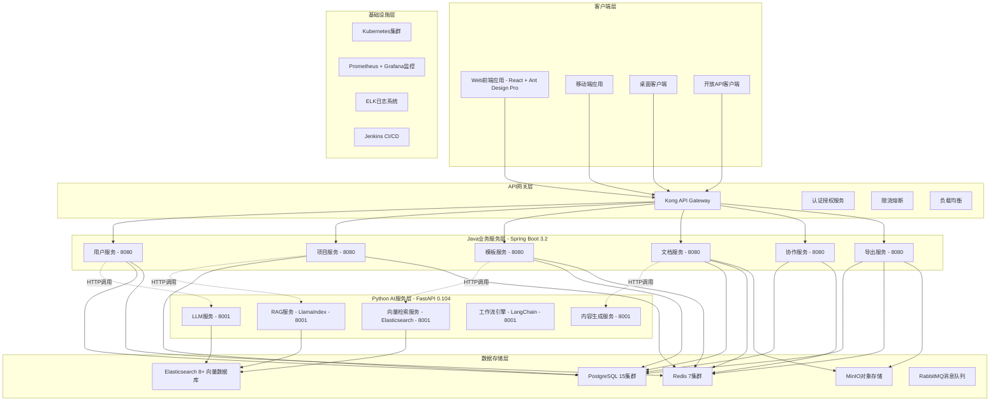

# AI标书智能创作平台 - 技术架构详细实现 - 🏗️ 系统架构深度解析

### 整体架构拓扑图

```mermaid
graph TB
    subgraph "客户端层"
        A[Web前端应用 - React + Ant Design Pro]
        B[移动端应用]
        C[桌面客户端]
        D[开放API客户端]
    end

    subgraph "API网关层"
        E[Kong API Gateway]
        F[认证授权服务]
        G[限流熔断]
        H[负载均衡]
    end

    subgraph "Java业务服务层 - Spring Boot 3.2"
        I[用户服务 - 8080]
        J[项目服务 - 8080]
        K[模板服务 - 8080]
        L[文档服务 - 8080]
        M[协作服务 - 8080]
        N[导出服务 - 8080]
    end

    subgraph "Python AI服务层 - FastAPI 0.104"
        O[LLM服务 - 8001]
        P[RAG服务 - LlamaIndex - 8001]
        Q[向量检索服务 - Elasticsearch - 8001]
        R[工作流引擎 - LangChain - 8001]
        S[内容生成服务 - 8001]
    end

    subgraph "数据存储层"
        T[PostgreSQL 15集群]
        U[Redis 7集群]
        V[MinIO对象存储]
        W[Elasticsearch 8+ 向量数据库]
        X[RabbitMQ消息队列]
    end

    subgraph "基础设施层"
        Y[Kubernetes集群]
        Z[Prometheus + Grafana监控]
        AA[ELK日志系统]
        BB[Jenkins CI/CD]
    end

    A --> E
    B --> E
    C --> E
    D --> E

    E --> I
    E --> J
    E --> K
    E --> L
    E --> M
    E --> N

    I -.HTTP调用.-> O
    J -.HTTP调用.-> P
    K -.HTTP调用.-> Q
    L -.HTTP调用.-> S

    O --> W
    P --> W
    Q --> W

    I --> T
    J --> T
    K --> T
    L --> T
    M --> T
    N --> T

    I --> U
    J --> U
    K --> U
    L --> U
    M --> U
    N --> U

    L --> V
    N --> V
```
