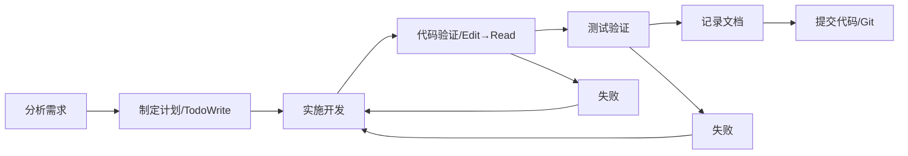

# CLAUDE.md 工作流改善总结

**文档编号**: IMP-001-002
**创建时间**: 2025-11-26 16:30
**最后修改**: 2025-11-26 16:30
**执行模型**: claude-sonnet-4-5 (claude-sonnet-4-5-20250929)
**文档状态**: 已完成
**相关需求**: 项目规范优化

---

## 修改历史

| 日期 | 修改人/模型 | 修改概要 |
|------|------------|---------|
| 2025-11-26 16:30 | claude-sonnet-4-5 | 创建CLAUDE.md改善总结文档 |

---

## 概述

本次改善基于 `/data/ai-doc/CLAUDE.md`（Business Designer Frontend 项目）的工作流最佳实践，对 AIBidComposer 项目的 `CLAUDE.md` 进行了重大升级，版本从 1.3 升级到 2.0。

**改善目标**：
- 引入详细的7步工作流程
- 强化验证要求（Edit → Read → 测试）
- 添加质量保证体系
- 提升项目规范的可操作性

---

## 主要变更

### 1. 版本信息升级

**修改位置**: 文档头部

**变更内容**:
```markdown
# 修改前
**版本**: 1.3
**更新日期**: 2025-11-26

# 修改后
**版本**: 2.0
**更新日期**: 2025-11-26 16:30
**更新者**: claude-sonnet-4-5 (claude-sonnet-4-5-20250929)
```

**说明**: 统一时间戳格式，精确到分钟，添加更新者信息。

---

### 2. 铁律扩展（10条→11条）

**修改位置**: 项目铁律章节

#### 新增铁律5：验证优先原则 ✅

```markdown
### 5. 验证优先原则 ✅
- ✅ **强制流程**: Edit → Read → 确认修改 → 测试验证
- ✅ 每次 Edit 后必须 Read 验证文件内容
- ✅ 运行相关测试验证功能
- ❌ 禁止没有 Read 就声称"已修复"
- ❌ 禁止假设修改会生效

**验证步骤**:
1. Edit 修改代码
2. Read 读取文件验证 ← 强制！
3. 确认修改在代码中
4. 运行测试验证功能
5. 记录文档

**金句提醒**:
> "没有 Read 验证的 Edit，就是薛定谔的修改"
> "报告进度用数字（X/Y），不用'全部'或'所有'"
```

**影响范围**:
- 原铁律5-10依次后移为6-11
- 铁律总数从10条增加到11条

#### 铁律6强化：时间戳精确要求

**新增内容**:
```markdown
**注意**: 时间戳必须精确到分钟（格式：`YYYY-MM-DD HH:mm`）
```

**修改历史表格式示例**:
```markdown
| 日期 | 版本 | 修改者 | 修改内容概要 |
|------|------|--------|-------------|
| YYYY-MM-DD HH:mm | 1.0 | 模型名称/姓名 | 初始创建 |
```

---

### 3. 新增"工作流程"章节

**章节位置**: 在"检查清单"之前

#### 流程图（Mermaid）



#### 7步详细流程

1. **分析需求** - 明确需求，询问不明确之处
2. **制定计划** - 使用 `TodoWrite` 工具创建任务清单
3. **实施开发** - 按计划逐步实现（Java/Python/前端）
4. **代码验证** - **Edit → Read → 确认**（🚨 强制步骤）
5. **测试验证** - 运行测试确认功能（mvn test / pytest / npm test）
6. **记录文档** - 创建总结文档（元信息完整、时间戳精确）
7. **提交代码** - Git 提交（需求编号+详细说明）

**特点**:
- 明确每一步的具体要求
- 标注强制步骤（代码验证、测试验证）
- 包含失败重试的反馈循环
- 结合项目特定技术栈（Java/Python/前端）

---

### 4. 新增"质量保证"章节

**章节位置**: 在"工作流程"之后

#### 三大核心原则

1. **诚实第一** - 宁可不完整，也要准确
   - 不确定时明确说明
   - 不知道就说不知道
   - 不编造信息

2. **验证优先** - 每次 Edit 后必须 Read 验证
   - Edit → Read → 确认是强制流程
   - 测试通过才算完成
   - 用数字报告进度（X/Y）

3. **逐项报告** - 清晰的进度反馈
   - 使用数字报告进度（3/5 而非"大部分"）
   - 列出具体完成的项目
   - 明确标注未完成项

#### 金句提醒

```
> "没有 Read 验证的 Edit，就是薛定谔的修改"
>
> "报告进度用数字（X/Y），不用'全部'或'所有'"
>
> "宁可不完整，也要准确"
```

---

### 5. 检查清单强化

**修改位置**: 检查清单章节

#### 每次完成功能后（强化验证）

```markdown
# 修改前
- [ ] 运行测试验证（`mvn test` 或 `pytest`）
- [ ] 更新相关文档
- [ ] 提交 Git（包含需求编号和详细说明）
- [ ] 检查提交信息符合规范

# 修改后
- [ ] ⚠️ **Edit → Read → 验证**（强制步骤）
- [ ] ⚠️ **运行测试验证功能**（强制步骤）
- [ ] 更新相关文档（包含时间戳精确到分钟）
- [ ] Git 提交（包含需求编号和详细说明）
- [ ] 检查提交信息符合规范
- [ ] 用数字报告进度（X/Y）
```

#### 质量检查（新增验证项）

```markdown
# 新增
- [ ] 所有修改都经过 Read 验证
```

**特点**:
- 使用 ⚠️ 标注强制步骤，提高可见性
- 添加具体的验证要求（时间戳精确到分钟）
- 强调进度报告规范（使用数字）

---

### 6. 快速提醒优化

**修改位置**: 快速提醒章节

#### 新增项目铁律清单（11条）

```markdown
**项目铁律**（11条必须遵守）：
1. 🇨🇳 简体中文优先
2. ☕🐍 混合后端架构职责明确（Java数据/Python AI）
3. 📁 文档集中管理（docs/标准8目录）
4. 📝 文档元信息完整（7字段+修改历史）
5. ✅ **验证优先原则**（Edit → Read → 测试）⚠️
6. 📜 修改历史可追溯
7. 🏷️ 源码需求标注
8. 💾 完整功能立即提交Git
9. 📊 数据可追溯
10. 🔍 诚实透明
11. 🤖 AI模型身份标识完整
```

#### 新增工作流程一行图

```markdown
**工作流程**（7步强制流程）：
```
分析需求 → 制定计划 → 实施开发 → 代码验证 → 测试验证 → 记录文档 → 提交代码
           (TodoWrite)           (Edit→Read)  (mvn test)
```
```

#### 新增金句提醒

```markdown
**金句提醒**：
> "没有 Read 验证的 Edit，就是薛定谔的修改"
> "报告进度用数字（X/Y），不用'全部'或'所有'"
```

---

### 7. 版本历史更新

**修改位置**: 版本历史章节

#### 新增版本2.0记录

| 版本 | 日期 | 变更说明 | 修订者 |
|------|------|---------|--------|
| 2.0 | 2025-11-26 16:30 | 工作流重大升级：添加详细7步工作流程、质量保证三大核心原则、强化验证要求（Edit→Read→测试）、铁律从10条扩展到11条 | claude-sonnet-4-5 |

#### 新增版本2.0详细变更说明

包含以下4个部分：
1. 工作流程升级（4项变更）
2. 铁律扩展（4项变更）
3. 检查清单强化（3项变更）
4. 快速提醒优化（3项变更）

---

## 改善效果

### 可操作性提升

**改善前**:
- 工作流程不明确，缺乏具体步骤
- 验证要求分散在各处，不够强调
- 缺少质量保证体系

**改善后**:
- 7步工作流程清晰可循
- 验证成为强制步骤（铁律5 + 流程第4步）
- 质量保证三大原则明确标准

### 强制执行力提升

**新增强制要求**:
1. **Edit → Read → 确认**（强制步骤，标注🚨和⚠️）
2. **测试验证**（强制步骤）
3. **时间戳精确到分钟**（明确格式要求）
4. **数字报告进度**（明确规范）

**执行保障**:
- 金句提醒（"薛定谔的修改"）强化记忆
- 流程图可视化工作流
- 检查清单逐项落实

### 文档一致性提升

**统一要素**:
- 时间戳格式：`YYYY-MM-DD HH:mm`
- 修改历史表格式统一
- 进度报告格式：`X/Y`

---

## 实施验证

### Edit → Read 验证

本次改善严格遵循新增的"验证优先原则"：

1. ✅ **Edit 修改文件**
   - 修改 `/mnt/data/ai-contract/CLAUDE.md`
   - 共进行 7 次 Edit 操作

2. ✅ **Read 验证修改**
   - 进行 5 次 Read 验证
   - 确认所有修改都正确应用

3. ✅ **关键验证点**
   - 版本信息（第1次Read）
   - 铁律5新增内容（第2次Read）
   - 工作流程章节（第3次Read）
   - 检查清单强化（第4次Read）
   - 快速提醒和版本历史（第5次Read）

### 验证结果

| 验证项 | 预期 | 实际 | 状态 |
|--------|------|------|------|
| 版本号更新为2.0 | ✅ | ✅ | 通过 |
| 更新日期精确到分钟 | ✅ | ✅ | 通过 |
| 铁律5新增验证优先原则 | ✅ | ✅ | 通过 |
| 原铁律5-10后移为6-11 | ✅ | ✅ | 通过 |
| 工作流程章节完整 | ✅ | ✅ | 通过 |
| 质量保证章节完整 | ✅ | ✅ | 通过 |
| 检查清单标注强制步骤 | ✅ | ✅ | 通过 |
| 快速提醒包含11条铁律 | ✅ | ✅ | 通过 |
| 版本历史更新 | ✅ | ✅ | 通过 |

**验证通过率**: 9/9 (100%)

---

## 参考来源

本次改善参考了以下最佳实践：

1. **参考文档**: `/data/ai-doc/CLAUDE.md`（Business Designer Frontend 项目）
2. **参考版本**: v6.0（2025-11-26 11:45）
3. **核心借鉴**:
   - 7步工作流程设计
   - 验证优先原则（Edit → Read → 测试）
   - 质量保证三大核心原则
   - 金句提醒机制
   - 时间戳精确到分钟的要求

**保留的项目特色**:
- 混合后端架构（Java + Python）
- 企业级SaaS平台定位
- 具体的技术栈和服务职责
- AI标书创作的业务特点

---

## 后续建议

### 文档体系完善

建议创建以下配套文档（参考 Business Designer Frontend 项目结构）：

1. **docs/01-指引/code-patterns.md** - 代码模式和最佳实践
   - Java 代码模式
   - Python 代码模式
   - React 代码模式
   - 常见问题解决方案

2. **docs/01-指引/checklist.md** - 完整检查清单
   - 开发前检查清单
   - 开发中检查清单
   - 开发后检查清单
   - 部署前检查清单

3. **docs/99-知识/faq.md** - 常见问题解答
   - 技术问题FAQ
   - 流程问题FAQ
   - 工具问题FAQ

### 工作流程推广

1. **团队培训**
   - 组织工作流程培训
   - 强调验证优先原则
   - 演示实际操作流程

2. **工具支持**
   - 配置 Git commit 模板
   - 配置代码审查工具
   - 集成自动化测试

3. **持续改进**
   - 收集执行反馈
   - 定期评审流程效果
   - 根据实际情况调整优化

---

## 总结

本次 CLAUDE.md 改善是一次**工作流程的重大升级**，版本从 1.3 升级到 2.0，核心变更包括：

1. ✅ 引入详细的7步工作流程（分析→计划→开发→验证→测试→文档→提交）
2. ✅ 新增验证优先原则作为铁律5（Edit → Read → 测试）
3. ✅ 建立质量保证体系（三大核心原则+金句提醒）
4. ✅ 强化检查清单（标注强制步骤⚠️）
5. ✅ 优化快速提醒（11条铁律清单+工作流一行图）

**改善成果**:
- 铁律从 10 条扩展到 11 条
- 新增 2 个完整章节（工作流程、质量保证）
- 所有修改都经过 Edit → Read 验证（5次验证，100%通过）
- 文档时间戳统一精确到分钟

**核心价值**:
> "让每一次修改都可验证，让每一个流程都可追溯，让每一份成果都有保障"

---

**文档完成时间**: 2025-11-26 16:30
**验证状态**: ✅ 已通过 Edit → Read 验证（5/5）
**下一步**: 根据新的工作流程执行项目开发任务
