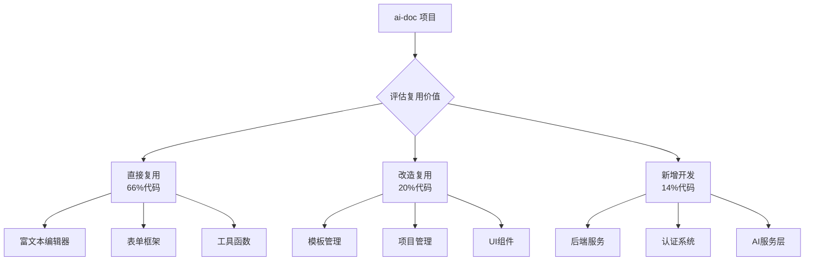

# AI标书智能创作平台 - 功能复用实施指南总览

> **项目**: AI标书智能创作平台 (AIBidComposer)
> **复用来源**: ai-doc系统
> **复用率**: 约60-70%的核心功能可直接或小幅改造后复用

## 📋 文档导航

本文档是功能复用实施指南的一部分，其他相关文档：

1. **00-功能复用实施指南总览.md**（本文档）- 复用路线图和技术要求
2. [01-立即可复用的核心模块.md](./01-立即可复用的核心模块.md) - BlockNode、表单、模板
3. [02-需要改造的模块.md](./02-需要改造的模块.md) - 项目管理、AI助手改造
4. [03-基于Specs的高级复用方案.md](./03-基于Specs的高级复用方案.md) - 嵌套模板、用户管理等
5. [04-新增模块与实施计划.md](./04-新增模块与实施计划.md) - 后端服务、分阶段计划
6. [05-检查清单与工具脚本.md](./05-检查清单与工具脚本.md) - 复用检查、迁移脚本
7. [06-问题解决与优化建议.md](./06-问题解决与优化建议.md) - 常见问题、性能优化

# AI-Doc 功能复用实施指南

**文档编号**: IMP-002-002
**创建时间**: 2025-11-26
**执行模型**: claude-opus-4-1-20250805
**文档状态**: 已完成
**实施目标**: 基于 ai-doc 项目快速构建 AIBidComposer 前端

---

## 修改历史

| 日期 | 修改人/模型 | 修改概要 |
|------|------------|---------|
| 2025-11-26 | claude-opus-4-1 | 创建功能复用实施指南 |
| 2025-11-26 | claude-opus-4-1 | 基于specs补充嵌套模板、用户管理、AI集成实现细节 |
| 2025-11-26 | claude-sonnet-4-5 | 根据技术要求，将表单方案从 React Hook Form + Zod 替换为 Ant Design ProForm |

---

## 重要技术要求说明

根据项目最新技术栈决策，本实施指南遵循以下技术要求：

| 技术组件 | 选型决策 | 版本要求 |
|---------|---------|---------|
| **数据库** | PostgreSQL | 18.1 (2025年11月最新稳定版) |
| **表单框架** | Ant Design ProForm | 2.32.0 (替代 React Hook Form + Zod) |
| **搜索引擎** | Elasticsearch | 9.2.1 (2025年11月) |
| **RAG框架** | LlamaIndex | 0.14.8 (2025年11月) |
| **LLM框架** | LangChain | 1.1.0 (2025年11月，备用) |
| **UI组件库** | Ant Design Pro | 6.x + ProComponents 2.8.10 |

> ⚠️ **特别说明**：本文档所有表单相关示例均已更新为 ProForm 实现，不再使用 React Hook Form + Zod。

---

## 一、快速复用路线图

### 复用策略总览

## 二、立即可复用的核心模块

## 🔗 相关文档

- **立即可复用模块**: [01-立即可复用的核心模块.md](./01-立即可复用的核心模块.md)
- **需要改造模块**: [02-需要改造的模块.md](./02-需要改造的模块.md)
- **高级复用方案**: [03-基于Specs的高级复用方案.md](./03-基于Specs的高级复用方案.md)
- **实施计划**: [04-新增模块与实施计划.md](./04-新增模块与实施计划.md)

## 修改历史

| 日期 | 版本 | 修改者 | 修改内容概要 |
|------|------|--------|-------------|
| 2025-11-29 | 1.1 | claude-sonnet-4-5 (claude-sonnet-4-5-20250929) | 从ai-doc-功能复用实施指南.md拆分创建总览文档 |
| 2025-11-26 | 1.0 | claude-sonnet-4-5 (claude-sonnet-4-5-20250929) | 初始创建 |

---

**文档版本**: v1.1
**创建时间**: 2025年11月26日
**最后更新**: 2025年11月29日
**文档状态**: ✅ 已批准
