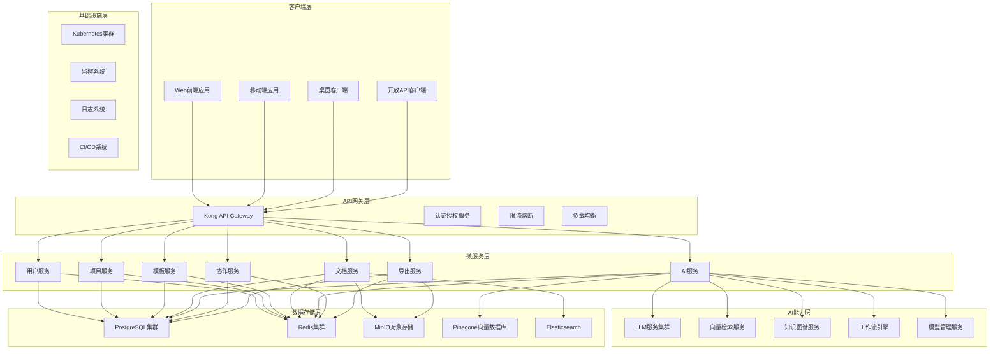

# AI标书智能创作平台 - 技术架构详细实现

## 🏗️ 系统架构深度解析

### 整体架构拓扑图


## 🔧 前端架构详细实现

### 组件架构设计
```typescript
// 组件层次结构详细设计
src/
├── components/                    # 通用组件库
│   ├── ui/                       # 基础UI组件
│   │   ├── Button/
│   │   │   ├── index.tsx
│   │   │   ├── Button.styles.ts
│   │   │   ├── Button.types.ts
│   │   │   └── Button.stories.tsx
│   │   ├── Input/
│   │   ├── Modal/
│   │   ├── Table/
│   │   └── ...
│   ├── forms/                    # 表单组件
│   │   ├── FormField/
│   │   ├── FormValidation/
│   │   └── FormBuilder/
│   ├── layout/                   # 布局组件
│   │   ├── Header/
│   │   ├── Sidebar/
│   │   ├── Footer/
│   │   └── MainLayout/
│   └── charts/                   # 图表组件
│       ├── LineChart/
│       ├── BarChart/
│       └── PieChart/
├── features/                     # 功能模块
│   ├── auth/                     # 认证模块
│   │   ├── components/
│   │   ├── hooks/
│   │   ├── services/
│   │   └── types/
│   ├── projects/                 # 项目管理
│   │   ├── components/
│   │   │   ├── ProjectList/
│   │   │   ├── ProjectDetail/
│   │   │   ├── ProjectForm/
│   │   │   └── ProjectDashboard/
│   │   ├── hooks/
│   │   │   ├── useProjects.ts
│   │   │   ├── useProjectDetail.ts
│   │   │   └── useProjectForm.ts
│   │   ├── services/
│   │   │   ├── projectApi.ts
│   │   │   └── projectUtils.ts
│   │   └── types/
│   │       ├── project.types.ts
│   │       └── projectApi.types.ts
│   ├── templates/                # 模板管理
│   ├── ai-assistant/             # AI助手
│   ├── documents/                # 文档管理
│   ├── collaboration/            # 协作功能
│   └── export/                   # 导出功能
├── hooks/                        # 全局Hooks
│   ├── useAuth.ts
│   ├── useApi.ts
│   ├── useLocalStorage.ts
│   └── useWebSocket.ts
├── services/                     # API服务
│   ├── api.ts                    # API基础配置
│   ├── auth.ts                   # 认证服务
│   ├── projects.ts               # 项目服务
│   ├── templates.ts              # 模板服务
│   └── ai.ts                     # AI服务
├── stores/                       # 状态管理
│   ├── authStore.ts
│   ├── projectStore.ts
│   ├── uiStore.ts
│   └── index.ts
├── utils/                        # 工具函数
│   ├── constants.ts
│   ├── helpers.ts
│   ├── validators.ts
│   └── formatters.ts
├── types/                        # TypeScript类型定义
│   ├── api.types.ts
│   ├── auth.types.ts
│   ├── project.types.ts
│   └── common.types.ts
└── styles/                       # 样式文件
    ├── globals.css
    ├── variables.css
    └── components/
```

### 状态管理详细实现
```typescript
// 使用Zustand进行状态管理
import { create } from 'zustand';
import { devtools } from 'zustand/middleware';

// 认证状态管理
interface AuthState {
  user: User | null;
  token: string | null;
  isAuthenticated: boolean;
  permissions: Permission[];
  login: (credentials: LoginCredentials) => Promise<void>;
  logout: () => void;
  refreshToken: () => Promise<void>;
  updateProfile: (profile: Partial<User>) => Promise<void>;
}

export const useAuthStore = create<AuthState>()(
  devtools(
    (set, get) => ({
      user: null,
      token: null,
      isAuthenticated: false,
      permissions: [],

      login: async (credentials) => {
        try {
          const response = await authService.login(credentials);
          const { user, token, permissions } = response.data;

          localStorage.setItem('token', token);

          set({
            user,
            token,
            isAuthenticated: true,
            permissions,
          });
        } catch (error) {
          throw new Error('Login failed');
        }
      },

      logout: () => {
        localStorage.removeItem('token');
        set({
          user: null,
          token: null,
          isAuthenticated: false,
          permissions: [],
        });
      },

      refreshToken: async () => {
        try {
          const response = await authService.refreshToken();
          const { token } = response.data;

          localStorage.setItem('token', token);
          set({ token });
        } catch (error) {
          get().logout();
        }
      },

      updateProfile: async (profile) => {
        const currentUser = get().user;
        if (!currentUser) return;

        const updatedUser = await authService.updateProfile(profile);
        set({ user: updatedUser.data });
      },
    }),
    { name: 'auth-store' }
  )
);

// 项目状态管理
interface ProjectState {
  projects: Project[];
  currentProject: Project | null;
  loading: boolean;
  error: string | null;
  filters: ProjectFilters;
  pagination: Pagination;

  // Actions
  fetchProjects: (params?: FetchProjectsParams) => Promise<void>;
  fetchProject: (id: string) => Promise<void>;
  createProject: (project: CreateProjectData) => Promise<void>;
  updateProject: (id: string, project: UpdateProjectData) => Promise<void>;
  deleteProject: (id: string) => Promise<void>;
  setFilters: (filters: Partial<ProjectFilters>) => void;
  setPagination: (pagination: Partial<Pagination>) => void;
}

export const useProjectStore = create<ProjectState>()(
  devtools(
    (set, get) => ({
      projects: [],
      currentProject: null,
      loading: false,
      error: null,
      filters: {},
      pagination: { page: 1, limit: 20, total: 0 },

      fetchProjects: async (params) => {
        set({ loading: true, error: null });

        try {
          const response = await projectApi.getProjects({
            ...get().filters,
            ...get().pagination,
            ...params,
          });

          set({
            projects: response.data.projects,
            pagination: response.data.pagination,
            loading: false,
          });
        } catch (error) {
          set({
            error: error.message,
            loading: false,
          });
        }
      },

      fetchProject: async (id) => {
        set({ loading: true, error: null });

        try {
          const response = await projectApi.getProject(id);
          set({
            currentProject: response.data,
            loading: false,
          });
        } catch (error) {
          set({
            error: error.message,
            loading: false,
          });
        }
      },

      createProject: async (project) => {
        try {
          const response = await projectApi.createProject(project);
          const newProject = response.data;

          set((state) => ({
            projects: [newProject, ...state.projects],
          }));

          return newProject;
        } catch (error) {
          set({ error: error.message });
          throw error;
        }
      },

      updateProject: async (id, project) => {
        try {
          const response = await projectApi.updateProject(id, project);
          const updatedProject = response.data;

          set((state) => ({
            projects: state.projects.map((p) =>
              p.id === id ? updatedProject : p
            ),
            currentProject:
              state.currentProject?.id === id
                ? updatedProject
                : state.currentProject,
          }));

          return updatedProject;
        } catch (error) {
          set({ error: error.message });
          throw error;
        }
      },

      deleteProject: async (id) => {
        try {
          await projectApi.deleteProject(id);

          set((state) => ({
            projects: state.projects.filter((p) => p.id !== id),
            currentProject:
              state.currentProject?.id === id ? null : state.currentProject,
          }));
        } catch (error) {
          set({ error: error.message });
          throw error;
        }
      },

      setFilters: (filters) => {
        set((state) => ({
          filters: { ...state.filters, ...filters },
        }));
      },

      setPagination: (pagination) => {
        set((state) => ({
          pagination: { ...state.pagination, ...pagination },
        }));
      },
    }),
    { name: 'project-store' }
  )
);
```

### 实时协作实现
```typescript
// 使用YJS实现实时协作
import * as Y from 'yjs';
import { WebsocketProvider } from 'y-websocket';
import { BlockNoteEditor } from '@blocknote/core';

// 协作文档管理
class CollaborationManager {
  private doc: Y.Doc;
  private provider: WebsocketProvider;
  private editor: BlockNoteEditor | null = null;

  constructor(projectId: string, documentId: string) {
    // 初始化YJS文档
    this.doc = new Y.Doc();

    // 连接到WebSocket服务器
    this.provider = new WebsocketProvider(
      `ws://localhost:1234`,
      `${projectId}-${documentId}`,
      this.doc
    );

    // 设置协作事件监听
    this.setupEventListeners();
  }

  private setupEventListeners() {
    // 用户连接/断开事件
    this.provider.awareness.on('change', () => {
      const users = this.provider.awareness.getStates();
      this.updateUserList(users);
    });

    // 同步状态事件
    this.provider.on('sync', (synced: boolean) => {
      if (synced) {
        console.log('Document synchronized');
      }
    });

    // 连接状态事件
    this.provider.on('status', (status: 'connected' | 'disconnected') => {
      console.log('Connection status:', status);
    });
  }

  // 初始化编辑器
  initializeEditor(container: HTMLElement) {
    // 获取共享的YJS文本
    const yText = this.doc.getText('content');

    // 创建BlockNote编辑器
    this.editor = new BlockNoteEditor({
      element: container,
      onTextChange: () => {
        // 编辑器内容变化时同步到YJS
        const content = this.editor?.getContent();
        if (content) {
          yText.insert(0, JSON.stringify(content));
        }
      },
    });

    // 监听YJS文本变化
    yText.observe(() => {
      const content = yText.toString();
      if (content && this.editor) {
        this.editor.setContent(JSON.parse(content));
      }
    });

    return this.editor;
  }

  // 添加评论
  addComment(position: number, text: string, userId: string) {
    const comments = this.doc.getMap('comments');
    const commentId = Date.now().toString();

    comments.set(commentId, {
      id: commentId,
      position,
      text,
      userId,
      timestamp: new Date().toISOString(),
      replies: [],
    });
  }

  // 处理用户光标位置
  updateCursorPosition(userId: string, position: number) {
    this.provider.awareness.setLocalStateField('cursor', {
      userId,
      position,
      timestamp: Date.now(),
    });
  }

  // 获取在线用户列表
  getOnlineUsers() {
    const users = this.provider.awareness.getStates();
    return Array.from(users.entries()).map(([userId, state]) => ({
      userId,
      name: state.name,
      cursor: state.cursor,
      color: state.color,
    }));
  }

  // 销毁协作管理器
  destroy() {
    this.editor?.destroy();
    this.provider.destroy();
    this.doc.destroy();
  }

  private updateUserList(users: Map<number, any>) {
    // 更新UI中的用户列表
    const onlineUsers = Array.from(users.entries()).map(([userId, state]) => ({
      userId,
      name: state.name,
      color: state.color,
    }));

    // 触发用户列表更新事件
    this.onUserListChange?.(onlineUsers);
  }

  public onUserListChange?: (users: any[]) => void;
}

// React Hook封装
export const useCollaboration = (projectId: string, documentId: string) => {
  const [collaborationManager, setCollaborationManager] = useState<CollaborationManager | null>(null);
  const [onlineUsers, setOnlineUsers] = useState<any[]>([]);

  useEffect(() => {
    const manager = new CollaborationManager(projectId, documentId);

    manager.onUserListChange = (users) => {
      setOnlineUsers(users);
    };

    setCollaborationManager(manager);

    return () => {
      manager.destroy();
    };
  }, [projectId, documentId]);

  return {
    collaborationManager,
    onlineUsers,
  };
};
```

## ⚙️ 后端服务详细实现

### 微服务架构实现
```python
# 用户服务实现
from fastapi import FastAPI, Depends, HTTPException, status
from fastapi.security import HTTPBearer, HTTPAuthorizationCredentials
from sqlalchemy.orm import Session
from typing import List, Optional
import redis
import jwt
from datetime import datetime, timedelta

app = FastAPI(title="User Service", version="1.0.0")

# 依赖注入
security = HTTPBearer()
redis_client = redis.Redis(host='redis', port=6379, db=0)

# 数据库模型
from sqlalchemy import Column, String, DateTime, Boolean, Text
from sqlalchemy.ext.declarative import declarative_base
from sqlalchemy.dialects.postgresql import UUID
import uuid

Base = declarative_base()

class User(Base):
    __tablename__ = "users"

    id = Column(UUID(as_uuid=True), primary_key=True, default=uuid.uuid4)
    username = Column(String(50), unique=True, nullable=False, index=True)
    email = Column(String(100), unique=True, nullable=False, index=True)
    password_hash = Column(String(255), nullable=False)
    full_name = Column(String(100))
    company_id = Column(UUID(as_uuid=True), nullable=True)
    role = Column(String(20), nullable=False, default='user')
    is_active = Column(Boolean, default=True)
    is_verified = Column(Boolean, default=False)
    created_at = Column(DateTime, default=datetime.utcnow)
    updated_at = Column(DateTime, default=datetime.utcnow, onupdate=datetime.utcnow)
    last_login = Column(DateTime, nullable=True)

    # 个人资料
    avatar_url = Column(String(500))
    phone = Column(String(20))
    department = Column(String(100))
    position = Column(String(100))
    bio = Column(Text)

# Pydantic模型
from pydantic import BaseModel, EmailStr, validator
from typing import Optional

class UserBase(BaseModel):
    username: str
    email: EmailStr
    full_name: Optional[str] = None
    company_id: Optional[str] = None
    role: str = 'user'

class UserCreate(UserBase):
    password: str

    @validator('password')
    def validate_password(cls, v):
        if len(v) < 8:
            raise ValueError('Password must be at least 8 characters long')
        return v

class UserUpdate(BaseModel):
    full_name: Optional[str] = None
    avatar_url: Optional[str] = None
    phone: Optional[str] = None
    department: Optional[str] = None
    position: Optional[str] = None
    bio: Optional[str] = None

class UserResponse(UserBase):
    id: str
    is_active: bool
    is_verified: bool
    created_at: datetime
    last_login: Optional[datetime] = None

    class Config:
        orm_mode = True

class LoginRequest(BaseModel):
    username: str
    password: str

class LoginResponse(BaseModel):
    access_token: str
    refresh_token: str
    token_type: str = 'bearer'
    expires_in: int
    user: UserResponse

# 数据库依赖
def get_db():
    db = SessionLocal()
    try:
        yield db
    finally:
        db.close()

# 认证依赖
async def get_current_user(
    credentials: HTTPAuthorizationCredentials = Depends(security),
    db: Session = Depends(get_db)
):
    try:
        payload = jwt.decode(
            credentials.credentials,
            SECRET_KEY,
            algorithms=[ALGORITHM]
        )
        user_id: str = payload.get("sub")
        if user_id is None:
            raise HTTPException(
                status_code=status.HTTP_401_UNAUTHORIZED,
                detail="Invalid authentication credentials"
            )
    except jwt.PyJWTError:
        raise HTTPException(
            status_code=status.HTTP_401_UNAUTHORIZED,
            detail="Invalid authentication credentials"
        )

    user = db.query(User).filter(User.id == user_id).first()
    if user is None:
        raise HTTPException(
            status_code=status.HTTP_401_UNAUTHORIZED,
            detail="User not found"
        )

    return user

# 用户注册
@app.post("/register", response_model=UserResponse)
async def register(user_data: UserCreate, db: Session = Depends(get_db)):
    # 检查用户名是否已存在
    existing_user = db.query(User).filter(
        (User.username == user_data.username) | (User.email == user_data.email)
    ).first()

    if existing_user:
        raise HTTPException(
            status_code=status.HTTP_400_BAD_REQUEST,
            detail="Username or email already registered"
        )

    # 创建新用户
    hashed_password = hash_password(user_data.password)
    db_user = User(
        username=user_data.username,
        email=user_data.email,
        password_hash=hashed_password,
        full_name=user_data.full_name,
        company_id=user_data.company_id,
        role=user_data.role
    )

    db.add(db_user)
    db.commit()
    db.refresh(db_user)

    # 发送验证邮件
    await send_verification_email(db_user.email)

    return db_user

# 用户登录
@app.post("/login", response_model=LoginResponse)
async def login(login_data: LoginRequest, db: Session = Depends(get_db)):
    # 验证用户凭据
    user = authenticate_user(db, login_data.username, login_data.password)
    if not user:
        raise HTTPException(
            status_code=status.HTTP_401_UNAUTHORIZED,
            detail="Invalid username or password"
        )

    if not user.is_active:
        raise HTTPException(
            status_code=status.HTTP_400_BAD_REQUEST,
            detail="Inactive user"
        )

    # 生成访问令牌
    access_token_expires = timedelta(minutes=ACCESS_TOKEN_EXPIRE_MINUTES)
    access_token = create_access_token(
        data={"sub": str(user.id)}, expires_delta=access_token_expires
    )

    # 生成刷新令牌
    refresh_token_expires = timedelta(days=REFRESH_TOKEN_EXPIRE_DAYS)
    refresh_token = create_refresh_token(
        data={"sub": str(user.id)}, expires_delta=refresh_token_expires
    )

    # 更新最后登录时间
    user.last_login = datetime.utcnow()
    db.commit()

    # 缓存用户信息
    cache_user_info(user.id, user)

    return {
        "access_token": access_token,
        "refresh_token": refresh_token,
        "token_type": "bearer",
        "expires_in": ACCESS_TOKEN_EXPIRE_MINUTES * 60,
        "user": user
    }

# 获取当前用户信息
@app.get("/me", response_model=UserResponse)
async def get_current_user_info(current_user: User = Depends(get_current_user)):
    return current_user

# 更新用户信息
@app.put("/me", response_model=UserResponse)
async def update_user_info(
    user_update: UserUpdate,
    current_user: User = Depends(get_current_user),
    db: Session = Depends(get_db)
):
    # 更新用户信息
    for field, value in user_update.dict(exclude_unset=True).items():
        setattr(current_user, field, value)

    current_user.updated_at = datetime.utcnow()
    db.commit()
    db.refresh(current_user)

    # 更新缓存
    cache_user_info(current_user.id, current_user)

    return current_user

# 刷新令牌
@app.post("/refresh")
async def refresh_token(refresh_token: str, db: Session = Depends(get_db)):
    try:
        payload = jwt.decode(refresh_token, REFRESH_SECRET_KEY, algorithms=[ALGORITHM])
        user_id: str = payload.get("sub")
        if user_id is None:
            raise HTTPException(
                status_code=status.HTTP_401_UNAUTHORIZED,
                detail="Invalid refresh token"
            )
    except jwt.PyJWTError:
        raise HTTPException(
            status_code=status.HTTP_401_UNAUTHORIZED,
            detail="Invalid refresh token"
        )

    user = db.query(User).filter(User.id == user_id).first()
    if not user or not user.is_active:
        raise HTTPException(
            status_code=status.HTTP_401_UNAUTHORIZED,
            detail="User not found or inactive"
        )

    # 生成新的访问令牌
    access_token_expires = timedelta(minutes=ACCESS_TOKEN_EXPIRE_MINUTES)
    access_token = create_access_token(
        data={"sub": str(user.id)}, expires_delta=access_token_expires
    )

    return {
        "access_token": access_token,
        "token_type": "bearer",
        "expires_in": ACCESS_TOKEN_EXPIRE_MINUTES * 60
    }

# 工具函数
import bcrypt
from passlib.context import CryptContext

pwd_context = CryptContext(schemes=["bcrypt"], deprecated="auto")

def hash_password(password: str) -> str:
    return pwd_context.hash(password)

def verify_password(plain_password: str, hashed_password: str) -> bool:
    return pwd_context.verify(plain_password, hashed_password)

def authenticate_user(db: Session, username: str, password: str) -> Optional[User]:
    user = db.query(User).filter(
        (User.username == username) | (User.email == username)
    ).first()

    if not user or not verify_password(password, user.password_hash):
        return None

    return user

def create_access_token(data: dict, expires_delta: Optional[timedelta] = None):
    to_encode = data.copy()
    if expires_delta:
        expire = datetime.utcnow() + expires_delta
    else:
        expire = datetime.utcnow() + timedelta(minutes=15)

    to_encode.update({"exp": expire})
    encoded_jwt = jwt.encode(to_encode, SECRET_KEY, algorithm=ALGORITHM)
    return encoded_jwt

def create_refresh_token(data: dict, expires_delta: Optional[timedelta] = None):
    to_encode = data.copy()
    if expires_delta:
        expire = datetime.utcnow() + expires_delta
    else:
        expire = datetime.utcnow() + timedelta(days=7)

    to_encode.update({"exp": expire})
    encoded_jwt = jwt.encode(to_encode, REFRESH_SECRET_KEY, algorithm=ALGORITHM)
    return encoded_jwt

def cache_user_info(user_id: str, user: User):
    user_data = {
        "id": str(user.id),
        "username": user.username,
        "email": user.email,
        "full_name": user.full_name,
        "role": user.role,
        "company_id": str(user.company_id) if user.company_id else None,
        "is_active": user.is_active,
        "is_verified": user.is_verified,
    }

    redis_client.setex(
        f"user:{user_id}",
        3600,  # 1小时过期
        json.dumps(user_data)
    )

async def send_verification_email(email: str):
    # 实现邮件发送逻辑
    pass

# 配置常量
SECRET_KEY = "your-secret-key"
REFRESH_SECRET_KEY = "your-refresh-secret-key"
ALGORITHM = "HS256"
ACCESS_TOKEN_EXPIRE_MINUTES = 30
REFRESH_TOKEN_EXPIRE_DAYS = 7
```

### AI服务详细实现
```python
# AI服务实现
from fastapi import FastAPI, Depends, HTTPException, BackgroundTasks
from pydantic import BaseModel
from typing import List, Dict, Any, Optional
import openai
import langchain
from langchain.chat_models import ChatOpenAI
from langchain.chains import LLMChain
from langchain.prompts import PromptTemplate
from langchain.embeddings import OpenAIEmbeddings
from langchain.vectorstores import Pinecone
import pinecone
import asyncio
from concurrent.futures import ThreadPoolExecutor
import hashlib

app = FastAPI(title="AI Service", version="1.0.0")

# 配置
OPENAI_API_KEY = "your-openai-api-key"
PINECONE_API_KEY = "your-pinecone-api-key"
PINECONE_ENVIRONMENT = "your-pinecone-environment"

# 初始化客户端
openai.api_key = OPENAI_API_KEY
pinecone.init(api_key=PINECONE_API_KEY, environment=PINECONE_ENVIRONMENT)

# 线程池
executor = ThreadPoolExecutor(max_workers=10)

# 数据模型
class DocumentAnalysisRequest(BaseModel):
    document_id: str
    document_content: str
    document_type: str  # 'tender', 'proposal', 'contract'
    analysis_options: List[str] = ['requirements', 'risks', 'opportunities']

class ContentGenerationRequest(BaseModel):
    project_id: str
    template_id: str
    requirements: Dict[str, Any]
    company_profile: Dict[str, Any]
    generation_options: Dict[str, Any] = {}

class MatchingAnalysisRequest(BaseModel):
    project_id: str
    requirements: List[str]
    company_capabilities: Dict[str, Any]
    matching_criteria: List[str] = ['technical', 'experience', 'resources']

class DocumentAnalysisResponse(BaseModel):
    document_id: str
    analysis_results: Dict[str, Any]
    confidence_score: float
    processing_time: float

class ContentGenerationResponse(BaseModel):
    generated_content: Dict[str, Any]
    quality_score: float
    suggestions: List[str]
    processing_time: float

# 招标文档分析
class TenderDocumentAnalyzer:
    def __init__(self):
        self.llm = ChatOpenAI(temperature=0.1, model_name="gpt-4")
        self.embeddings = OpenAIEmbeddings()

        # 初始化提示模板
        self.requirements_prompt = PromptTemplate(
            input_variables=["document_content"],
            template="""
            你是一位专业的招标文件分析专家。请仔细分析以下招标文件内容，提取关键信息：

            招标文件内容：
            {document_content}

            请按以下格式输出分析结果：
            1. 项目基本信息
            2. 技术要求
            3. 商务条款
            4. 评分标准
            5. 风险因素
            6. 投标建议

            请确保分析结果准确、完整、有价值。
            """
        )

        self.risk_analysis_prompt = PromptTemplate(
            input_variables=["document_content"],
            template="""
            请分析以下招标文件中的潜在风险：

            招标文件内容：
            {document_content}

            请识别并分类以下风险：
            1. 技术风险
            2. 商务风险
            3. 合规风险
            4. 时间风险
            5. 成本风险

            对每个风险，请提供：
            - 风险描述
            - 影响程度（高/中/低）
            - 发生概率（高/中/低）
            - 应对建议
            """
        )

    async def analyze_document(self, request: DocumentAnalysisRequest) -> DocumentAnalysisResponse:
        start_time = time.time()

        try:
            # 并行执行多个分析任务
            tasks = []

            if 'requirements' in request.analysis_options:
                tasks.append(self._extract_requirements(request.document_content))

            if 'risks' in request.analysis_options:
                tasks.append(self._analyze_risks(request.document_content))

            if 'opportunities' in request.analysis_options:
                tasks.append(self._identify_opportunities(request.document_content))

            # 等待所有任务完成
            results = await asyncio.gather(*tasks)

            # 合并分析结果
            analysis_results = {
                "document_id": request.document_id,
                "document_type": request.document_type,
                "analysis_timestamp": datetime.utcnow().isoformat(),
            }

            for i, option in enumerate(request.analysis_options):
                analysis_results[option] = results[i]

            # 计算置信度分数
            confidence_score = self._calculate_confidence_score(analysis_results)

            processing_time = time.time() - start_time

            return DocumentAnalysisResponse(
                document_id=request.document_id,
                analysis_results=analysis_results,
                confidence_score=confidence_score,
                processing_time=processing_time
            )

        except Exception as e:
            raise HTTPException(status_code=500, detail=f"Analysis failed: {str(e)}")

    async def _extract_requirements(self, content: str) -> Dict[str, Any]:
        """提取招标要求"""
        chain = LLMChain(llm=self.llm, prompt=self.requirements_prompt)

        loop = asyncio.get_event_loop()
        result = await loop.run_in_executor(
            executor,
            chain.run,
            {"document_content": content[:4000]}  # 限制内容长度
        )

        return {
            "requirements_analysis": result,
            "extracted_date": datetime.utcnow().isoformat()
        }

    async def _analyze_risks(self, content: str) -> Dict[str, Any]:
        """分析风险因素"""
        chain = LLMChain(llm=self.llm, prompt=self.risk_analysis_prompt)

        loop = asyncio.get_event_loop()
        result = await loop.run_in_executor(
            executor,
            chain.run,
            {"document_content": content[:4000]}
        )

        return {
            "risk_analysis": result,
            "analysis_date": datetime.utcnow().isoformat()
        }

    async def _identify_opportunities(self, content: str) -> Dict[str, Any]:
        """识别商业机会"""
        opportunity_prompt = PromptTemplate(
            input_variables=["document_content"],
            template="""
            请分析以下招标文件中的商业机会：

            招标文件内容：
            {document_content}

            请识别：
            1. 市场机会
            2. 技术创新机会
            3. 合作机会
            4. 长期合作可能性
            5. 差异化竞争机会

            对每个机会，请提供：
            - 机会描述
            - 潜在价值
            - 实现难度
            - 建议策略
            """
        )

        chain = LLMChain(llm=self.llm, prompt=opportunity_prompt)

        loop = asyncio.get_event_loop()
        result = await loop.run_in_executor(
            executor,
            chain.run,
            {"document_content": content[:4000]}
        )

        return {
            "opportunity_analysis": result,
            "analysis_date": datetime.utcnow().isoformat()
        }

    def _calculate_confidence_score(self, results: Dict[str, Any]) -> float:
        """计算分析结果的置信度分数"""
        # 基于多个因素计算置信度
        factors = {
            "completeness": len(results) / 3.0,  # 假设最多3个分析维度
            "content_length": sum(len(str(v)) for v in results.values()) / 1000.0,
            "structure_quality": 0.8  # 基于结果结构的质量评分
        }

        # 加权平均
        weights = {"completeness": 0.4, "content_length": 0.3, "structure_quality": 0.3}

        confidence_score = sum(
            factors[factor] * weights[factor]
            for factor in factors
        )

        return min(max(confidence_score, 0.0), 1.0)

# 内容生成器
class ContentGenerator:
    def __init__(self):
        self.llm = ChatOpenAI(temperature=0.3, model_name="gpt-4")

        # 初始化各种内容生成的提示模板
        self.executive_summary_prompt = PromptTemplate(
            input_variables=["requirements", "company_profile", "project_info"],
            template="""
            基于以下信息生成一份优秀的执行摘要：

            项目要求：
            {requirements}

            公司信息：
            {company_profile}

            项目信息：
            {project_info}

            请生成一份专业、有说服力的执行摘要，包括：
            1. 项目理解
            2. 解决方案概述
            3. 公司优势
            4. 价值主张
            5. 成功保证

            要求：
            - 语言专业、简洁
            - 突出核心竞争力
            - 体现客户价值
            - 长度控制在500-800字
            """
        )

        self.technical_proposal_prompt = PromptTemplate(
            input_variables=["requirements", "company_capabilities", "technical_approach"],
            template="""
            基于以下信息生成技术方案：

            技术要求：
            {requirements}

            公司技术能力：
            {company_capabilities}

            技术路线：
            {technical_approach}

            请生成详细的技术方案，包括：
            1. 技术架构设计
            2. 实施方法论
            3. 关键技术点
            4. 质量保证措施
            5. 风险控制方案
            6. 创新亮点

            要求：
            - 技术方案要具体可行
            - 体现公司技术优势
            - 解决客户核心关切
            - 具有可操作性
            """
        )

    async def generate_content(self, request: ContentGenerationRequest) -> ContentGenerationResponse:
        """生成标书内容"""
        start_time = time.time()

        try:
            # 准备生成参数
            generation_params = {
                "requirements": request.requirements,
                "company_profile": request.company_profile,
                "project_info": request.generation_options.get("project_info", {}),
                "company_capabilities": request.company_profile.get("capabilities", {}),
                "technical_approach": request.generation_options.get("technical_approach", "")
            }

            # 并行生成各个章节
            tasks = [
                self._generate_executive_summary(generation_params),
                self._generate_technical_proposal(generation_params),
                self._generate_management_approach(generation_params),
                self._generate_pricing_proposal(generation_params)
            ]

            results = await asyncio.gather(*tasks)

            # 组装生成的内容
            generated_content = {
                "executive_summary": results[0],
                "technical_proposal": results[1],
                "management_approach": results[2],
                "pricing_proposal": results[3],
                "generation_metadata": {
                    "project_id": request.project_id,
                    "template_id": request.template_id,
                    "generation_timestamp": datetime.utcnow().isoformat(),
                    "generation_options": request.generation_options
                }
            }

            # 质量评估
            quality_score = await self._assess_content_quality(generated_content)

            # 生成改进建议
            suggestions = await self._generate_improvement_suggestions(generated_content, quality_score)

            processing_time = time.time() - start_time

            return ContentGenerationResponse(
                generated_content=generated_content,
                quality_score=quality_score,
                suggestions=suggestions,
                processing_time=processing_time
            )

        except Exception as e:
            raise HTTPException(status_code=500, detail=f"Content generation failed: {str(e)}")

    async def _generate_executive_summary(self, params: Dict[str, Any]) -> str:
        """生成执行摘要"""
        chain = LLMChain(llm=self.llm, prompt=self.executive_summary_prompt)

        loop = asyncio.get_event_loop()
        result = await loop.run_in_executor(
            executor,
            chain.run,
            params
        )

        return result

    async def _generate_technical_proposal(self, params: Dict[str, Any]) -> str:
        """生成技术方案"""
        chain = LLMChain(llm=self.llm, prompt=self.technical_proposal_prompt)

        loop = asyncio.get_event_loop()
        result = await loop.run_in_executor(
            executor,
            chain.run,
            params
        )

        return result

    async def _generate_management_approach(self, params: Dict[str, Any]) -> str:
        """生成管理方案"""
        management_prompt = PromptTemplate(
            input_variables=["company_profile", "project_info"],
            template="""
            基于以下信息生成项目管理方案：

            公司管理能力：
            {company_profile}

            项目信息：
            {project_info}

            请生成详细的项目管理方案，包括：
            1. 项目组织架构
            2. 团队配置
            3. 沟通机制
            4. 进度管理
            5. 质量管理
            6. 风险管理
            """
        )

        chain = LLMChain(llm=self.llm, prompt=management_prompt)

        loop = asyncio.get_event_loop()
        result = await loop.run_in_executor(
            executor,
            chain.run,
            params
        )

        return result

    async def _generate_pricing_proposal(self, params: Dict[str, Any]) -> str:
        """生成商务报价方案"""
        pricing_prompt = PromptTemplate(
            input_variables=["requirements", "company_profile"],
            template="""
            基于以下信息生成商务报价方案：

            项目要求：
            {requirements}

            公司定价策略：
            {company_profile}

            请生成合理的商务报价方案，包括：
            1. 报价总览
            2. 分项报价
            3. 报价说明
            4. 付款方式
            5. 服务承诺
            6. 价值说明
            """
        )

        chain = LLMChain(llm=self.llm, prompt=pricing_prompt)

        loop = asyncio.get_event_loop()
        result = await loop.run_in_executor(
            executor,
            chain.run,
            params
        )

        return result

    async def _assess_content_quality(self, content: Dict[str, Any]) -> float:
        """评估内容质量"""
        quality_prompt = PromptTemplate(
            input_variables=["content"],
            template="""
            请评估以下标书内容的质量：

            内容：
            {content}

            请从以下维度评估（0-100分）：
            1. 完整性
            2. 专业性
            3. 针对性
            4. 说服力
            5. 逻辑性

            请给出总分和改进建议。
            """
        )

        chain = LLMChain(llm=ChatOpenAI(temperature=0.1), prompt=quality_prompt)

        loop = asyncio.get_event_loop()
        result = await loop.run_in_executor(
            executor,
            chain.run,
            {"content": str(content)}
        )

        # 从结果中提取分数
        try:
            score = float(result.split("总分：")[1].split("分")[0])
            return min(max(score / 100.0, 0.0), 1.0)
        except:
            return 0.7  # 默认分数

    async def _generate_improvement_suggestions(self, content: Dict[str, Any], quality_score: float) -> List[str]:
        """生成改进建议"""
        if quality_score > 0.8:
            return ["内容质量优秀，建议保持"]

        improvement_prompt = PromptTemplate(
            input_variables=["content", "quality_score"],
            template="""
            基于当前质量分数：{quality_score}

            请为以下标书内容提供具体的改进建议：

            内容：
            {content}

            请提供3-5条具体、可操作的改进建议。
            """
        )

        chain = LLMChain(llm=ChatOpenAI(temperature=0.2), prompt=improvement_prompt)

        loop = asyncio.get_event_loop()
        result = await loop.run_in_executor(
            executor,
            chain.run,
            {"content": str(content), "quality_score": quality_score}
        )

        # 解析建议列表
        suggestions = [s.strip() for s in result.split('\n') if s.strip()]
        return suggestions[:5]  # 最多返回5条建议

# 初始化服务
tender_analyzer = TenderDocumentAnalyzer()
content_generator = ContentGenerator()

# API端点
@app.post("/analyze/document", response_model=DocumentAnalysisResponse)
async def analyze_document(request: DocumentAnalysisRequest):
    return await tender_analyzer.analyze_document(request)

@app.post("/generate/content", response_model=ContentGenerationResponse)
async def generate_content(request: ContentGenerationRequest):
    return await content_generator.generate_content(request)

# 健康检查
@app.get("/health")
async def health_check():
    return {"status": "healthy", "service": "ai-service"}

if __name__ == "__main__":
    import uvicorn
    uvicorn.run(app, host="0.0.0.0", port=8005)
```

## 🗄️ 数据库设计详细实现

### 数据库架构设计
```sql
-- 数据库架构详细设计
-- 创建数据库
CREATE DATABASE aibidcomposer;
CREATE DATABASE aibidcomposer_test;
CREATE DATABASE aibidcomposer_dev;

-- 使用主数据库
\c aibidcomposer;

-- 创建扩展
CREATE EXTENSION IF NOT EXISTS "uuid-ossp";
CREATE EXTENSION IF NOT EXISTS "pgcrypto";
CREATE EXTENSION IF NOT EXISTS "pg_trgm";

-- 启用行级安全
ALTER DATABASE aibidcomposer SET row_security = on;

-- 企业信息表
CREATE TABLE companies (
    id UUID PRIMARY KEY DEFAULT uuid_generate_v4(),
    name VARCHAR(200) NOT NULL,
    display_name VARCHAR(200),
    description TEXT,
    industry VARCHAR(100),
    company_size VARCHAR(50), -- 'startup', 'small', 'medium', 'large', 'enterprise'
    website VARCHAR(500),
    logo_url VARCHAR(500),
    contact_email VARCHAR(200),
    contact_phone VARCHAR(50),
    address TEXT,
    country VARCHAR(100),
    region VARCHAR(100),
    city VARCHAR(100),
    postal_code VARCHAR(20),

    -- 业务信息
    established_year INTEGER,
    annual_revenue DECIMAL(15,2),
    employee_count INTEGER,

    -- 系统字段
    subscription_tier VARCHAR(20) DEFAULT 'basic', -- 'basic', 'professional', 'enterprise', 'flagship'
    subscription_status VARCHAR(20) DEFAULT 'active', -- 'active', 'inactive', 'suspended', 'cancelled'
    subscription_expires_at TIMESTAMP,
    is_active BOOLEAN DEFAULT true,
    is_verified BOOLEAN DEFAULT false,

    -- 审计字段
    created_at TIMESTAMP DEFAULT CURRENT_TIMESTAMP,
    updated_at TIMESTAMP DEFAULT CURRENT_TIMESTAMP,
    created_by UUID,
    updated_by UUID,

    -- 约束
    CONSTRAINT companies_name_unique UNIQUE (name),
    CONSTRAINT companies_email_check CHECK (contact_email ~* '^[A-Za-z0-9._%+-]+@[A-Za-z0-9.-]+\.[A-Za-z]{2,}$'),
    CONSTRAINT companies_phone_check CHECK (contact_phone ~* '^[+]?[\d\s\-()]+$'),
    CONSTRAINT companies_size_check CHECK (company_size IN ('startup', 'small', 'medium', 'large', 'enterprise')),
    CONSTRAINT companies_tier_check CHECK (subscription_tier IN ('basic', 'professional', 'enterprise', 'flagship'))
);

-- 用户表
CREATE TABLE users (
    id UUID PRIMARY KEY DEFAULT uuid_generate_v4(),
    company_id UUID NOT NULL REFERENCES companies(id) ON DELETE CASCADE,

    -- 基本信息
    username VARCHAR(50) NOT NULL,
    email VARCHAR(200) NOT NULL,
    password_hash VARCHAR(255) NOT NULL,
    full_name VARCHAR(100),
    first_name VARCHAR(50),
    last_name VARCHAR(50),

    -- 个人资料
    avatar_url VARCHAR(500),
    phone VARCHAR(20),
    department VARCHAR(100),
    position VARCHAR(100),
    bio TEXT,
    expertise TEXT[], -- 专业技能数组
    languages JSONB, -- 语言能力

    -- 角色和权限
    role VARCHAR(20) NOT NULL DEFAULT 'user',
    permissions JSONB DEFAULT '[]', -- 权限列表

    -- 状态
    is_active BOOLEAN DEFAULT true,
    is_verified BOOLEAN DEFAULT false,
    is_online BOOLEAN DEFAULT false,
    last_login_at TIMESTAMP,
    login_count INTEGER DEFAULT 0,

    -- 偏好设置
    timezone VARCHAR(50) DEFAULT 'UTC',
    language VARCHAR(10) DEFAULT 'zh-CN',
    theme VARCHAR(20) DEFAULT 'light', -- 'light', 'dark', 'auto'
    notification_settings JSONB DEFAULT '{}',

    -- 系统字段
    created_at TIMESTAMP DEFAULT CURRENT_TIMESTAMP,
    updated_at TIMESTAMP DEFAULT CURRENT_TIMESTAMP,
    created_by UUID,
    updated_by UUID,

    -- 约束
    CONSTRAINT users_username_unique UNIQUE (username),
    CONSTRAINT users_email_unique UNIQUE (email),
    CONSTRAINT users_email_check CHECK (email ~* '^[A-Za-z0-9._%+-]+@[A-Za-z0-9.-]+\.[A-Za-z]{2,}$'),
    CONSTRAINT users_phone_check CHECK (phone ~* '^[+]?[\d\s\-()]+$'),
    CONSTRAINT users_role_check CHECK (role IN ('super_admin', 'admin', 'manager', 'editor', 'viewer', 'user')),
    CONSTRAINT users_theme_check CHECK (theme IN ('light', 'dark', 'auto'))
);

-- 项目表
CREATE TABLE projects (
    id UUID PRIMARY KEY DEFAULT uuid_generate_v4(),
    company_id UUID NOT NULL REFERENCES companies(id) ON DELETE CASCADE,
    created_by UUID NOT NULL REFERENCES users(id),

    -- 基本信息
    name VARCHAR(200) NOT NULL,
    description TEXT,
    project_number VARCHAR(100), -- 项目编号
    client_name VARCHAR(200),
    client_industry VARCHAR(100),
    project_type VARCHAR(50), -- 'government', 'commercial', 'internal'
    project_category VARCHAR(100), -- 'construction', 'it', 'consulting', 'manufacturing'

    -- 招标信息
    tender_document_url VARCHAR(500),
    tender_document_id UUID, -- 关联到文档表
    submission_deadline TIMESTAMP,
    bid_opening_date TIMESTAMP,
    budget_amount DECIMAL(15,2),
    budget_currency VARCHAR(10) DEFAULT 'CNY',

    -- 项目状态
    status VARCHAR(20) NOT NULL DEFAULT 'draft',
    -- 'draft', 'in_progress', 'review', 'approved', 'submitted', 'won', 'lost', 'cancelled'
    priority VARCHAR(20) DEFAULT 'medium', -- 'low', 'medium', 'high', 'urgent'

    -- 项目信息
    estimated_duration INTEGER, -- 预估天数
    actual_duration INTEGER, -- 实际天数
    team_size INTEGER,

    -- 竞争信息
    competitors JSONB DEFAULT '[]',
    market_analysis JSONB,

    -- 系统字段
    created_at TIMESTAMP DEFAULT CURRENT_TIMESTAMP,
    updated_at TIMESTAMP DEFAULT CURRENT_TIMESTAMP,
    submitted_at TIMESTAMP,
    completed_at TIMESTAMP,

    -- 约束
    CONSTRAINT projects_status_check CHECK (status IN ('draft', 'in_progress', 'review', 'approved', 'submitted', 'won', 'lost', 'cancelled')),
    CONSTRAINT projects_priority_check CHECK (priority IN ('low', 'medium', 'high', 'urgent')),
    CONSTRAINT projects_type_check CHECK (project_type IN ('government', 'commercial', 'internal'))
);

-- 项目成员表
CREATE TABLE project_members (
    id UUID PRIMARY KEY DEFAULT uuid_generate_v4(),
    project_id UUID NOT NULL REFERENCES projects(id) ON DELETE CASCADE,
    user_id UUID NOT NULL REFERENCES users(id) ON DELETE CASCADE,

    -- 角色信息
    role VARCHAR(50) NOT NULL DEFAULT 'member', -- 'owner', 'manager', 'editor', 'reviewer', 'member'
    responsibilities TEXT[],

    -- 权限
    can_edit BOOLEAN DEFAULT false,
    can_delete BOOLEAN DEFAULT false,
    can_invite BOOLEAN DEFAULT false,
    can_approve BOOLEAN DEFAULT false,

    -- 状态
    status VARCHAR(20) DEFAULT 'active', -- 'active', 'inactive', 'pending'
    joined_at TIMESTAMP DEFAULT CURRENT_TIMESTAMP,
    left_at TIMESTAMP,

    -- 系统字段
    created_at TIMESTAMP DEFAULT CURRENT_TIMESTAMP,
    updated_at TIMESTAMP DEFAULT CURRENT_TIMESTAMP,
    created_by UUID REFERENCES users(id),

    -- 约束
    CONSTRAINT project_members_unique UNIQUE (project_id, user_id),
    CONSTRAINT project_members_role_check CHECK (role IN ('owner', 'manager', 'editor', 'reviewer', 'member')),
    CONSTRAINT project_members_status_check CHECK (status IN ('active', 'inactive', 'pending'))
);

-- 模板表
CREATE TABLE templates (
    id UUID PRIMARY KEY DEFAULT uuid_generate_v4(),
    company_id UUID REFERENCES companies(id) ON DELETE CASCADE, -- NULL表示公共模板
    created_by UUID NOT NULL REFERENCES users(id),

    -- 基本信息
    name VARCHAR(200) NOT NULL,
    description TEXT,
    category VARCHAR(50) NOT NULL, -- 'tender', 'proposal', 'contract', 'report'
    industry VARCHAR(100), -- 适用行业
    project_type VARCHAR(50), -- 适用项目类型

    -- 模板内容
    content JSONB NOT NULL, -- 模板内容结构
    structure JSONB, -- 模板结构定义
    variables JSONB DEFAULT '{}', -- 模板变量定义
    sections JSONB DEFAULT '[]', -- 章节定义

    -- 模板属性
    is_public BOOLEAN DEFAULT false, -- 是否公开
    is_active BOOLEAN DEFAULT true,
    is_default BOOLEAN DEFAULT false, -- 是否为默认模板

    -- 使用统计
    usage_count INTEGER DEFAULT 0,
    rating DECIMAL(3,2) DEFAULT 0.00, -- 平均评分
    rating_count INTEGER DEFAULT 0,

    -- 版本信息
    version INTEGER DEFAULT 1,
    parent_template_id UUID REFERENCES templates(id), -- 父模板ID

    -- 系统字段
    created_at TIMESTAMP DEFAULT CURRENT_TIMESTAMP,
    updated_at TIMESTAMP DEFAULT CURRENT_TIMESTAMP,
    published_at TIMESTAMP,

    -- 约束
    CONSTRAINT templates_category_check CHECK (category IN ('tender', 'proposal', 'contract', 'report', 'other')),
    CONSTRAINT templates_rating_check CHECK (rating >= 0 AND rating <= 5)
);

-- 文档表
CREATE TABLE documents (
    id UUID PRIMARY KEY DEFAULT uuid_generate_v4(),
    project_id UUID REFERENCES projects(id) ON DELETE CASCADE,
    template_id UUID REFERENCES templates(id),
    created_by UUID NOT NULL REFERENCES users(id),
    updated_by UUID REFERENCES users(id),

    -- 基本信息
    title VARCHAR(200) NOT NULL,
    document_type VARCHAR(50) NOT NULL, -- 'tender_analysis', 'bid_document', 'supporting_document'
    file_name VARCHAR(500),
    file_path VARCHAR(1000),
    file_size BIGINT,
    file_type VARCHAR(50), -- 'pdf', 'docx', 'xlsx', 'txt'
    mime_type VARCHAR(100),

    -- 文档状态
    status VARCHAR(20) NOT NULL DEFAULT 'draft', -- 'draft', 'review', 'approved', 'final', 'archived'
    version INTEGER DEFAULT 1,
    parent_document_id UUID REFERENCES documents(id), -- 父文档ID

    -- 文档内容
    content JSONB, -- 结构化内容
    raw_content TEXT, -- 原始文本内容
    analysis_result JSONB, -- AI分析结果

    -- 质量指标
    quality_score DECIMAL(5,2), -- 质量评分
    completeness_score DECIMAL(5,2), -- 完整性评分
    ai_generated BOOLEAN DEFAULT false,

    -- 系统字段
    created_at TIMESTAMP DEFAULT CURRENT_TIMESTAMP,
    updated_at TIMESTAMP DEFAULT CURRENT_TIMESTAMP,

    -- 约束
    CONSTRAINT documents_status_check CHECK (status IN ('draft', 'review', 'approved', 'final', 'archived')),
    CONSTRAINT documents_type_check CHECK (document_type IN ('tender_analysis', 'bid_document', 'supporting_document', 'template'))
);

-- 企业能力库表
CREATE TABLE enterprise_capabilities (
    id UUID PRIMARY KEY DEFAULT uuid_generate_v4(),
    company_id UUID NOT NULL REFERENCES companies(id) ON DELETE CASCADE,
    created_by UUID NOT NULL REFERENCES users(id),
    updated_by UUID REFERENCES users(id),

    -- 基本信息
    name VARCHAR(200) NOT NULL,
    type VARCHAR(50) NOT NULL, -- 'product', 'service', 'project', 'personnel', 'technology', 'certification'
    category VARCHAR(100),
    subcategory VARCHAR(100),

    -- 详细信息
    description TEXT,
    specifications JSONB, -- 技术规格
    features JSONB DEFAULT '[]', -- 特性列表
    benefits JSONB DEFAULT '[]', -- 优势列表
    limitations JSONB DEFAULT '[]', -- 局限性

    -- 能力级别
    proficiency_level INTEGER DEFAULT 3, -- 1-5级
    experience_years INTEGER,
    case_study_count INTEGER DEFAULT 0,

    -- 标签和分类
    tags TEXT[] DEFAULT '{}',
    keywords TEXT[] DEFAULT '{}',
    industry_focus TEXT[] DEFAULT '{}',

    -- 向量化数据
    embedding_vector VECTOR(1536), -- 用于语义搜索

    -- 关联数据
    related_capabilities UUID[], -- 关联能力ID
    applicable_projects UUID[], -- 适用项目ID
    required_certifications TEXT[], -- 所需认证

    -- 状态和可用性
    is_active BOOLEAN DEFAULT true,
    is_verified BOOLEAN DEFAULT false,
    availability_status VARCHAR(20) DEFAULT 'available', -- 'available', 'limited', 'unavailable'

    -- 使用统计
    usage_count INTEGER DEFAULT 0,
    success_rate DECIMAL(5,2), -- 成功率
    client_satisfaction DECIMAL(5,2), -- 客户满意度

    -- 系统字段
    created_at TIMESTAMP DEFAULT CURRENT_TIMESTAMP,
    updated_at TIMESTAMP DEFAULT CURRENT_TIMESTAMP,
    last_used_at TIMESTAMP,

    -- 约束
    CONSTRAINT capabilities_type_check CHECK (type IN ('product', 'service', 'project', 'personnel', 'technology', 'certification')),
    CONSTRAINT capabilities_level_check CHECK (proficiency_level >= 1 AND proficiency_level <= 5),
    CONSTRAINT capabilities_availability_check CHECK (availability_status IN ('available', 'limited', 'unavailable'))
);

-- AI助手配置表
CREATE TABLE ai_assistants (
    id UUID PRIMARY KEY DEFAULT uuid_generate_v4(),
    company_id UUID REFERENCES companies(id) ON DELETE CASCADE, -- NULL表示系统预定义
    created_by UUID NOT NULL REFERENCES users(id),

    -- 基本信息
    name VARCHAR(200) NOT NULL,
    description TEXT,
    type VARCHAR(50) NOT NULL, -- 'system', 'template', 'instance', 'temporary'
    category VARCHAR(100), -- 'analysis', 'generation', 'review', 'optimization'

    -- AI配置
    model_name VARCHAR(100) NOT NULL, -- 'gpt-4', 'gpt-3.5-turbo', 'claude-2', etc.
    model_version VARCHAR(50),
    temperature DECIMAL(3,2) DEFAULT 0.7,
    max_tokens INTEGER DEFAULT 2000,
    top_p DECIMAL(3,2) DEFAULT 1.0,

    -- 提示词配置
    system_prompt TEXT,
    user_prompt_template TEXT,
    context_template TEXT,
    output_format_template TEXT,

    -- 能力配置
    capabilities JSONB DEFAULT '[]', -- 能力列表
    expertise_domains TEXT[] DEFAULT '{}', -- 专业领域
    languages TEXT[] DEFAULT '{zh-CN}', -- 支持语言

    -- 使用限制
    daily_usage_limit INTEGER,
    monthly_usage_limit INTEGER,
    cost_per_use DECIMAL(10,4) DEFAULT 0.0,

    -- 性能指标
    average_response_time INTEGER, -- 毫秒
    success_rate DECIMAL(5,2) DEFAULT 0.0,
    user_satisfaction DECIMAL(5,2) DEFAULT 0.0,

    -- 状态
    is_active BOOLEAN DEFAULT true,
    is_public BOOLEAN DEFAULT false,
    is_default BOOLEAN DEFAULT false,

    -- 系统字段
    created_at TIMESTAMP DEFAULT CURRENT_TIMESTAMP,
    updated_at TIMESTAMP DEFAULT CURRENT_TIMESTAMP,
    last_used_at TIMESTAMP,

    -- 约束
    CONSTRAINT ai_assistants_type_check CHECK (type IN ('system', 'template', 'instance', 'temporary')),
    CONSTRAINT ai_assistants_temperature_check CHECK (temperature >= 0 AND temperature <= 2),
    CONSTRAINT ai_assistants_top_p_check CHECK (top_p > 0 AND top_p <= 1)
);

-- 创建索引
CREATE INDEX idx_users_company_id ON users(company_id);
CREATE INDEX idx_users_email ON users(email);
CREATE INDEX idx_users_username ON users(username);
CREATE INDEX idx_users_created_at ON users(created_at);

CREATE INDEX idx_projects_company_id ON projects(company_id);
CREATE INDEX idx_projects_created_by ON projects(created_by);
CREATE INDEX idx_projects_status ON projects(status);
CREATE INDEX idx_projects_deadline ON projects(submission_deadline);
CREATE INDEX idx_projects_created_at ON projects(created_at);

CREATE INDEX idx_project_members_project_id ON project_members(project_id);
CREATE INDEX idx_project_members_user_id ON project_members(user_id);
CREATE INDEX idx_project_members_role ON project_members(role);

CREATE INDEX idx_templates_company_id ON templates(company_id);
CREATE INDEX idx_templates_category ON templates(category);
CREATE INDEX idx_templates_industry ON templates(industry);
CREATE INDEX idx_templates_is_public ON templates(is_public);
CREATE INDEX idx_templates_created_at ON templates(created_at);

CREATE INDEX idx_documents_project_id ON documents(project_id);
CREATE INDEX idx_documents_template_id ON documents(template_id);
CREATE INDEX idx_documents_created_by ON documents(created_by);
CREATE INDEX idx_documents_status ON documents(status);
CREATE INDEX idx_documents_type ON documents(document_type);
CREATE INDEX idx_documents_created_at ON documents(created_at);

CREATE INDEX idx_enterprise_capabilities_company_id ON enterprise_capabilities(company_id);
CREATE INDEX idx_enterprise_capabilities_type ON enterprise_capabilities(type);
CREATE INDEX idx_enterprise_capabilities_category ON enterprise_capabilities(category);
CREATE INDEX idx_enterprise_capabilities_tags ON enterprise_capabilities USING GIN(tags);
CREATE INDEX idx_enterprise_capabilities_embedding ON enterprise_capabilities USING ivfflat (embedding_vector vector_cosine_ops);

CREATE INDEX idx_ai_assistants_company_id ON ai_assistants(company_id);
CREATE INDEX idx_ai_assistants_type ON ai_assistants(type);
CREATE INDEX idx_ai_assistants_category ON ai_assistants(category);
CREATE INDEX idx_ai_assistants_is_active ON ai_assistants(is_active);

-- 创建触发器函数
CREATE OR REPLACE FUNCTION update_updated_at_column()
RETURNS TRIGGER AS $$
BEGIN
    NEW.updated_at = CURRENT_TIMESTAMP;
    RETURN NEW;
END;
$$ language 'plpgsql';

-- 为需要的表创建更新时间触发器
CREATE TRIGGER update_users_updated_at BEFORE UPDATE ON users
    FOR EACH ROW EXECUTE FUNCTION update_updated_at_column();

CREATE TRIGGER update_companies_updated_at BEFORE UPDATE ON companies
    FOR EACH ROW EXECUTE FUNCTION update_updated_at_column();

CREATE TRIGGER update_projects_updated_at BEFORE UPDATE ON projects
    FOR EACH ROW EXECUTE FUNCTION update_updated_at_column();

CREATE TRIGGER update_templates_updated_at BEFORE UPDATE ON templates
    FOR EACH ROW EXECUTE FUNCTION update_updated_at_column();

CREATE TRIGGER update_documents_updated_at BEFORE UPDATE ON documents
    FOR EACH ROW EXECUTE FUNCTION update_updated_at_column();

CREATE TRIGGER update_enterprise_capabilities_updated_at BEFORE UPDATE ON enterprise_capabilities
    FOR EACH ROW EXECUTE FUNCTION update_updated_at_column();

CREATE TRIGGER update_ai_assistants_updated_at BEFORE UPDATE ON ai_assistants
    FOR EACH ROW EXECUTE FUNCTION update_updated_at_column();

-- 创建视图
CREATE VIEW project_summary AS
SELECT
    p.id,
    p.name,
    p.status,
    p.priority,
    p.submission_deadline,
    p.budget_amount,
    p.client_name,
    p.project_type,
    c.name as company_name,
    u.full_name as created_by_name,
    COUNT(pm.user_id) as member_count,
    COUNT(d.id) as document_count,
    p.created_at,
    p.updated_at
FROM projects p
JOIN companies c ON p.company_id = c.id
JOIN users u ON p.created_by = u.id
LEFT JOIN project_members pm ON p.id = pm.project_id AND pm.status = 'active'
LEFT JOIN documents d ON p.id = d.project_id
GROUP BY p.id, c.name, u.full_name;

CREATE VIEW user_project_summary AS
SELECT
    u.id as user_id,
    u.full_name,
    u.email,
    c.name as company_name,
    COUNT(p.id) as total_projects,
    COUNT(CASE WHEN p.status IN ('won', 'lost') THEN 1 END) as completed_projects,
    COUNT(CASE WHEN p.status = 'won' THEN 1 END) as won_projects,
    COUNT(CASE WHEN p.status = 'active' THEN 1 END) as active_projects,
    MAX(p.updated_at) as last_project_activity
FROM users u
JOIN companies c ON u.company_id = c.id
LEFT JOIN project_members pm ON u.id = pm.user_id AND pm.status = 'active'
LEFT JOIN projects p ON pm.project_id = p.id
GROUP BY u.id, c.name, u.full_name, u.email;

-- 创建行级安全策略
ALTER TABLE projects ENABLE ROW LEVEL SECURITY;
ALTER TABLE documents ENABLE ROW LEVEL SECURITY;
ALTER TABLE enterprise_capabilities ENABLE ROW LEVEL SECURITY;

-- 创建RLS策略
CREATE POLICY company_projects_policy ON projects
    FOR ALL TO authenticated_users
    USING (company_id = current_setting('app.current_company_id')::uuid);

CREATE POLICY company_documents_policy ON documents
    FOR ALL TO authenticated_users
    USING (company_id = current_setting('app.current_company_id')::uuid);

CREATE POLICY company_capabilities_policy ON enterprise_capabilities
    FOR ALL TO authenticated_users
    USING (company_id = current_setting('app.current_company_id')::uuid);
```

这份详细的技术架构实现文档涵盖了前端、后端、数据库设计的各个层面，为实际的开发实施提供了具体的技术指导。
TodoWrite
<arg_key>todos</arg_key>
<arg_value>[{"content": "细化技术架构实现细节", "status": "completed", "activeForm": "细化技术架构实现细节"}, {"content": "完善AI算法和模型设计", "status": "in_progress", "activeForm": "完善AI算法和模型设计"}, {"content": "详细设计数据模型和API接口", "status": "pending", "activeForm": "详细设计数据模型和API接口"}, {"content": "制定详细的市场推广策略", "status": "pending", "activeForm": "制定详细的市场推广策略"}, {"content": "设计详细的财务模型和KPI体系", "status": "pending", "activeForm": "设计详细的财务模型和KPI体系"}]