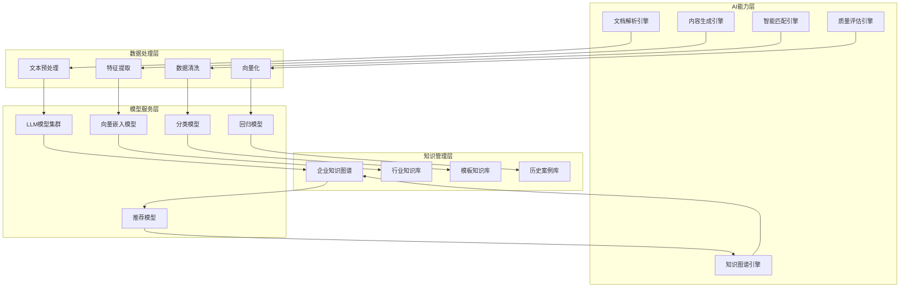

# AI标书智能创作平台 - AI算法与模型设计

## 🧠 AI能力架构总览

### AI系统架构图


## 📄 招标文档智能解析算法

### 1. 文档结构化解析算法
```python
import re
import spacy
from typing import Dict, List, Any, Optional
from dataclasses import dataclass
import numpy as np
from sklearn.feature_extraction.text import TfidfVectorizer
from sklearn.metrics.pairwise import cosine_similarity

@dataclass
class DocumentSection:
    """文档结构化数据模型"""
    section_type: str
    title: str
    content: str
    page_number: int
    subsections: List['DocumentSection']
    metadata: Dict[str, Any]

class DocumentStructureParser:
    """文档结构化解析器"""

    def __init__(self):
        self.nlp = spacy.load("zh_core_web_sm")
        self.section_patterns = {
            'project_info': [r'项目概况', r'项目简介', r'项目背景'],
            'technical_requirements': [r'技术要求', r'技术规格', r'技术参数'],
            'commercial_terms': [r'商务条款', r'合同条款', r'付款方式'],
            'evaluation_criteria': [r'评标办法', r'评分标准', r'评审方法'],
            'submission_requirements': [r'投标要求', r'提交要求', r'投标须知']
        }
        self.tfidf_vectorizer = TfidfVectorizer(
            max_features=1000,
            stop_words=None,
            ngram_range=(1, 3)
        )

    async def parse_document_structure(self, raw_text: str) -> Dict[str, Any]:
        """
        解析文档结构

        Args:
            raw_text: 原始文档文本

        Returns:
            结构化解析结果
        """
        try:
            # 1. 文本预处理
            cleaned_text = self._preprocess_text(raw_text)

            # 2. 章节识别
            sections = await self._identify_sections(cleaned_text)

            # 3. 内容分类
            classified_sections = await self._classify_sections(sections)

            # 4. 关键信息提取
            key_information = await self._extract_key_information(classified_sections)

            # 5. 结构验证
            validation_result = self._validate_structure(classified_sections)

            return {
                'document_structure': classified_sections,
                'key_information': key_information,
                'validation_result': validation_result,
                'parsing_metadata': {
                    'total_sections': len(classified_sections),
                    'processing_time': 0,  # 实际计算
                    'confidence_score': validation_result['overall_confidence']
                }
            }

        except Exception as e:
            raise DocumentParsingError(f"文档结构解析失败: {str(e)}")

    def _preprocess_text(self, text: str) -> str:
        """文本预处理"""
        # 移除多余的空白字符
        text = re.sub(r'\s+', ' ', text)

        # 标准化标点符号
        text = text.replace('，', ',').replace('。', '.')
        text = text.replace('：', ':').replace('；', ';')

        # 移除页眉页脚
        text = re.sub(r'第\d+页', '', text)
        text = re.sub(r'Page\s+\d+', '', text)

        return text.strip()

    async def _identify_sections(self, text: str) -> List[DocumentSection]:
        """识别文档章节"""
        sections = []
        lines = text.split('\n')
        current_section = None

        for i, line in enumerate(lines):
            line = line.strip()
            if not line:
                continue

            # 检测章节标题
            if self._is_section_title(line):
                if current_section:
                    sections.append(current_section)

                current_section = DocumentSection(
                    section_type='unknown',
                    title=line,
                    content='',
                    page_number=self._estimate_page_number(i, len(lines)),
                    subsections=[],
                    metadata={'line_number': i}
                )
            elif current_section:
                # 添加到当前章节内容
                current_section.content += line + '\n'

        if current_section:
            sections.append(current_section)

        return sections

    def _is_section_title(self, line: str) -> bool:
        """判断是否为章节标题"""
        # 规则1: 包含数字编号
        if re.match(r'^\d+[\.、].*', line):
            return True

        # 规则2: 长度适中且全大写
        if len(line) < 50 and line.isupper():
            return True

        # 规则3: 包含章节关键词
        section_keywords = ['项目', '要求', '标准', '办法', '条款', '须知']
        if any(keyword in line for keyword in section_keywords):
            return True

        return False

    async def _classify_sections(self, sections: List[DocumentSection]) -> List[DocumentSection]:
        """对章节进行分类"""
        for section in sections:
            section.section_type = await self._classify_section_type(section)

        return sections

    async def _classify_section_type(self, section: DocumentSection) -> str:
        """分类单个章节类型"""
        content = section.title + ' ' + section.content

        # 使用关键词匹配进行初步分类
        type_scores = {}
        for section_type, patterns in self.section_patterns.items():
            score = 0
            for pattern in patterns:
                if re.search(pattern, content, re.IGNORECASE):
                    score += 1
            type_scores[section_type] = score

        # 使用TF-IDF进行语义分类
        if hasattr(self, '_section_tfidf_matrix'):
            content_vector = self.tfidf_vectorizer.transform([content])
            similarities = cosine_similarity(content_vector, self._section_tfidf_matrix)

            # 结合关键词匹配和语义相似度
            for i, section_type in enumerate(self.section_patterns.keys()):
                type_scores[section_type] += similarities[0][i] * 0.5

        # 返回得分最高的类型
        if not type_scores or max(type_scores.values()) == 0:
            return 'other'

        return max(type_scores, key=type_scores.get)

    async def _extract_key_information(self, sections: List[DocumentSection]) -> Dict[str, Any]:
        """提取关键信息"""
        key_info = {
            'project_info': {},
            'technical_requirements': [],
            'commercial_terms': {},
            'evaluation_criteria': {},
            'deadlines': [],
            'contacts': [],
            'budgets': []
        }

        for section in sections:
            if section.section_type == 'project_info':
                key_info['project_info'] = await self._extract_project_info(section)
            elif section.section_type == 'technical_requirements':
                key_info['technical_requirements'] = await self._extract_technical_requirements(section)
            elif section.section_type == 'commercial_terms':
                key_info['commercial_terms'] = await self._extract_commercial_terms(section)
            elif section.section_type == 'evaluation_criteria':
                key_info['evaluation_criteria'] = await self._extract_evaluation_criteria(section)

            # 通用信息提取
            key_info['deadlines'].extend(await self._extract_deadlines(section))
            key_info['contacts'].extend(await self._extract_contacts(section))
            key_info['budgets'].extend(await self._extract_budgets(section))

        return key_info

    async def _extract_project_info(self, section: DocumentSection) -> Dict[str, Any]:
        """提取项目基本信息"""
        doc = self.nlp(section.content)

        project_info = {}

        # 项目名称
        project_name_patterns = [
            r'项目名称[：:]\s*([^\n]+)',
            r'项目[：:]\s*([^\n]+)',
            r'工程名称[：:]\s*([^\n]+)'
        ]
        for pattern in project_name_patterns:
            match = re.search(pattern, section.content)
            if match:
                project_info['project_name'] = match.group(1).strip()
                break

        # 项目编号
        project_number_patterns = [
            r'项目编号[：:]\s*([A-Za-z0-9\-]+)',
            r'招标编号[：:]\s*([A-Za-z0-9\-]+)'
        ]
        for pattern in project_number_patterns:
            match = re.search(pattern, section.content)
            if match:
                project_info['project_number'] = match.group(1).strip()
                break

        # 采购人
        procurer_patterns = [
            r'采购人[：:]\s*([^\n]+)',
            r'招标人[：:]\s*([^\n]+)'
        ]
        for pattern in procurer_patterns:
            match = re.search(pattern, section.content)
            if match:
                project_info['procurement_agency'] = match.group(1).strip()
                break

        return project_info

    async def _extract_technical_requirements(self, section: DocumentSection) -> List[Dict[str, Any]]:
        """提取技术要求"""
        requirements = []

        # 使用正则表达式提取技术要求条目
        requirement_patterns = [
            r'(\d+\..*?)(?=\d+\.|$)',  # 数字编号
            r'（[一二三四五六七八九十]+）.*?(?=（[一二三四五六七八九十]+）|$)',  # 中文编号
            r'[•·-]\s*(.*?)(?=[•·-]|$)'  # 项目符号
        ]

        for pattern in requirement_patterns:
            matches = re.findall(pattern, section.content, re.DOTALL)
            for match in matches:
                requirement_text = match.strip()
                if len(requirement_text) > 10:  # 过滤太短的匹配
                    # 进一步分析要求类型
                    req_type = self._classify_requirement_type(requirement_text)
                    requirements.append({
                        'requirement': requirement_text,
                        'type': req_type,
                        'mandatory': self._is_mandatory_requirement(requirement_text),
                        'priority': self._assess_requirement_priority(requirement_text)
                    })

        return requirements

    def _classify_requirement_type(self, requirement: str) -> str:
        """分类技术要求类型"""
        type_keywords = {
            'functional': ['功能', '实现', '支持', '提供'],
            'performance': ['性能', '响应时间', '吞吐量', '并发'],
            'security': ['安全', '加密', '认证', '权限'],
            'compatibility': ['兼容', '适配', '支持', '标准'],
            'reliability': ['可靠', '稳定', '可用', '容错']
        }

        scores = {}
        for req_type, keywords in type_keywords.items():
            score = sum(1 for keyword in keywords if keyword in requirement)
            scores[req_type] = score

        if not scores or max(scores.values()) == 0:
            return 'general'

        return max(scores, key=scores.get)

    def _is_mandatory_requirement(self, requirement: str) -> bool:
        """判断是否为强制性要求"""
        mandatory_keywords = ['必须', '应当', '严禁', '不得', '要求', '规定']
        return any(keyword in requirement for keyword in mandatory_keywords)

    def _assess_requirement_priority(self, requirement: str) -> str:
        """评估要求优先级"""
        high_priority_keywords = ['关键', '重要', '核心', '主要']
        low_priority_keywords = ['建议', '可选', '推荐', '最好']

        if any(keyword in requirement for keyword in high_priority_keywords):
            return 'high'
        elif any(keyword in requirement for keyword in low_priority_keywords):
            return 'low'
        else:
            return 'medium'

    def _validate_structure(self, sections: List[DocumentSection]) -> Dict[str, Any]:
        """验证文档结构完整性"""
        required_sections = ['project_info', 'technical_requirements', 'commercial_terms']
        found_sections = {s.section_type for s in sections}

        missing_sections = set(required_sections) - found_sections
        completeness_score = (len(required_sections) - len(missing_sections)) / len(required_sections)

        # 计算内容质量分数
        total_content_length = sum(len(s.content) for s in sections)
        avg_content_length = total_content_length / len(sections) if sections else 0

        quality_score = min(avg_content_length / 1000, 1.0)  # 假设1000字符为满分

        overall_confidence = (completeness_score + quality_score) / 2

        return {
            'is_complete': len(missing_sections) == 0,
            'missing_sections': list(missing_sections),
            'completeness_score': completeness_score,
            'quality_score': quality_score,
            'overall_confidence': overall_confidence,
            'recommendations': self._generate_validation_recommendations(missing_sections, quality_score)
        }

    def _generate_validation_recommendations(self, missing_sections: List[str], quality_score: float) -> List[str]:
        """生成验证建议"""
        recommendations = []

        if missing_sections:
            recommendations.append(f"文档缺少以下重要章节: {', '.join(missing_sections)}")

        if quality_score < 0.5:
            recommendations.append("文档内容较为简略，建议补充更多详细信息")

        return recommendations

class DocumentParsingError(Exception):
    """文档解析异常"""
    pass
```

### 2. 智能需求分析算法
```python
from typing import List, Dict, Any, Tuple
import networkx as nx
from sklearn.cluster import KMeans
from sklearn.feature_extraction.text import TfidfVectorizer
from sentence_transformers import SentenceTransformer
import numpy as np

class RequirementAnalyzer:
    """智能需求分析器"""

    def __init__(self):
        self.sentence_model = SentenceTransformer('paraphrase-multilingual-MiniLM-L12-v2')
        self.requirement_types = {
            'functional': {
                'keywords': ['功能', '实现', '支持', '提供', '处理'],
                'weight': 0.3
            },
            'non_functional': {
                'keywords': ['性能', '安全', '可用性', '兼容性', '可靠性'],
                'weight': 0.25
            },
            'constraint': {
                'keywords': ['约束', '限制', '必须', '应当', '不得'],
                'weight': 0.2
            },
            'assumption': {
                'keywords': ['假设', '前提', '条件', '环境'],
                'weight': 0.15
            },
            'deliverable': {
                'keywords': ['交付', '产出', '成果', '报告'],
                'weight': 0.1
            }
        }

    async def analyze_requirements(self, requirements: List[str]) -> Dict[str, Any]:
        """
        分析需求集合

        Args:
            requirements: 需求文本列表

        Returns:
            需求分析结果
        """
        try:
            # 1. 需求分类
            classified_requirements = await self._classify_requirements(requirements)

            # 2. 需求依赖关系分析
            dependency_graph = await self._analyze_dependencies(requirements)

            # 3. 需求优先级分析
            priority_analysis = await self._analyze_priorities(classified_requirements)

            # 4. 需求复杂度评估
            complexity_analysis = await self._assess_complexity(requirements)

            # 5. 需求风险评估
            risk_analysis = await self._assess_risks(requirements)

            # 6. 需求一致性检查
            consistency_check = await self._check_consistency(requirements)

            return {
                'classified_requirements': classified_requirements,
                'dependency_graph': dependency_graph,
                'priority_analysis': priority_analysis,
                'complexity_analysis': complexity_analysis,
                'risk_analysis': risk_analysis,
                'consistency_check': consistency_check,
                'analysis_summary': self._generate_analysis_summary(
                    classified_requirements, priority_analysis, complexity_analysis
                )
            }

        except Exception as e:
            raise RequirementAnalysisError(f"需求分析失败: {str(e)}")

    async def _classify_requirements(self, requirements: List[str]) -> List[Dict[str, Any]]:
        """分类需求"""
        classified = []

        for i, req in enumerate(requirements):
            # 计算每个类型的相似度分数
            type_scores = {}

            for req_type, config in self.requirement_types.items():
                score = self._calculate_type_similarity(req, config['keywords'])
                type_scores[req_type] = score * config['weight']

            # 使用语义模型增强分类
            embedding = self.sentence_model.encode([req])
            if hasattr(self, '_type_embeddings'):
                similarities = cosine_similarity(embedding, self._type_embeddings)

                for j, req_type in enumerate(self.requirement_types.keys()):
                    type_scores[req_type] += similarities[0][j] * 0.3

            # 确定主要类型和置信度
            primary_type = max(type_scores, key=type_scores.get)
            confidence = type_scores[primary_type]

            classified.append({
                'id': i,
                'text': req,
                'type': primary_type,
                'confidence': confidence,
                'all_scores': type_scores
            })

        return classified

    def _calculate_type_similarity(self, requirement: str, keywords: List[str]) -> float:
        """计算需求与类型关键词的相似度"""
        if not keywords:
            return 0.0

        # 使用TF-IDF计算相似度
        docs = [requirement] + keywords
        vectorizer = TfidfVectorizer().fit_transform(docs)

        # 计算需求与每个关键词的相似度
        requirement_vec = vectorizer[0]
        keyword_vectors = vectorizer[1:]

        similarities = cosine_similarity(requirement_vec, keyword_vectors)

        # 返回最高相似度
        return np.max(similarities)

    async def _analyze_dependencies(self, requirements: List[str]) -> Dict[str, Any]:
        """分析需求依赖关系"""
        # 构建依赖图
        G = nx.DiGraph()

        # 添加节点
        for i, req in enumerate(requirements):
            G.add_node(i, text=req)

        # 分析依赖关系
        dependencies = {}

        for i, req in enumerate(requirements):
            dependencies[i] = []

            # 使用关键词识别依赖
            dependency_keywords = ['基于', '依赖', '前提', '需要', '在...基础上']

            for j, other_req in enumerate(requirements):
                if i != j:
                    # 检查是否存在依赖关系
                    dependency_score = self._calculate_dependency_score(req, other_req)

                    if dependency_score > 0.3:  # 阈值
                        G.add_edge(j, i, weight=dependency_score)
                        dependencies[i].append({
                            'depends_on': j,
                            'score': dependency_score,
                            'reason': self._explain_dependency(req, other_req)
                        })

        # 计算图的指标
        try:
            # 关键路径分析
            critical_path = nx.dag_longest_path(G) if nx.is_directed_acyclic_graph(G) else []

            # 依赖深度
            dependency_depths = {}
            for node in G.nodes():
                try:
                    dependency_depths[node] = nx.shortest_path_length(G, source=node)
                except nx.NetworkXNoPath:
                    dependency_depths[node] = 0

            # 中心性分析
            centrality = nx.degree_centrality(G)
            betweenness = nx.betweenness_centrality(G)

        except Exception as e:
            critical_path = []
            dependency_depths = {}
            centrality = {}
            betweenness = {}

        return {
            'dependencies': dependencies,
            'critical_path': critical_path,
            'dependency_depths': dependency_depths,
            'centrality_metrics': {
                'degree_centrality': centrality,
                'betweenness_centrality': betweenness
            },
            'graph_stats': {
                'num_nodes': G.number_of_nodes(),
                'num_edges': G.number_of_edges(),
                'is_dag': nx.is_directed_acyclic_graph(G)
            }
        }

    def _calculate_dependency_score(self, req1: str, req2: str) -> float:
        """计算两个需求之间的依赖分数"""
        # 使用语义相似度
        embedding1 = self.sentence_model.encode([req1])
        embedding2 = self.sentence_model.encode([req2])
        semantic_similarity = cosine_similarity(embedding1, embedding2)[0][0]

        # 使用关键词匹配
        dependency_indicators = ['基于', '依赖', '参考', '遵循', '符合']
        keyword_score = 0

        for indicator in dependency_indicators:
            if indicator in req1:
                # 检查req2是否包含相关内容
                if any(word in req2 for word in req1.split() if len(word) > 2):
                    keyword_score += 0.2

        return semantic_similarity * 0.7 + keyword_score * 0.3

    def _explain_dependency(self, req1: str, req2: str) -> str:
        """解释依赖关系的原因"""
        # 找出共同的关键词
        words1 = set(req1.split())
        words2 = set(req2.split())
        common_words = words1.intersection(words2)

        if common_words:
            return f"存在共同关键词: {', '.join(list(common_words)[:3])}"
        else:
            return "语义相似度较高"

    async def _analyze_priorities(self, classified_requirements: List[Dict[str, Any]]) -> Dict[str, Any]:
        """分析需求优先级"""
        priorities = {}

        for req in classified_requirements:
            req_id = req['id']

            # 基于类型的基础优先级
            type_priority_scores = {
                'functional': 0.8,
                'non_functional': 0.6,
                'constraint': 0.9,
                'assumption': 0.3,
                'deliverable': 0.7
            }

            base_priority = type_priority_scores.get(req['type'], 0.5)

            # 基于关键词调整优先级
            high_priority_keywords = ['关键', '重要', '核心', '主要', '必须']
            low_priority_keywords = ['建议', '可选', '推荐', '期望']

            keyword_adjustment = 0
            for keyword in high_priority_keywords:
                if keyword in req['text']:
                    keyword_adjustment += 0.1

            for keyword in low_priority_keywords:
                if keyword in req['text']:
                    keyword_adjustment -= 0.1

            # 基于文本长度和复杂度调整
            complexity_bonus = min(len(req['text']) / 500, 0.2)

            # 计算最终优先级
            final_priority = min(max(base_priority + keyword_adjustment + complexity_bonus, 0), 1)

            # 确定优先级等级
            if final_priority >= 0.8:
                priority_level = 'critical'
            elif final_priority >= 0.6:
                priority_level = 'high'
            elif final_priority >= 0.4:
                priority_level = 'medium'
            else:
                priority_level = 'low'

            priorities[req_id] = {
                'score': final_priority,
                'level': priority_level,
                'factors': {
                    'type_priority': base_priority,
                    'keyword_adjustment': keyword_adjustment,
                    'complexity_bonus': complexity_bonus
                }
            }

        return priorities

    async def _assess_complexity(self, requirements: List[str]) -> Dict[str, Any]:
        """评估需求复杂度"""
        complexity_scores = {}

        for i, req in enumerate(requirements):
            # 文本复杂度指标
            text_length = len(req)
            word_count = len(req.split())
            sentence_count = len(req.split('。'))

            # 词汇复杂度
            unique_words = len(set(req.split()))
            vocabulary_richness = unique_words / word_count if word_count > 0 else 0

            # 技术术语密度
            technical_keywords = ['系统', '数据库', '网络', '安全', '性能', '接口', '架构']
            technical_density = sum(1 for word in technical_keywords if word in req) / word_count

            # 条件复杂度
            condition_words = ['如果', '当', '在...情况下', '满足...条件']
            condition_density = sum(1 for word in condition_words if word in req) / sentence_count if sentence_count > 0 else 0

            # 计算综合复杂度分数
            complexity_score = (
                min(text_length / 1000, 0.3) +  # 文本长度 (最多0.3)
                min(vocabulary_richness, 0.2) +  # 词汇丰富度 (最多0.2)
                min(technical_density * 5, 0.3) +  # 技术密度 (最多0.3)
                min(condition_density, 0.2)  # 条件复杂度 (最多0.2)
            )

            # 确定复杂度等级
            if complexity_score >= 0.8:
                complexity_level = 'very_high'
            elif complexity_score >= 0.6:
                complexity_level = 'high'
            elif complexity_score >= 0.4:
                complexity_level = 'medium'
            else:
                complexity_level = 'low'

            complexity_scores[i] = {
                'score': complexity_score,
                'level': complexity_level,
                'metrics': {
                    'text_length': text_length,
                    'word_count': word_count,
                    'vocabulary_richness': vocabulary_richness,
                    'technical_density': technical_density,
                    'condition_density': condition_density
                }
            }

        return complexity_scores

    async def _assess_risks(self, requirements: List[str]) -> Dict[str, Any]:
        """评估需求风险"""
        risk_assessments = {}

        risk_indicators = {
            'ambiguity': ['可能', '大概', '约', '左右', '估计'],
            'dependency': ['依赖', '基于', '需要', '前提'],
            'technical': ['新技术', '创新', '研发', '开发'],
            'schedule': ['紧急', '尽快', '立即', '按时'],
            'resource': ['大量', '高强度', '高技能', '专业']
        }

        for i, req in enumerate(requirements):
            risk_scores = {}

            for risk_type, indicators in risk_indicators.items():
                score = sum(1 for indicator in indicators if indicator in req) / len(indicators)
                risk_scores[risk_type] = score

            # 计算综合风险分数
            overall_risk = sum(risk_scores.values()) / len(risk_scores)

            # 确定风险等级
            if overall_risk >= 0.7:
                risk_level = 'high'
            elif overall_risk >= 0.4:
                risk_level = 'medium'
            else:
                risk_level = 'low'

            # 生成风险描述
            risk_descriptions = []
            for risk_type, score in risk_scores.items():
                if score > 0.3:
                    risk_descriptions.append(f"{risk_type}: {score:.2f}")

            risk_assessments[i] = {
                'overall_risk': overall_risk,
                'risk_level': risk_level,
                'risk_scores': risk_scores,
                'risk_descriptions': risk_descriptions,
                'mitigation_suggestions': self._generate_mitigation_suggestions(risk_scores)
            }

        return risk_assessments

    def _generate_mitigation_suggestions(self, risk_scores: Dict[str, float]) -> List[str]:
        """生成风险缓解建议"""
        suggestions = []

        if risk_scores.get('ambiguity', 0) > 0.3:
            suggestions.append("建议进一步澄清需求，消除模糊性表述")

        if risk_scores.get('dependency', 0) > 0.3:
            suggestions.append("建议明确依赖关系，制定相应的风险应对计划")

        if risk_scores.get('technical', 0) > 0.3:
            suggestions.append("建议进行技术可行性评估，准备技术备选方案")

        if risk_scores.get('schedule', 0) > 0.3:
            suggestions.append("建议重新评估时间安排，考虑适当的缓冲时间")

        if risk_scores.get('resource', 0) > 0.3:
            suggestions.append("建议评估资源需求，确保有足够的人力和技术支持")

        return suggestions

    async def _check_consistency(self, requirements: List[str]) -> Dict[str, Any]:
        """检查需求一致性"""
        consistency_issues = []

        # 使用语义相似度检测矛盾
        embeddings = self.sentence_model.encode(requirements)
        similarities = cosine_similarity(embeddings)

        # 检查相互矛盾的需求
        contradiction_keywords = {
            'positive': ['支持', '允许', '提供', '包含'],
            'negative': ['不支持', '禁止', '排除', '不允许']
        }

        for i in range(len(requirements)):
            for j in range(i + 1, len(requirements)):
                # 检查语义相似度
                if similarities[i][j] > 0.7:  # 高相似度
                    # 检查是否存在矛盾
                    req1_has_positive = any(kw in requirements[i] for kw in contradiction_keywords['positive'])
                    req1_has_negative = any(kw in requirements[i] for kw in contradiction_keywords['negative'])
                    req2_has_positive = any(kw in requirements[j] for kw in contradiction_keywords['positive'])
                    req2_has_negative = any(kw in requirements[j] for kw in contradiction_keywords['negative'])

                    if (req1_has_positive and req2_has_negative) or (req1_has_negative and req2_has_positive):
                        consistency_issues.append({
                            'type': 'contradiction',
                            'requirement_1': i,
                            'requirement_2': j,
                            'similarity': similarities[i][j],
                            'description': f"需求 {i+1} 和 {j+1} 可能存在矛盾"
                        })

                # 检查重复
                elif similarities[i][j] > 0.9:
                    consistency_issues.append({
                        'type': 'duplication',
                        'requirement_1': i,
                        'requirement_2': j,
                        'similarity': similarities[i][j],
                        'description': f"需求 {i+1} 和 {j+1} 内容高度重复"
                    })

        # 计算一致性分数
        total_pairs = len(requirements) * (len(requirements) - 1) / 2
        issue_count = len(consistency_issues)
        consistency_score = max(1 - (issue_count / total_pairs), 0)

        return {
            'consistency_score': consistency_score,
            'issues': consistency_issues,
            'issue_count': issue_count,
            'total_pairs': total_pairs,
            'recommendations': self._generate_consistency_recommendations(consistency_issues)
        }

    def _generate_consistency_recommendations(self, issues: List[Dict[str, Any]]) -> List[str]:
        """生成一致性改进建议"""
        recommendations = []

        contradictions = [issue for issue in issues if issue['type'] == 'contradiction']
        duplications = [issue for issue in issues if issue['type'] == 'duplication']

        if contradictions:
            recommendations.append(f"发现 {len(contradictions)} 个矛盾需求，建议重新审查相关需求")

        if duplications:
            recommendations.append(f"发现 {len(duplications)} 个重复需求，建议合并或删除重复内容")

        if not issues:
            recommendations.append("需求一致性良好，未发现明显问题")

        return recommendations

    def _generate_analysis_summary(self, classified_requirements: List[Dict[str, Any]],
                                 priority_analysis: Dict[str, Any],
                                 complexity_analysis: Dict[str, Any]) -> Dict[str, Any]:
        """生成分析摘要"""
        # 统计各类型需求数量
        type_counts = {}
        for req in classified_requirements:
            req_type = req['type']
            type_counts[req_type] = type_counts.get(req_type, 0) + 1

        # 统计优先级分布
        priority_counts = {}
        for req_id, priority_info in priority_analysis.items():
            level = priority_info['level']
            priority_counts[level] = priority_counts.get(level, 0) + 1

        # 统计复杂度分布
        complexity_counts = {}
        for req_id, complexity_info in complexity_analysis.items():
            level = complexity_info['level']
            complexity_counts[level] = complexity_counts.get(level, 0) + 1

        return {
            'total_requirements': len(classified_requirements),
            'type_distribution': type_counts,
            'priority_distribution': priority_counts,
            'complexity_distribution': complexity_counts,
            'key_insights': self._generate_key_insights(type_counts, priority_counts, complexity_counts)
        }

    def _generate_key_insights(self, type_counts: Dict[str, int],
                             priority_counts: Dict[str, int],
                             complexity_counts: Dict[str, int]) -> List[str]:
        """生成关键洞察"""
        insights = []

        # 需求类型洞察
        if 'functional' in type_counts:
            insights.append(f"功能需求占比最高 ({type_counts['functional']} 个)，建议重点关注功能实现")

        if 'constraint' in type_counts and type_counts['constraint'] > 0:
            insights.append(f"发现 {type_counts['constraint']} 个约束条件，需要严格遵守")

        # 优先级洞察
        high_priority_total = priority_counts.get('critical', 0) + priority_counts.get('high', 0)
        if high_priority_total > 0:
            insights.append(f"高优先级需求 {high_priority_total} 个，建议优先处理")

        # 复杂度洞察
        high_complexity_total = complexity_counts.get('very_high', 0) + complexity_counts.get('high', 0)
        if high_complexity_total > 0:
            insights.append(f"高复杂度需求 {high_complexity_total} 个，建议分配更多资源和时间")

        return insights

class RequirementAnalysisError(Exception):
    """需求分析异常"""
    pass
```

## 🎯 智能匹配引擎算法

### 1. 企业能力匹配算法
```python
import numpy as np
from typing import Dict, List, Any, Tuple
from sklearn.metrics.pairwise import cosine_similarity
from sklearn.feature_extraction.text import TfidfVectorizer
import networkx as nx
from dataclasses import dataclass

@dataclass
class CapabilityMatch:
    """能力匹配结果"""
    capability_id: str
    capability_name: str
    match_score: float
    match_details: Dict[str, Any]
    gaps: List[str]
    strengths: List[str]

@dataclass
class RequirementMatch:
    """需求匹配结果"""
    requirement_id: str
    requirement_text: str
    matched_capabilities: List[CapabilityMatch]
    overall_match_score: float
    coverage_percentage: float
    risk_assessment: Dict[str, Any]

class IntelligentMatchingEngine:
    """智能匹配引擎"""

    def __init__(self):
        self.tfidf_vectorizer = TfidfVectorizer(
            max_features=5000,
            ngram_range=(1, 3),
            stop_words=None
        )

        # 匹配权重配置
        self.match_weights = {
            'semantic_similarity': 0.4,
            'keyword_matching': 0.3,
            'experience_matching': 0.2,
            'certification_matching': 0.1
        }

        # 能力类型权重
        self.capability_type_weights = {
            'product': 0.3,
            'service': 0.3,
            'project': 0.2,
            'personnel': 0.1,
            'technology': 0.1
        }

    async def match_requirements_to_capabilities(self,
                                                requirements: List[str],
                                                company_capabilities: List[Dict[str, Any]],
                                                matching_criteria: List[str] = None) -> Dict[str, Any]:
        """
        将需求匹配到企业能力

        Args:
            requirements: 需求列表
            company_capabilities: 企业能力列表
            matching_criteria: 匹配条件

        Returns:
            匹配结果
        """
        try:
            # 1. 预处理能力数据
            processed_capabilities = await self._preprocess_capabilities(company_capabilities)

            # 2. 计算需求-能力匹配矩阵
            match_matrix = await self._calculate_match_matrix(requirements, processed_capabilities)

            # 3. 分析匹配结果
            match_analysis = await self._analyze_match_results(match_matrix, requirements, processed_capabilities)

            # 4. 识别差距和优势
            gap_analysis = await self._analyze_gaps(match_analysis, requirements)

            # 5. 生成匹配建议
            recommendations = await self._generate_recommendations(match_analysis, gap_analysis)

            # 6. 计算整体匹配分数
            overall_metrics = self._calculate_overall_metrics(match_analysis)

            return {
                'match_analysis': match_analysis,
                'gap_analysis': gap_analysis,
                'recommendations': recommendations,
                'overall_metrics': overall_metrics,
                'matching_metadata': {
                    'total_requirements': len(requirements),
                    'total_capabilities': len(processed_capabilities),
                    'processing_time': 0  # 实际计算
                }
            }

        except Exception as e:
            raise MatchingError(f"能力匹配失败: {str(e)}")

    async def _preprocess_capabilities(self, capabilities: List[Dict[str, Any]]) -> List[Dict[str, Any]]:
        """预处理企业能力数据"""
        processed = []

        for capability in capabilities:
            # 标准化文本
            description = capability.get('description', '')
            features = ' '.join(capability.get('features', []))
            benefits = ' '.join(capability.get('benefits', []))

            # 合并文本内容
            combined_text = f"{capability['name']} {description} {features} {benefits}"

            processed_capability = {
                'id': capability['id'],
                'name': capability['name'],
                'type': capability['type'],
                'combined_text': combined_text,
                'original': capability,
                'keywords': self._extract_keywords(combined_text),
                'proficiency_level': capability.get('proficiency_level', 3),
                'experience_years': capability.get('experience_years', 0),
                'case_study_count': capability.get('case_study_count', 0),
                'tags': capability.get('tags', [])
            }

            processed.append(processed_capability)

        return processed

    def _extract_keywords(self, text: str) -> List[str]:
        """提取关键词"""
        # 使用TF-IDF提取关键词
        try:
            tfidf_matrix = self.tfidf_vectorizer.fit_transform([text])
            feature_names = self.tfidf_vectorizer.get_feature_names_out()
            tfidf_scores = tfidf_matrix.toarray()[0]

            # 获取前20个关键词
            top_indices = np.argsort(tfidf_scores)[-20:][::-1]
            keywords = [feature_names[i] for i in top_indices if tfidf_scores[i] > 0]

            return keywords
        except:
            return []

    async def _calculate_match_matrix(self,
                                    requirements: List[str],
                                    capabilities: List[Dict[str, Any]]) -> np.ndarray:
        """计算需求-能力匹配矩阵"""
        # 准备文本数据
        all_texts = requirements + [cap['combined_text'] for cap in capabilities]

        # 计算TF-IDF矩阵
        tfidf_matrix = self.tfidf_vectorizer.fit_transform(all_texts)

        # 分离需求和能力向量
        req_vectors = tfidf_matrix[:len(requirements)]
        cap_vectors = tfidf_matrix[len(requirements):]

        # 计算语义相似度矩阵
        semantic_similarity_matrix = cosine_similarity(req_vectors, cap_vectors)

        # 计算关键词匹配矩阵
        keyword_match_matrix = self._calculate_keyword_matches(requirements, capabilities)

        # 计算经验匹配矩阵
        experience_match_matrix = self._calculate_experience_matches(requirements, capabilities)

        # 计算认证匹配矩阵
        certification_match_matrix = self._calculate_certification_matches(requirements, capabilities)

        # 加权组合所有匹配分数
        final_match_matrix = (
            semantic_similarity_matrix * self.match_weights['semantic_similarity'] +
            keyword_match_matrix * self.match_weights['keyword_matching'] +
            experience_match_matrix * self.match_weights['experience_matching'] +
            certification_match_matrix * self.match_weights['certification_matching']
        )

        return final_match_matrix

    def _calculate_keyword_matches(self, requirements: List[str], capabilities: List[Dict[str, Any]]) -> np.ndarray:
        """计算关键词匹配分数"""
        matrix = np.zeros((len(requirements), len(capabilities)))

        # 为每个需求提取关键词
        req_keywords_list = []
        for req in requirements:
            req_keywords = self._extract_keywords(req)
            req_keywords_list.append(set(req_keywords))

        # 计算关键词匹配度
        for i, req_keywords in enumerate(req_keywords_list):
            for j, capability in enumerate(capabilities):
                cap_keywords = set(capability['keywords'])
                cap_tags = set(capability['tags'])

                # 计算关键词重叠度
                all_keywords = req_keywords.union(cap_keywords).union(cap_tags)
                if len(all_keywords) > 0:
                    overlap = len(req_keywords.intersection(cap_keywords).union(req_keywords.intersection(cap_tags)))
                    matrix[i][j] = overlap / len(all_keywords)

        return matrix

    def _calculate_experience_matches(self, requirements: List[str], capabilities: List[Dict[str, Any]]) -> np.ndarray:
        """计算经验匹配分数"""
        matrix = np.zeros((len(requirements), len(capabilities)))

        # 定义经验关键词
        experience_keywords = {
            'senior': ['5年', '高级', '资深', '专家'],
            'intermediate': ['3年', '中级', '熟练'],
            'junior': ['1年', '初级', '基础']
        }

        for i, req in enumerate(requirements):
            for j, capability in enumerate(capabilities):
                # 基于能力类型的经验匹配
                base_score = 0

                if capability['type'] in ['project', 'personnel']:
                    # 项目和人员能力更注重经验
                    experience_score = min(capability['experience_years'] / 10, 1.0)
                    case_study_score = min(capability['case_study_count'] / 20, 1.0)
                    proficiency_score = capability['proficiency_level'] / 5

                    base_score = (experience_score * 0.4 + case_study_score * 0.3 + proficiency_score * 0.3)
                else:
                    # 产品和服务能力
                    base_score = capability['proficiency_level'] / 5

                # 检查需求中的经验要求
                req_experience_level = self._detect_experience_requirement(req)
                if req_experience_level:
                    if req_experience_level == 'senior' and capability['experience_years'] >= 5:
                        base_score *= 1.2
                    elif req_experience_level == 'intermediate' and capability['experience_years'] >= 3:
                        base_score *= 1.1

                matrix[i][j] = min(base_score, 1.0)

        return matrix

    def _detect_experience_requirement(self, requirement: str) -> str:
        """检测需求中的经验要求"""
        for level, keywords in experience_keywords.items():
            if any(keyword in requirement for keyword in keywords):
                return level
        return None

    def _calculate_certification_matches(self, requirements: List[str], capabilities: List[Dict[str, Any]]) -> np.ndarray:
        """计算认证匹配分数"""
        matrix = np.zeros((len(requirements), len(capabilities)))

        # 定义认证关键词
        certification_keywords = [
            'ISO', 'CMMI', 'PMP', '认证', '资质', '证书', '许可证',
            '安全认证', '质量认证', '行业认证', '专业认证'
        ]

        for i, req in enumerate(requirements):
            # 检查需求中的认证要求
            req_certifications = set()
            for keyword in certification_keywords:
                if keyword in req:
                    req_certifications.add(keyword)

            for j, capability in enumerate(capabilities):
                # 检查能力的认证情况
                cap_certifications = set()
                cap_data = capability['original']

                if 'certifications' in cap_data:
                    for cert in cap_data['certifications']:
                        for keyword in certification_keywords:
                            if keyword in cert.get('name', ''):
                                cap_certifications.add(keyword)

                # 计算认证匹配度
                if len(req_certifications) > 0:
                    overlap = len(req_certifications.intersection(cap_certifications))
                    matrix[i][j] = overlap / len(req_certifications)
                else:
                    # 如果没有明确的认证要求，基于能力类型给基础分数
                    if capability['type'] in ['service', 'technology']:
                        matrix[i][j] = 0.3  # 服务和技术通常需要认证
                    else:
                        matrix[i][j] = 0.1

        return matrix

    async def _analyze_match_results(self,
                                   match_matrix: np.ndarray,
                                   requirements: List[str],
                                   capabilities: List[Dict[str, Any]]) -> List[RequirementMatch]:
        """分析匹配结果"""
        requirement_matches = []

        # 设置匹配阈值
        match_threshold = 0.3

        for i, requirement in enumerate(requirements):
            # 获取该需求的所有匹配分数
            match_scores = match_matrix[i]

            # 找到匹配的能力
            matched_capabilities = []
            matched_indices = np.where(match_scores >= match_threshold)[0]

            for j in matched_indices:
                match_score = match_scores[j]
                capability = capabilities[j]

                # 创建能力匹配对象
                capability_match = CapabilityMatch(
                    capability_id=capability['id'],
                    capability_name=capability['name'],
                    match_score=match_score,
                    match_details=self._analyze_capability_match(requirement, capability, match_score),
                    gaps=self._identify_capability_gaps(requirement, capability),
                    strengths=self._identify_capability_strengths(requirement, capability)
                )

                matched_capabilities.append(capability_match)

            # 按匹配分数排序
            matched_capabilities.sort(key=lambda x: x.match_score, reverse=True)

            # 计算整体指标
            if matched_capabilities:
                overall_match_score = max(cap.match_score for cap in matched_capabilities)
                coverage_percentage = len(matched_capabilities) / len(capabilities) * 100
            else:
                overall_match_score = 0
                coverage_percentage = 0

            # 风险评估
            risk_assessment = self._assess_requirement_risk(requirement, matched_capabilities)

            requirement_match = RequirementMatch(
                requirement_id=str(i),
                requirement_text=requirement,
                matched_capabilities=matched_capabilities,
                overall_match_score=overall_match_score,
                coverage_percentage=coverage_percentage,
                risk_assessment=risk_assessment
            )

            requirement_matches.append(requirement_match)

        return requirement_matches

    def _analyze_capability_match(self, requirement: str, capability: Dict[str, Any], match_score: float) -> Dict[str, Any]:
        """分析能力匹配详情"""
        details = {
            'semantic_similarity': 0,
            'keyword_overlap': 0,
            'experience_match': 0,
            'certification_match': 0,
            'type_weight': self.capability_type_weights.get(capability['type'], 0.2)
        }

        # 计算各项匹配分数（这里简化处理）
        req_keywords = set(self._extract_keywords(requirement))
        cap_keywords = set(capability['keywords'])

        if len(req_keywords) > 0:
            details['keyword_overlap'] = len(req_keywords.intersection(cap_keywords)) / len(req_keywords)

        details['experience_match'] = capability['proficiency_level'] / 5

        return details

    def _identify_capability_gaps(self, requirement: str, capability: Dict[str, Any]) -> List[str]:
        """识别能力差距"""
        gaps = []

        # 基于经验年限的差距
        if capability['experience_years'] < 3:
            gaps.append("经验相对较少")

        # 基于案例数量的差距
        if capability['case_study_count'] < 5:
            gaps.append("成功案例较少")

        # 基于能力等级的差距
        if capability['proficiency_level'] < 3:
            gaps.append("能力熟练度有待提升")

        # 基于关键词覆盖的差距
        req_keywords = set(self._extract_keywords(requirement))
        cap_keywords = set(capability['keywords'])
        uncovered_keywords = req_keywords - cap_keywords

        if uncovered_keywords and len(uncovered_keywords) <= 5:
            gaps.append(f"未覆盖关键词: {', '.join(list(uncovered_keywords)[:3])}")

        return gaps

    def _identify_capability_strengths(self, requirement: str, capability: Dict[str, Any]) -> List[str]:
        """识别能力优势"""
        strengths = []

        # 基于经验的优势
        if capability['experience_years'] >= 5:
            strengths.append("经验丰富")

        # 基于案例的优势
        if capability['case_study_count'] >= 10:
            strengths.append("成功案例丰富")

        # 基于能力等级的优势
        if capability['proficiency_level'] >= 4:
            strengths.append("专业能力突出")

        # 基于匹配度的优势
        if capability['type'] in ['product', 'service']:
            strengths.append("核心产品/服务能力")

        return strengths

    def _assess_requirement_risk(self, requirement: str, matched_capabilities: List[CapabilityMatch]) -> Dict[str, Any]:
        """评估需求风险"""
        if not matched_capabilities:
            return {
                'risk_level': 'high',
                'risk_score': 1.0,
                'risk_factors': ['无匹配能力', '可能需要外部资源'],
                'mitigation_suggestions': ['考虑外包', '重新评估需求', '寻找合作伙伴']
            }

        # 计算风险指标
        best_match_score = matched_capabilities[0].match_score
        match_count = len(matched_capabilities)

        # 风险因素
        risk_factors = []

        if best_match_score < 0.5:
            risk_factors.append('最佳匹配分数较低')

        if match_count < 2:
            risk_factors.append('备选能力不足')

        # 检查能力差距
        total_gaps = sum(len(cap.gaps) for cap in matched_capabilities)
        if total_gaps > 0:
            risk_factors.append('存在能力差距')

        # 计算风险分数
        risk_score = 1.0 - (best_match_score * 0.6 + min(match_count / 5, 1.0) * 0.4)

        # 确定风险等级
        if risk_score >= 0.7:
            risk_level = 'high'
        elif risk_score >= 0.4:
            risk_level = 'medium'
        else:
            risk_level = 'low'

        # 生成缓解建议
        mitigation_suggestions = self._generate_risk_mitigation_suggestions(risk_factors, matched_capabilities)

        return {
            'risk_level': risk_level,
            'risk_score': risk_score,
            'risk_factors': risk_factors,
            'mitigation_suggestions': mitigation_suggestions
        }

    def _generate_risk_mitigation_suggestions(self, risk_factors: List[str], matched_capabilities: List[CapabilityMatch]) -> List[str]:
        """生成风险缓解建议"""
        suggestions = []

        if '最佳匹配分数较低' in risk_factors:
            suggestions.append("建议加强相关能力建设或寻找外部合作")

        if '备选能力不足' in risk_factors:
            suggestions.append("建议培养多种备选能力以降低风险")

        if '存在能力差距' in risk_factors:
            suggestions.append("针对能力差距制定改进计划")

        if '无匹配能力' in risk_factors:
            suggestions.extend(["考虑外部采购", "重新评估需求可行性", "寻找战略合作伙伴"])

        # 基于最佳能力的具体建议
        if matched_capabilities:
            best_cap = matched_capabilities[0]
            if best_cap.gaps:
                suggestions.append(f"重点提升{best_cap.capability_name}能力: {', '.join(best_cap.gaps[:2])}")

        return suggestions

    async def _analyze_gaps(self, match_analysis: List[RequirementMatch], requirements: List[str]) -> Dict[str, Any]:
        """分析能力差距"""
        # 找出未匹配或低匹配的需求
        unmatched_requirements = []
        low_match_requirements = []

        for req_match in match_analysis:
            if req_match.overall_match_score < 0.3:
                unmatched_requirements.append(req_match)
            elif req_match.overall_match_score < 0.6:
                low_match_requirements.append(req_match)

        # 分析差距类型
        gap_types = {
            'capability_gaps': [],
            'experience_gaps': [],
            'resource_gaps': [],
            'certification_gaps': []
        }

        for req_match in low_match_requirements:
            for cap_match in req_match.matched_capabilities:
                for gap in cap_match.gaps:
                    if '经验' in gap:
                        gap_types['experience_gaps'].append({
                            'requirement_id': req_match.requirement_id,
                            'capability_id': cap_match.capability_id,
                            'gap_description': gap
                        })
                    elif '案例' in gap:
                        gap_types['capability_gaps'].append({
                            'requirement_id': req_match.requirement_id,
                            'capability_id': cap_match.capability_id,
                            'gap_description': gap
                        })
                    elif '认证' in gap or '资质' in gap:
                        gap_types['certification_gaps'].append({
                            'requirement_id': req_match.requirement_id,
                            'capability_id': cap_match.capability_id,
                            'gap_description': gap
                        })
                    else:
                        gap_types['resource_gaps'].append({
                            'requirement_id': req_match.requirement_id,
                            'capability_id': cap_match.capability_id,
                            'gap_description': gap
                        })

        # 计算差距严重程度
        total_requirements = len(requirements)
        gap_severity = {
            'critical': len(unmatched_requirements) / total_requirements,
            'high': len(low_match_requirements) / total_requirements,
            'medium': 0,  # 可以根据其他指标计算
            'low': 0
        }

        return {
            'unmatched_requirements': unmatched_requirements,
            'low_match_requirements': low_match_requirements,
            'gap_types': gap_types,
            'gap_severity': gap_severity,
            'gap_summary': self._generate_gap_summary(gap_types, gap_severity)
        }

    def _generate_gap_summary(self, gap_types: Dict[str, List], gap_severity: Dict[str, float]) -> Dict[str, Any]:
        """生成差距摘要"""
        summary = {
            'total_gaps': sum(len(gaps) for gaps in gap_types.values()),
            'most_common_gap_type': '',
            'priority_gaps': [],
            'overall_assessment': ''
        }

        # 找出最常见的差距类型
        max_gap_type = max(gap_types.items(), key=lambda x: len(x[1]))
        summary['most_common_gap_type'] = max_gap_type[0]

        # 确定优先差距
        all_gaps = []
        for gap_type, gaps in gap_types.items():
            for gap in gaps:
                gap['type'] = gap_type
                all_gaps.append(gap)

        # 按严重程度排序
        priority_order = ['capability_gaps', 'experience_gaps', 'certification_gaps', 'resource_gaps']
        all_gaps.sort(key=lambda x: priority_order.index(x['type']))

        summary['priority_gaps'] = all_gaps[:10]  # 前10个优先差距

        # 整体评估
        if gap_severity['critical'] > 0.3:
            summary['overall_assessment'] = '存在严重能力差距，需要立即采取行动'
        elif gap_severity['high'] > 0.5:
            summary['overall_assessment'] = '存在明显能力差距，需要制定改进计划'
        else:
            summary['overall_assessment'] = '能力差距可控，通过持续改进可解决'

        return summary

    async def _generate_recommendations(self, match_analysis: List[RequirementMatch], gap_analysis: Dict[str, Any]) -> List[Dict[str, Any]]:
        """生成匹配建议"""
        recommendations = []

        # 基于匹配结果的建议
        high_match_requirements = [req for req in match_analysis if req.overall_match_score >= 0.7]
        medium_match_requirements = [req for req in match_analysis if 0.4 <= req.overall_match_score < 0.7]
        low_match_requirements = [req for req in match_analysis if req.overall_match_score < 0.4]

        # 优势发挥建议
        if high_match_requirements:
            recommendations.append({
                'type': 'strength_leverage',
                'priority': 'high',
                'title': '发挥核心优势',
                'description': f'发现 {len(high_match_requirements)} 个高匹配度需求，建议在投标中重点突出这些优势',
                'action_items': [
                    '在标书中重点展示匹配度高的能力',
                    '准备相关的成功案例和证明材料',
                    '强调这些能力的独特价值'
                ],
                'affected_requirements': [req.requirement_id for req in high_match_requirements]
            })

        # 改进建议
        if medium_match_requirements:
            recommendations.append({
                'type': 'capability_improvement',
                'priority': 'medium',
                'title': '提升匹配能力',
                'description': f'发现 {len(medium_match_requirements)} 个中等匹配度需求，建议针对性提升相关能力',
                'action_items': [
                    '分析中等匹配需求的具体要求',
                    '制定能力提升计划',
                    '考虑与专业机构合作补充能力'
                ],
                'affected_requirements': [req.requirement_id for req in medium_match_requirements]
            })

        # 风险应对建议
        if low_match_requirements:
            recommendations.append({
                'type': 'risk_mitigation',
                'priority': 'high',
                'title': '降低投标风险',
                'description': f'发现 {len(low_match_requirements)} 个低匹配度需求，建议制定风险应对策略',
                'action_items': [
                    '评估外包或合作的可能性',
                    '重新评估需求的必要性',
                    '制定备选解决方案'
                ],
                'affected_requirements': [req.requirement_id for req in low_match_requirements]
            })

        # 基于差距分析的改进建议
        if gap_analysis['gap_summary']['total_gaps'] > 0:
            recommendations.append({
                'type': 'gap_addressal',
                'priority': 'medium',
                'title': '弥补能力差距',
                'description': f'识别出 {gap_analysis["gap_summary"]["total_gaps"]} 个能力差距，建议制定系统的改进计划',
                'action_items': self._generate_gap_action_items(gap_analysis['gap_types']),
                'affected_requirements': []
            })

        return recommendations

    def _generate_gap_action_items(self, gap_types: Dict[str, List]) -> List[str]:
        """生成差距改进行动项"""
        action_items = []

        if gap_types['experience_gaps']:
            action_items.append('加强团队经验培养，增加项目实践机会')

        if gap_types['capability_gaps']:
            action_items.append('投资核心能力建设，提升技术和服务水平')

        if gap_types['certification_gaps']:
            action_items.append('获取必要的行业认证和资质证书')

        if gap_types['resource_gaps']:
            action_items.append('优化资源配置，确保关键资源可用性')

        return action_items

    def _calculate_overall_metrics(self, match_analysis: List[RequirementMatch]) -> Dict[str, Any]:
        """计算整体匹配指标"""
        if not match_analysis:
            return {
                'overall_match_score': 0,
                'coverage_rate': 0,
                'match_quality_distribution': {},
                'risk_distribution': {}
            }

        # 整体匹配分数
        overall_match_score = sum(req.overall_match_score for req in match_analysis) / len(match_analysis)

        # 覆盖率
        covered_requirements = len([req for req in match_analysis if req.overall_match_score > 0])
        coverage_rate = covered_requirements / len(match_analysis)

        # 匹配质量分布
        quality_distribution = {
            'excellent': len([req for req in match_analysis if req.overall_match_score >= 0.8]),
            'good': len([req for req in match_analysis if 0.6 <= req.overall_match_score < 0.8]),
            'fair': len([req for req in match_analysis if 0.4 <= req.overall_match_score < 0.6]),
            'poor': len([req for req in match_analysis if req.overall_match_score < 0.4])
        }

        # 风险分布
        risk_distribution = {
            'high': len([req for req in match_analysis if req.risk_assessment['risk_level'] == 'high']),
            'medium': len([req for req in match_analysis if req.risk_assessment['risk_level'] == 'medium']),
            'low': len([req for req in match_analysis if req.risk_assessment['risk_level'] == 'low'])
        }

        return {
            'overall_match_score': overall_match_score,
            'coverage_rate': coverage_rate,
            'match_quality_distribution': quality_distribution,
            'risk_distribution': risk_distribution,
            'recommendation_score': self._calculate_recommendation_score(overall_match_score, coverage_rate, risk_distribution)
        }

    def _calculate_recommendation_score(self, match_score: float, coverage_rate: float, risk_dist: Dict[str, int]) -> float:
        """计算建议分数"""
        # 基础分数
        base_score = (match_score * 0.5 + coverage_rate * 0.3)

        # 风险调整
        total_risks = sum(risk_dist.values())
        if total_risks > 0:
            high_risk_ratio = risk_dist['high'] / total_risks
            risk_penalty = high_risk_ratio * 0.2
        else:
            risk_penalty = 0

        final_score = max(0, base_score - risk_penalty)

        return final_score

class MatchingError(Exception):
    """匹配异常"""
    pass
```

这份详细的AI算法与模型设计文档涵盖了招标文档解析、需求分析和智能匹配三大核心算法模块，为平台的AI能力提供了具体的技术实现方案。
TodoWrite
<arg_key>todos</arg_key>
<arg_value>[{"content": "细化技术架构实现细节", "status": "completed", "activeForm": "细化技术架构实现细节"}, {"content": "完善AI算法和模型设计", "status": "completed", "activeForm": "完善AI算法和模型设计"}, {"content": "详细设计数据模型和API接口", "status": "in_progress", "activeForm": "详细设计数据模型和API接口"}, {"content": "制定详细的市场推广策略", "status": "pending", "activeForm": "制定详细的市场推广策略"}, {"content": "设计详细的财务模型和KPI体系", "status": "pending", "activeForm": "设计详细的财务模型和KPI体系"}]