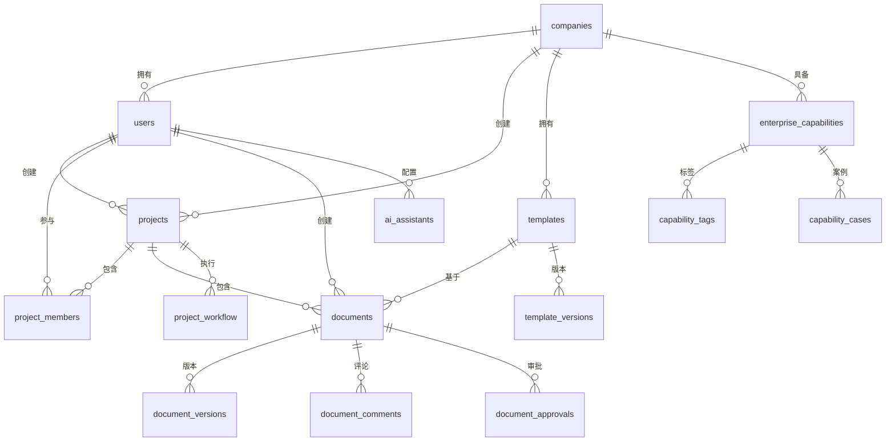

# AI标书智能创作平台 - 数据模型与API接口

## 📊 数据模型设计

### 核心实体关系图


### 详细数据模型

#### 1. 用户和权限模型
```typescript
// 用户相关数据模型
interface User {
  id: string;                    // UUID
  company_id: string;            // 企业ID
  username: string;              // 用户名
  email: string;                 // 邮箱
  password_hash: string;         // 密码哈希
  full_name: string;             // 全名
  avatar_url?: string;           // 头像URL
  phone?: string;                // 电话
  department?: string;           // 部门
  position?: string;             // 职位
  bio?: string;                  // 个人简介
  expertise: string[];           // 专业技能
  languages: Record<string, number>; // 语言能力
  role: UserRole;                // 用户角色
  permissions: Permission[];     // 权限列表
  is_active: boolean;            // 是否激活
  is_verified: boolean;          // 是否验证
  is_online: boolean;            // 在线状态
  last_login_at?: Date;          // 最后登录时间
  login_count: number;           // 登录次数
  timezone: string;              // 时区
  language: string;              // 语言
  theme: ThemeType;              // 主题
  notification_settings: NotificationSettings; // 通知设置
  created_at: Date;              // 创建时间
  updated_at: Date;              // 更新时间
}

// 用户角色枚举
enum UserRole {
  SUPER_ADMIN = 'super_admin',
  ADMIN = 'admin',
  MANAGER = 'manager',
  EDITOR = 'editor',
  REVIEWER = 'reviewer',
  VIEWER = 'viewer',
  USER = 'user'
}

// 权限定义
interface Permission {
  resource: string;              // 资源类型
  action: string;                // 操作类型
  conditions?: Record<string, any>; // 条件限制
}

// 通知设置
interface NotificationSettings {
  email: boolean;                // 邮件通知
  push: boolean;                 // 推送通知
  sms: boolean;                  // 短信通知
  project_updates: boolean;      // 项目更新
  deadline_reminders: boolean;   // 截止日期提醒
  ai_recommendations: boolean;   // AI推荐
  system_updates: boolean;       // 系统更新
}

// 企业模型
interface Company {
  id: string;                    // UUID
  name: string;                  // 企业名称
  display_name: string;          // 显示名称
  description?: string;          // 描述
  industry: string;              // 行业
  company_size: CompanySize;     // 企业规模
  website?: string;              // 网站
  logo_url?: string;             // Logo URL
  contact_email: string;         // 联系邮箱
  contact_phone?: string;        // 联系电话
  address?: string;              // 地址
  country: string;               // 国家
  region: string;                // 地区
  city: string;                  // 城市
  postal_code?: string;          // 邮编
  established_year?: number;    // 成立年份
  annual_revenue?: number;       // 年收入
  employee_count?: number;       // 员工数
  subscription_tier: SubscriptionTier; // 订阅层级
  subscription_status: SubscriptionStatus; // 订阅状态
  subscription_expires_at?: Date; // 订阅过期时间
  is_active: boolean;            // 是否激活
  is_verified: boolean;          // 是否验证
  created_at: Date;              // 创建时间
  updated_at: Date;              // 更新时间
}

// 企业规模枚举
enum CompanySize {
  STARTUP = 'startup',
  SMALL = 'small',
  MEDIUM = 'medium',
  LARGE = 'large',
  ENTERPRISE = 'enterprise'
}

// 订阅层级
enum SubscriptionTier {
  BASIC = 'basic',
  PROFESSIONAL = 'professional',
  ENTERPRISE = 'enterprise',
  FLAGSHIP = 'flagship'
}

// 订阅状态
enum SubscriptionStatus {
  ACTIVE = 'active',
  INACTIVE = 'inactive',
  SUSPENDED = 'suspended',
  CANCELLED = 'cancelled'
}
```

#### 2. 项目管理模型
```typescript
// 项目模型
interface Project {
  id: string;                    // UUID
  company_id: string;            // 企业ID
  created_by: string;            // 创建者ID
  name: string;                  // 项目名称
  description?: string;          // 项目描述
  project_number?: string;       // 项目编号
  client_name: string;           // 客户名称
  client_industry?: string;      // 客户行业
  project_type: ProjectType;     // 项目类型
  project_category?: string;     // 项目分类

  // 招标信息
  tender_document_url?: string;  // 招标文档URL
  tender_document_id?: string;   // 招标文档ID
  submission_deadline?: Date;    // 提交截止时间
  bid_opening_date?: Date;       // 开标时间
  budget_amount?: number;        // 预算金额
  budget_currency: string;       // 预算货币

  // 项目状态
  status: ProjectStatus;         // 项目状态
  priority: Priority;            // 优先级

  // 项目信息
  estimated_duration?: number;   // 预估天数
  actual_duration?: number;      // 实际天数
  team_size?: number;            // 团队规模

  // 竞争信息
  competitors: CompetitorInfo[]; // 竞争对手信息
  market_analysis?: MarketAnalysis; // 市场分析

  // 系统字段
  created_at: Date;              // 创建时间
  updated_at: Date;              // 更新时间
  submitted_at?: Date;           // 提交时间
  completed_at?: Date;           // 完成时间
}

// 项目类型
enum ProjectType {
  GOVERNMENT = 'government',
  COMMERCIAL = 'commercial',
  INTERNAL = 'internal'
}

// 项目状态
enum ProjectStatus {
  DRAFT = 'draft',
  IN_PROGRESS = 'in_progress',
  REVIEW = 'review',
  APPROVED = 'approved',
  SUBMITTED = 'submitted',
  WON = 'won',
  LOST = 'lost',
  CANCELLED = 'cancelled'
}

// 优先级
enum Priority {
  LOW = 'low',
  MEDIUM = 'medium',
  HIGH = 'high',
  URGENT = 'urgent'
}

// 竞争对手信息
interface CompetitorInfo {
  name: string;                  // 竞争对手名称
  type: CompetitorType;          // 竞争对手类型
  strengths: string[];           // 优势
  weaknesses: string[];          // 劣势
  market_position: string;       // 市场地位
  historical_performance?: string; // 历史表现
}

enum CompetitorType {
  DIRECT = 'direct',
  INDIRECT = 'indirect',
  POTENTIAL = 'potential'
}

// 市场分析
interface MarketAnalysis {
  market_size?: number;          // 市场规模
  growth_rate?: number;          // 增长率
  competition_level: CompetitionLevel; // 竞争程度
  success_factors: string[];     // 成功因素
  barriers: string[];            // 进入壁垒
}

enum CompetitionLevel {
  LOW = 'low',
  MEDIUM = 'medium',
  HIGH = 'high'
}

// 项目成员模型
interface ProjectMember {
  id: string;                    // UUID
  project_id: string;            // 项目ID
  user_id: string;               // 用户ID
  role: ProjectRole;             // 项目角色
  responsibilities: string[];     // 职责
  can_edit: boolean;             // 编辑权限
  can_delete: boolean;           // 删除权限
  can_invite: boolean;           // 邀请权限
  can_approve: boolean;          // 审批权限
  status: MemberStatus;          // 成员状态
  joined_at: Date;               // 加入时间
  left_at?: Date;                // 离开时间
  created_at: Date;              // 创建时间
  updated_at: Date;              // 更新时间
  created_by?: string;           // 创建者
}

enum ProjectRole {
  OWNER = 'owner',
  MANAGER = 'manager',
  EDITOR = 'editor',
  REVIEWER = 'reviewer',
  MEMBER = 'member'
}

enum MemberStatus {
  ACTIVE = 'active',
  INACTIVE = 'inactive',
  PENDING = 'pending'
}
```

#### 3. 模板系统模型
```typescript
// 模板模型
interface Template {
  id: string;                    // UUID
  company_id?: string;           // 企业ID (null表示公共模板)
  created_by: string;            // 创建者ID
  name: string;                  // 模板名称
  description?: string;          // 描述
  category: TemplateCategory;    // 模板分类
  industry?: string;             // 适用行业
  project_type?: string;         // 适用项目类型

  // 模板内容
  content: TemplateContent;      // 模板内容
  structure: TemplateStructure;  // 模板结构
  variables: TemplateVariable[]; // 模板变量
  sections: TemplateSection[];   // 章节定义

  // 模板属性
  is_public: boolean;            // 是否公开
  is_active: boolean;            // 是否激活
  is_default: boolean;           // 是否默认模板

  // 使用统计
  usage_count: number;           // 使用次数
  rating: number;                // 平均评分
  rating_count: number;          // 评分数量

  // 版本信息
  version: number;               // 版本号
  parent_template_id?: string;   // 父模板ID

  // 系统字段
  created_at: Date;              // 创建时间
  updated_at: Date;              // 更新时间
  published_at?: Date;           // 发布时间
}

// 模板分类
enum TemplateCategory {
  TENDER = 'tender',
  PROPOSAL = 'proposal',
  CONTRACT = 'contract',
  REPORT = 'report',
  OTHER = 'other'
}

// 模板内容
interface TemplateContent {
  metadata: TemplateMetadata;    // 元数据
  sections: ContentSection[];    // 内容章节
  styles: TemplateStyles;        // 样式定义
  scripts: TemplateScript[];     // 脚本定义
}

// 模板元数据
interface TemplateMetadata {
  title: string;                 // 标题
  author: string;                // 作者
  version: string;               // 版本
  description?: string;          // 描述
  keywords: string[];            // 关键词
  language: string;              // 语言
  page_size: PageSize;           // 页面大小
  orientation: PageOrientation;  // 页面方向
}

// 内容章节
interface ContentSection {
  id: string;                    // 章节ID
  type: SectionType;             // 章节类型
  title: string;                 // 章节标题
  order: number;                 // 排序
  content: string | ContentBlock[]; // 章节内容
  is_required: boolean;          // 是否必需
  is_repeatable: boolean;        // 是否可重复
  conditions?: SectionCondition[]; // 显示条件
  variables?: string[];          // 关联变量
}

// 章节类型
enum SectionType {
  HEADER = 'header',
  PARAGRAPH = 'paragraph',
  LIST = 'list',
  TABLE = 'table',
  IMAGE = 'image',
  CHART = 'chart',
  FORM = 'form',
  CUSTOM = 'custom'
}

// 章节条件
interface SectionCondition {
  variable: string;              // 变量名
  operator: ConditionOperator;   // 操作符
  value: any;                    // 值
  logic?: 'AND' | 'OR';          // 逻辑关系
}

enum ConditionOperator {
  EQUALS = 'equals',
  NOT_EQUALS = 'not_equals',
  GREATER_THAN = 'greater_than',
  LESS_THAN = 'less_than',
  CONTAINS = 'contains',
  NOT_CONTAINS = 'not_contains',
  IS_EMPTY = 'is_empty',
  IS_NOT_EMPTY = 'is_not_empty'
}

// 模板变量
interface TemplateVariable {
  id: string;                    // 变量ID
  name: string;                  // 变量名
  type: VariableType;            // 变量类型
  label: string;                 // 显示标签
  description?: string;          // 描述
  default_value?: any;           // 默认值
  required: boolean;             // 是否必需
  validation?: ValidationRule[]; // 验证规则
  options?: VariableOption[];    // 选项 (用于select类型)
  data_source?: string;          // 数据源
}

enum VariableType {
  TEXT = 'text',
  NUMBER = 'number',
  DATE = 'date',
  BOOLEAN = 'boolean',
  SELECT = 'select',
  MULTI_SELECT = 'multi_select',
  FILE = 'file',
  RICH_TEXT = 'rich_text',
  REFERENCE = 'reference'
}

// 验证规则
interface ValidationRule {
  type: ValidationType;          // 验证类型
  value?: any;                   // 验证值
  message: string;               // 错误消息
}

enum ValidationType {
  REQUIRED = 'required',
  MIN_LENGTH = 'min_length',
  MAX_LENGTH = 'max_length',
  MIN_VALUE = 'min_value',
  MAX_VALUE = 'max_value',
  PATTERN = 'pattern',
  EMAIL = 'email',
  URL = 'url'
}

// 变量选项
interface VariableOption {
  value: any;                    // 选项值
  label: string;                 // 选项标签
  description?: string;          // 描述
  disabled?: boolean;            // 是否禁用
}
```

#### 4. 文档管理模型
```typescript
// 文档模型
interface Document {
  id: string;                    // UUID
  project_id: string;            // 项目ID
  template_id?: string;          // 模板ID
  created_by: string;            // 创建者ID
  updated_by: string;            // 更新者ID

  // 基本信息
  title: string;                 // 文档标题
  document_type: DocumentType;   // 文档类型
  file_name?: string;            // 文件名
  file_path?: string;            // 文件路径
  file_size?: number;            // 文件大小
  file_type: FileType;           // 文件类型
  mime_type?: string;            // MIME类型

  // 文档状态
  status: DocumentStatus;        // 文档状态
  version: number;               // 版本号
  parent_document_id?: string;   // 父文档ID

  // 文档内容
  content?: DocumentContent;     // 结构化内容
  raw_content?: string;          // 原始文本内容
  analysis_result?: AnalysisResult; // AI分析结果

  // 质量指标
  quality_score?: number;        // 质量评分
  completeness_score?: number;   // 完整性评分
  ai_generated: boolean;         // 是否AI生成

  // 协作信息
  collaborators: DocumentCollaborator[]; // 协作者
  comments: DocumentComment[];   // 评论
  approvals: DocumentApproval[]; // 审批记录

  // 系统字段
  created_at: Date;              // 创建时间
  updated_at: Date;              // 更新时间
  last_accessed_at?: Date;       // 最后访问时间
}

// 文档类型
enum DocumentType {
  TENDER_ANALYSIS = 'tender_analysis',
  BID_DOCUMENT = 'bid_document',
  SUPPORTING_DOCUMENT = 'supporting_document',
  TEMPLATE = 'template',
  CONTRACT = 'contract'
}

// 文件类型
enum FileType {
  PDF = 'pdf',
  DOCX = 'docx',
  XLSX = 'xlsx',
  TXT = 'txt',
  HTML = 'html',
  JSON = 'json'
}

// 文档状态
enum DocumentStatus {
  DRAFT = 'draft',
  REVIEW = 'review',
  APPROVED = 'approved',
  FINAL = 'final',
  ARCHIVED = 'archived'
}

// 文档内容
interface DocumentContent {
  metadata: DocumentMetadata;    // 文档元数据
  sections: DocumentSection[];   // 文档章节
  styles: DocumentStyles;        // 样式信息
  variables: DocumentVariable[]; // 变量定义
  assets: DocumentAsset[];       // 资源文件
}

// 文档元数据
interface DocumentMetadata {
  title: string;                 // 标题
  author: string;                // 作者
  subject?: string;              // 主题
  keywords?: string[];           // 关键词
  creation_date: Date;           // 创建日期
  modification_date: Date;       // 修改日期
  language: string;              // 语言
  page_count?: number;           // 页数
  word_count?: number;           // 字数
}

// 文档章节
interface DocumentSection {
  id: string;                    // 章节ID
  parent_id?: string;            // 父章节ID
  type: SectionType;             // 章节类型
  title: string;                 // 章节标题
  level: number;                 // 层级
  order: number;                 // 排序
  content: any;                  // 章节内容
  styles?: SectionStyles;        // 章节样式
  locked: boolean;               // 是否锁定
  locked_by?: string;            // 锁定者
  locked_at?: Date;              // 锁定时间
  created_at: Date;              // 创建时间
  updated_at: Date;              // 更新时间
}

// AI分析结果
interface AnalysisResult {
  overall_score: number;         // 总体评分
  sections: SectionAnalysis[];   // 章节分析
  issues: AnalysisIssue[];       // 问题
  suggestions: AnalysisSuggestion[]; // 建议
  processing_metadata: ProcessingMetadata; // 处理元数据
}

// 章节分析
interface SectionAnalysis {
  section_id: string;            // 章节ID
  relevance_score: number;       // 相关性评分
  quality_score: number;         // 质量评分
  completeness_score: number;    // 完整性评分
  identified_issues: string[];   // 识别的问题
  improvement_suggestions: string[]; // 改进建议
}

// 分析问题
interface AnalysisIssue {
  type: IssueType;               // 问题类型
  severity: IssueSeverity;       // 严重程度
  description: string;           // 描述
  location: string;              // 位置
  suggestion?: string;           // 建议
}

enum IssueType {
  GRAMMAR = 'grammar',
  STYLE = 'style',
  COMPLETENESS = 'completeness',
  CONSISTENCY = 'consistency',
  COMPLIANCE = 'compliance'
}

enum IssueSeverity {
  LOW = 'low',
  MEDIUM = 'medium',
  HIGH = 'high',
  CRITICAL = 'critical'
}

// 文档协作者
interface DocumentCollaborator {
  user_id: string;               // 用户ID
  permission: CollaborationPermission; // 权限
  joined_at: Date;               // 加入时间
  last_activity_at?: Date;       // 最后活动时间
  is_active: boolean;            // 是否活跃
}

enum CollaborationPermission {
  READ = 'read',
  COMMENT = 'comment',
  EDIT = 'edit',
  APPROVE = 'approve',
  ADMIN = 'admin'
}

// 文档评论
interface DocumentComment {
  id: string;                    // UUID
  user_id: string;               // 评论者ID
  section_id?: string;           // 章节ID
  content: string;               // 评论内容
  type: CommentType;             // 评论类型
  parent_id?: string;            // 父评论ID
  resolved: boolean;             // 是否已解决
  resolved_by?: string;          // 解决者ID
  resolved_at?: Date;            // 解决时间
  created_at: Date;              // 创建时间
  updated_at: Date;              // 更新时间
}

enum CommentType {
  SUGGESTION = 'suggestion',
  QUESTION = 'question',
  ISSUE = 'issue',
  APPROVAL = 'approval',
  GENERAL = 'general'
}

// 文档审批
interface DocumentApproval {
  id: string;                    // UUID
  workflow_id: string;           // 工作流ID
  step_id: string;               // 步骤ID
  reviewer_id: string;           // 审批者ID
  decision: ApprovalDecision;    // 决定
  comments?: string;             // 审批意见
  conditions?: ApprovalCondition[]; // 条件
  reviewed_at: Date;             // 审批时间
  expires_at?: Date;             // 过期时间
}

enum ApprovalDecision {
  APPROVED = 'approved',
  REJECTED = 'rejected',
  REQUESTED_CHANGES = 'requested_changes',
  PENDING = 'pending'
}

// 审批条件
interface ApprovalCondition {
  type: ConditionType;           // 条件类型
  description: string;           // 描述
  requirement: string;           // 要求
  deadline?: Date;               // 截止时间
}

enum ConditionType {
  MODIFICATION = 'modification',
  ADDITION = 'addition',
  REVIEW = 'review',
  VERIFICATION = 'verification'
}
```

#### 5. 企业能力模型
```typescript
// 企业能力模型
interface EnterpriseCapability {
  id: string;                    // UUID
  company_id: string;            // 企业ID
  created_by: string;            // 创建者ID
  updated_by: string;            // 更新者ID

  // 基本信息
  name: string;                  // 能力名称
  type: CapabilityType;          // 能力类型
  category: string;              // 分类
  subcategory?: string;          // 子分类
  description: string;           // 描述

  // 详细信息
  specifications: CapabilitySpecification; // 技术规格
  features: CapabilityFeature[]; // 特性列表
  benefits: CapabilityBenefit[]; // 优势列表
  limitations: CapabilityLimitation[]; // 局限性

  // 能力级别
  proficiency_level: number;     // 能力级别 (1-5)
  experience_years: number;      // 经验年数
  case_study_count: number;      // 案例数量

  // 标签和分类
  tags: string[];                // 标签
  keywords: string[];            // 关键词
  industry_focus: string[];      // 行业焦点

  // 向量化数据
  embedding_vector?: number[];   // 向量表示

  // 关联数据
  related_capabilities: string[]; // 关联能力ID
  applicable_projects: string[]; // 适用项目ID
  required_certifications: string[]; // 所需认证

  // 状态和可用性
  is_active: boolean;            // 是否激活
  is_verified: boolean;          // 是否验证
  availability_status: AvailabilityStatus; // 可用性状态

  // 使用统计
  usage_count: number;           // 使用次数
  success_rate?: number;         // 成功率
  client_satisfaction?: number;  // 客户满意度

  // 成本信息
  cost_info?: CostInfo;          // 成本信息

  // 系统字段
  created_at: Date;              // 创建时间
  updated_at: Date;              // 更新时间
  last_used_at?: Date;           // 最后使用时间
}

// 能力类型
enum CapabilityType {
  PRODUCT = 'product',
  SERVICE = 'service',
  PROJECT = 'project',
  PERSONNEL = 'personnel',
  TECHNOLOGY = 'technology',
  CERTIFICATION = 'certification'
}

// 技术规格
interface CapabilitySpecification {
  technical_specs: Record<string, any>; // 技术规格
  performance_metrics: PerformanceMetric[]; // 性能指标
  compliance_standards: string[]; // 合规标准
  quality_standards: string[];   // 质量标准
  integration_capabilities: string[]; // 集成能力
}

// 性能指标
interface PerformanceMetric {
  name: string;                  // 指标名称
  value: number | string;        // 指标值
  unit?: string;                 // 单位
  benchmark?: number | string;   // 基准值
  description?: string;          // 描述
}

// 能力特性
interface CapabilityFeature {
  id: string;                    // 特性ID
  name: string;                  // 特性名称
  description: string;           // 描述
  type: FeatureType;             // 特性类型
  importance: ImportanceLevel;    // 重要性
  is_unique: boolean;            // 是否独特
  evidence?: string;             // 证据
}

enum FeatureType {
  TECHNICAL = 'technical',
  FUNCTIONAL = 'functional',
  BUSINESS = 'business',
  QUALITY = 'quality'
}

enum ImportanceLevel {
  LOW = 'low',
  MEDIUM = 'medium',
  HIGH = 'high',
  CRITICAL = 'critical'
}

// 能力优势
interface CapabilityBenefit {
  id: string;                    // 优势ID
  description: string;           // 描述
  value_proposition: string;     // 价值主张
  differentiation: string;        // 差异化
  evidence?: Evidence;           // 证据
  impact_level: ImpactLevel;     // 影响程度
}

enum ImpactLevel {
  MINOR = 'minor',
  MODERATE = 'moderate',
  SIGNIFICANT = 'significant',
  MAJOR = 'major'
}

// 证据
interface Evidence {
  type: EvidenceType;            // 证据类型
  description: string;           // 描述
  source: string;                // 来源
  date: Date;                    // 日期
  verified: boolean;             // 是否验证
}

enum EvidenceType {
  CASE_STUDY = 'case_study',
  CERTIFICATION = 'certification',
  TEST_REPORT = 'test_report',
  CUSTOMER_TESTIMONIAL = 'customer_testimonial',
  AWARD = 'award'
}

// 能力局限性
interface CapabilityLimitation {
  id: string;                    // 局限性ID
  description: string;           // 描述
  impact: string;                // 影响
  mitigation: string;            // 缓解措施
  severity: SeverityLevel;       // 严重程度
  temporary: boolean;            // 是否临时
}

enum SeverityLevel {
  LOW = 'low',
  MEDIUM = 'medium',
  HIGH = 'high',
  CRITICAL = 'critical'
}

// 可用性状态
enum AvailabilityStatus {
  AVAILABLE = 'available',
  LIMITED = 'limited',
  UNAVAILABLE = 'unavailable',
  IN_DEVELOPMENT = 'in_development'
}

// 成本信息
interface CostInfo {
  cost_model: CostModel;         // 成本模型
  unit_cost: number;             // 单位成本
  currency: string;              // 货币
  billing_cycle: BillingCycle;   // 计费周期
  minimum_commitment?: number;   // 最小承诺
  discount_structure?: DiscountStructure; // 折扣结构
}

enum CostModel {
  FIXED = 'fixed',
  USAGE_BASED = 'usage_based',
  SUBSCRIPTION = 'subscription',
  TIERED = 'tiered'
}

enum BillingCycle {
  MONTHLY = 'monthly',
  QUARTERLY = 'quarterly',
  ANNUALLY = 'annually',
  PROJECT_BASED = 'project_based'
}

// 折扣结构
interface DiscountStructure {
  volume_discounts: VolumeDiscount[]; // 数量折扣
  long_term_discounts: LongTermDiscount[]; // 长期折扣
  partnership_discounts: PartnershipDiscount[]; // 合作折扣
}

interface VolumeDiscount {
  min_quantity: number;         // 最小数量
  discount_percentage: number;   // 折扣百分比
}

interface LongTermDiscount {
  min_duration_months: number;   // 最小月数
  discount_percentage: number;   // 折扣百分比
}

interface PartnershipDiscount {
  partner_type: string;          // 合作伙伴类型
  discount_percentage: number;   // 折扣百分比
}
```

## 🔌 API接口设计

### API架构设计
```typescript
// API基础配置
interface APIConfig {
  baseURL: string;               // 基础URL
  version: string;               // API版本
  timeout: number;               // 超时时间
  retryAttempts: number;         // 重试次数
  retryDelay: number;            // 重试延迟
}

// 通用响应格式
interface APIResponse<T> {
  success: boolean;              // 是否成功
  data?: T;                      // 响应数据
  message?: string;              // 消息
  errors?: APIError[];           // 错误列表
  metadata?: ResponseMetadata;   // 元数据
}

// 响应元数据
interface ResponseMetadata {
  timestamp: string;             // 时间戳
  requestId: string;             // 请求ID
  version: string;               // API版本
  pagination?: PaginationInfo;   // 分页信息
  rateLimit?: RateLimitInfo;     // 限流信息
}

// 分页信息
interface PaginationInfo {
  page: number;                  // 当前页
  limit: number;                 // 每页数量
  total: number;                 // 总数
  totalPages: number;            // 总页数
  hasNext: boolean;              // 是否有下一页
  hasPrev: boolean;              // 是否有上一页
}

// 限流信息
interface RateLimitInfo {
  limit: number;                 // 限制
  remaining: number;             // 剩余
  reset: number;                 // 重置时间
}

// 错误信息
interface APIError {
  code: string;                  // 错误代码
  message: string;               // 错误消息
  field?: string;                // 字段
  details?: any;                 // 详细信息
}

// 请求参数
interface RequestParams {
  [key: string]: any;
}

// 查询参数
interface QueryParams extends RequestParams {
  page?: number;                 // 页码
  limit?: number;                // 每页数量
  sort?: string;                 // 排序
  order?: 'asc' | 'desc';       // 排序方向
  search?: string;               // 搜索关键词
  filter?: Record<string, any>;  // 过滤条件
  include?: string[];            // 包含字段
  exclude?: string[];            // 排除字段
}
```

### 认证与授权API
```typescript
// 认证API接口
interface AuthAPI {
  // 用户注册
  register(userData: RegisterRequest): Promise<APIResponse<UserResponse>>;

  // 用户登录
  login(credentials: LoginRequest): Promise<APIResponse<LoginResponse>>;

  // 刷新令牌
  refreshToken(refreshToken: string): Promise<APIResponse<TokenResponse>>;

  // 登出
  logout(): Promise<APIResponse<null>>;

  // 获取当前用户信息
  getCurrentUser(): Promise<APIResponse<UserResponse>>;

  // 更新用户信息
  updateProfile(userData: UpdateProfileRequest): Promise<APIResponse<UserResponse>>;

  // 修改密码
  changePassword(passwordData: ChangePasswordRequest): Promise<APIResponse<null>>;

  // 忘记密码
  forgotPassword(email: string): Promise<APIResponse<null>>;

  // 重置密码
  resetPassword(resetData: ResetPasswordRequest): Promise<APIResponse<null>>;

  // 验证邮箱
  verifyEmail(token: string): Promise<APIResponse<null>>;

  // 重新发送验证邮件
  resendVerificationEmail(): Promise<APIResponse<null>>;
}

// 注册请求
interface RegisterRequest {
  username: string;              // 用户名
  email: string;                 // 邮箱
  password: string;              // 密码
  full_name: string;             // 全名
  company_name: string;          // 公司名称
  phone?: string;                // 电话
  agree_terms: boolean;          // 同意条款
}

// 登录请求
interface LoginRequest {
  username: string;              // 用户名或邮箱
  password: string;              // 密码
  remember_me?: boolean;         // 记住我
  captcha?: string;              // 验证码
}

// 登录响应
interface LoginResponse {
  access_token: string;          // 访问令牌
  refresh_token: string;         // 刷新令牌
  token_type: string;            // 令牌类型
  expires_in: number;            // 过期时间
  user: UserResponse;            // 用户信息
}

// 令牌响应
interface TokenResponse {
  access_token: string;          // 访问令牌
  expires_in: number;            // 过期时间
  token_type: string;            // 令牌类型
}

// 更新资料请求
interface UpdateProfileRequest {
  full_name?: string;            // 全名
  avatar_url?: string;           // 头像
  phone?: string;                // 电话
  department?: string;           // 部门
  position?: string;             // 职位
  bio?: string;                  // 个人简介
  timezone?: string;             // 时区
  language?: string;             // 语言
  theme?: ThemeType;             // 主题
  notification_settings?: NotificationSettings; // 通知设置
}

// 修改密码请求
interface ChangePasswordRequest {
  current_password: string;      // 当前密码
  new_password: string;          // 新密码
  confirm_password: string;      // 确认密码
}

// 重置密码请求
interface ResetPasswordRequest {
  token: string;                 // 重置令牌
  new_password: string;          // 新密码
  confirm_password: string;      // 确认密码
}
```

### 项目管理API
```typescript
// 项目API接口
interface ProjectAPI {
  // 获取项目列表
  getProjects(params?: QueryParams): Promise<APIResponse<PaginatedResponse<ProjectResponse>>>;

  // 获取项目详情
  getProject(projectId: string): Promise<APIResponse<ProjectDetailResponse>>;

  // 创建项目
  createProject(projectData: CreateProjectRequest): Promise<APIResponse<ProjectResponse>>;

  // 更新项目
  updateProject(projectId: string, projectData: UpdateProjectRequest): Promise<APIResponse<ProjectResponse>>;

  // 删除项目
  deleteProject(projectId: string): Promise<APIResponse<null>>;

  // 复制项目
  duplicateProject(projectId: string, data: DuplicateProjectRequest): Promise<APIResponse<ProjectResponse>>;

  // 获取项目成员
  getProjectMembers(projectId: string): Promise<APIResponse<ProjectMemberResponse[]>>;

  // 添加项目成员
  addProjectMember(projectId: string, memberData: AddProjectMemberRequest): Promise<APIResponse<ProjectMemberResponse>>;

  // 更新项目成员
  updateProjectMember(projectId: string, memberId: string, memberData: UpdateProjectMemberRequest): Promise<APIResponse<ProjectMemberResponse>>;

  // 移除项目成员
  removeProjectMember(projectId: string, memberId: string): Promise<APIResponse<null>>;

  // 获取项目统计
  getProjectStats(projectId: string): Promise<APIResponse<ProjectStatsResponse>>;

  // 导出项目数据
  exportProject(projectId: string, format: ExportFormat): Promise<APIResponse<ExportResponse>>;
}

// 项目响应
interface ProjectResponse {
  id: string;                    // 项目ID
  name: string;                  // 项目名称
  description?: string;          // 描述
  client_name: string;           // 客户名称
  project_type: ProjectType;     // 项目类型
  status: ProjectStatus;         // 项目状态
  priority: Priority;            // 优先级
  submission_deadline?: Date;    // 提交截止时间
  budget_amount?: number;        // 预算金额
  created_at: Date;              // 创建时间
  updated_at: Date;              // 更新时间
  member_count: number;          // 成员数量
  document_count: number;        // 文档数量
}

// 项目详情响应
interface ProjectDetailResponse extends ProjectResponse {
  project_number?: string;       // 项目编号
  client_industry?: string;      // 客户行业
  project_category?: string;     // 项目分类
  tender_document_url?: string;  // 招标文档URL
  bid_opening_date?: Date;       // 开标时间
  estimated_duration?: number;   // 预估天数
  actual_duration?: number;      // 实际天数
  team_size?: number;            // 团队规模
  competitors: CompetitorInfo[]; // 竞争对手
  market_analysis?: MarketAnalysis; // 市场分析
  created_by: UserResponse;      // 创建者
  members: ProjectMemberResponse[]; // 成员列表
  recent_activities: ActivityLog[]; // 最近活动
}

// 创建项目请求
interface CreateProjectRequest {
  name: string;                  // 项目名称
  description?: string;          // 描述
  client_name: string;           // 客户名称
  client_industry?: string;      // 客户行业
  project_type: ProjectType;     // 项目类型
  project_category?: string;     // 项目分类
  project_number?: string;       // 项目编号
  tender_document_url?: string;  // 招标文档URL
  submission_deadline?: Date;    // 提交截止时间
  bid_opening_date?: Date;       // 开标时间
  budget_amount?: number;        // 预算金额
  budget_currency?: string;      // 预算货币
  priority?: Priority;           // 优先级
  estimated_duration?: number;   // 预估天数
  team_size?: number;            // 团队规模
  tags?: string[];               // 标签
}

// 更新项目请求
interface UpdateProjectRequest {
  name?: string;                 // 项目名称
  description?: string;          // 描述
  client_name?: string;          // 客户名称
  client_industry?: string;      // 客户行业
  project_type?: ProjectType;    // 项目类型
  project_category?: string;     // 项目分类
  status?: ProjectStatus;        // 项目状态
  priority?: Priority;           // 优先级
  submission_deadline?: Date;    // 提交截止时间
  bid_opening_date?: Date;       // 开标时间
  budget_amount?: number;        // 预算金额
  actual_duration?: number;      // 实际天数
  team_size?: number;            // 团队规模
  tags?: string[];               // 标签
}

// 复制项目请求
interface DuplicateProjectRequest {
  name: string;                  // 新项目名称
  copy_members?: boolean;        // 是否复制成员
  copy_documents?: boolean;      // 是否复制文档
  copy_settings?: boolean;       // 是否复制设置
}

// 项目成员响应
interface ProjectMemberResponse {
  id: string;                    // 成员ID
  user_id: string;               // 用户ID
  user: UserResponse;            // 用户信息
  role: ProjectRole;             // 项目角色
  responsibilities: string[];     // 职责
  can_edit: boolean;             // 编辑权限
  can_delete: boolean;           // 删除权限
  can_invite: boolean;           // 邀请权限
  can_approve: boolean;          // 审批权限
  status: MemberStatus;          // 成员状态
  joined_at: Date;               // 加入时间
  last_activity_at?: Date;       // 最后活动时间
}

// 添加项目成员请求
interface AddProjectMemberRequest {
  user_id: string;               // 用户ID
  role: ProjectRole;             // 项目角色
  responsibilities?: string[];     // 职责
  can_edit?: boolean;            // 编辑权限
  can_delete?: boolean;          // 删除权限
  can_invite?: boolean;          // 邀请权限
  can_approve?: boolean;         // 审批权限
  send_notification?: boolean;   // 发送通知
}

// 更新项目成员请求
interface UpdateProjectMemberRequest {
  role?: ProjectRole;            // 项目角色
  responsibilities?: string[];    // 职责
  can_edit?: boolean;            // 编辑权限
  can_delete?: boolean;          // 删除权限
  can_invite?: boolean;          // 邀请权限
  can_approve?: boolean;         // 审批权限
  status?: MemberStatus;         // 成员状态
}

// 项目统计响应
interface ProjectStatsResponse {
  total_documents: number;       // 总文档数
  completed_sections: number;    // 完成章节数
  total_sections: number;        // 总章节数
  completion_percentage: number; // 完成百分比
  days_until_deadline: number;   // 距离截止日期天数
  active_members: number;        // 活跃成员数
  recent_activity_count: number; // 最近活动数
  quality_score: number;         // 质量分数
  risk_level: RiskLevel;         // 风险等级
}

// 分页响应
interface PaginatedResponse<T> {
  items: T[];                    // 数据项
  pagination: PaginationInfo;    // 分页信息
}

// 活动日志
interface ActivityLog {
  id: string;                    // 活动ID
  type: ActivityType;            // 活动类型
  description: string;           // 描述
  user_id: string;               // 用户ID
  user: UserResponse;            // 用户信息
  target_type: string;           // 目标类型
  target_id: string;             // 目标ID
  metadata?: Record<string, any>; // 元数据
  created_at: Date;              // 创建时间
}

// 活动类型
enum ActivityType {
  PROJECT_CREATED = 'project_created',
  PROJECT_UPDATED = 'project_updated',
  PROJECT_DELETED = 'project_deleted',
  MEMBER_ADDED = 'member_added',
  MEMBER_REMOVED = 'member_removed',
  DOCUMENT_CREATED = 'document_created',
  DOCUMENT_UPDATED = 'document_updated',
  DOCUMENT_DELETED = 'document_deleted',
  COMMENT_ADDED = 'comment_added',
  APPROVAL_REQUESTED = 'approval_requested',
  APPROVAL_COMPLETED = 'approval_completed'
}

// 风险等级
enum RiskLevel {
  LOW = 'low',
  MEDIUM = 'medium',
  HIGH = 'high',
  CRITICAL = 'critical'
}

// 导出格式
enum ExportFormat {
  PDF = 'pdf',
  DOCX = 'docx',
  XLSX = 'xlsx',
  JSON = 'json',
  CSV = 'csv'
}

// 导出响应
interface ExportResponse {
  download_url: string;         // 下载链接
  file_name: string;             // 文件名
  file_size: number;             // 文件大小
  expires_at: Date;             // 过期时间
}
```

### 文档管理API
```typescript
// 文档API接口
interface DocumentAPI {
  // 获取文档列表
  getDocuments(projectId: string, params?: QueryParams): Promise<APIResponse<PaginatedResponse<DocumentResponse>>>;

  // 获取文档详情
  getDocument(documentId: string): Promise<APIResponse<DocumentDetailResponse>>;

  // 创建文档
  createDocument(projectId: string, documentData: CreateDocumentRequest): Promise<APIResponse<DocumentResponse>>;

  // 更新文档
  updateDocument(documentId: string, documentData: UpdateDocumentRequest): Promise<APIResponse<DocumentResponse>>;

  // 删除文档
  deleteDocument(documentId: string): Promise<APIResponse<null>>;

  // 上传文档
  uploadDocument(projectId: string, file: File, metadata?: UploadMetadata): Promise<APIResponse<DocumentResponse>>;

  // 下载文档
  downloadDocument(documentId: string, format?: DownloadFormat): Promise<APIResponse<DownloadResponse>>;

  // 复制文档
  duplicateDocument(documentId: string, data: DuplicateDocumentRequest): Promise<APIResponse<DocumentResponse>>;

  // 获取文档版本
  getDocumentVersions(documentId: string): Promise<APIResponse<DocumentVersionResponse[]>>;

  // 创建文档版本
  createDocumentVersion(documentId: string, versionData: CreateVersionRequest): Promise<APIResponse<DocumentVersionResponse>>;

  // 恢复文档版本
  restoreDocumentVersion(documentId: string, versionId: string): Promise<APIResponse<DocumentResponse>>;

  // 获取文档评论
  getDocumentComments(documentId: string, params?: QueryParams): Promise<APIResponse<CommentResponse[]>>;

  // 添加文档评论
  addDocumentComment(documentId: string, commentData: CreateCommentRequest): Promise<APIResponse<CommentResponse>>;

  // 更新文档评论
  updateDocumentComment(documentId: string, commentId: string, commentData: UpdateCommentRequest): Promise<APIResponse<CommentResponse>>;

  // 删除文档评论
  deleteDocumentComment(documentId: string, commentId: string): Promise<APIResponse<null>>;

  // 分析文档
  analyzeDocument(documentId: string, analysisOptions?: AnalysisOptions): Promise<APIResponse<AnalysisResponse>>;

  // 生成内容
  generateContent(documentId: string, generationRequest: ContentGenerationRequest): Promise<APIResponse<ContentGenerationResponse>>;

  // 检查文档质量
  checkDocumentQuality(documentId: string): Promise<APIResponse<QualityCheckResponse>>;

  // 获取文档协作者
  getDocumentCollaborators(documentId: string): Promise<APIResponse<CollaboratorResponse[]>>;

  // 添加文档协作者
  addDocumentCollaborator(documentId: string, collaboratorData: AddCollaboratorRequest): Promise<APIResponse<CollaboratorResponse>>;

  // 更新文档协作者
  updateDocumentCollaborator(documentId: string, collaboratorId: string, collaboratorData: UpdateCollaboratorRequest): Promise<APIResponse<CollaboratorResponse>>;

  // 移除文档协作者
  removeDocumentCollaborator(documentId: string, collaboratorId: string): Promise<APIResponse<null>>;

  // 锁定文档章节
  lockDocumentSection(documentId: string, sectionId: string): Promise<APIResponse<null>>;

  // 解锁文档章节
  unlockDocumentSection(documentId: string, sectionId: string): Promise<APIResponse<null>>;

  // 获取文档活动日志
  getDocumentActivity(documentId: string, params?: QueryParams): Promise<APIResponse<ActivityLog[]>>;
}

// 文档响应
interface DocumentResponse {
  id: string;                    // 文档ID
  project_id: string;            // 项目ID
  title: string;                 // 文档标题
  document_type: DocumentType;   // 文档类型
  file_name?: string;            // 文件名
  file_type: FileType;           // 文件类型
  file_size?: number;            // 文件大小
  status: DocumentStatus;        // 文档状态
  version: number;               // 版本号
  quality_score?: number;        // 质量评分
  completeness_score?: number;   // 完整性评分
  ai_generated: boolean;         // 是否AI生成
  created_at: Date;              // 创建时间
  updated_at: Date;              // 更新时间
  created_by: UserResponse;      // 创建者
  updated_by: UserResponse;      // 更新者
}

// 文档详情响应
interface DocumentDetailResponse extends DocumentResponse {
  template_id?: string;          // 模板ID
  content?: DocumentContent;     // 文档内容
  raw_content?: string;          // 原始内容
  analysis_result?: AnalysisResult; // 分析结果
  collaborators: CollaboratorResponse[]; // 协作者
  comment_count: number;         // 评论数量
  approval_status?: ApprovalStatus; // 审批状态
  word_count?: number;           // 字数
  page_count?: number;           // 页数
  last_accessed_at?: Date;       // 最后访问时间
}

// 创建文档请求
interface CreateDocumentRequest {
  title: string;                 // 文档标题
  document_type: DocumentType;   // 文档类型
  template_id?: string;          // 模板ID
  content?: DocumentContent;     // 文档内容
  variables?: Record<string, any>; // 变量值
  ai_generate?: boolean;         // 是否AI生成
  generation_options?: GenerationOptions; // 生成选项
}

// 更新文档请求
interface UpdateDocumentRequest {
  title?: string;                // 文档标题
  content?: DocumentContent;     // 文档内容
  variables?: Record<string, any>; // 变量值
  status?: DocumentStatus;       // 文档状态
  quality_score?: number;        // 质量评分
  completeness_score?: number;   // 完整性评分
}

// 上传元数据
interface UploadMetadata {
  title?: string;                // 文档标题
  document_type?: DocumentType;  // 文档类型
  description?: string;          // 描述
  tags?: string[];               // 标签
}

// 下载格式
enum DownloadFormat {
  ORIGINAL = 'original',
  PDF = 'pdf',
  DOCX = 'docx',
  HTML = 'html',
  TXT = 'txt'
}

// 下载响应
interface DownloadResponse {
  download_url: string;         // 下载链接
  file_name: string;             // 文件名
  file_size: number;             // 文件大小
  mime_type: string;             // MIME类型
  expires_at: Date;             // 过期时间
}

// 复制文档请求
interface DuplicateDocumentRequest {
  title: string;                 // 新文档标题
  project_id?: string;           // 目标项目ID
  copy_content?: boolean;        // 是否复制内容
  copy_comments?: boolean;       // 是否复制评论
  copy_collaborators?: boolean;  // 是否复制协作者
}

// 文档版本响应
interface DocumentVersionResponse {
  id: string;                    // 版本ID
  document_id: string;           // 文档ID
  version: number;               // 版本号
  title: string;                 // 标题
  description?: string;          // 描述
  content?: DocumentContent;     // 内容
  changes: VersionChange[];      // 变更记录
  created_by: UserResponse;      // 创建者
  created_at: Date;              // 创建时间
  file_size?: number;            // 文件大小
  download_url?: string;         // 下载链接
}

// 版本变更
interface VersionChange {
  type: ChangeType;              // 变更类型
  section_id?: string;           // 章节ID
  description: string;           // 描述
  old_value?: any;               // 旧值
  new_value?: any;               // 新值
}

enum ChangeType {
  CONTENT_ADDED = 'content_added',
  CONTENT_MODIFIED = 'content_modified',
  CONTENT_DELETED = 'content_deleted',
  SECTION_ADDED = 'section_added',
  SECTION_MODIFIED = 'section_modified',
  SECTION_DELETED = 'section_deleted',
  STYLE_CHANGED = 'style_changed'
}

// 创建版本请求
interface CreateVersionRequest {
  description: string;           // 版本描述
  content?: DocumentContent;     // 内容
  changes?: VersionChange[];     // 变更记录
  is_major?: boolean;            // 是否主版本
}

// 评论响应
interface CommentResponse {
  id: string;                    // 评论ID
  user_id: string;               // 用户ID
  user: UserResponse;            // 用户信息
  section_id?: string;           // 章节ID
  content: string;               // 评论内容
  type: CommentType;             // 评论类型
  parent_id?: string;            // 父评论ID
  resolved: boolean;             // 是否已解决
  resolved_by?: UserResponse;    // 解决者
  resolved_at?: Date;            // 解决时间
  replies?: CommentResponse[];   // 回复
  created_at: Date;              // 创建时间
  updated_at: Date;              // 更新时间
}

// 创建评论请求
interface CreateCommentRequest {
  section_id?: string;           // 章节ID
  content: string;               // 评论内容
  type?: CommentType;            // 评论类型
  parent_id?: string;            // 父评论ID
  mentions?: string[];           // 提及用户
}

// 更新评论请求
interface UpdateCommentRequest {
  content: string;               // 评论内容
  resolved?: boolean;            // 是否已解决
}

// 分析选项
interface AnalysisOptions {
  analyze_requirements?: boolean; // 分析需求
  analyze_risks?: boolean;       // 分析风险
  analyze_compliance?: boolean;  // 分析合规性
  check_quality?: boolean;       // 检查质量
  extract_keywords?: boolean;    // 提取关键词
  generate_summary?: boolean;    // 生成摘要
}

// 内容生成请求
interface ContentGenerationRequest {
  section_id?: string;           // 章节ID
  generation_type: GenerationType; // 生成类型
  prompt?: string;               // 提示词
  requirements?: string[];        // 需求
  context?: Record<string, any>; // 上下文
  options?: GenerationOptions;   // 生成选项
}

enum GenerationType {
  SECTION_CONTENT = 'section_content',
  EXECUTIVE_SUMMARY = 'executive_summary',
  TECHNICAL_PROPOSAL = 'technical_proposal',
  MANAGEMENT_APPROACH = 'management_approach',
  PRICING_PROPOSAL = 'pricing_proposal',
  IMPROVEMENT_SUGGESTIONS = 'improvement_suggestions'
}

// 生成选项
interface GenerationOptions {
  tone?: 'formal' | 'persuasive' | 'technical' | 'conversational'; // 语气
  length?: 'short' | 'medium' | 'long'; // 长度
  creativity?: number;            // 创造性 (0-1)
  include_examples?: boolean;    // 包含示例
  focus_areas?: string[];        // 重点关注领域
}

// 内容生成响应
interface ContentGenerationResponse {
  generated_content: any;        // 生成的内容
  quality_score: number;         // 质量分数
  suggestions: string[];         // 改进建议
  processing_time: number;       // 处理时间
  tokens_used: number;           // 使用的令牌数
}

// 质量检查响应
interface QualityCheckResponse {
  overall_score: number;         // 总体评分
  section_scores: SectionQualityScore[]; // 章节评分
  issues: QualityIssue[];        // 质量问题
  recommendations: QualityRecommendation[]; // 改进建议
  compliance_status: ComplianceStatus; // 合规状态
}

// 章节质量评分
interface SectionQualityScore {
  section_id: string;            // 章节ID
  section_title: string;         // 章节标题
  relevance_score: number;       // 相关性评分
  completeness_score: number;    // 完整性评分
  clarity_score: number;         // 清晰度评分
  persuasiveness_score: number;  // 说服力评分
  overall_score: number;         // 总体评分
}

// 质量问题
interface QualityIssue {
  type: QualityIssueType;        // 问题类型
  severity: IssueSeverity;       // 严重程度
  section_id?: string;           // 章节ID
  description: string;           // 描述
  suggestion: string;            // 建议
  auto_fix_available?: boolean;  // 是否可自动修复
}

enum QualityIssueType {
  GRAMMAR_ERROR = 'grammar_error',
  STYLE_INCONSISTENCY = 'style_inconsistency',
  CONTENT_GAP = 'content_gap',
  CLARITY_ISSUE = 'clarity_issue',
  COMPLIANCE_VIOLATION = 'compliance_violation',
  FORMATTING_ERROR = 'formatting_error'
}

// 质量建议
interface QualityRecommendation {
  type: RecommendationType;      // 建议类型
  priority: Priority;            // 优先级
  description: string;           // 描述
  action_items: string[];        // 行动项
  estimated_impact: string;      // 预估影响
}

enum RecommendationType {
  CONTENT_IMPROVEMENT = 'content_improvement',
  STRUCTURE_OPTIMIZATION = 'structure_optimization',
  STYLE_ENHANCEMENT = 'style_enhancement',
  COMPLIANCE_ENSURE = 'compliance_ensure'
}

// 合规状态
interface ComplianceStatus {
  overall_status: ComplianceStatusType; // 总体状态
  checked_requirements: ComplianceRequirement[]; // 检查的要求
  violations: ComplianceViolation[]; // 违规项
  passed_checks: number;         // 通过的检查数
  total_checks: number;          // 总检查数
}

enum ComplianceStatusType {
  COMPLIANT = 'compliant',
  NON_COMPLIANT = 'non_compliant',
  PARTIALLY_COMPLIANT = 'partially_compliant',
  NOT_CHECKED = 'not_checked'
}

// 合规要求
interface ComplianceRequirement {
  id: string;                    // 要求ID
  category: string;              // 类别
  description: string;           // 描述
  mandatory: boolean;            // 是否必需
  status: ComplianceStatusType;  // 状态
  last_checked: Date;            // 最后检查时间
}

// 合规违规
interface ComplianceViolation {
  requirement_id: string;        // 要求ID
  severity: IssueSeverity;       // 严重程度
  description: string;           // 描述
  location?: string;             // 位置
  remediation: string;           // 补救措施
}

// 协作者响应
interface CollaboratorResponse {
  id: string;                    // 协作者ID
  user_id: string;               // 用户ID
  user: UserResponse;            // 用户信息
  permission: CollaborationPermission; // 权限
  joined_at: Date;               // 加入时间
  last_activity_at?: Date;       // 最后活动时间
  is_online: boolean;            // 是否在线
}

// 添加协作者请求
interface AddCollaboratorRequest {
  user_id: string;               // 用户ID
  permission: CollaborationPermission; // 权限
  send_notification?: boolean;   // 发送通知
  message?: string;              // 消息
}

// 更新协作者请求
interface UpdateCollaboratorRequest {
  permission?: CollaborationPermission; // 权限
  is_active?: boolean;           // 是否激活
}

// 审批状态
interface ApprovalStatus {
  current_step?: string;         // 当前步骤
  overall_status: ApprovalOverallStatus; // 总体状态
  completed_steps: ApprovalStep[]; // 完成的步骤
  pending_steps: ApprovalStep[]; // 待处理步骤
  progress_percentage: number;   // 进度百分比
}

enum ApprovalOverallStatus {
  NOT_STARTED = 'not_started',
  IN_PROGRESS = 'in_progress',
  APPROVED = 'approved',
  REJECTED = 'rejected',
  CANCELLED = 'cancelled'
}

// 审批步骤
interface ApprovalStep {
  id: string;                    // 步骤ID
  name: string;                  // 步骤名称
  description: string;           // 描述
  assignee_id?: string;          // 指派人ID
  assignee?: UserResponse;       // 指派人
  status: ApprovalStepStatus;    // 步骤状态
  decision?: ApprovalDecision;   // 决定
  comments?: string;             // 评论
  completed_at?: Date;           // 完成时间
  due_date?: Date;               // 截止时间
}

enum ApprovalStepStatus {
  PENDING = 'pending',
  IN_REVIEW = 'in_review',
  COMPLETED = 'completed',
  SKIPPED = 'skipped'
}
```

### AI服务API
```typescript
// AI服务API接口
interface AIServiceAPI {
  // 分析招标文档
  analyzeTenderDocument(request: TenderAnalysisRequest): Promise<APIResponse<TenderAnalysisResponse>>;

  // 生成标书内容
  generateBidContent(request: BidGenerationRequest): Promise<APIResponse<BidGenerationResponse>>;

  // 匹配企业能力
  matchCapabilities(request: CapabilityMatchingRequest): Promise<APIResponse<CapabilityMatchingResponse>>;

  // 评估标书质量
  evaluateBidQuality(request: QualityEvaluationRequest): Promise<APIResponse<QualityEvaluationResponse>>;

  // 生成改进建议
  generateImprovements(request: ImprovementRequest): Promise<APIResponse<ImprovementResponse>>;

  // 分析竞争对手
  analyzeCompetitors(request: CompetitorAnalysisRequest): Promise<APIResponse<CompetitorAnalysisResponse>>;

  // 生成投标策略
  generateBidStrategy(request: StrategyGenerationRequest): Promise<APIResponse<StrategyResponse>>;

  // 智能问答
  askQuestion(request: QuestionRequest): Promise<APIResponse<QuestionResponse>>;

  // 翻译内容
  translateContent(request: TranslationRequest): Promise<APIResponse<TranslationResponse>>;

  // 优化文本
  optimizeText(request: TextOptimizationRequest): Promise<APIResponse<TextOptimizationResponse>>;

  // 提取关键信息
  extractKeyInformation(request: InformationExtractionRequest): Promise<APIResponse<InformationExtractionResponse>>;

  // 检查合规性
  checkCompliance(request: ComplianceCheckRequest): Promise<APIResponse<ComplianceCheckResponse>>;

  // 生成摘要
  generateSummary(request: SummaryGenerationRequest): Promise<APIResponse<SummaryResponse>>;

  // 获取AI模型状态
  getModelStatus(): Promise<APIResponse<ModelStatusResponse>>;

  // 获取使用统计
  getUsageStats(params?: UsageStatsParams): Promise<APIResponse<UsageStatsResponse>>;
}

// 招标文档分析请求
interface TenderAnalysisRequest {
  document_id: string;           // 文档ID
  document_content: string;      // 文档内容
  document_type: DocumentType;   // 文档类型
  analysis_options: AnalysisOptions; // 分析选项
  context?: Record<string, any>; // 上下文信息
}

// 招标文档分析响应
interface TenderAnalysisResponse {
  document_id: string;           // 文档ID
  analysis_results: TenderAnalysisResults; // 分析结果
  confidence_score: number;      // 置信度分数
  processing_time: number;       // 处理时间
  model_used: string;            // 使用的模型
  tokens_consumed: number;       // 消耗的令牌数
}

// 招标文档分析结果
interface TenderAnalysisResults {
  basic_info: BasicProjectInfo;  // 项目基本信息
  technical_requirements: TechnicalRequirement[]; // 技术要求
  commercial_terms: CommercialTerm[]; // 商务条款
  evaluation_criteria: EvaluationCriterion[]; // 评分标准
  submission_requirements: SubmissionRequirement[]; // 提交要求
  risk_factors: RiskFactor[];    // 风险因素
  opportunities: Opportunity[];  // 机会
  compliance_requirements: ComplianceRequirement[]; // 合规要求
  key_dates: KeyDate[];          // 关键日期
  contacts: ContactInfo[];       // 联系信息
}

// 项目基本信息
interface BasicProjectInfo {
  project_name: string;          // 项目名称
  project_number?: string;       // 项目编号
  procurement_agency: string;    // 采购机构
  project_description: string;   // 项目描述
  budget_amount?: number;        // 预算金额
  budget_currency?: string;      // 预算货币
  estimated_duration?: string;   // 预估工期
  project_location?: string;     // 项目地点
  industry_sector?: string;      // 行业领域
}

// 技术要求
interface TechnicalRequirement {
  id: string;                    // 要求ID
  category: string;              // 类别
  requirement: string;           // 要求内容
  priority: RequirementPriority; // 优先级
  mandatory: boolean;            // 是否强制性
  acceptance_criteria?: string[]; // 验收标准
  related_requirements?: string[]; // 关联要求
}

enum RequirementPriority {
  CRITICAL = 'critical',
  HIGH = 'high',
  MEDIUM = 'medium',
  LOW = 'low'
}

// 商务条款
interface CommercialTerm {
  id: string;                    // 条款ID
  type: CommercialTermType;      // 条款类型
  description: string;           // 描述
  conditions: string[];          // 条件
  obligations: string[];         // 义务
  penalties?: string[];          // 违约责任
}

enum CommercialTermType {
  PAYMENT_TERMS = 'payment_terms',
  DELIVERY_TERMS = 'delivery_terms',
  WARRANTY_TERMS = 'warranty_terms',
  INSURANCE_TERMS = 'insurance_terms',
  PENALTY_TERMS = 'penalty_terms',
  FORCE_MAJEURE = 'force_majeure'
}

// 评分标准
interface EvaluationCriterion {
  id: string;                    // 标准ID
  category: EvaluationCategory;  // 评分类别
  criterion: string;             // 评分标准
  weight: number;                // 权重
  max_score: number;             // 最高分
  scoring_method: ScoringMethod; // 评分方法
  sub_criteria?: EvaluationSubCriterion[]; // 子标准
}

enum EvaluationCategory {
  TECHNICAL = 'technical',
  COMMERCIAL = 'commercial',
  MANAGEMENT = 'management',
  EXPERIENCE = 'experience',
  QUALITY = 'quality',
  SERVICE = 'service'
}

enum ScoringMethod {
  QUALITATIVE = 'qualitative',
  QUANTITATIVE = 'quantitative',
  HYBRID = 'hybrid'
}

// 评分子标准
interface EvaluationSubCriterion {
  id: string;                    // 子标准ID
  criterion: string;             // 子标准
  weight: number;                // 权重
  max_score: number;             // 最高分
  description?: string;          // 描述
}

// 提交要求
interface SubmissionRequirement {
  id: string;                    // 要求ID
  requirement_type: SubmissionRequirementType; // 要求类型
  description: string;           // 描述
  format: string;                // 格式要求
  deadline: Date;                // 截止时间
  submission_method: string;     // 提交方式
  required_documents: string[];  // 所需文档
  special_instructions?: string; // 特殊说明
}

enum SubmissionRequirementType {
  DOCUMENT = 'document',
  FORM = 'form',
  CERTIFICATION = 'certification',
  SAMPLE = 'sample',
  DEMONSTRATION = 'demonstration',
  FINANCIAL_GUARANTEE = 'financial_guarantee'
}

// 风险因素
interface RiskFactor {
  id: string;                    // 风险ID
  category: RiskCategory;        // 风险类别
  description: string;           // 风险描述
  probability: RiskProbability;  // 发生概率
  impact: RiskImpact;            // 影响程度
  risk_level: RiskLevel;         // 风险等级
  mitigation_strategies: string[]; // 缓解策略
  contingency_plans: string[];   // 应急计划
}

enum RiskCategory {
  TECHNICAL = 'technical',
  COMMERCIAL = 'commercial',
  LEGAL = 'legal',
  OPERATIONAL = 'operational',
  FINANCIAL = 'financial',
  REPUTATIONAL = 'reputational'
}

enum RiskProbability {
  VERY_LOW = 'very_low',
  LOW = 'low',
  MEDIUM = 'medium',
  HIGH = 'high',
  VERY_HIGH = 'very_high'
}

enum RiskImpact {
  VERY_LOW = 'very_low',
  LOW = 'low',
  MEDIUM = 'medium',
  HIGH = 'high',
  VERY_HIGH = 'very_high'
}

// 机会
interface Opportunity {
  id: string;                    // 机会ID
  category: OpportunityCategory;  // 机会类别
  description: string;           // 机会描述
  value_proposition: string;     // 价值主张
  competitive_advantage: string; // 竞争优势
  success_factors: string[];     // 成功因素
  resource_requirements: string[]; // 资源要求
}

enum OpportunityCategory {
  MARKET_EXPANSION = 'market_expansion',
  TECHNOLOGY_INNOVATION = 'technology_innovation',
  STRATEGIC_PARTNERSHIP = 'strategic_partnership',
  COST_OPTIMIZATION = 'cost_optimization',
  SERVICE_IMPROVEMENT = 'service_improvement'
}

// 关键日期
interface KeyDate {
  id: string;                    // 日期ID
  event_type: KeyDateEventType;  // 事件类型
  description: string;           // 描述
  date: Date;                    // 日期
  importance: DateImportance;    // 重要性
  reminder_settings?: ReminderSettings; // 提醒设置
}

enum KeyDateEventType {
  DEADLINE = 'deadline',
  MEETING = 'meeting',
  PRESENTATION = 'presentation',
  SITE_VISIT = 'site_visit',
  SUBMISSION = 'submission',
  EVALUATION = 'evaluation',
  AWARD = 'award'
}

enum DateImportance {
  CRITICAL = 'critical',
  HIGH = 'high',
  MEDIUM = 'medium',
  LOW = 'low'
}

// 提醒设置
interface ReminderSettings {
  enabled: boolean;              // 是否启用
  advance_notice_days: number;   // 提前天数
  reminder_channels: string[];   // 提醒渠道
  custom_message?: string;       // 自定义消息
}

// 联系信息
interface ContactInfo {
  id: string;                    // 联系人ID
  name: string;                  // 姓名
  title: string;                 // 职位
  department: string;            // 部门
  organization: string;          // 组织
  phone?: string;                // 电话
  email: string;                 // 邮箱
  role: ContactRole;             // 角色
  preferred_contact_method: string; // 首选联系方式
  working_hours?: WorkingHours;   // 工作时间
}

enum ContactRole {
  PRIMARY_CONTACT = 'primary_contact',
  TECHNICAL_CONTACT = 'technical_contact',
  COMMERCIAL_CONTACT = 'commercial_contact',
  ADMINISTRATIVE_CONTACT = 'administrative_contact',
  ALTERNATE_CONTACT = 'alternate_contact'
}

// 工作时间
interface WorkingHours {
  monday: DaySchedule;
  tuesday: DaySchedule;
  wednesday: DaySchedule;
  thursday: DaySchedule;
  friday: DaySchedule;
  saturday: DaySchedule;
  sunday: DaySchedule;
  timezone: string;
}

interface DaySchedule {
  enabled: boolean;
  start_time: string;
  end_time: string;
  breaks: TimeBreak[];
}

interface TimeBreak {
  start_time: string;
  end_time: string;
}

// 标书内容生成请求
interface BidGenerationRequest {
  project_id: string;            // 项目ID
  template_id?: string;          // 模板ID
  requirements: GenerationRequirements; // 生成需求
  company_profile: CompanyProfile; // 企业资料
  generation_options: BidGenerationOptions; // 生成选项
}

// 生成需求
interface GenerationRequirements {
  sections: SectionRequirement[]; // 章节要求
  tone: ContentTone;             // 内容语气
  style: ContentStyle;           // 内容风格
  length: ContentLength;         // 内容长度
  focus_areas: string[];         // 重点关注领域
  exclude_topics?: string[];     // 排除主题
  include_examples?: boolean;    // 包含示例
  competitive_analysis?: boolean; // 竞争分析
}

enum ContentTone {
  FORMAL = 'formal',
  PERSUASIVE = 'persuasive',
  TECHNICAL = 'technical',
  CONVERSATIONAL = 'conversational',
  CONFIDENT = 'confident'
}

enum ContentStyle {
  CONCISE = 'concise',
  DETAILED = 'detailed',
  PROFESSIONAL = 'professional',
  INNOVATIVE = 'innovative',
  TRADITIONAL = 'traditional'
}

enum ContentLength {
  BRIEF = 'brief',
  STANDARD = 'standard',
  COMPREHENSIVE = 'comprehensive',
  EXTENSIVE = 'extensive'
}

// 章节要求
interface SectionRequirement {
  section_id: string;            // 章节ID
  section_type: string;          // 章节类型
  title: string;                 // 章节标题
  required: boolean;             // 是否必需
  custom_requirements?: string[]; // 自定义要求
  word_count_target?: number;    // 目标字数
  key_points?: string[];         // 要点
}

// 企业资料
interface CompanyProfile {
  basic_info: CompanyBasicInfo;  // 基本信息
  capabilities: EnterpriseCapability[]; // 能力列表
  experience: ProjectExperience[]; // 项目经验
  certifications: Certification[]; // 认证资质
  team_info: TeamInfo;           // 团队信息
  financial_info?: FinancialInfo; // 财务信息
  market_position?: MarketPosition; // 市场地位
}

// 企业基本信息
interface CompanyBasicInfo {
  name: string;                  // 企业名称
  description: string;           // 描述
  industry: string;              // 行业
  founded_year: number;          // 成立年份
  employee_count: number;        // 员工数量
  annual_revenue: number;        // 年收入
  headquarters: string;          // 总部地址
  website: string;               // 网站
  key_strengths: string[];       // 核心优势
  mission_statement?: string;    // 使命陈述
  vision_statement?: string;     // 愿景陈述
}

// 项目经验
interface ProjectExperience {
  id: string;                    // 项目ID
  project_name: string;          // 项目名称
  client: string;                // 客户
  industry: string;              // 行业
  project_value: number;         // 项目价值
  duration: string;              // 项目周期
  description: string;           // 项目描述
  role: string;                  // 角色
  responsibilities: string[];     // 职责
  achievements: string[];        // 成就
  technologies: string[];        // 技术
  start_date: Date;              // 开始日期
  end_date: Date;                // 结束日期
  outcomes: ProjectOutcome;      // 项目成果
}

// 项目成果
interface ProjectOutcome {
  client_satisfaction: number;   // 客户满意度
  quality_rating: number;        // 质量评级
  on_time_delivery: boolean;      // 按时交付
  on_budget: boolean;            // 预算控制
  lessons_learned: string[];     // 经验教训
  success_factors: string[];     // 成功因素
  challenges_overcome: string[]; // 克服的挑战
}

// 认证资质
interface Certification {
  id: string;                    // 认证ID
  name: string;                  // 认证名称
  issuing_organization: string;  // 发证机构
  certification_level: string;    // 认证级别
  issue_date: Date;              // 发证日期
  expiry_date: Date;             // 过期日期
  status: CertificationStatus;    // 状态
  scope: string;                 // 范围
  verified: boolean;             // 是否验证
}

enum CertificationStatus {
  ACTIVE = 'active',
  EXPIRED = 'expired',
  SUSPENDED = 'suspended',
  REVOKED = 'revoked',
  PENDING = 'pending'
}

// 团队信息
interface TeamInfo {
  key_personnel: KeyPersonnel[]; // 关键人员
  organizational_structure: string; // 组织结构
  team_size: number;             // 团队规模
  average_experience: number;    // 平均经验
  technical_expertise: string[]; // 技术专长
  management_approach: string;   // 管理方式
  communication_channels: string[]; // 沟通渠道
}

// 关键人员
interface KeyPersonnel {
  id: string;                    // 人员ID
  name: string;                  // 姓名
  position: string;              // 职位
  experience_years: number;      // 经验年限
  qualifications: string[];      // 资质
  key_skills: string[];          // 关键技能
  notable_achievements: string[]; // 重要成就
  availability: string;          // 可用性
  role_in_project: string;       // 项目角色
}

// 财务信息
interface FinancialInfo {
  annual_revenue: number;        // 年收入
  net_profit_margin: number;     // 净利润率
  debt_to_equity_ratio: number;  // 债务权益比
  credit_rating?: string;        // 信用评级
  insurance_coverage: string[];  // 保险覆盖
  financial_stability: FinancialStability; // 财务稳定性
}

enum FinancialStability {
  EXCELLENT = 'excellent',
  GOOD = 'good',
  AVERAGE = 'average',
  BELOW_AVERAGE = 'below_average',
  POOR = 'poor'
}

// 市场地位
interface MarketPosition {
  market_share: number;          // 市场份额
  competitive_position: CompetitivePosition; // 竞争地位
  brand_recognition: string;      // 品牌认知度
  customer_base: CustomerBase;   // 客户基础
  geographic_presence: string[]; // 地域覆盖
  growth_rate: number;           // 增长率
}

enum CompetitivePosition {
  LEADER = 'leader',
  CHALLENGER = 'challenger',
  FOLLOWER = 'follower',
  NICHE_PLAYER = 'niche_player'
}

// 客户基础
interface CustomerBase {
  total_customers: number;       // 客户总数
  repeat_customers: number;      // 重复客户数
  customer_retention_rate: number; // 客户保留率
  key_customers: string[];       // 主要客户
  customer_segments: string[];   // 客户细分
  satisfaction_score: number;    // 满意度评分
}

// 标书生成选项
interface BidGenerationOptions {
  generation_mode: GenerationMode; // 生成模式
  quality_level: QualityLevel;   // 质量等级
  customization_level: CustomizationLevel; // 定制化程度
  include_visual_elements: boolean; // 包含视觉元素
  language: string;              // 语言
  citation_style?: string;       // 引用风格
  compliance_check: boolean;     // 合规检查
  competitive_analysis: boolean; // 竞争分析
  risk_assessment: boolean;      // 风险评估
  cost_optimization: boolean;    // 成本优化
}

enum GenerationMode {
  FULL_AUTO = 'full_auto',
  SEMI_AUTO = 'semi_auto',
  GUIDED = 'guided',
  TEMPLATE_BASED = 'template_based'
}

enum QualityLevel {
  BASIC = 'basic',
  STANDARD = 'standard',
  PREMIUM = 'premium',
  EXCELLENT = 'excellent'
}

enum CustomizationLevel {
  LOW = 'low',
  MEDIUM = 'medium',
  HIGH = 'high',
  FULL = 'full'
}

// 标书生成响应
interface BidGenerationResponse {
  generation_id: string;         // 生成ID
  project_id: string;            // 项目ID
  generated_content: GeneratedContent; // 生成内容
  quality_metrics: QualityMetrics; // 质量指标
  suggestions: GenerationSuggestion[]; // 建议
  processing_info: ProcessingInfo; // 处理信息
  metadata: GenerationMetadata; // 元数据
}

// 生成内容
interface GeneratedContent {
  executive_summary?: string;    // 执行摘要
  technical_proposal?: string;   // 技术方案
  management_approach?: string;  // 管理方案
  team_composition?: string;     // 团队构成
  project_schedule?: string;     // 项目计划
  quality_assurance?: string;    // 质量保证
  risk_management?: string;      // 风险管理
  pricing_proposal?: string;     // 价格方案
  appendices?: string;          // 附件
  sections: GeneratedSection[];  // 章节列表
}

// 生成章节
interface GeneratedSection {
  section_id: string;            // 章节ID
  title: string;                 // 标题
  content: string;               // 内容
  word_count: number;            // 字数
  quality_score: number;         // 质量分数
  sources?: string[];            // 来源
  generation_time: number;       // 生成时间
  confidence: number;            // 置信度
}

// 质量指标
interface QualityMetrics {
  overall_score: number;         // 总体评分
  relevance_score: number;       // 相关性评分
  completeness_score: number;    // 完整性评分
  clarity_score: number;         // 清晰度评分
  persuasiveness_score: number;  // 说服力评分
  compliance_score: number;      // 合规性评分
  originality_score: number;     // 原创性评分
  section_scores: SectionScore[]; // 章节评分
}

// 章节评分
interface SectionScore {
  section_id: string;            // 章节ID
  section_title: string;         // 章节标题
  score: number;                 // 评分
  factors: ScoreFactor[];        // 评分因素
  issues: QualityIssue[];        // 问题
  strengths: string[];          // 优势
}

// 评分因素
interface ScoreFactor {
  factor: string;                // 因素名称
  score: number;                 // 分数
  weight: number;                // 权重
  description: string;           // 描述
}

// 生成建议
interface GenerationSuggestion {
  type: SuggestionType;          // 建议类型
  priority: Priority;            // 优先级
  section_id?: string;           // 章节ID
  title: string;                 // 标题
  description: string;           // 描述
  rationale: string;             // 理由
  implementation: string;        // 实施方法
  expected_impact: string;       // 预期影响
}

enum SuggestionType {
  CONTENT_IMPROVEMENT = 'content_improvement',
  STRUCTURE_OPTIMIZATION = 'structure_optimization',
  ENHANCEMENT = 'enhancement',
  CORRECTION = 'correction',
  EXPANSION = 'expansion',
  SIMPLIFICATION = 'simplification'
}

// 处理信息
interface ProcessingInfo {
  total_processing_time: number; // 总处理时间
  generation_time: number;       // 生成时间
  quality_check_time: number;    // 质量检查时间
  tokens_consumed: number;       // 消耗令牌数
  model_used: string;            // 使用的模型
  api_calls_count: number;       // API调用次数
  cost_estimate: number;         // 成本估算
}

// 生成元数据
interface GenerationMetadata {
  generation_id: string;         // 生成ID
  version: string;               // 版本
  created_at: Date;              // 创建时间
  created_by: string;            // 创建者
  template_version?: string;     // 模板版本
  ai_model_version: string;      // AI模型版本
  parameters_used: Record<string, any>; // 使用的参数
  environment: string;           // 环境
}

这份详细的数据模型与API接口文档为平台的开发提供了完整的技术规范，涵盖了所有核心功能和数据结构。
TodoWrite
<arg_key>todos</arg_key>
<arg_value>[{"content": "细化技术架构实现细节", "status": "completed", "activeForm": "细化技术架构实现细节"}, {"content": "完善AI算法和模型设计", "status": "completed", "activeForm": "完善AI算法和模型设计"}, {"content": "详细设计数据模型和API接口", "status": "completed", "activeForm": "详细设计数据模型和API接口"}, {"content": "制定详细的市场推广策略", "status": "in_progress", "activeForm": "制定详细的市场推广策略"}, {"content": "设计详细的财务模型和KPI体系", "status": "pending", "activeForm": "设计详细的财务模型和KPI体系"}]